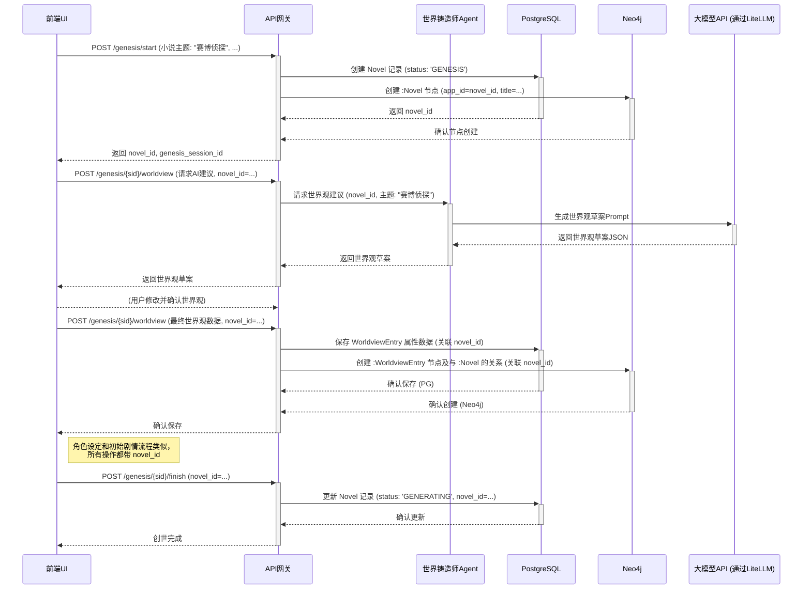
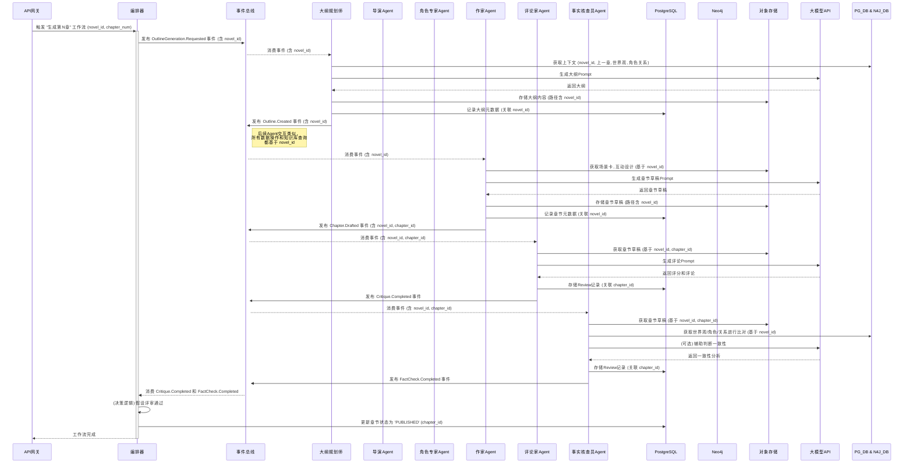

# 多智能体网络小说自动写作系统 全栈架构文档

## Introduction

本文档概述了“多智能体网络小说自动写作系统”的完整全栈架构，包括后端服务、前端实现及其集成方式。它将作为所有AI开发智能体的唯一技术事实来源，确保整个技术栈的一致性。

### 启动模板或现有项目

本项目将采用**分步模板策略**进行初始化。我们将使用 **Vite** 官方提供的 **React + TypeScript** 模板来创建前端应用，并将其集成到一个手动配置的、基于 **pnpm workspaces** 的Monorepo中。后端Python服务将在此Monorepo中从头开始设置。

### Change Log

| Date | Version | Description | Author |
| :--- | :------ | :---------- | :----- |
|      | 1.0     | Initial Draft | Winston (Architect) |
|      | 1.1     | 集成Neo4j管理世界观关系 | Winston (Architect) |
|      | 1.2     | 根据PRD v1.3和front-end-spec v1.2更新，重点调整数据模型、API接口、数据库模式以支持项目仪表盘和项目级知识库。 | Winston (Architect) |
|      | 1.3     | **重大更新**: 全面重构数据库模式以支持多智能体追踪、工作流编排、版本控制和动态配置。采纳了关于外键的混合策略。 | Winston (Architect) |
|      | 1.4     | **最终定稿**: 根据最终审查意见，对数据库模式进行硬化，增加索引、触发器、完整性约束和分区策略规划。 | Winston (Architect) |


## High Level Architecture

### 技术摘要

本系统将构建为一个基于**事件驱动的微服务架构**，部署在云平台上。前端采用**React (Vite)** 构建的单页应用（SPA），通过一个**API网关**与后端进行通信。后端由一系列解耦的、容器化的**Python智能体（Agent）服务**组成，它们通过 **Kafka** 事件总线进行异步协作。整个创作流程由 **Prefect** 进行编排。数据存储采用混合模式，使用 **PostgreSQL** 进行结构化属性数据存储，**Milvus** 进行向量相似性搜索，**Neo4j** 管理复杂的关系数据（如特定书籍的世界观和角色关系），以及 **Minio** 进行对象存储。

### 平台与基础设施选择

*   **平台:** 我们将采用**平台无关的云原生方法**。所有服务都将被容器化（Docker），使其可以部署在任何支持容器的主流云平台（如AWS, GCP, Azure）或本地环境中。
*   **关键服务:**
    *   **计算:** 容器运行服务（如 Kubernetes, ECS, 或 Docker Swarm）。
    *   **消息队列:** 一个托管的Kafka集群或自部署的Kafka。
    *   **数据库:** 托管的PostgreSQL、Milvus和**Neo4j**服务。
    *   **对象存储:** 兼容S3的存储服务（如AWS S3或自部署的Minio）。
*   **部署宿主和区域:** MVP阶段将在本地通过Docker Compose进行开发和测试。生产部署的区域将根据目标用户地理位置和成本效益另行决定。

### 仓库结构

*   **结构:** **Monorepo**。
*   **Monorepo工具:** **pnpm workspaces**。
*   **包组织:**
    *   `apps/`: 存放可独立部署的应用，如 `frontend`, `backend` (包含API Gateway和所有Agent服务)。
    *   `packages/`: 存放共享的代码库，如 `shared-types`, `eslint-config`, `common-utils` 等。

### High Level Architecture

```mermaid
graph TD
    subgraph "用户端"
        User[监督者] --> FE[React前端 (Vite)<br/>仪表盘, 项目详情, 创世向导]
    end

    subgraph "云平台 / 本地Docker"
        FE --> APIGW[API网关 (FastAPI)<br/>控制API, 数据查询]
        
        subgraph "数据存储层"
            DB[(PostgreSQL<br/>属性数据, 元数据, 版本, 日志)]
            VDB[(Milvus<br/>向量嵌入, 相似搜索)]
            GDB[("Neo4j<br/>项目级知识图谱<br/>世界观/角色关系")]
            S3[(Minio<br/>章节内容, 大纲等)]
        end

        subgraph "编排与事件层"
            Orchestrator[工作流编排器 (Prefect)]
            Broker[事件总线 (Kafka)]
        end

        subgraph "智能体微服务集群"
            Agent1[WriterAgent]
            Agent2[CriticAgent]
            Agent3[FactCheckerAgent]
            AgentN[...]
        end

        APIGW --> Orchestrator
        APIGW --> DB
        APIGW --> GDB # API网关查询项目级图数据
        
        Orchestrator -- "发布任务事件" --> Broker
        Broker -- "分发任务" --> Agent1 & Agent2 & Agent3 & AgentN
        Agent1 & Agent2 & Agent3 & AgentN -- "读/写" --> DB & VDB & GDB & S3
        Agent1 & Agent2 & Agent3 & AgentN -- "发布完成/中间事件" --> Broker
        Broker -- "通知" --> Orchestrator
        Broker -- "通知 (可选)" --> APIGW # 用于UI实时更新
    end

    User -- "通过浏览器访问" --> FE
```

### 架构模式

*   **整体架构:** **事件驱动微服务 (Event-Driven Microservices)** - 服务之间通过异步消息解耦，提高了系统的弹性和可扩展性。
*   **前端模式:** **单页应用 (Single-Page Application - SPA)** - 提供流畅的、类似桌面应用的交互体验，包含项目仪表盘和项目详情视图。
*   **后端模式:** **智能体模式 (Agent Model)** - 每个服务都是一个具有特定技能的自主智能体。
*   **集成模式:** **API网关 (API Gateway)** - 为前端提供一个统一、简化的入口点来与复杂的后端系统交互。
*   **知识表示:** **混合数据模型 (Hybrid Data Model)** - 结构化属性使用PostgreSQL，向量相似性使用Milvus，**特定于项目的复杂关系和知识图谱使用Neo4j**。

## Tech Stack

以下表格定义了本项目将要使用的全部核心技术及其具体版本。所有开发工作都必须严格遵守此技术栈，以确保兼容性和稳定性。

### Tech Stack表

| 类别 | 技术 | 版本 | 用途 | 理由 |
| :--- | :--- | :--- | :--- | :--- |
| **前端语言** | TypeScript | `~5.2.2` | 前端开发语言 | 提供强类型安全，与React生态完美集成。 |
| **前端框架** | React | `~18.2.0` | 构建用户界面 | 业界标准，生态系统成熟，性能优秀。 |
| **UI组件库** | Shadcn UI | `~0.8.0` | 基础UI组件 | 提供可高度定制、符合设计系统的无头组件。 |
| **状态管理** | Zustand | `~4.5.0` | 前端全局状态管理 | 轻量、简洁、基于Hooks，避免了Redux的样板代码。 |
| **数据请求** | TanStack Query | `~5.25.0`| 服务端状态管理 | 极大地简化了数据获取、缓存、同步和更新的逻辑。 |
| **前端路由** | React Router | `~6.22.0` | 客户端路由 | React官方推荐的路由解决方案，功能强大。 |
| **构建工具** | Vite | `~5.2.0` | 前端开发与构建 | 提供极速的开发服务器和优化的构建输出。 |
| **CSS方案** | Tailwind CSS | `~3.4.1` | UI样式 | 提供原子化的CSS类，开发效率高，与Shadcn UI集成良好。 |
| **包管理器** | pnpm | `~8.15.0`| Monorepo依赖管理 | 速度快，节省磁盘空间，对Monorepo支持优秀。 |
| **后端语言** | Python | `~3.11` | 后端与Agent开发 | AI/ML生态系统无与伦比，异步性能良好。 |
| **后端框架** | FastAPI | `~0.115.13`| API网关与服务 | 高性能，基于Pydantic的自动校验和文档生成。 |
| **数据校验** | Pydantic | `~2.11.7` | 数据模型与校验 | 提供运行时的数据类型强制，是FastAPI的核心。 |
| **工作流编排** | Prefect | `~2.19.0`| 业务流程编排 | Python原生，对数据密集型和动态工作流支持良好。 |
| **事件总线** | Apache Kafka | `3.7.0` (镜像) | 智能体间异步通信 | 高吞吐量、持久化的分布式消息系统，业界标准。 |
| **关系型数据库**| PostgreSQL | `16` (镜像) | 核心元数据与属性存储 | 功能强大，可靠，支持丰富的JSON操作。 |
| **向量数据库** | Milvus | `2.4.0` (镜像) | 上下文检索 | 专为向量相似性搜索设计，性能卓越。 |
| **图数据库** | Neo4j | `5.x` (最新稳定版镜像) | 存储和查询**项目级**复杂的世界观、角色关系 | 强大的图数据处理能力，支持复杂的关系分析和一致性校验。 |
| **对象存储** | Minio | `LATEST` (镜像) | 存储小说内容等大文件 | 兼容S3协议的开源解决方案，便于本地部署。 |
| **缓存** | Redis | `7.2` (镜像) | 缓存与临时数据 | 高性能的内存数据库，用途广泛。 |
| **LLM网关** | LiteLLM | `~1.34.0`| 统一调用大模型API | 支持多种模型，提供统一的接口和成本控制。 |
| **可观测性** | Langfuse | `~2.25.0`| LLM应用追踪与调试 | 提供对复杂Agent流程的端到端可见性。 |
| **测试框架** | Vitest, Pytest | `~1.4.0`, `~8.1.0` | 前后端单元/集成测试 | 分别是Vite和Python生态中最主流、最强大的测试框架。 |

## Data Models

以下是本系统的核心数据模型定义。这些模型将在 `packages/shared-types` 中实现，供前后端共同使用。属性主要存储在PostgreSQL，**特定于项目的知识图谱关系主要存储在Neo4j**。

### AgentActivity (活动日志) - PostgreSQL

*   **目的:** 记录系统中由智能体执行的每一个有意义的事件或操作。
*   **TypeScript 接口 (对应PG表):**
    ```typescript
    interface AgentActivity {
      id: string; // 活动的唯一标识符 (UUID)
      workflow_run_id?: string; // 关联的工作流运行ID (UUID)
      novel_id: string; // 关联的小说ID (UUID)
      target_entity_id?: string; // 活动所针对的目标实体的ID (如 chapter_id, character_id)
      target_entity_type?: string; // 目标实体的类型 (如 'CHAPTER', 'CHARACTER')
      agent_type?: 'worldsmith' | 'plotmaster' | 'outliner' | 'director' | 'character_expert' | 'worldbuilder' | 'writer' | 'critic' | 'fact_checker' | 'rewriter'; // 执行活动的Agent类型
      activity_type: string; // 活动的具体类型 (如 'CREATE', 'UPDATE', 'GENERATE_OUTLINE')
      status: 'STARTED' | 'IN_PROGRESS' | 'COMPLETED' | 'FAILED' | 'RETRYING'; // 活动的当前状态
      input_data?: any; // 活动的输入数据 (JSONB)
      output_data?: any; // 活动的输出数据 (JSONB)
      error_details?: any; // 如果失败，记录错误详情 (JSONB)
      started_at: Date; // 活动开始时间
      completed_at?: Date; // 活动完成时间
      duration_seconds?: number; // 活动持续时间（秒），由数据库自动计算
      llm_tokens_used?: number; // 本次活动消耗的LLM Token数量
      llm_cost_estimate?: number; // 本次活动估算的LLM成本
      retry_count: number; // 活动重试次数
    }
    ```

### Novel (小说) - PostgreSQL & Neo4j Node :Novel

*   **目的:** 代表一个独立的小说项目，是所有其他数据的根实体。
*   **TypeScript 接口 (属性部分，对应PG表):**
    ```typescript
    interface Novel {
      id: string; // 小说的唯一标识符 (UUID), 主键
      title: string; // 小说标题
      theme: string; // 小说主题
      writing_style: string; // 写作风格描述
      status: 'GENESIS' | 'GENERATING' | 'PAUSED' | 'COMPLETED' | 'FAILED'; // 小说的当前状态
      target_chapters: number; // 目标总章节数
      completed_chapters: number; // 已完成章节数
      version: number; // 版本号，用于乐观锁控制并发更新
      created_by_agent_type?: string; // 创建此小说的Agent类型 (通常是 'worldsmith')
      updated_by_agent_type?: string; // 最后更新此小说元数据的Agent类型
      created_at: Date; // 创建时间
      updated_at: Date; // 最后更新时间
    }
    ```
*   **Neo4j Node `:Novel` 核心属性:** `app_id: string` (对应PG的 `novels.id`), `title: string`。

### Chapter (章节) - PostgreSQL & Neo4j Node :Chapter

*   **目的:** 代表小说中的一个独立章节的元数据。实际内容存储在 `chapter_versions` 表中。
*   **TypeScript 接口 (属性部分，对应PG表):**
    ```typescript
    interface Chapter {
      id: string; // 章节的唯一标识符 (UUID), 主键
      novel_id: string; // 所属小说的ID (UUID), 外键
      chapter_number: number; // 章节序号
      title: string; // 章节标题
      status: 'DRAFT' | 'REVIEWING' | 'REVISING' | 'PUBLISHED'; // 章节的当前状态
      published_version_id?: string; // 指向当前已发布版本的ID (来自 chapter_versions 表)
      version: number; // 版本号，用于乐观锁
      created_by_agent_type?: string; // 创建此章节记录的Agent类型
      updated_by_agent_type?: string; // 最后更新此章节元数据的Agent类型
      created_at: Date; // 创建时间
      updated_at: Date; // 最后更新时间
    }
    ```
*   **Neo4j Node `:Chapter` 核心属性:** `app_id: string` (对应PG的 `chapters.id`), `chapter_number: integer`, `title: string`。
*   **Neo4j关系示例:** `(:Chapter {app_id: 'chapter_uuid'})-[:BELONGS_TO_NOVEL]->(:Novel {app_id: 'novel_uuid'})`

### ChapterVersion (章节版本) - PostgreSQL

*   **目的:** 存储一个章节的每一次具体内容的迭代版本。
*   **TypeScript 接口 (对应PG表):**
    ```typescript
    interface ChapterVersion {
      id: string; // 章节版本的唯一标识符 (UUID), 主键
      chapter_id: string; // 所属章节的ID (UUID), 外键
      version_number: number; // 版本号
      content_url: string; // 指向Minio中存储的该版本章节文本内容的URL
      word_count?: number; // 该版本的字数
      created_by_agent_type: string; // 创建此版本的Agent类型 (如 'writer', 'rewriter')
      change_reason?: string; // (可选) 修改原因，如“根据评论家意见修改”
      parent_version_id?: string; // (可选) 指向上一个版本的ID，形成版本链
      metadata?: any; // (可选) 与此版本相关的其他元数据 (JSONB)
      created_at: Date; // 创建时间
    }
    ```

### Character (角色) - PostgreSQL & Neo4j Node :Character

*   **目的:** 代表小说中的一个角色，包含其所有核心设定。
*   **TypeScript 接口 (属性部分，对应PG表):**
    ```typescript
    interface Character {
      id: string; // 角色的唯一标识符 (UUID), 主键
      novel_id: string; // 所属小说的ID (UUID), 外键
      name: string; // 角色名称
      role: 'PROTAGONIST' | 'ANTAGONIST' | 'ALLY' | 'SUPPORTING'; // 角色定位
      description: string; // 外貌、性格等简述
      background_story: string; // 背景故事
      personality_traits: string[]; // 性格特点列表
      goals: string[]; // 角色的主要目标列表
      version: number; // 版本号，用于乐观锁
      created_by_agent_type?: string; // 创建此角色的Agent类型
      updated_by_agent_type?: string; // 最后更新此角色的Agent类型
      created_at: Date; // 创建时间
      updated_at: Date; // 最后更新时间
    }
    ```
*   **Neo4j Node `:Character` 核心属性:** `app_id: string` (对应PG的 `characters.id`), `name: string`, `role: string`。
*   **Neo4j关系示例:** `(:Character {app_id: 'char1_uuid'})-[:APPEARS_IN_NOVEL]->(:Novel {app_id: 'novel_uuid'})`, `(:Character {app_id: 'char1_uuid'})-[:INTERACTS_WITH {type: "FRIENDSHIP", in_chapter: 5}]->(:Character {app_id: 'char2_uuid'})`

### WorldviewEntry (世界观条目) - PostgreSQL & Neo4j Node :WorldviewEntry

*   **目的:** 代表世界观中的一个独立设定条目（如地点、组织、物品、概念等）。
*   **TypeScript 接口 (属性部分，对应PG表):**
    ```typescript
    interface WorldviewEntry {
      id: string; // 世界观条目的唯一标识符 (UUID), 主键
      novel_id: string; // 所属小说的ID (UUID), 外键
      entry_type: 'LOCATION' | 'ORGANIZATION' | 'TECHNOLOGY' | 'LAW' | 'CONCEPT' | 'EVENT' | 'ITEM'; // 条目类型
      name: string; // 条目名称
      description: string; // 详细描述
      tags?: string[]; // 标签，用于分类和检索
      version: number; // 版本号，用于乐观锁
      created_by_agent_type?: string; // 创建此条目的Agent类型
      updated_by_agent_type?: string; // 最后更新此条目的Agent类型
      created_at: Date; // 创建时间
      updated_at: Date; // 最后更新时间
    }
    ```
*   **Neo4j Node `:WorldviewEntry` 核心属性:** `app_id: string` (对应PG的 `worldview_entries.id`), `name: string`, `entry_type: string`。
*   **Neo4j关系示例:** `(:WorldviewEntry {name:'Kyoto'})-[:PART_OF_NOVEL_WORLDVIEW]->(:Novel)`, `(:Character)-[:RESIDES_IN]->(:WorldviewEntry {name:'Kyoto'})`

### Review (评审) - PostgreSQL

*   **目的:** 记录一次对章节草稿的评审结果。
*   **TypeScript 接口 (对应PG表):**
    ```typescript
    interface Review {
      id: string; // 评审记录的唯一标识符 (UUID)
      chapter_id: string; // 所属章节的ID (UUID), 外键
      chapter_version_id: string; // 评审针对的具体章节版本的ID (UUID), 外键
      workflow_run_id?: string; // 关联的工作流运行ID (UUID)
      agent_type: string; // 执行评审的Agent类型 (如 'critic', 'fact_checker')
      review_type: 'CRITIC' | 'FACT_CHECK'; // 评审类型
      score?: number; // 评论家评分 (可选)
      comment?: string; // 评论家评语 (可选)
      is_consistent?: boolean; // 事实核查员判断是否一致 (可选)
      issues_found?: string[]; // 事实核查员发现的问题列表 (可选)
      created_at: Date; // 创建时间
    }
    ```

### StoryArc (故事弧) - PostgreSQL & Neo4j Node :StoryArc

*   **目的:** 代表一个主要的情节线或故事阶段。
*   **TypeScript 接口 (属性部分，对应PG表):**
    ```typescript
    interface StoryArc {
      id: string; // 故事弧的唯一标识符 (UUID), 主键
      novel_id: string; // 所属小说的ID (UUID), 外键
      title: string; // 故事弧标题
      summary: string; // 故事弧摘要
      start_chapter_number?: number; // 开始章节号
      end_chapter_number?: number; // 结束章节号
      status: 'PLANNED' | 'ACTIVE' | 'COMPLETED'; // 故事弧状态
      version: number; // 版本号，用于乐观锁
      created_by_agent_type?: string; // 创建此故事弧的Agent类型
      updated_by_agent_type?: string; // 最后更新此故事弧的Agent类型
      created_at: Date; // 创建时间
      updated_at: Date; // 最后更新时间
    }
    ```
*   **Neo4j Node `:StoryArc` 核心属性:** `app_id: string` (对应PG的 `story_arcs.id`), `title: string`。
*   **Neo4j关系示例:** `(:StoryArc)-[:PART_OF_NOVEL_PLOT]->(:Novel)`, `(:StoryArc)-[:PRECEDES_ARC]->(:StoryArc)`

### Neo4j 关系模型概念

Neo4j将用于存储**每个小说项目内部**的实体间的复杂关系，例如：
*   **角色间关系:** `(:Character)-[:KNOWS {strength: 0.8, sentiment: "positive"}]->(:Character)`
*   **角色与地点:** `(:Character)-[:LOCATED_IN {start_chapter: 1, end_chapter: 5, duration_description: "童年时期"}]->(:WorldviewEntry {entry_type: "LOCATION"})`
*   **事件顺序:** `(:WorldviewEntry {entry_type: "EVENT", name: "大灾变"})-[:PRECEDES_EVENT]->(:WorldviewEntry {entry_type: "EVENT", name: "重建期"})`
*   **章节与实体关联:**
    *   `(:Chapter)-[:FEATURES_CHARACTER {role_in_chapter: "POV"}]->(:Character)`
    *   `(:Chapter)-[:MENTIONS_LOCATION]->(:WorldviewEntry {entry_type: "LOCATION"})`
    *   `(:Chapter)-[:DEVELOPS_ARC]->(:StoryArc)`
*   **世界观条目间关系:**
    *   `(:WorldviewEntry {entry_type:"ORGANIZATION", name:"光明教会"})-[:HOSTILE_TO]->(:WorldviewEntry {entry_type:"ORGANIZATION", name:"暗影兄弟会"})`
    *   `(:WorldviewEntry {entry_type:"TECHNOLOGY", name:"曲速引擎"})-[:REQUIRES_MATERIAL]->(:WorldviewEntry {entry_type:"ITEM", name:"零点水晶"})`

## Components

### 1. API网关 (API Gateway)

*   **责任:**
    *   作为前端UI与后端所有服务的唯一入口点。
    *   处理所有来自前端的HTTP请求。
    *   进行身份验证和授权。
    *   将前端指令（如“开始创世”、“生成章节”）转化为对Prefect工作流的调用。
    *   提供查询接口，供前端获取工作流状态、结果数据（如章节内容、**项目列表**）、以及**特定项目的Neo4j图数据**。
*   **关键接口 (部分，参考OpenAPI Spec):**
    *   `POST /genesis/start`
    *   `POST /genesis/{session_id}/...`
    *   `GET /novels` (新增，获取所有小说项目列表)
    *   `POST /novels/{novel_id}/generate-chapter`
    *   `GET /chapters/{chapter_id}`
    *   `GET /workflows/{workflow_run_id}/status` (查询工作流状态)
    *   `GET /metrics`
    *   `GET /health`
    *   `GET /novels/{novel_id}/graph/worldview` (新增，查询指定小说的Neo4j世界观图数据)
*   **依赖:** PostgreSQL (用于存储创世数据、小说元数据), **Neo4j (用于查询项目级关系图谱)**, Prefect (用于触发工作流), Kafka (可选，用于发布某些UI触发的即时事件)。
*   **技术栈:** FastAPI, Python, Pydantic。

### 2. 世界铸造师Agent (Worldsmith Agent)
*   **责任:**
    *   在“创世阶段”与人类监督者（通过API网关和UI）交互。
    *   根据用户的核心创意，调用大模型API生成小说主题、世界观、核心角色阵容和初始剧情弧光的草案。
    *   辅助用户完成这些初始设定的迭代和确认。
    *   将最终确认的设定属性写入PostgreSQL，并在Neo4j中创建对应的节点和初始关系 (所有操作均与 `novel_id` 关联)。
*   **关键接口/事件:**
    *   **订阅:** (通过内部调用或事件) `GenesisStep.Requested` (例如，请求生成世界观建议，包含 `novel_id`)。
    *   **发布:** (通过内部调用或事件) `GenesisStep.SuggestionProvided` (包含AI生成的草案)。
*   **依赖:** 大模型API (通过LiteLLM), PostgreSQL, Neo4j (操作均与 `novel_id` 关联)。
*   **技术栈:** Python, Pydantic, LiteLLM。

### 3. 剧情策划师Agent (PlotMaster Agent)
*   **责任:**
    *   进行高层次的、战略性的剧情规划 (针对特定 `novel_id`)。
    *   周期性地（或按需）分析故事的整体进展、节奏和角色弧光。
    *   发布“高层剧情指令”，如引入新角色、开启新支线、制造情节转折等。
*   **关键接口/事件:**
    *   **订阅:** `Novel.AnalysisRequested` (含 `novel_id`), `Chapter.Completed` (含 `novel_id`, 用于计数和触发周期性评估)。
    *   **发布:** `PlotDirective.Created` (包含具体的剧情指令, 关联 `novel_id`)。
*   **依赖:** 知识库 (PostgreSQL, Milvus, Neo4j - 所有查询均基于 `novel_id`) 用于获取故事全局信息。
*   **技术栈:** Python, Pydantic。

### 4. 大纲规划师Agent (Outliner Agent)
*   **责任:**
    *   将高层的剧情指令（来自PlotMaster）或简单的“下一章”请求 (均含 `novel_id`)，转化为具体的章节情节大纲。
*   **关键接口/事件:**
    *   **订阅:** `OutlineGeneration.Requested` (含 `novel_id`), `PlotDirective.Created` (含 `novel_id`)。
    *   **发布:** `Outline.Created` (包含章节大纲, 关联 `novel_id`, `chapter_id`)。
*   **依赖:** 大模型API (通过LiteLLM), 知识库 (基于 `novel_id` 获取上一章结尾和相关上下文)。
*   **技术栈:** Python, Pydantic, LiteLLM。

### 5. 导演Agent (Director Agent)
*   **责任:**
    *   将章节大纲 (关联 `novel_id`, `chapter_id`) 分解为更小的场景序列。
    *   为每个场景定义核心目标、节奏（紧张、平缓等）、视角（POV）和关键转折点。
*   **关键接口/事件:**
    *   **订阅:** `SceneDesign.Requested` (含 `novel_id`, `chapter_id`), `Outline.Created` (含 `novel_id`, `chapter_id`)。
    *   **发布:** `SceneDesign.Completed` (包含场景卡序列, 关联 `novel_id`, `chapter_id`)。
*   **依赖:** 大模型API (通过LiteLLM), 知识库 (基于 `novel_id` 获取大纲)。
*   **技术栈:** Python, Pydantic, LiteLLM。

### 6. 角色专家Agent (CharacterExpert Agent)
*   **责任:**
    *   根据场景设计 (关联 `novel_id`, `chapter_id`)，规划角色间的具体对话和互动。
    *   如果场景中出现新角色，负责创建其完整的角色卡（属性入PG, 节点入Neo4j - 均关联 `novel_id`）并触发持久化。
    *   更新Neo4j中角色间的互动关系 (基于 `novel_id`)。
*   **关键接口/事件:**
    *   **订阅:** `CharacterInteractionDesign.Requested` (含 `novel_id`, `chapter_id`), `SceneDesign.Completed` (含 `novel_id`, `chapter_id`)。
    *   **发布:** `CharacterInteraction.Designed` (关联 `novel_id`, `chapter_id`), `Character.Created` (如果创建了新角色, 关联 `novel_id`)。
*   **依赖:** 大模型API (通过LiteLLM), 知识库 (PostgreSQL获取场景卡、角色属性; Neo4j获取和更新角色关系 - 均基于 `novel_id`)。
*   **技术栈:** Python, Pydantic, LiteLLM。

### 7. 世界观构建师Agent (WorldBuilder Agent)
*   **责任:**
    *   在创作过程中，根据需要（例如，导演或作家Agent发现设定不足，针对特定 `novel_id`）扩展和丰富世界观设定。
    *   确保新的设定属性写入PostgreSQL，并在Neo4j中创建对应的节点和关系 (均关联 `novel_id`)。
*   **关键接口/事件:**
    *   **订阅:** `WorldviewExpansion.Requested` (含 `novel_id`)。
    *   **发布:** `WorldviewEntry.Created` (关联 `novel_id`)。
*   **依赖:** 大模型API (通过LiteLLM), 知识库 (PostgreSQL获取现有世界观属性; Neo4j获取和更新关系 - 均基于 `novel_id`)。
*   **技术栈:** Python, Pydantic, LiteLLM。

### 8. 作家Agent (Writer Agent)
*   **责任:**
    *   严格遵循导演的场景和节奏指令，并结合角色专家的对话设计 (均关联 `novel_id`, `chapter_id`)，调用大模型API将所有元素渲染成最终的章节草稿。
*   **关键接口/事件:**
    *   **订阅:** `ChapterWriting.Requested` (含 `novel_id`, `chapter_id`), `SceneDesign.Completed` (含 `novel_id`, `chapter_id`), `CharacterInteraction.Designed` (含 `novel_id`, `chapter_id`)。
    *   **发布:** `Chapter.Drafted` (包含章节草稿的URL和元数据, 关联 `novel_id`, `chapter_id`)。
*   **依赖:** 大模型API (通过LiteLLM), 知识库 (基于 `novel_id` 获取完整的创作指令), Minio (存储草稿, 路径含 `novel_id`)。
*   **技术栈:** Python, Pydantic, LiteLLM。

### 9. 评论家Agent (Critic Agent)
*   **责任:**
    *   对章节草稿 (关联 `novel_id`, `chapter_id`) 的文学质量、节奏感、趣味性和是否符合导演要求进行评估。
    *   输出结构化的评分和具体的改进建议。
*   **关键接口/事件:**
    *   **订阅:** `Critique.Requested` (含 `novel_id`, `chapter_id`), `Chapter.Drafted` (含 `novel_id`, `chapter_id`)。
    *   **发布:** `Critique.Completed` (包含评分和评论, 关联 `chapter_id`)。
*   **依赖:** 大模型API (通过LiteLLM), 知识库 (基于 `novel_id` 获取草稿内容)。
*   **技术栈:** Python, Pydantic, LiteLLM。

### 10. 事实核查员Agent (FactChecker Agent)
*   **责任:**
    *   将章节草稿的内容 (关联 `novel_id`, `chapter_id`) 与知识库中已确立的世界观（PG属性）、角色设定（PG属性）和历史情节（Neo4j关系 - 均基于 `novel_id`）进行比对。
    *   报告任何发现的不一致之处或逻辑矛盾。
*   **关键接口/事件:**
    *   **订阅:** `FactCheck.Requested` (含 `novel_id`, `chapter_id`), `Chapter.Drafted` (含 `novel_id`, `chapter_id`)。
    *   **发布:** `FactCheck.Completed` (包含一致性报告和问题列表, 关联 `chapter_id`)。
*   **依赖:** 大模型API (通过LiteLLM), 知识库 (PostgreSQL, Milvus, Neo4j - 所有查询均基于 `novel_id`)。
*   **技术栈:** Python, Pydantic, LiteLLM。

### 11. 改写者Agent (Rewriter Agent)
*   **责任:**
    *   根据评论家Agent的评分和建议，或事实核查员Agent的报告 (均关联 `chapter_id`)，对章节草稿进行针对性的修改和润色。
*   **关键接口/事件:**
    *   **订阅:** `Revision.Requested` (通常包含草稿、评论和问题报告, 关联 `chapter_id`)。
    *   **发布:** `Chapter.Revised` (修改后的草稿，将重新进入评审流程, 关联 `chapter_id`)。
*   **依赖:** 大模型API (通过LiteLLM), 知识库 (基于 `novel_id`)。
*   **技术栈:** Python, Pydantic, LiteLLM。

### Components图

```mermaid
graph TD
    UI[前端UI<br/>仪表盘, 项目详情] --> APIGW[API网关]

    subgraph "编排层"
        Orchestrator[Prefect工作流]
    end

    APIGW --> Orchestrator

    subgraph "事件总线 (Kafka)"
        KafkaBus[Kafka]
    end

    Orchestrator -- "触发任务" --> KafkaBus
    
    subgraph "智能体集群"
        WS[世界铸造师]
        PM[剧情策划师]
        OL[大纲规划师]
        DIR[导演]
        CE[角色专家]
        WB[世界观构建师]
        WR[作家]
        CR[评论家]
        FC[事实核查员]
        RW[改写者]
    end

    KafkaBus --> WS & PM & OL & DIR & CE & WB & WR & CR & FC & RW
    WS & PM & OL & DIR & CE & WB & WR & CR & FC & RW --> KafkaBus

    subgraph "支撑服务"
        LLMGW[LiteLLM网关]
        LGF[Langfuse]
    end
    
    subgraph "存储层 (按项目隔离)"
        PG[(PostgreSQL<br/>小说/章节/角色属性)]
        MV[(Milvus<br/>项目级文本向量)]
        N4J[("Neo4j<br/>项目级知识图谱<br/>(世界观,角色关系,情节)")]
        MN[(Minio<br/>章节文本,大纲文件)]
    end

    WS & PM & OL & DIR & CE & WB & WR & CR & FC & RW -- "LLM调用" --> LLMGW
    WS & PM & OL & DIR & CE & WB & WR & CR & FC & RW -- "数据交互 (novel_id scoped)" --> PG & MV & N4J & MN
    LLMGW -- "日志/追踪" --> LGF
    APIGW -- "数据查询 (novel_id scoped)" --> PG & N4J


    classDef agent fill:#D6EAF8,stroke:#2E86C1,stroke-width:2px;
    classDef support fill:#E8F8F5,stroke:#1ABC9C,stroke-width:2px;
    class WS,PM,OL,DIR,CE,WB,WR,CR,FC,RW agent;
    class LLMGW,LGF support;
```



## External APIs

### 1. 大型语言模型 (LLM) API
*   **目的:** 所有智能体执行其核心的自然语言理解、生成和评估任务。
*   **API提供商 (示例):** OpenAI (GPT-4o, GPT-3.5-Turbo等), Anthropic (Claude 3 Opus, Sonnet, Haiku等), Google (Gemini Pro等)。
*   **统一网关:** **LiteLLM**
    *   **作用:** 所有对LLM API的调用都**必须**通过LiteLLM代理。
    *   **好处:** 统一接口, 模型切换, 成本控制, 回退与重试, 日志与监控。
*   **认证:** 每种LLM API都有其自己的认证机制（通常是API密钥）。这些密钥将安全地存储，并通过配置注入到LiteLLM中。Agent服务本身不直接持有这些密钥。
*   **速率限制与配额:** 每个LLM提供商都有其速率限制和使用配额。LiteLLM可以帮助我们管理这些限制。
*   **集成注意事项:** Prompt Engineering, 上下文管理, 错误处理。

## Core Workflows

### 1. 创世流程 (Genesis Flow) - UI触发


### 2. 章节生成流程 (Chapter Generation Flow) - 标准路径


## REST API Spec
```yaml
openapi: 3.0.0
info:
  title: 多智能体网络小说自动写作系统 - 控制API
  version: v1.4.0 
  description: 用于前端UI与后端工作流系统交互的控制API。
servers:
  - url: http://localhost:8000/api/v1 
    description: 本地开发服务器
  - url: https://your-production-domain.com/api/v1 
    description: 生产环境服务器

components:
  schemas:
    Novel:
      type: object
      properties:
        id:
          type: string
          format: uuid
          description: 小说的唯一标识符 (UUID)
        title:
          type: string
          description: 小说标题
        theme:
          type: string
          description: 小说主题
        writing_style:
          type: string
          description: 小说写作风格
        status:
          type: string
          enum: [GENESIS, GENERATING, PAUSED, COMPLETED, FAILED]
          description: 小说的当前状态
        target_chapters:
          type: integer
          description: 目标总章节数
        completed_chapters:
          type: integer
          description: 已完成的章节数
        created_at:
          type: string
          format: date-time
          description: 创建时间戳
        updated_at:
          type: string
          format: date-time
          description: 最后更新时间戳
    Chapter:
      type: object
      properties:
        id:
          type: string
          format: uuid
          description: 章节的唯一标识符 (UUID)
        novel_id:
          type: string
          format: uuid
          description: 所属小说的ID
        chapter_number:
          type: integer
          description: 章节序号
        title:
          type: string
          description: 章节标题
        content_url:
          type: string
          format: url
          description: 指向Minio中存储的章节文本内容的URL
        status:
          type: string
          enum: [DRAFT, REVIEWING, REVISING, PUBLISHED]
          description: 章节的当前状态
        word_count:
          type: integer
          description: 章节字数
        created_at:
          type: string
          format: date-time
          description: 创建时间戳
        updated_at:
          type: string
          format: date-time
          description: 最后更新时间戳
    Review:
      type: object
      properties:
        id:
          type: string
          format: uuid
          description: 评审记录的唯一标识符 (UUID)
        chapter_id:
          type: string
          format: uuid
          description: 被评审章节的ID
        agent_id:
          type: string
          description: 执行评审的Agent的ID
        review_type:
          type: string
          enum: [CRITIC, FACT_CHECK]
          description: 评审类型
        score:
          type: number
          format: float
          description: 评论家评分 (可选)
        comment:
          type: string
          description: 评论家评语 (可选)
        is_consistent:
          type: boolean
          description: 事实核查员判断是否一致 (可选)
        issues_found:
          type: array
          items:
            type: string
          description: 事实核查员发现的问题列表 (可选)
        created_at:
          type: string
          format: date-time
          description: 评审创建时间戳
    WorldviewNode: 
      type: object
      properties:
        id: 
          type: string 
          description: Neo4j内部节点ID
        app_id: 
          type: string
          format: uuid
          description: 对应PostgreSQL中的实体ID
        labels: 
          type: array
          items: 
            type: string 
          description: 节点的标签 (e.g., Character, Location)
        properties: 
          type: object
          description: 节点的属性 (e.g., name, entry_type)
    WorldviewRelationship: 
      type: object
      properties:
        id: 
          type: string
          description: Neo4j内部关系ID
        type: 
          type: string
          description: 关系的类型 (e.g., KNOWS, LOCATED_IN)
        startNodeAppId: 
          type: string
          format: uuid
          description: 关系起始节点的app_id
        endNodeAppId: 
          type: string
          format: uuid
          description: 关系结束节点的app_id
        properties: 
          type: object
          description: 关系的属性
    GenesisStartRequest:
      type: object
      required:
        - title
        - theme
        - writing_style
        - target_chapters
      properties:
        title:
          type: string
          description: 新小说的标题
        theme:
          type: string
          description: 新小说的主题
        writing_style:
          type: string
          description: 新小说的写作风格
        target_chapters:
          type: integer
          minimum: 1
          description: 计划的总章节数
    GenesisStartResponse:
      type: object
      properties:
        novel_id:
          type: string
          format: uuid
          description: 新创建的小说的ID
        genesis_session_id:
          type: string
          format: uuid
          description: 用于后续创世步骤的会话ID
    GenesisStepRequest: 
      type: object
      properties:
        data:
          type: object 
          description: 具体步骤的数据，如世界观条目数组或角色对象数组
    GenesisStepResponse:
      type: object
      properties:
        success:
          type: boolean
          description: 操作是否成功
        message:
          type: string
          description: 相关的状态或错误信息
    WorkflowStatus:
      type: object
      properties:
        task_id:
          type: string
          description: 被查询的工作流任务ID
        status:
          type: string
          description: 工作流的当前状态
        progress:
          type: number
          format: float
          description: 工作流的完成进度 (0.0 到 1.0)
        details:
          type: string
          description: 关于当前状态的详细描述
    Metrics:
      type: object
      properties:
        total_words_generated:
          type: integer
          description: 系统生成的总字数
        cost_per_10k_words:
          type: number
          format: float
          description: 每生成一万字的平均成本
        avg_chapter_generation_time_seconds:
          type: number
          format: float
          description: 生成一个章节的平均耗时（秒）
        chapter_revision_rate:
          type: number
          format: float
          description: 章节需要修订的比例
  securitySchemes:
    BearerAuth:
      type: http
      scheme: bearer
      bearerFormat: JWT
      description: 用于API认证的JWT令牌

security:
  - BearerAuth: []

paths:
  /health:
    get:
      summary: 健康检查
      description: 检查API服务及其依赖项（如数据库）是否正常运行。
      responses:
        '200':
          description: 服务正常
          content:
            application/json:
              schema:
                type: object
                properties:
                  status:
                    type: string
                    example: ok
  /genesis/start:
    post:
      summary: 启动新的创世流程
      description: 开始一个新的小说项目，创建初始记录并返回会话ID。
      requestBody:
        required: true
        content:
          application/json:
            schema:
              $ref: '#/components/schemas/GenesisStartRequest'
      responses:
        '201':
          description: 创世流程已成功启动
          content:
            application/json:
              schema:
                $ref: '#/components/schemas/GenesisStartResponse'
        '400':
          description: 无效请求，例如请求体格式错误
  /genesis/{session_id}/worldview:
    post:
      summary: 提交世界观设定
      description: 在创世流程中，提交并保存世界观设定。
      parameters:
        - name: session_id
          in: path
          required: true
          schema:
            type: string
            format: uuid
          description: 从 /genesis/start 获取的会话ID
      requestBody:
        required: true
        content:
          application/json:
            schema:
              $ref: '#/components/schemas/GenesisStepRequest' 
      responses:
        '200':
          description: 世界观已保存
          content:
            application/json:
              schema:
                $ref: '#/components/schemas/GenesisStepResponse'
  /genesis/{session_id}/characters:
    post:
      summary: 提交核心角色
      description: 在创世流程中，提交并保存核心角色设定。
      parameters:
        - name: session_id
          in: path
          required: true
          schema:
            type: string
            format: uuid
          description: 从 /genesis/start 获取的会话ID
      requestBody:
        required: true
        content:
          application/json:
            schema:
              $ref: '#/components/schemas/GenesisStepRequest' 
      responses:
        '200':
          description: 核心角色已保存
          content:
            application/json:
              schema:
                $ref: '#/components/schemas/GenesisStepResponse'
  /genesis/{session_id}/plot:
    post:
      summary: 提交初始剧情弧光
      description: 在创世流程中，提交并保存初始的剧情大纲或故事弧。
      parameters:
        - name: session_id
          in: path
          required: true
          schema:
            type: string
            format: uuid
          description: 从 /genesis/start 获取的会话ID
      requestBody:
        required: true
        content:
          application/json:
            schema:
              $ref: '#/components/schemas/GenesisStepRequest' 
      responses:
        '200':
          description: 初始剧情已保存
          content:
            application/json:
              schema:
                $ref: '#/components/schemas/GenesisStepResponse'
  /genesis/{session_id}/finish:
    post:
      summary: 完成并结束创世流程
      description: 标记创世流程结束，小说项目状态变为待生成。
      parameters:
        - name: session_id
          in: path
          required: true
          schema:
            type: string
            format: uuid
          description: 从 /genesis/start 获取的会话ID
      responses:
        '200':
          description: 创世已完成，小说待生成
          content:
            application/json:
              schema:
                $ref: '#/components/schemas/GenesisStepResponse'
  /novels: 
    get:
      summary: 获取所有小说项目列表
      description: 返回当前用户的所有小说项目及其基本信息。
      responses:
        '200':
          description: 成功获取小说列表
          content:
            application/json:
              schema:
                type: array
                items:
                  $ref: '#/components/schemas/Novel'
  /novels/{novel_id}/generate-chapter:
    post:
      summary: 触发指定小说生成下一章
      description: 接受请求，并异步启动一个用于生成指定小说下一章的工作流。
      parameters:
        - name: novel_id
          in: path
          required: true
          schema:
            type: string
            format: uuid
          description: 要生成章节的小说的ID
      responses:
        '202':
          description: 章节生成任务已接受，正在后台处理
          content:
            application/json:
              schema:
                type: object
                properties:
                  task_id: 
                    type: string
                    description: 启动的后台工作流任务ID，可用于查询状态
                  message:
                    type: string
                    description: 确认消息
  /chapters/{chapter_id}:
    get:
      summary: 获取指定章节内容及其评审
      description: 返回特定章节的详细信息，包括其内容和所有相关的评审记录。
      parameters:
        - name: chapter_id
          in: path
          required: true
          schema:
            type: string
            format: uuid
          description: 要获取详情的章节ID
      responses:
        '200':
          description: 成功获取章节详情
          content:
            application/json:
              schema:
                type: object
                properties:
                  chapter:
                    $ref: '#/components/schemas/Chapter'
                  reviews:
                    type: array
                    items:
                      $ref: '#/components/schemas/Review'
  /workflows/{workflow_run_id}/status:
    get:
      summary: 查询指定工作流的状态
      description: 根据从触发任务时获取的ID，查询后台工作流的实时状态。
      parameters:
        - name: workflow_run_id
          in: path
          required: true
          schema:
            type: string
            format: uuid
          description: 要查询状态的工作流运行ID
      responses:
        '200':
          description: 成功获取工作流状态
          content:
            application/json:
              schema:
                $ref: '#/components/schemas/WorkflowStatus'
  /metrics:
    get:
      summary: 获取系统关键性能与成本指标
      description: 返回关于系统整体性能和成本的关键指标。
      responses:
        '200':
          description: 成功获取指标
          content:
            application/json:
              schema:
                $ref: '#/components/schemas/Metrics'
  /novels/{novel_id}/graph/worldview: 
    get:
      summary: 获取指定小说的世界观图谱数据 (用于可视化)
      description: 从Neo4j中查询并返回特定小说的知识图谱数据，用于前端进行可视化展示。
      parameters:
        - name: novel_id
          in: path
          required: true
          schema:
            type: string
            format: uuid
          description: 要获取图谱数据的小说ID
      responses:
        '200':
          description: 成功获取图谱数据
          content:
            application/json:
              schema:
                type: object
                properties:
                  nodes:
                    type: array
                    items:
                      $ref: '#/components/schemas/WorldviewNode'
                  relationships:
                    type: array
                    items:
                      $ref: '#/components/schemas/WorldviewRelationship'
  /agents/configurations:
    get:
      summary: 获取所有 Agent 的当前配置
      description: 返回系统中所有Agent的配置信息。
      responses:
        '200':
          description: 成功获取配置列表
    post:
      summary: 更新 Agent 配置
      description: 批量或单个更新Agent的配置项。
      responses:
        '200':
          description: 配置已更新
  /agents/{agent_type}/configurations:
    get:
      summary: 获取特定 Agent 的配置历史
      description: 返回指定类型Agent的所有配置及其历史记录。
      parameters:
        - name: agent_type
          in: path
          required: true
          schema:
            type: string
          description: 要查询配置的Agent类型
      responses:
        '200':
          description: 成功获取特定Agent的配置
```

## Database Schema

### PostgreSQL

#### 混合外键策略说明
*   **核心领域模型**: 在代表小说核心结构和内容的表之间（如`novels`, `chapters`, `characters`等），**保留**数据库内建的外键约束（`REFERENCES`），以保证数据的强一致性和引用完整性。
*   **追踪与日志系统**: 在高吞吐量的追踪和日志类表（如`agent_activities`, `events`, `workflow_runs`）中，**不使用**内建外键约束。关联ID将作为普通字段存储，由应用层负责维护其有效性，以获得更好的写入性能和未来扩展的灵活性。

#### SQL 定义
```sql
-- 自动更新 'updated_at' 字段的函数
CREATE OR REPLACE FUNCTION trigger_set_timestamp()
RETURNS TRIGGER AS $$
BEGIN
  NEW.updated_at = NOW();
  RETURN NEW;
END;
$$ LANGUAGE plpgsql;

-- ENUM 类型定义
CREATE TYPE agent_type AS ENUM ('worldsmith', 'plotmaster', 'outliner', 'director', 'character_expert', 'worldbuilder', 'writer', 'critic', 'fact_checker', 'rewriter');
CREATE TYPE activity_status AS ENUM ('STARTED', 'IN_PROGRESS', 'COMPLETED', 'FAILED', 'RETRYING');
CREATE TYPE workflow_status AS ENUM ('PENDING', 'RUNNING', 'COMPLETED', 'FAILED', 'CANCELLED', 'PAUSED');
CREATE TYPE event_status AS ENUM ('PENDING', 'PROCESSING', 'PROCESSED', 'FAILED', 'DEAD_LETTER');
CREATE TYPE novel_status AS ENUM ('GENESIS', 'GENERATING', 'PAUSED', 'COMPLETED', 'FAILED');
CREATE TYPE chapter_status AS ENUM ('DRAFT', 'REVIEWING', 'REVISING', 'PUBLISHED');

--- 核心实体表 ---

CREATE TABLE novels (
    id UUID PRIMARY KEY DEFAULT gen_random_uuid(), -- 小说唯一ID
    title VARCHAR(255) NOT NULL, -- 小说标题
    theme TEXT, -- 小说主题
    writing_style TEXT, -- 写作风格
    status novel_status NOT NULL DEFAULT 'GENESIS', -- 当前状态
    target_chapters INTEGER NOT NULL DEFAULT 0, -- 目标章节数
    completed_chapters INTEGER NOT NULL DEFAULT 0, -- 已完成章节数
    version INTEGER NOT NULL DEFAULT 1, -- 乐观锁版本号
    created_by_agent_type agent_type, -- 创建此记录的Agent类型
    updated_by_agent_type agent_type, -- 最后更新此记录的Agent类型
    created_at TIMESTAMPTZ NOT NULL DEFAULT NOW(), -- 创建时间
    updated_at TIMESTAMPTZ NOT NULL DEFAULT NOW() -- 最后更新时间
);

CREATE TABLE chapter_versions (
    id UUID PRIMARY KEY DEFAULT gen_random_uuid(), -- 章节版本的唯一ID
    chapter_id UUID NOT NULL, -- 关联的章节ID (外键后加)
    version_number INTEGER NOT NULL, -- 版本号，从1开始递增
    content_url TEXT NOT NULL, -- 指向Minio中该版本内容的URL
    word_count INTEGER, -- 该版本的字数
    created_by_agent_type agent_type NOT NULL, -- 创建此版本的Agent类型
    change_reason TEXT, -- (可选) 修改原因，如“根据评论家意见修改”
    parent_version_id UUID REFERENCES chapter_versions(id) ON DELETE SET NULL, -- 指向上一个版本的ID，形成版本链
    metadata JSONB, -- 存储与此版本相关的额外元数据
    created_at TIMESTAMPTZ NOT NULL DEFAULT NOW(), -- 版本创建时间
    UNIQUE(chapter_id, version_number)
);

CREATE TABLE chapters (
    id UUID PRIMARY KEY DEFAULT gen_random_uuid(), -- 章节唯一ID
    novel_id UUID NOT NULL REFERENCES novels(id) ON DELETE CASCADE, -- 所属小说的ID
    chapter_number INTEGER NOT NULL, -- 章节序号
    title VARCHAR(255), -- 章节标题
    status chapter_status NOT NULL DEFAULT 'DRAFT', -- 章节当前状态
    published_version_id UUID REFERENCES chapter_versions(id) ON DELETE SET NULL, -- 指向当前已发布版本的ID
    version INTEGER NOT NULL DEFAULT 1, -- 乐观锁版本号
    created_by_agent_type agent_type, -- 创建此记录的Agent类型
    updated_by_agent_type agent_type, -- 最后更新此记录的Agent类型
    created_at TIMESTAMPTZ NOT NULL DEFAULT NOW(), -- 创建时间
    updated_at TIMESTAMPTZ NOT NULL DEFAULT NOW(), -- 最后更新时间
    UNIQUE (novel_id, chapter_number)
);

ALTER TABLE chapter_versions ADD CONSTRAINT fk_chapter_versions_chapter_id FOREIGN KEY (chapter_id) REFERENCES chapters(id) ON DELETE CASCADE;

CREATE TABLE characters (
    id UUID PRIMARY KEY DEFAULT gen_random_uuid(), -- 角色唯一ID
    novel_id UUID NOT NULL REFERENCES novels(id) ON DELETE CASCADE, -- 所属小说的ID
    name VARCHAR(255) NOT NULL, -- 角色名称
    role VARCHAR(50), -- 角色定位 (如主角, 反派)
    description TEXT, -- 角色外貌、性格等简述
    background_story TEXT, -- 角色背景故事
    personality_traits TEXT[], -- 性格特点列表
    goals TEXT[], -- 角色的主要目标列表
    version INTEGER NOT NULL DEFAULT 1, -- 乐观锁版本号
    created_by_agent_type agent_type, -- 创建此记录的Agent类型
    updated_by_agent_type agent_type, -- 最后更新此记录的Agent类型
    created_at TIMESTAMPTZ NOT NULL DEFAULT NOW(), -- 创建时间
    updated_at TIMESTAMPTZ NOT NULL DEFAULT NOW() -- 最后更新时间
);

CREATE TABLE worldview_entries (
    id UUID PRIMARY KEY DEFAULT gen_random_uuid(), -- 世界观条目唯一ID
    novel_id UUID NOT NULL REFERENCES novels(id) ON DELETE CASCADE, -- 所属小说的ID
    entry_type VARCHAR(50) NOT NULL, -- 条目类型 (如 'LOCATION', 'ORGANIZATION')
    name VARCHAR(255) NOT NULL, -- 条目名称
    description TEXT, -- 详细描述
    tags TEXT[], -- 标签，用于分类和检索
    version INTEGER NOT NULL DEFAULT 1, -- 乐观锁版本号
    created_by_agent_type agent_type, -- 创建此记录的Agent类型
    updated_by_agent_type agent_type, -- 最后更新此记录的Agent类型
    created_at TIMESTAMPTZ NOT NULL DEFAULT NOW(), -- 创建时间
    updated_at TIMESTAMPTZ NOT NULL DEFAULT NOW(), -- 最后更新时间
    UNIQUE (novel_id, name, entry_type)
);

CREATE TABLE story_arcs (
    id UUID PRIMARY KEY DEFAULT gen_random_uuid(), -- 故事弧唯一ID
    novel_id UUID NOT NULL REFERENCES novels(id) ON DELETE CASCADE, -- 所属小说的ID
    title VARCHAR(255) NOT NULL, -- 故事弧标题
    summary TEXT, -- 故事弧摘要
    start_chapter_number INTEGER, -- 开始章节号
    end_chapter_number INTEGER, -- 结束章节号
    status VARCHAR(50) DEFAULT 'PLANNED', -- 状态 (如 'PLANNED', 'ACTIVE', 'COMPLETED')
    version INTEGER NOT NULL DEFAULT 1, -- 乐观锁版本号
    created_by_agent_type agent_type, -- 创建此记录的Agent类型
    updated_by_agent_type agent_type, -- 最后更新此记录的Agent类型
    created_at TIMESTAMPTZ NOT NULL DEFAULT NOW(), -- 创建时间
    updated_at TIMESTAMPTZ NOT NULL DEFAULT NOW() -- 最后更新时间
);

CREATE TABLE reviews (
    id UUID PRIMARY KEY DEFAULT gen_random_uuid(), -- 评审记录唯一ID
    chapter_id UUID NOT NULL REFERENCES chapters(id) ON DELETE CASCADE, -- 关联的章节ID
    chapter_version_id UUID NOT NULL REFERENCES chapter_versions(id) ON DELETE CASCADE, -- 评审针对的具体章节版本ID
    workflow_run_id UUID, -- 关联的工作流运行ID (无外键)
    agent_type agent_type NOT NULL, -- 执行评审的Agent类型
    review_type VARCHAR(50) NOT NULL, -- 评审类型 (如 'CRITIC', 'FACT_CHECK')
    score NUMERIC(3, 1), -- 评论家评分
    comment TEXT, -- 评论家评语
    is_consistent BOOLEAN, -- 事实核查员判断是否一致
    issues_found TEXT[], -- 事实核查员发现的问题列表
    created_at TIMESTAMPTZ NOT NULL DEFAULT NOW() -- 评审创建时间
);

--- 中间产物表 ---

CREATE TABLE outlines (
    id UUID PRIMARY KEY DEFAULT gen_random_uuid(), -- 大纲唯一ID
    chapter_id UUID NOT NULL REFERENCES chapters(id) ON DELETE CASCADE, -- 关联的章节ID
    created_by_agent_type agent_type, -- 创建此大纲的Agent类型
    version INTEGER NOT NULL DEFAULT 1, -- 大纲版本号
    content TEXT NOT NULL, -- 大纲文本内容
    content_url TEXT, -- 指向Minio中存储的大纲文件URL
    metadata JSONB, -- 额外的结构化元数据
    created_at TIMESTAMPTZ NOT NULL DEFAULT NOW(), -- 创建时间
    UNIQUE(chapter_id, version)
);

CREATE TABLE scene_cards (
    id UUID PRIMARY KEY DEFAULT gen_random_uuid(), -- 场景卡唯一ID
    novel_id UUID NOT NULL REFERENCES novels(id) ON DELETE CASCADE, -- (冗余) 所属小说ID，用于性能优化
    chapter_id UUID NOT NULL REFERENCES chapters(id) ON DELETE CASCADE, -- (冗余) 所属章节ID，用于性能优化
    outline_id UUID NOT NULL REFERENCES outlines(id) ON DELETE CASCADE, -- 关联的大纲ID
    created_by_agent_type agent_type, -- 创建此场景卡的Agent类型
    scene_number INTEGER NOT NULL, -- 场景在章节内的序号
    pov_character_id UUID REFERENCES characters(id), -- 视角角色ID
    content JSONB NOT NULL, -- 场景的详细设计 (如节奏、目标、转折点)
    created_at TIMESTAMPTZ NOT NULL DEFAULT NOW() -- 创建时间
);

CREATE TABLE character_interactions (
    id UUID PRIMARY KEY DEFAULT gen_random_uuid(), -- 角色互动唯一ID
    novel_id UUID NOT NULL REFERENCES novels(id) ON DELETE CASCADE, -- (冗余) 所属小说ID
    chapter_id UUID NOT NULL REFERENCES chapters(id) ON DELETE CASCADE, -- (冗余) 所属章节ID
    scene_card_id UUID NOT NULL REFERENCES scene_cards(id) ON DELETE CASCADE, -- 关联的场景卡ID
    created_by_agent_type agent_type, -- 创建此互动的Agent类型
    interaction_type VARCHAR(50), -- 互动类型 (如 'dialogue', 'action')
    content JSONB NOT NULL, -- 互动的详细内容 (如对话文本)
    created_at TIMESTAMPTZ NOT NULL DEFAULT NOW() -- 创建时间
);

--- 追踪与配置表 (无外键) ---

CREATE TABLE workflow_runs (
    id UUID PRIMARY KEY DEFAULT gen_random_uuid(), -- 工作流运行实例的唯一ID
    novel_id UUID NOT NULL, -- 关联的小说ID
    workflow_type VARCHAR(100) NOT NULL, -- 工作流类型 (如 'chapter_generation')
    status workflow_status NOT NULL, -- 工作流当前状态
    parameters JSONB, -- 启动工作流时传入的参数
    started_at TIMESTAMPTZ NOT NULL DEFAULT NOW(), -- 开始时间
    completed_at TIMESTAMPTZ, -- 完成时间
    error_details JSONB -- 如果失败，记录错误详情
);

CREATE TABLE agent_activities (
    id UUID PRIMARY KEY DEFAULT gen_random_uuid(), -- Agent活动的唯一ID
    workflow_run_id UUID, -- 关联的工作流运行ID
    novel_id UUID NOT NULL, -- 关联的小说ID
    target_entity_id UUID, -- 活动操作的目标实体ID (如 chapter_id, character_id)
    target_entity_type VARCHAR(50), -- 目标实体类型 (如 'CHAPTER', 'CHARACTER')
    agent_type agent_type, -- 执行活动的Agent类型
    activity_type VARCHAR(100) NOT NULL, -- 活动类型 (如 'GENERATE_OUTLINE', 'WRITE_DRAFT')
    status activity_status NOT NULL, -- 活动状态
    input_data JSONB, -- 活动的输入数据摘要
    output_data JSONB, -- 活动的输出数据摘要
    error_details JSONB, -- 如果失败，记录错误详情
    started_at TIMESTAMPTZ NOT NULL DEFAULT NOW(), -- 开始时间
    completed_at TIMESTAMPTZ, -- 完成时间
    duration_seconds INTEGER GENERATED ALWAYS AS (EXTRACT(EPOCH FROM (completed_at - started_at))::INTEGER) STORED, -- 持续时间（秒）
    llm_tokens_used INTEGER, -- 调用LLM消耗的Token数
    llm_cost_estimate DECIMAL(10, 6), -- 调用LLM的估算成本
    retry_count INTEGER DEFAULT 0 -- 重试次数
) PARTITION BY RANGE (started_at);

CREATE TABLE events (
    id UUID PRIMARY KEY DEFAULT gen_random_uuid(), -- 事件唯一ID
    event_type VARCHAR(100) NOT NULL, -- 事件类型 (如 'Outline.Created')
    novel_id UUID, -- 关联的小说ID
    workflow_run_id UUID, -- 关联的工作流运行ID
    payload JSONB NOT NULL, -- 事件的完整载荷
    status event_status NOT NULL DEFAULT 'PENDING', -- 事件处理状态
    processed_by_agent_type agent_type, -- 处理此事件的Agent类型
    created_at TIMESTAMPTZ NOT NULL DEFAULT NOW(), -- 事件创建时间
    processed_at TIMESTAMPTZ, -- 事件处理完成时间
    error_details JSONB -- 如果处理失败，记录错误详情
);

CREATE TABLE agent_configurations (
    id UUID PRIMARY KEY DEFAULT gen_random_uuid(), -- 配置项唯一ID
    novel_id UUID, -- 关联的小说ID (NULL表示全局配置)
    agent_type agent_type, -- 配置作用的Agent类型
    config_key VARCHAR(255) NOT NULL, -- 配置项名称 (如 'llm_model')
    config_value TEXT NOT NULL, -- 配置项的值
    is_active BOOLEAN DEFAULT true, -- 是否启用此配置
    created_at TIMESTAMPTZ NOT NULL DEFAULT NOW(), -- 创建时间
    updated_at TIMESTAMPTZ NOT NULL DEFAULT NOW(), -- 最后更新时间
    UNIQUE(novel_id, agent_type, config_key)
);

--- 索引定义 ---

-- 性能关键索引
CREATE INDEX idx_agent_activities_novel_agent ON agent_activities(novel_id, agent_type, started_at DESC);
CREATE INDEX idx_workflow_runs_novel_status ON workflow_runs(novel_id, status);
CREATE INDEX idx_events_type_status ON events(event_type, status);
CREATE INDEX idx_chapter_versions_chapter ON chapter_versions(chapter_id, version_number DESC);

-- 用于关联查询的索引
CREATE INDEX idx_reviews_chapter_version ON reviews(chapter_id, chapter_version_id);
CREATE INDEX idx_scene_cards_chapter ON scene_cards(chapter_id, scene_number);
CREATE INDEX idx_outlines_chapter ON outlines(chapter_id);
CREATE INDEX idx_character_interactions_scene ON character_interactions(scene_card_id);

--- 触发器定义 ---

-- 为所有有 updated_at 的表创建触发器
CREATE TRIGGER set_timestamp_novels BEFORE UPDATE ON novels FOR EACH ROW EXECUTE FUNCTION trigger_set_timestamp();
CREATE TRIGGER set_timestamp_chapters BEFORE UPDATE ON chapters FOR EACH ROW EXECUTE FUNCTION trigger_set_timestamp();
CREATE TRIGGER set_timestamp_characters BEFORE UPDATE ON characters FOR EACH ROW EXECUTE FUNCTION trigger_set_timestamp();
CREATE TRIGGER set_timestamp_worldview_entries BEFORE UPDATE ON worldview_entries FOR EACH ROW EXECUTE FUNCTION trigger_set_timestamp();
CREATE TRIGGER set_timestamp_story_arcs BEFORE UPDATE ON story_arcs FOR EACH ROW EXECUTE FUNCTION trigger_set_timestamp();
CREATE TRIGGER set_timestamp_agent_configurations BEFORE UPDATE ON agent_configurations FOR EACH ROW EXECUTE FUNCTION trigger_set_timestamp();

--- 数据完整性约束 ---

-- 确保 published_version_id 指向的版本属于同一章节
ALTER TABLE chapters ADD CONSTRAINT check_published_version 
CHECK (published_version_id IS NULL OR EXISTS (
    SELECT 1 FROM chapter_versions cv 
    WHERE cv.id = chapters.published_version_id AND cv.chapter_id = chapters.id
));

--- 未来扩展性规划 (Post-MVP) ---

-- 分区表示例: 为 agent_activities 表自动创建每月分区
CREATE OR REPLACE FUNCTION create_monthly_partition(target_table TEXT)
RETURNS void AS $$
DECLARE
    start_date date;
    end_date date;
    partition_name text;
BEGIN
    start_date := date_trunc('month', CURRENT_DATE);
    end_date := start_date + interval '1 month';
    partition_name := target_table || '_' || to_char(start_date, 'YYYY_MM');
    
    IF NOT EXISTS (SELECT 1 FROM pg_tables WHERE tablename = partition_name) THEN
        EXECUTE format(
            'CREATE TABLE %I PARTITION OF %I FOR VALUES FROM (%L) TO (%L)',
            partition_name, target_table, start_date, end_date
        );
    END IF;
END;
$$ LANGUAGE plpgsql;
-- 注意: 需要一个定时任务 (如 pg_cron) 来定期调用此函数，例如: SELECT create_monthly_partition('agent_activities');

-- 可选的通用审计日志表
-- 目的: 提供一个更低级别的、由数据库触发器驱动的审计日志，记录所有表的变更。
-- 这与 agent_activities 表形成互补：agent_activities 记录“业务活动”，而 audit_log 记录“数据变更”。
CREATE TABLE audit_log (
    id UUID PRIMARY KEY DEFAULT gen_random_uuid(), -- 审计日志唯一ID
    table_name VARCHAR(63) NOT NULL, -- 发生变更的表名
    record_id UUID NOT NULL, -- 发生变更的记录ID
    operation VARCHAR(10) NOT NULL CHECK (operation IN ('INSERT', 'UPDATE', 'DELETE')), -- 操作类型
    changed_by_agent_type agent_type, -- 执行变更的Agent类型 (需要通过 session 变量等方式传入)
    changed_at TIMESTAMPTZ NOT NULL DEFAULT NOW(), -- 变更发生时间
    old_values JSONB, -- 对于UPDATE和DELETE，记录旧值
    new_values JSONB -- 对于INSERT和UPDATE，记录新值
);
```

### Neo4j
*   **核心原则:** Neo4j用于存储和查询**每个小说项目内部的**知识图谱。它的核心价值在于管理和推理实体之间复杂的、动态演变的关系，这是传统关系型数据库难以高效处理的。
    *   **关联性:** 所有Neo4j中的核心节点都应有一个 `app_id` 属性，其值对应其在PostgreSQL中对应表的主键ID，以便于跨数据库关联和数据补充。
    *   **数据职责:** PostgreSQL负责存储实体的核心“属性”和“版本化内容”，而Neo4j专注于存储这些实体之间的“关系”、“上下文”和“随时间演变的互动状态”。
    *   **范围隔离:** 所有图数据都必须通过关系连接到唯一的 `:Novel` 节点，确保每个小说的知识图谱是完全隔离的。

*   **节点标签 (Node Labels) - 示例:**
    *   `:Novel` (属性: `app_id: string` (来自PG `novels.id`), `title: string`) - 图谱的根节点。
    *   `:Chapter` (属性: `app_id: string` (来自PG `chapters.id`), `chapter_number: integer`, `title: string`) - 章节的元数据节点。
    *   `:ChapterVersion` (属性: `app_id: string` (来自PG `chapter_versions.id`), `version_number: integer`, `created_by_agent_type: string`) - 代表一个具体的章节版本，是大多数事件和互动的关联点。
    *   `:Character` (属性: `app_id: string` (来自PG `characters.id`), `name: string`, `role: string`) - 角色节点。
    *   `:WorldviewEntry` (属性: `app_id: string` (来自PG `worldview_entries.id`), `name: string`, `entry_type: string`) - 世界观实体，如地点、组织、物品等。
    *   `:StoryArc` (属性: `app_id: string` (来自PG `story_arcs.id`), `title: string`, `status: string`) - 故事弧线节点。
    *   `:Outline` (属性: `app_id: string` (来自PG `outlines.id`), `version: integer`) - 大纲节点。
    *   `:SceneCard` (属性: `app_id: string` (来自PG `scene_cards.id`), `scene_number: integer`) - 场景卡节点。
    *   `:Interaction` (属性: `app_id: string` (来自PG `character_interactions.id`), `interaction_type: string`) - 具体的互动事件节点，如对话。
    *   `:Review` (属性: `app_id: string` (来自PG `reviews.id`), `agent_type: string`, `score: float`, `is_consistent: boolean`) - 评审结果节点。
    *   `:PlotPoint` (属性: `description: string`, `significance: float`) - (可选) 用于更细致的情节跟踪，可能没有直接的PG对应。

*   **关系类型 (Relationship Types) - 示例 (所有关系都应隐含地属于某个Novel的上下文):**
    *   **结构性关系 (Structural Relationships):**
        *   `(:Chapter)-[:BELONGS_TO_NOVEL]->(:Novel)`
        *   `(:Character)-[:APPEARS_IN_NOVEL]->(:Novel)`
        *   `(:WorldviewEntry)-[:PART_OF_WORLDVIEW]->(:Novel)`
        *   `(:StoryArc)-[:PART_OF_PLOT]->(:Novel)`
        *   `(:ChapterVersion)-[:VERSION_OF]->(:Chapter)`
        *   `(:Outline)-[:OUTLINE_FOR]->(:ChapterVersion)`
        *   `(:SceneCard)-[:SCENE_IN]->(:Outline)`
        *   `(:Interaction)-[:INTERACTION_IN]->(:SceneCard)`
        *   `(:Review)-[:REVIEWS]->(:ChapterVersion)`
    *   **时序与因果关系 (Temporal & Causal Relationships):**
        *   `(:Chapter)-[:PRECEDES {order: 1}]->(:Chapter {order: 2})`
        *   `(:StoryArc)-[:PRECEDES_ARC]->(:StoryArc)`
        *   `(:WorldviewEntry {entry_type: 'EVENT'})-[:LEADS_TO_EVENT]->(:WorldviewEntry {entry_type: 'EVENT'})`
        *   `(:PlotPoint)-[:CAUSES]->(:PlotPoint)`
    *   **角色关系 (Character Relationships):**
        *   `(:Character)-[:HAS_RELATIONSHIP {type: 'FRIENDLY', strength: 0.9, since_chapter: 5}]->(:Character)`
        *   `(:Character)-[:HAS_RELATIONSHIP {type: 'HOSTILE', reason: 'Betrayal'}]->(:Character)`
        *   `(:Character)-[:MEMBER_OF]->(:WorldviewEntry {entry_type:'ORGANIZATION'})`
        *   `(:Character)-[:HAS_GOAL]->(:PlotPoint)`
    *   **互动与事件关系 (Interaction & Event Relationships):**
        *   `(:ChapterVersion)-[:FEATURES_CHARACTER]->(:Character)`
        *   `(:ChapterVersion)-[:TAKES_PLACE_IN]->(:WorldviewEntry {entry_type:'LOCATION'})`
        *   `(:Interaction)-[:INVOLVES]->(:Character)`
        *   `(:Character)-[:USED_ITEM_IN {chapter_version_id: '...'}]->(:WorldviewEntry {entry_type:'ITEM'})`
        *   `(:ChapterVersion)-[:ADVANCES_ARC]->(:StoryArc)`
        *   `(:ChapterVersion)-[:REVEALS_INFO_ABOUT]->(:WorldviewEntry)`

*   **Cypher 查询示例 (展示图数据库的威力):**
    *   **简单查询 (角色出场章节):**
        ```cypher
        MATCH (c:Character {name: '艾拉'})<-[:FEATURES_CHARACTER]-(cv:ChapterVersion)-[:VERSION_OF]->(chap:Chapter)
        WHERE (chap)-[:BELONGS_TO_NOVEL]->(:Novel {app_id: '指定小说ID'})
        RETURN chap.chapter_number, chap.title
        ORDER BY chap.chapter_number;
        ```
    *   **中等查询 (复杂关系查找):** 找出在“暗影森林”中出现过，并且是“光明教会”敌人的所有角色。
        ```cypher
        MATCH (c:Character)-[:APPEARS_IN_NOVEL]->(:Novel {app_id: '指定小说ID'}),
              (c)-[:TAKES_PLACE_IN]->(:WorldviewEntry {name: '暗影森林'}),
              (c)-[:HAS_RELATIONSHIP {type: 'HOSTILE'}]->(:WorldviewEntry {name: '光明教会', entry_type: 'ORGANIZATION'})
        RETURN c.name, c.role;
        ```
    *   **复杂查询 (事实一致性检查):** 检查角色“艾拉”在第5章的版本中，是否既有在“北境”的互动，又有在“南都”的互动（逻辑矛盾）。
        ```cypher
        MATCH (cv:ChapterVersion)-[:VERSION_OF]->(:Chapter {chapter_number: 5}),
              (cv)-[:BELONGS_TO_NOVEL]->(:Novel {app_id: '指定小说ID'})
        MATCH (cv)-[:FEATURES_CHARACTER]->(c:Character {name: '艾拉'})
        MATCH (c)<-[:INVOLVES]-(:Interaction)-[:INTERACTION_IN]->(:SceneCard)-[:SCENE_IN]->(:Outline)-[:OUTLINE_FOR]->(cv),
              (interaction_location:WorldviewEntry {entry_type: 'LOCATION'})<-[:TAKES_PLACE_IN]-(cv)
        WITH interaction_location.name AS location_name
        RETURN count(DISTINCT location_name) > 1 AS has_contradiction, collect(DISTINCT location_name) AS locations;
        ```

*   **索引策略 (Indexing Strategy):**
    *   为了保证查询性能，必须为节点上频繁用于查找的属性创建索引。
    *   **必须创建的索引:**
        *   `CREATE INDEX novel_app_id FOR (n:Novel) ON (n.app_id);`
        *   `CREATE INDEX chapter_app_id FOR (c:Chapter) ON (c.app_id);`
        *   `CREATE INDEX character_app_id FOR (c:Character) ON (c.app_id);`
        *   `CREATE INDEX worldview_app_id FOR (w:WorldviewEntry) ON (w.app_id);`
    *   **推荐创建的索引:**
        *   `CREATE INDEX character_name FOR (c:Character) ON (c.name);`
        *   `CREATE INDEX worldview_name_type FOR (w:WorldviewEntry) ON (w.name, w.entry_type);`

*   **数据同步策略 (Data Synchronization Strategy):**
    *   **挑战:** 保持PostgreSQL（作为事实来源 Source of Truth）和Neo4j（作为关系视图）之间的数据同步至关重要。
    *   **方案1 (双写模式 - MVP适用):** 应用层的服务在完成一个业务逻辑时，同时向PostgreSQL和Neo4j进行写入。例如，创建一个新角色时，服务先在PG中插入记录，成功后获取ID，再在Neo4j中创建对应的节点。
        *   **优点:** 实现简单直接。
        *   **缺点:** 缺乏事务保证，可能导致数据不一致（例如PG写入成功，Neo4j写入失败）。
    *   **方案2 (事件驱动的CDC模式 - 长期推荐):**
        1.  所有数据变更只写入PostgreSQL。
        2.  使用变更数据捕获（Change Data Capture, CDC）工具（如 Debezium）监控PostgreSQL的预写日志（WAL）。
        3.  Debezium将数据变更（INSERT, UPDATE, DELETE）作为事件发布到Kafka。
        4.  创建一个专门的“图同步服务（Graph Sync Service）”，订阅这些Kafka事件。
        5.  该服务根据接收到的事件，在Neo4j中创建、更新或删除相应的节点和关系。
        *   **优点:** 高度解耦、可靠、可扩展，保证最终一致性。
        *   **缺点:** 架构更复杂，需要引入额外的组件。

### WorldviewEntry 的关系模型详解

`WorldviewEntry` 是知识图谱中最多样化的节点，代表了世界观中的所有非角色实体，如地点、组织、物品、概念等。因此，它拥有最丰富的关系类型，用于构建一个逻辑严密、细节丰富的虚拟世界。

以下是 `WorldviewEntry` 节点作为关系起点或终点的详细关系类型列表：

#### 1. 结构性与层级关系 (Structural & Hierarchical)

这些关系定义了世界观条目之间的基本结构和归属。

*   **`(:WorldviewEntry)-[:PART_OF_WORLDVIEW]->(:Novel)`**
    *   **含义:** 声明一个世界观条目属于某部小说的世界观。这是所有世界观条目的根关系。
    *   **示例:** `(:WorldviewEntry {name: '霍格沃茨'})-[:PART_OF_WORLDVIEW]->(:Novel {title: '哈利·波特'})`

*   **`(:WorldviewEntry)-[:CONTAINS]->(:WorldviewEntry)`**
    *   **含义:** 表示一个实体在物理上或概念上包含另一个实体。常用于地点、组织等。
    *   **示例 (地点):** `(:WorldviewEntry {name: '英国', entry_type: 'LOCATION'})-[:CONTAINS]->(:WorldviewEntry {name: '伦敦', entry_type: 'LOCATION'})`
    *   **示例 (组织):** `(:WorldviewEntry {name: '魔法部', entry_type: 'ORGANIZATION'})-[:CONTAINS]->(:WorldviewEntry {name: '傲罗办公室', entry_type: 'ORGANIZATION'})`

*   **`(:WorldviewEntry)-[:DERIVED_FROM]->(:WorldviewEntry)`**
    *   **含义:** 表示一个概念、技术或律法源自于另一个。
    *   **示例:** `(:WorldviewEntry {name: '曲速引擎', entry_type: 'TECHNOLOGY'})-[:DERIVED_FROM]->(:WorldviewEntry {name: '空间折叠理论', entry_type: 'CONCEPT'})`

#### 2. 实体间交互关系 (Inter-Entity Interactions)

这些关系描述了不同世界观条目之间的动态或静态互动。

*   **`(:WorldviewEntry)-[:HOSTILE_TO | ALLIED_WITH | NEUTRAL_TO]->(:WorldviewEntry)`**
    *   **含义:** 定义组织、国家等实体之间的阵营关系。
    *   **属性示例:** `{ since_year: 1941, reason: "Territorial dispute" }`
    *   **示例:** `(:WorldviewEntry {name: '光明教会'})-[:HOSTILE_TO]->(:WorldviewEntry {name: '暗影兄弟会'})`

*   **`(:WorldviewEntry)-[:REQUIRES]->(:WorldviewEntry)`**
    *   **含义:** 表示一个技术、物品或事件的发生需要另一个物品、技术或概念作为前提。
    *   **示例:** `(:WorldviewEntry {name: '传送法术', entry_type: 'TECHNOLOGY'})-[:REQUIRES]->(:WorldviewEntry {name: '魔力水晶', entry_type: 'ITEM'})`

*   **`(:WorldviewEntry)-[:PRODUCES | YIELDS]->(:WorldviewEntry)`**
    *   **含义:** 表示一个地点、组织或技术能够产出某种物品或资源。
    *   **示例:** `(:WorldviewEntry {name: '矮人矿山', entry_type: 'LOCATION'})-[:PRODUCES]->(:WorldviewEntry {name: '秘银', entry_type: 'ITEM'})`

*   **`(:WorldviewEntry)-[:GOVERNED_BY]->(:WorldviewEntry)`**
    *   **含义:** 表示一个地点或组织受到某个律法或另一个组织的管辖。
    *   **示例:** `(:WorldviewEntry {name: '对角巷', entry_type: 'LOCATION'})-[:GOVERNED_BY]->(:WorldviewEntry {name: '魔法不滥用法', entry_type: 'LAW'})`

#### 3. 与角色（Character）的交互关系

这些关系将非生命实体与角色紧密联系起来。

*   **`(:Character)-[:MEMBER_OF | LEADS | FOUNDED]->(:WorldviewEntry {entry_type: 'ORGANIZATION'})`**
    *   **含义:** 定义角色与组织之间的关系。
    *   **属性示例:** `{ rank: 'Captain', join_chapter: 3 }`
    *   **示例:** `(:Character {name: '阿拉贡'})-[:MEMBER_OF]->(:WorldviewEntry {name: '护戒远征队'})`

*   **`(:Character)-[:RESIDES_IN | BORN_IN | DIED_IN]->(:WorldviewEntry {entry_type: 'LOCATION'})`**
    *   **含义:** 定义角色的关键生命事件发生的地点。
    *   **属性示例:** `{ start_year: 20, end_year: 35, duration_description: "青年时期" }`
    *   **示例:** `(:Character {name: '弗罗多'})-[:RESIDES_IN]->(:WorldviewEntry {name: '夏尔'})`

*   **`(:Character)-[:POSSESSES | OWNS]->(:WorldviewEntry {entry_type: 'ITEM'})`**
    *   **含义:** 表示角色拥有某个特定物品。
    *   **属性示例:** `{ acquisition_method: "Inherited", acquisition_chapter: 1 }`
    *   **示例:** `(:Character {name: '哈利'})-[:POSSESSES]->(:WorldviewEntry {name: '隐形斗篷'})`

*   **`(:Character)-[:USED_ITEM_IN {chapter_version_id: '...'}]->(:WorldviewEntry {entry_type: 'ITEM'})`**
    *   **含义:** 记录角色在特定章节版本中使用过某个物品。这是一个事件性关系。
    *   **示例:** `(:Character {name: '赫敏'})-[:USED_ITEM_IN {chapter_version_id: '...'}]->(:WorldviewEntry {name: '时间转换器'})`

*   **`(:Character)-[:BELIEVES_IN]->(:WorldviewEntry {entry_type: 'CONCEPT'})`**
    *   **含义:** 表示角色的信仰或所遵循的理念。
    *   **示例:** `(:Character {name: '奈德·史塔克'})-[:BELIEVES_IN]->(:WorldviewEntry {name: '荣誉高于一切'})`

#### 4. 与章节版本（ChapterVersion）的叙事关系

这些关系将世界观实体嵌入到具体的故事叙述中。

*   **`(:ChapterVersion)-[:TAKES_PLACE_IN]->(:WorldviewEntry {entry_type: 'LOCATION'})`**
    *   **含义:** 表明某个章节版本的主要故事发生在某个地点。
    *   **示例:** `(:ChapterVersion {version_number: 1, chapter_id: '...' })-[:TAKES_PLACE_IN]->(:WorldviewEntry {name: '禁林'})`

*   **`(:ChapterVersion)-[:MENTIONS]->(:WorldviewEntry)`**
    *   **含义:** 表示某个章节版本中提到了一个世界观条目，但故事不一定发生在那里。用于追踪信息的分布。
    *   **示例:** `(:ChapterVersion { ... })-[:MENTIONS]->(:WorldviewEntry {name: '瓦雷利亚'})`

*   **`(:ChapterVersion)-[:REVEALS_INFO_ABOUT]->(:WorldviewEntry)`**
    *   **含义:** 表示某个章节版本揭示了关于某个世界观条目的关键信息或背景故事。
    *   **属性示例:** `{ info_summary: "揭示了魂器的制作方法" }`
    *   **示例:** `(:ChapterVersion { ... })-[:REVEALS_INFO_ABOUT]->(:WorldviewEntry {name: '魂器', entry_type: 'CONCEPT'})`

*   **`(:ChapterVersion)-[:AFFECTS_STATUS_OF]->(:WorldviewEntry)`**
    *   **含义:** 表示某个章节版本的事件改变了一个世界观实体的状态。
    *   **属性示例:** `{ change_description: "从繁荣变为废墟" }`
    *   **示例:** `(:ChapterVersion { ... })-[:AFFECTS_STATUS_OF]->(:WorldviewEntry {name: '临冬城', entry_type: 'LOCATION'})`

通过这些丰富的关系，Neo4j能够构建一个动态、互联的世界观知识库，为 `FactCheckerAgent` 提供强大的事实核查依据，也为 `PlotMasterAgent` 和 `OutlinerAgent` 在规划后续情节时提供无限的灵感和素材。

## Source Tree
```plaintext
novel-ai-writer/
├── .github/                    # CI/CD 工作流 (GitHub Actions)
│   └── workflows/
│       └── main.yml            # 主CI/CD流水线
├── .vscode/                    # VSCode 编辑器特定配置 (可选)
│   └── settings.json
├── apps/                       # 存放可独立部署的应用
│   ├── frontend/               # React + Vite 前端应用
│   │   ├── public/             # 静态资源
│   │   ├── src/
│   │   │   ├── assets/         # 图片、字体等
│   │   │   ├── components/     # UI组件
│   │   │   │   ├── custom/     # 项目自定义业务组件 (e.g., ProjectCard, NovelReader)
│   │   │   │   └── ui/         # 从Shadcn UI复制和定制的基础组件
│   │   │   ├── config/         # 前端特定配置 (e.g., API base URL)
│   │   │   ├── hooks/          # 自定义React Hooks (e.g., useProjectList, useChapterDetails)
│   │   │   ├── layouts/        # 页面布局组件 (e.g., DashboardLayout, ProjectDetailLayout)
│   │   │   ├── pages/          # 页面级组件 (路由目标)
│   │   │   │   ├── dashboard/  # 项目仪表盘页面
│   │   │   │   │   └── index.tsx
│   │   │   │   ├── projects/
│   │   │   │   │   └── [id]/     # 项目详情页 (动态路由)
│   │   │   │   │       ├── overview/
│   │   │   │   │       ├── chapters/
│   │   │   │   │       │   └── [chapterId]/ # 章节阅读器
│   │   │   │   │       ├── knowledge-base/
│   │   │   │   │       └── settings/
│   │   │   │   ├── create-novel/ # 创世向导页面
│   │   │   │   ├── global-monitoring/
│   │   │   │   └── settings/     # 用户设置页面
│   │   │   ├── services/       # API调用服务 (e.g., novelService.ts, chapterService.ts, graphService.ts)
│   │   │   ├── store/          # Zustand状态管理 (e.g., authStore.ts, projectStore.ts)
│   │   │   ├── styles/         # 全局样式, Tailwind配置
│   │   │   ├── types/          # 前端特定类型 (如果不能从shared-types导入或需要扩展)
│   │   │   ├── utils/          # 前端工具函数
│   │   │   └── App.tsx
│   │   │   └── main.tsx
│   │   ├── index.html
│   │   ├── package.json
│   │   ├── tsconfig.json
│   │   ├── vite.config.ts
│   │   └── vitest.config.ts
│   └── backend/                # 统一的后端服务 (API Gateway和所有Agent服务)
│       ├── src/
│       │   ├── api/            # API Gateway模块
│       │   │   ├── routes/     # API路由 (e.g., v1/genesis.py, v1/novels.py)
│       │   │   ├── middleware/ # 中间件
│       │   │   └── main.py     # API Gateway入口
│       │   ├── agents/         # 所有Agent服务
│       │   │   ├── worldsmith/      # 世界铸造师Agent
│       │   │   ├── plotmaster/      # 剧情策划师Agent
│       │   │   ├── outliner/        # 大纲规划师Agent
│       │   │   ├── director/        # 导演Agent
│       │   │   ├── characterexpert/ # 角色专家Agent
│       │   │   ├── worldbuilder/    # 世界观构建师Agent
│       │   │   ├── writer/          # 作家Agent
│       │   │   ├── critic/          # 评论家Agent
│       │   │   ├── factchecker/     # 事实核查员Agent
│       │   │   └── rewriter/        # 改写者Agent
│       │   ├── core/           # 核心配置, 共享功能
│       │   │   ├── config.py   # 统一配置管理
│       │   │   ├── database.py # 数据库连接
│       │   │   └── messaging.py # Kafka等消息队列
│       │   └── common/         # 共享业务逻辑
│       │       ├── services/   # 共享服务 (e.g., neo4j_service.py)
│       │       └── models/     # 共享数据模型
│       ├── tests/              # 统一测试目录
│       ├── pyproject.toml      # 后端统一依赖配置
│       └── Dockerfile          # 统一Dockerfile (通过SERVICE_TYPE环境变量选择服务)
├── packages/                   # 存放共享的代码包
│   ├── shared-types/           # Pydantic模型, TypeScript接口, 事件Schema
│   │   ├── src/
│   │   │   ├── models_db.py    # Pydantic数据模型 (对应PG表)
│   │   │   ├── models_api.py   # Pydantic API请求/响应模型
│   │   │   ├── events.py       # Kafka事件Schema (Pydantic)
│   │   │   └── index.ts        # TypeScript类型导出 (基于Pydantic模型生成或手动编写)
│   │   └── package.json
│   ├── eslint-config-custom/   # 共享ESLint配置
│   │   └── index.js
│   ├── tsconfig-custom/        # 共享TypeScript配置
│   │   └── base.json
│   └── common-utils/           # 通用工具函数 (Python和JS/TS)
│       ├── py_utils/           # Python通用工具 (e.g., neo4j_connector.py)
│       ├── ts_utils/           # TypeScript通用工具
│       └── package.json
├── infrastructure/             # Terraform IaC 代码
│   └── modules/
│       ├── vpc/
│       ├── kafka/
│       ├── postgresql/
│       ├── milvus/
│       ├── neo4j/  
│       └── ecs_fargate/ 
├── docs/                       # 项目文档
│   ├── project-brief.md
│   ├── prd.md
│   ├── front-end-spec.md
│   └── architecture.md         # (本文档)
├── scripts/                    # 项目级脚本 (如: 启动所有服务, 清理, 生成类型)
├── .dockerignore
├── .env.example                # 环境变量模板
├── .eslintignore
├── .eslintrc.js                # Monorepo根ESLint配置
├── .gitignore
├── .prettierignore
├── .prettierrc.js              # Monorepo根Prettier配置
├── docker-compose.yml          # Docker Compose配置 (包含Neo4j)
├── package.json                # Monorepo根package.json (pnpm)
├── pnpm-workspace.yaml         # pnpm工作区定义
├── README.md
└── tsconfig.json               # Monorepo根TypeScript配置 (用于路径映射等)
```

## Backend Architecture: Unified Structure

### 后端统一架构说明

为了简化开发、部署和维护，所有后端服务（API Gateway和所有Agent服务）已整合到统一的代码库中：

*   **单一代码库:** 所有后端服务位于 `apps/backend/` 目录下。
*   **共享依赖:** 使用单一的 `pyproject.toml` 管理所有Python依赖。
*   **代码复用:** Agent服务可以轻松共享 `core` 和 `common` 模块中的功能。
*   **灵活部署:** 通过 `SERVICE_TYPE` 环境变量决定运行哪个服务：
    *   `SERVICE_TYPE=api-gateway` - 运行API Gateway
    *   `SERVICE_TYPE=agent-worldsmith` - 运行世界铸造师Agent
    *   `SERVICE_TYPE=agent-plotmaster` - 运行剧情策划师Agent
    *   其他Agent服务类推
*   **统一Docker镜像:** 一个Dockerfile可以构建包含所有服务的镜像，部署时通过环境变量选择具体服务。

### 服务启动示例

```bash
# 本地开发
cd apps/backend
uvicorn src.api.main:app --reload  # API Gateway
python -m src.agents.worldsmith.main  # Agent服务

# Docker部署
docker build -t infinite-scribe-backend ./apps/backend
docker run -e SERVICE_TYPE=api-gateway infinite-scribe-backend
docker run -e SERVICE_TYPE=agent-worldsmith infinite-scribe-backend
```

## Infrastructure and Deployment

### 基础设施即代码 (Infrastructure as Code - IaC)

*   **工具:** **Terraform** 
    *   **版本:** Terraform `~1.7.0`
*   **位置:** 所有IaC代码将存放在Monorepo的 `infrastructure/` 目录下。
*   **方法:**
    *   为每个环境（开发、预发布、生产）创建独立的Terraform工作区。
    *   核心基础设施（如VPC、Kafka集群、PostgreSQL, Milvus, **Neo4j实例**）将作为基础模块进行管理。
    *   应用服务（如Agent容器、API网关）的部署将引用这些基础模块。

### 部署策略

*   **策略:** **基于容器的蓝绿部署 (Blue/Green Deployment)** 或 **金丝雀发布 (Canary Releases)**。
*   **CI/CD平台:** **GitHub Actions**。
*   **流水线配置:** 位于 `.github/workflows/main.yml`。
    *   **阶段:** 代码检出 -> Lint/Test -> 构建Docker镜像 -> 推送镜像 -> (可选)安全扫描 -> Terraform应用 -> 部署服务 -> E2E测试 -> 流量切换/增加。

### 环境

| 环境名称 | 用途 | 部署方式 | 数据库/事件总线/图库 |
| :--- | :--- | :--- | :--- |
| **本地 (Local)** | 日常开发与单元测试 | `docker-compose up` | 本地Docker容器 (含Neo4j) |
| **开发 (Development)** | 共享的开发/集成测试环境 | CI/CD自动部署 (来自`develop`分支) | 专用的云上开发实例 (含Neo4j) |
| **预发布 (Staging)** | 模拟生产环境，进行UAT和E2E测试 | CI/CD自动部署 (来自`release/*`分支或手动触发) | 生产环境的精确副本 (含Neo4j，数据可能脱敏) |
| **生产 (Production)** | 最终用户访问的实时环境 | CI/CD手动批准部署 (来自`main`分支) | 高可用的生产级云实例 (含Neo4j) |

### 环境提升流程


### 回滚策略

*   **主要方法:** 蓝绿切换, Docker镜像回滚。
*   **触发条件:** 关键KPI恶化, E2E测试失败, 大量用户负面反馈。
*   **恢复时间目标 (RTO):** 生产环境回滚操作应在 **15分钟内** 完成。

## Error Handling Strategy

### 总体方法
*   **错误模型:** **基于异常 (Exception-based)**。
*   **异常层级:** 后端定义基础 `AppException`；前端使用标准 `Error`。
*   **错误传递:** 服务内部捕获/重抛；服务间通过Kafka DLQ；API网关转HTTP错误。

### 日志标准
*   **库:** Python `logging` (JSON格式), 前端 `console.error()`。
*   **格式:** 结构化 (时间戳, 服务名/Agent ID, 日志级别, 相关ID, 错误消息, 堆栈跟踪)。
*   **日志级别:** ERROR, WARNING, INFO, DEBUG。
*   **必需上下文:** 相关ID (UUID), 服务上下文, (脱敏)用户上下文。

### 错误处理模式
#### External APIs错误 (特别是LLM API)
*   **重试策略:** LiteLLM配置指数退避重试。
*   **熔断器 (Circuit Breaker):** LiteLLM配置模型/提供商自动切换。
*   **超时配置:** 为LLM API调用设置合理超时。
*   **错误翻译:** Agent服务将LiteLLM错误翻译为业务异常。
#### 业务逻辑错误
*   **自定义异常:** 定义清晰的业务异常。
*   **用户友好错误:** API网关转换错误为用户友好消息和错误码。
*   **错误码:** 考虑为API响应定义统一内部错误码。
#### 数据一致性
*   **事务策略 (PostgreSQL):** 关键写操作使用事务。
*   **补偿逻辑 (Saga Pattern - 后MVP):** 为跨服务长时间流程考虑。
*   **幂等性:** 所有事件消费者必须设计为幂等。

## Coding Standards

### 核心标准

*   **语言与运行时版本:** Python `~3.11`, TypeScript `~5.2.2`, Node.js `~20.x.x`。
*   **代码风格与Linting:**
    *   **Python:** `Ruff` (Linter), `Black` (Formatter)。
    *   **TypeScript/JavaScript:** `ESLint` (共享配置), `Prettier` (共享配置)。
    *   **强制执行:** Git提交钩子和CI流水线。
*   **测试文件组织:** Python (`test_*.py` 或 `*_test.py`), TypeScript (`*.test.ts(x)` 或 `*.spec.ts(x)`), 与被测模块同级。

### 命名约定

| 元素 | 约定 | Python示例 | TypeScript示例 |
| :--- | :--- | :--- | :--- |
| 变量 | snake_case (Py), camelCase (TS) | `user_name` | `userName` |
| 函数/方法 | snake_case (Py), camelCase (TS) | `get_user_data()` | `getUserData()` |
| 类名 | PascalCase | `UserDataProcessor` | `UserDataProcessor` |
| 常量 | UPPER_SNAKE_CASE | `MAX_RETRIES` | `MAX_RETRIES` |
| 文件名 (Py) | snake_case.py | `user_service.py` | N/A |
| 文件名 (TS) | kebab-case.ts 或 PascalCase.tsx | N/A | `user-service.ts`, `UserProfile.tsx` |
| Pydantic模型字段 | snake_case | `class User(BaseModel): user_id: UUID` | N/A |

### 关键规则 (AI智能体必须严格遵守)

*   **1. 禁止硬编码敏感信息:** 通过环境变量或配置服务加载。
*   **2. 严格的类型提示:** Python类型提示, TypeScript `strict`模式。
*   **3. 优先使用异步/非阻塞IO:** Python后端使用 `async/await`。
*   **4. 结构化日志记录:** 使用项目定义的结构化日志格式，含相关ID。
*   **5. 错误处理规范:** 遵循定义的错误处理策略。
*   **6. 遵循Monorepo结构:** 代码放置在正确位置，共享代码在 `packages/`。
*   **7. 事件驱动通信:** Agent间通信必须通过Kafka。
*   **8. 幂等性设计:** 事件消费者逻辑必须幂等。
*   **9. Neo4j操作封装:** 对Neo4j的操作应通过专门的知识图谱服务或共享库进行封装 (例如在 `packages/common-utils/py_utils/neo4j_connector.py`)，避免在各个Agent中直接编写复杂的Cypher查询。所有查询必须与 `novel_id` 关联。

### 语言特定指南

*   **Python:** 依赖在 `pyproject.toml` 中声明（遵循PEP 517/518标准）。使用 `uv` 作为包管理器，建议独立虚拟环境。
*   **TypeScript:** 利用 `tsconfig.json` 的 `paths` 别名引用共享包。

## Test Strategy and Standards

### 测试理念
*   **测试驱动开发 (TDD) / 行为驱动开发 (BDD) - 鼓励但不强制。**
*   **覆盖率目标:** 单元测试核心逻辑 **85%**。集成测试覆盖关键交互。
*   **测试金字塔:** (如图所示)
    ```text
            /\
           /  \
          /E2E \  
         /______\
        /        \
       /集成测试 \ 
      /__________\
     /            \
    /  单元测试    \ 
   /______________\
    ```

### 测试类型与组织
#### 1. 单元测试 (Unit Tests)
*   **框架:** Python: `Pytest ~8.1.0`; TypeScript: `Vitest ~1.4.0`。
*   **文件约定:** (如编码标准中所述)。
*   **模拟库:** Python: `unittest.mock`, `pytest-mock`; TypeScript: `Vitest`内置。
*   **AI要求:** 为所有公开函数/方法生成测试，覆盖正常、边界、错误情况，遵循AAA，模拟所有外部依赖。
#### 2. 集成测试 (Integration Tests)
*   **范围:** API网关与Agent交互, Agent与Kafka交互, Agent与数据库(PG, Milvus, Neo4j)交互。
*   **位置:** 各自服务的 `tests/integration` 目录。
*   **测试基础设施:** 使用 `testcontainers` 启动临时的PG, Milvus, Neo4j, Kafka实例。模拟LiteLLM或测试与真实LiteLLM(模拟后端)的集成。
#### 3. 端到端测试 (End-to-End Tests)
*   **框架:** Playwright `~1.42.0`。
*   **范围:** MVP阶段覆盖“创世流程”和“单章节生成与查看”。
*   **环境:** 预发布 (Staging) 环境。

### 测试数据管理
*   **单元测试:** 硬编码模拟数据。
*   **集成测试:** 数据工厂/固件创建数据，测试后清理/回滚。
*   **端到端测试:** 专用可重置E2E数据库或测试用例自管理数据。

### 持续测试
*   **CI集成:** 单元、集成测试在每次提交/PR时自动运行 (GitHub Actions)。E2E测试在合并到`develop`/`release`后触发。
*   **性能测试 (后MVP):** `k6` 或 `Locust`。
*   **安全测试 (后MVP):** SAST/DAST工具。

## Security

### 输入验证
*   **库:** Pydantic (后端), Zod/Yup (前端)。
*   **位置:** 前后端双重验证。后端验证是最后防线。
*   **规则:** 严格验证所有外部输入，白名单优先。

### 认证与授权 (Authentication & Authorization)
*   **方法 (API网关):** JWT。考虑 `Auth0`, `Keycloak` 或自定义实现。
*   **存储 (前端):** JWT存入安全的 `HttpOnly` Cookie。
*   **授权:** RBAC。API端点声明所需权限。
*   **密码:** 强哈希算法 (`bcrypt` 或 `Argon2`) 加盐存储。

### 密钥管理 (Secrets Management)
*   **开发:** `.env` 文件 (加入 `.gitignore`)。
*   **生产:** **必须**使用专用密钥管理服务 (HashiCorp Vault, AWS Secrets Manager等)。
*   **代码要求:** 严禁硬编码密钥，严禁日志中出现密钥。

### API安全
*   **速率限制:** API网关实现 (如 `slowapi` for FastAPI)。
*   **CORS策略:** API网关配置严格CORS。
*   **安全头:** API响应包含推荐安全头。
*   **HTTPS强制:** 生产环境流量必须HTTPS。

### 数据保护
*   **传输中加密:** 所有外部通信必须TLS/SSL (HTTPS)。
*   **静态加密 (后MVP):** 考虑对PG, Minio, Neo4j中的敏感数据进行静态加密。
*   **PII处理:** (如果适用) 遵循相关隐私法规。
*   **日志限制:** 敏感数据不入日志。

### 依赖安全
*   **扫描工具:** CI/CD集成漏洞扫描 (`npm audit`/`pnpm audit`, `pip-audit`/`Safety`)。
*   **更新策略:** 定期审查和更新依赖。
*   **审批流程:** 新依赖需安全评估。

### Security测试 (后MVP)
*   **SAST:** `Bandit` (Python), `ESLint`安全插件。
*   **DAST:** OWASP ZAP。
*   **渗透测试:** 定期第三方渗透测试。


