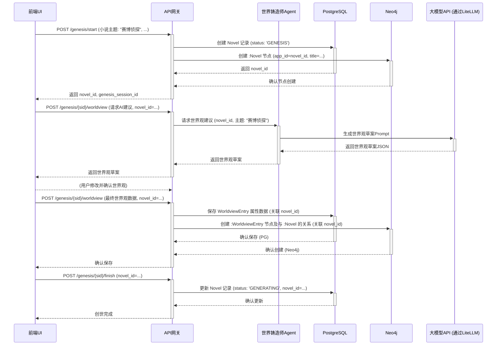
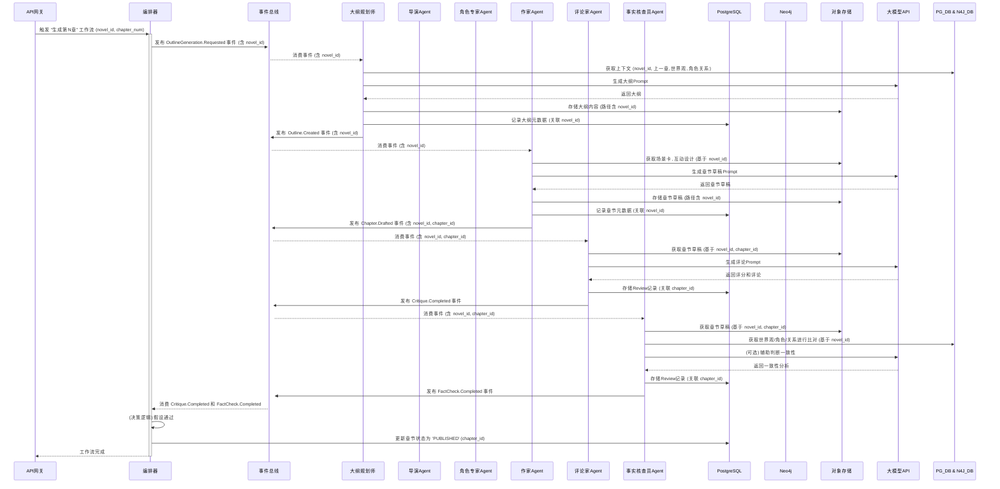

# 多智能体网络小说自动写作系统 全栈架构文档

## Introduction

本文档概述了“多智能体网络小说自动写作系统”的完整全栈架构，包括后端服务、前端实现及其集成方式。它将作为所有AI开发智能体的唯一技术事实来源，确保整个技术栈的一致性。

### 启动模板或现有项目

本项目将采用**分步模板策略**进行初始化。我们将使用 **Vite** 官方提供的 **React + TypeScript** 模板来创建前端应用，并将其集成到一个手动配置的、基于 **pnpm workspaces** 的Monorepo中。后端Python服务将在此Monorepo中从头开始设置。

### Change Log

| Date | Version | Description | Author |
| :--- | :------ | :---------- | :----- |
|      | 1.0     | Initial Draft | Winston (Architect) |
|      | 1.1     | 集成Neo4j管理世界观关系 | Winston (Architect) |
|      | 1.2     | 根据PRD v1.3和front-end-spec v1.2更新，重点调整数据模型、API接口、数据库模式以支持项目仪表盘和项目级知识库。 | Winston (Architect) |

## High Level Architecture

### 技术摘要

本系统将构建为一个基于**事件驱动的微服务架构**，部署在云平台上。前端采用**React (Vite)** 构建的单页应用（SPA），通过一个**API网关**与后端进行通信。后端由一系列解耦的、容器化的**Python智能体（Agent）服务**组成，它们通过 **Kafka** 事件总线进行异步协作。整个创作流程由 **Prefect** 进行编排。数据存储采用混合模式，使用 **PostgreSQL** 进行结构化属性数据存储，**Milvus** 进行向量相似性搜索，**Neo4j** 管理复杂的关系数据（如特定书籍的世界观和角色关系），以及 **Minio** 进行对象存储。

### 平台与基础设施选择

*   **平台:** 我们将采用**平台无关的云原生方法**。所有服务都将被容器化（Docker），使其可以部署在任何支持容器的主流云平台（如AWS, GCP, Azure）或本地环境中。
*   **关键服务:**
    *   **计算:** 容器运行服务（如 Kubernetes, ECS, 或 Docker Swarm）。
    *   **消息队列:** 一个托管的Kafka集群或自部署的Kafka。
    *   **数据库:** 托管的PostgreSQL、Milvus和**Neo4j**服务。
    *   **对象存储:** 兼容S3的存储服务（如AWS S3或自部署的Minio）。
*   **部署宿主和区域:** MVP阶段将在本地通过Docker Compose进行开发和测试。生产部署的区域将根据目标用户地理位置和成本效益另行决定。

### 仓库结构

*   **结构:** **Monorepo**。
*   **Monorepo工具:** **pnpm workspaces**。
*   **包组织:**
    *   `apps/`: 存放可独立部署的应用，如 `frontend`, `api-gateway`, `writer-agent` 等。
    *   `packages/`: 存放共享的代码库，如 `shared-types`, `eslint-config`, `common-utils` 等。

### High Level Architecture

```mermaid
graph TD
    subgraph "用户端"
        User[监督者] --> FE[React前端 (Vite)<br/>仪表盘, 项目详情, 创世向导]
    end

    subgraph "云平台 / 本地Docker"
        FE --> APIGW[API网关 (FastAPI)<br/>控制API, 数据查询]
        
        subgraph "数据存储层"
            DB[(PostgreSQL<br/>属性数据, 元数据)]
            VDB[(Milvus<br/>向量嵌入, 相似搜索)]
            GDB[("Neo4j<br/>项目级知识图谱<br/>世界观/角色关系")]
            S3[(Minio<br/>章节内容, 大纲等)]
        end

        subgraph "编排与事件层"
            Orchestrator[工作流编排器 (Prefect)]
            Broker[事件总线 (Kafka)]
        end

        subgraph "智能体微服务集群"
            Agent1[WriterAgent]
            Agent2[CriticAgent]
            Agent3[FactCheckerAgent]
            AgentN[...]
        end

        APIGW --> Orchestrator
        APIGW --> DB
        APIGW --> GDB # API网关查询项目级图数据
        
        Orchestrator -- "发布任务事件" --> Broker
        Broker -- "分发任务" --> Agent1 & Agent2 & Agent3 & AgentN
        Agent1 & Agent2 & Agent3 & AgentN -- "读/写" --> DB & VDB & GDB & S3
        Agent1 & Agent2 & Agent3 & AgentN -- "发布完成/中间事件" --> Broker
        Broker -- "通知" --> Orchestrator
        Broker -- "通知 (可选)" --> APIGW # 用于UI实时更新
    end

    User -- "通过浏览器访问" --> FE
```

### 架构模式

*   **整体架构:** **事件驱动微服务 (Event-Driven Microservices)** - 服务之间通过异步消息解耦，提高了系统的弹性和可扩展性。
*   **前端模式:** **单页应用 (Single-Page Application - SPA)** - 提供流畅的、类似桌面应用的交互体验，包含项目仪表盘和项目详情视图。
*   **后端模式:** **智能体模式 (Agent Model)** - 每个服务都是一个具有特定技能的自主智能体。
*   **集成模式:** **API网关 (API Gateway)** - 为前端提供一个统一、简化的入口点来与复杂的后端系统交互。
*   **知识表示:** **混合数据模型 (Hybrid Data Model)** - 结构化属性使用PostgreSQL，向量相似性使用Milvus，**特定于项目的复杂关系和知识图谱使用Neo4j**。

## Tech Stack

以下表格定义了本项目将要使用的全部核心技术及其具体版本。所有开发工作都必须严格遵守此技术栈，以确保兼容性和稳定性。

### Tech Stack表

| 类别 | 技术 | 版本 | 用途 | 理由 |
| :--- | :--- | :--- | :--- | :--- |
| **前端语言** | TypeScript | `~5.2.2` | 前端开发语言 | 提供强类型安全，与React生态完美集成。 |
| **前端框架** | React | `~18.2.0` | 构建用户界面 | 业界标准，生态系统成熟，性能优秀。 |
| **UI组件库** | Shadcn UI | `~0.8.0` | 基础UI组件 | 提供可高度定制、符合设计系统的无头组件。 |
| **状态管理** | Zustand | `~4.5.0` | 前端全局状态管理 | 轻量、简洁、基于Hooks，避免了Redux的样板代码。 |
| **数据请求** | TanStack Query | `~5.25.0`| 服务端状态管理 | 极大地简化了数据获取、缓存、同步和更新的逻辑。 |
| **前端路由** | React Router | `~6.22.0` | 客户端路由 | React官方推荐的路由解决方案，功能强大。 |
| **构建工具** | Vite | `~5.2.0` | 前端开发与构建 | 提供极速的开发服务器和优化的构建输出。 |
| **CSS方案** | Tailwind CSS | `~3.4.1` | UI样式 | 提供原子化的CSS类，开发效率高，与Shadcn UI集成良好。 |
| **包管理器** | pnpm | `~8.15.0`| Monorepo依赖管理 | 速度快，节省磁盘空间，对Monorepo支持优秀。 |
| **后端语言** | Python | `~3.11` | 后端与Agent开发 | AI/ML生态系统无与伦比，异步性能良好。 |
| **后端框架** | FastAPI | `~0.110.0`| API网关与服务 | 高性能，基于Pydantic的自动校验和文档生成。 |
| **数据校验** | Pydantic | `~2.6.0` | 数据模型与校验 | 提供运行时的数据类型强制，是FastAPI的核心。 |
| **工作流编排** | Prefect | `~2.19.0`| 业务流程编排 | Python原生，对数据密集型和动态工作流支持良好。 |
| **事件总线** | Apache Kafka | `3.7.0` (镜像) | 智能体间异步通信 | 高吞吐量、持久化的分布式消息系统，业界标准。 |
| **关系型数据库**| PostgreSQL | `16` (镜像) | 核心元数据与属性存储 | 功能强大，可靠，支持丰富的JSON操作。 |
| **向量数据库** | Milvus | `2.4.0` (镜像) | 上下文检索 | 专为向量相似性搜索设计，性能卓越。 |
| **图数据库** | Neo4j | `5.x` (最新稳定版镜像) | 存储和查询**项目级**复杂的世界观、角色关系 | 强大的图数据处理能力，支持复杂的关系分析和一致性校验。 |
| **对象存储** | Minio | `LATEST` (镜像) | 存储小说内容等大文件 | 兼容S3协议的开源解决方案，便于本地部署。 |
| **缓存** | Redis | `7.2` (镜像) | 缓存与临时数据 | 高性能的内存数据库，用途广泛。 |
| **LLM网关** | LiteLLM | `~1.34.0`| 统一调用大模型API | 支持多种模型，提供统一的接口和成本控制。 |
| **可观测性** | Langfuse | `~2.25.0`| LLM应用追踪与调试 | 提供对复杂Agent流程的端到端可见性。 |
| **测试框架** | Vitest, Pytest | `~1.4.0`, `~8.1.0` | 前后端单元/集成测试 | 分别是Vite和Python生态中最主流、最强大的测试框架。 |

## Data Models

以下是本系统的核心数据模型定义。这些模型将在 `packages/shared-types` 中实现，供前后端共同使用。属性主要存储在PostgreSQL，**特定于项目的知识图谱关系主要存储在Neo4j**。

### Novel (小说) - PostgreSQL & Neo4j Node :Novel

*   **目的:** 代表一个独立的小说项目，是所有其他数据的根实体。
*   **TypeScript 接口 (属性部分，对应PG表):**
    ```typescript
    interface Novel {
      id: string; // UUID, 主键
      title: string;
      theme: string; 
      writing_style: string; 
      status: 'GENESIS' | 'GENERATING' | 'PAUSED' | 'COMPLETED' | 'FAILED'; // 对应 PRD FR12
      target_chapters: number;
      completed_chapters: number;
      created_at: Date;
      updated_at: Date;
    }
    ```
*   **Neo4j Node `:Novel` 核心属性:** `app_id: string` (对应PG的 `novels.id`), `title: string`。

### Chapter (章节) - PostgreSQL & Neo4j Node :Chapter

*   **目的:** 代表小说中的一个独立章节。
*   **TypeScript 接口 (属性部分，对应PG表):**
    ```typescript
    interface Chapter {
      id: string; // UUID, 主键
      novel_id: string; // 外键 -> Novel.id
      chapter_number: number;
      title: string;
      content_url: string; // 指向Minio中存储的章节文本内容
      status: 'DRAFT' | 'REVIEWING' | 'REVISING' | 'PUBLISHED';
      word_count: number;
      created_at: Date;
      updated_at: Date;
    }
    ```
*   **Neo4j Node `:Chapter` 核心属性:** `app_id: string` (对应PG的 `chapters.id`), `chapter_number: integer`, `title: string`。
*   **Neo4j关系示例:** `(:Chapter {app_id: 'chapter_uuid'})-[:BELONGS_TO_NOVEL]->(:Novel {app_id: 'novel_uuid'})`

### Character (角色) - PostgreSQL & Neo4j Node :Character

*   **目的:** 代表小说中的一个角色，包含其所有核心设定。
*   **TypeScript 接口 (属性部分，对应PG表):**
    ```typescript
    interface Character {
      id: string; // UUID, 主键
      novel_id: string; // 外键 -> Novel.id
      name: string;
      role: 'PROTAGONIST' | 'ANTAGONIST' | 'ALLY' | 'SUPPORTING'; // 角色定位
      description: string; // 外貌、性格等简述
      background_story: string; // 背景故事
      personality_traits: string[]; // 性格特点列表
      goals: string[]; // 角色的主要目标列表
      created_at: Date;
      updated_at: Date;
    }
    ```
*   **Neo4j Node `:Character` 核心属性:** `app_id: string` (对应PG的 `characters.id`), `name: string`, `role: string`。
*   **Neo4j关系示例:** `(:Character {app_id: 'char1_uuid'})-[:APPEARS_IN_NOVEL]->(:Novel {app_id: 'novel_uuid'})`, `(:Character {app_id: 'char1_uuid'})-[:INTERACTS_WITH {type: "FRIENDSHIP", in_chapter: 5}]->(:Character {app_id: 'char2_uuid'})`

### WorldviewEntry (世界观条目) - PostgreSQL & Neo4j Node :WorldviewEntry

*   **目的:** 代表世界观中的一个独立设定条目（如地点、组织、物品、概念等）。
*   **TypeScript 接口 (属性部分，对应PG表):**
    ```typescript
    interface WorldviewEntry {
      id: string; // UUID, 主键
      novel_id: string; // 外键 -> Novel.id
      entry_type: 'LOCATION' | 'ORGANIZATION' | 'TECHNOLOGY' | 'LAW' | 'CONCEPT' | 'EVENT' | 'ITEM'; // 条目类型
      name: string; // 条目名称
      description: string; // 详细描述
      tags?: string[]; // 标签，用于分类和检索
      created_at: Date;
      updated_at: Date;
    }
    ```
*   **Neo4j Node `:WorldviewEntry` 核心属性:** `app_id: string` (对应PG的 `worldview_entries.id`), `name: string`, `entry_type: string`。
*   **Neo4j关系示例:** `(:WorldviewEntry {app_id: 'loc1_uuid', entry_type:'LOCATION'})-[:PART_OF_NOVEL_WORLDVIEW]->(:Novel {app_id: 'novel_uuid'})`, `(:WorldviewEntry {name:'Kyoto', entry_type:'LOCATION'})-[:CONTAINS_LOCATION]->(:WorldviewEntry {name:'OldTownDistrict', entry_type:'LOCATION'})`, `(:Character {name:'Ella'})-[:RESIDES_IN]->(:WorldviewEntry {name:'Kyoto', entry_type:'LOCATION'})`

### Review (评审) - PostgreSQL

*   **目的:** 记录一次对章节草稿的评审结果。
*   **TypeScript 接口 (对应PG表):**
    ```typescript
    interface Review {
      id: string; // UUID
      chapter_id: string; // 外键 -> Chapter.id
      agent_id: string; // 执行评审的Agent的ID
      review_type: 'CRITIC' | 'FACT_CHECK'; // 评审类型
      score?: number; // 评论家评分 (可选)
      comment?: string; // 评论家评语 (可选)
      is_consistent?: boolean; // 事实核查员判断是否一致 (可选)
      issues_found?: string[]; // 事实核查员发现的问题列表 (可选)
      created_at: Date;
    }
    ```

### StoryArc (故事弧) - PostgreSQL & Neo4j Node :StoryArc (可选，用于更高级的剧情规划)

*   **目的:** 代表一个主要的情节线或故事阶段。
*   **TypeScript 接口 (属性部分，对应PG表):**
    ```typescript
    interface StoryArc {
      id: string; // UUID, 主键
      novel_id: string; // 外键 -> Novel.id
      title: string;
      summary: string;
      start_chapter_number?: number;
      end_chapter_number?: number;
      status: 'PLANNED' | 'ACTIVE' | 'COMPLETED';
      created_at: Date;
      updated_at: Date;
    }
    ```
*   **Neo4j Node `:StoryArc` 核心属性:** `app_id: string` (对应PG的 `story_arcs.id`), `title: string`, `status: string`。
*   **Neo4j关系示例:** `(:StoryArc {app_id: 'arc1_uuid'})-[:PART_OF_NOVEL_PLOT]->(:Novel {app_id: 'novel_uuid'})`, `(:StoryArc {title:'序章'})-[:PRECEDES_ARC]->(:StoryArc {title:'第一幕'})`

### Neo4j 关系模型概念

Neo4j将用于存储**每个小说项目内部**的实体间的复杂关系，例如：
*   **角色间关系:** `(:Character)-[:KNOWS {strength: 0.8, sentiment: "positive"}]->(:Character)`
*   **角色与地点:** `(:Character)-[:LOCATED_IN {start_chapter: 1, end_chapter: 5, duration_description: "童年时期"}]->(:WorldviewEntry {entry_type: "LOCATION"})`
*   **事件顺序:** `(:WorldviewEntry {entry_type: "EVENT", name: "大灾变"})-[:PRECEDES_EVENT]->(:WorldviewEntry {entry_type: "EVENT", name: "重建期"})`
*   **章节与实体关联:**
    *   `(:Chapter)-[:FEATURES_CHARACTER {role_in_chapter: "POV"}]->(:Character)`
    *   `(:Chapter)-[:MENTIONS_LOCATION]->(:WorldviewEntry {entry_type: "LOCATION"})`
    *   `(:Chapter)-[:DEVELOPS_ARC]->(:StoryArc)`
*   **世界观条目间关系:**
    *   `(:WorldviewEntry {entry_type:"ORGANIZATION", name:"光明教会"})-[:HOSTILE_TO]->(:WorldviewEntry {entry_type:"ORGANIZATION", name:"暗影兄弟会"})`
    *   `(:WorldviewEntry {entry_type:"TECHNOLOGY", name:"曲速引擎"})-[:REQUIRES_MATERIAL]->(:WorldviewEntry {entry_type:"ITEM", name:"零点水晶"})`

## Components

### 1. API网关 (API Gateway)

*   **责任:**
    *   作为前端UI与后端所有服务的唯一入口点。
    *   处理所有来自前端的HTTP请求。
    *   进行身份验证和授权。
    *   将前端指令（如“开始创世”、“生成章节”）转化为对Prefect工作流的调用。
    *   提供查询接口，供前端获取工作流状态、结果数据（如章节内容、**项目列表**）、以及**特定项目的Neo4j图数据**。
*   **关键接口 (部分，参考OpenAPI Spec):**
    *   `POST /genesis/start`
    *   `POST /genesis/{session_id}/...`
    *   `GET /novels` (新增，获取所有小说项目列表)
    *   `POST /novels/{novel_id}/generate-chapter`
    *   `GET /chapters/{chapter_id}`
    *   `GET /workflows/{task_id}/status` (查询工作流状态)
    *   `GET /metrics`
    *   `GET /health`
    *   `GET /novels/{novel_id}/graph/worldview` (新增，查询指定小说的Neo4j世界观图数据)
*   **依赖:** PostgreSQL (用于存储创世数据、小说元数据), **Neo4j (用于查询项目级关系图谱)**, Prefect (用于触发工作流), Kafka (可选，用于发布某些UI触发的即时事件)。
*   **技术栈:** FastAPI, Python, Pydantic。

### 2. 世界铸造师Agent (Worldsmith Agent)
*   **责任:**
    *   在“创世阶段”与人类监督者（通过API网关和UI）交互。
    *   根据用户的核心创意，调用大模型API生成小说主题、世界观、核心角色阵容和初始剧情弧光的草案。
    *   辅助用户完成这些初始设定的迭代和确认。
    *   将最终确认的设定属性写入PostgreSQL，并在Neo4j中创建对应的节点和初始关系 (所有操作均与 `novel_id` 关联)。
*   **关键接口/事件:**
    *   **订阅:** (通过内部调用或事件) `GenesisStep.Requested` (例如，请求生成世界观建议，包含 `novel_id`)。
    *   **发布:** (通过内部调用或事件) `GenesisStep.SuggestionProvided` (包含AI生成的草案)。
*   **依赖:** 大模型API (通过LiteLLM), PostgreSQL, Neo4j (操作均与 `novel_id` 关联)。
*   **技术栈:** Python, Pydantic, LiteLLM。

### 3. 剧情策划师Agent (PlotMaster Agent)
*   **责任:**
    *   进行高层次的、战略性的剧情规划 (针对特定 `novel_id`)。
    *   周期性地（或按需）分析故事的整体进展、节奏和角色弧光。
    *   发布“高层剧情指令”，如引入新角色、开启新支线、制造情节转折等。
*   **关键接口/事件:**
    *   **订阅:** `Novel.AnalysisRequested` (含 `novel_id`), `Chapter.Completed` (含 `novel_id`, 用于计数和触发周期性评估)。
    *   **发布:** `PlotDirective.Created` (包含具体的剧情指令, 关联 `novel_id`)。
*   **依赖:** 知识库 (PostgreSQL, Milvus, Neo4j - 所有查询均基于 `novel_id`) 用于获取故事全局信息。
*   **技术栈:** Python, Pydantic。

### 4. 大纲规划师Agent (Outliner Agent)
*   **责任:**
    *   将高层的剧情指令（来自PlotMaster）或简单的“下一章”请求 (均含 `novel_id`)，转化为具体的章节情节大纲。
*   **关键接口/事件:**
    *   **订阅:** `OutlineGeneration.Requested` (含 `novel_id`), `PlotDirective.Created` (含 `novel_id`)。
    *   **发布:** `Outline.Created` (包含章节大纲, 关联 `novel_id`, `chapter_id`)。
*   **依赖:** 大模型API (通过LiteLLM), 知识库 (基于 `novel_id` 获取上一章结尾和相关上下文)。
*   **技术栈:** Python, Pydantic, LiteLLM。

### 5. 导演Agent (Director Agent)
*   **责任:**
    *   将章节大纲 (关联 `novel_id`, `chapter_id`) 分解为更小的场景序列。
    *   为每个场景定义核心目标、节奏（紧张、平缓等）、视角（POV）和关键转折点。
*   **关键接口/事件:**
    *   **订阅:** `SceneDesign.Requested` (含 `novel_id`, `chapter_id`), `Outline.Created` (含 `novel_id`, `chapter_id`)。
    *   **发布:** `SceneDesign.Completed` (包含场景卡序列, 关联 `novel_id`, `chapter_id`)。
*   **依赖:** 大模型API (通过LiteLLM), 知识库 (基于 `novel_id` 获取大纲)。
*   **技术栈:** Python, Pydantic, LiteLLM。

### 6. 角色专家Agent (CharacterExpert Agent)
*   **责任:**
    *   根据场景设计 (关联 `novel_id`, `chapter_id`)，规划角色间的具体对话和互动。
    *   如果场景中出现新角色，负责创建其完整的角色卡（属性入PG, 节点入Neo4j - 均关联 `novel_id`）并触发持久化。
    *   更新Neo4j中角色间的互动关系 (基于 `novel_id`)。
*   **关键接口/事件:**
    *   **订阅:** `CharacterInteractionDesign.Requested` (含 `novel_id`, `chapter_id`), `SceneDesign.Completed` (含 `novel_id`, `chapter_id`)。
    *   **发布:** `CharacterInteraction.Designed` (关联 `novel_id`, `chapter_id`), `Character.Created` (如果创建了新角色, 关联 `novel_id`)。
*   **依赖:** 大模型API (通过LiteLLM), 知识库 (PostgreSQL获取场景卡、角色属性; Neo4j获取和更新角色关系 - 均基于 `novel_id`)。
*   **技术栈:** Python, Pydantic, LiteLLM。

### 7. 世界观构建师Agent (WorldBuilder Agent)
*   **责任:**
    *   在创作过程中，根据需要（例如，导演或作家Agent发现设定不足，针对特定 `novel_id`）扩展和丰富世界观设定。
    *   确保新的设定属性写入PostgreSQL，并在Neo4j中创建对应的节点和关系 (均关联 `novel_id`)。
*   **关键接口/事件:**
    *   **订阅:** `WorldviewExpansion.Requested` (含 `novel_id`)。
    *   **发布:** `WorldviewEntry.Created` (关联 `novel_id`)。
*   **依赖:** 大模型API (通过LiteLLM), 知识库 (PostgreSQL获取现有世界观属性; Neo4j获取和更新关系 - 均基于 `novel_id`)。
*   **技术栈:** Python, Pydantic, LiteLLM。

### 8. 作家Agent (Writer Agent)
*   **责任:**
    *   严格遵循导演的场景和节奏指令，并结合角色专家的对话设计 (均关联 `novel_id`, `chapter_id`)，调用大模型API将所有元素渲染成最终的章节草稿。
*   **关键接口/事件:**
    *   **订阅:** `ChapterWriting.Requested` (含 `novel_id`, `chapter_id`), `SceneDesign.Completed` (含 `novel_id`, `chapter_id`), `CharacterInteraction.Designed` (含 `novel_id`, `chapter_id`)。
    *   **发布:** `Chapter.Drafted` (包含章节草稿的URL和元数据, 关联 `novel_id`, `chapter_id`)。
*   **依赖:** 大模型API (通过LiteLLM), 知识库 (基于 `novel_id` 获取完整的创作指令), Minio (存储草稿, 路径含 `novel_id`)。
*   **技术栈:** Python, Pydantic, LiteLLM。

### 9. 评论家Agent (Critic Agent)
*   **责任:**
    *   对章节草稿 (关联 `novel_id`, `chapter_id`) 的文学质量、节奏感、趣味性和是否符合导演要求进行评估。
    *   输出结构化的评分和具体的改进建议。
*   **关键接口/事件:**
    *   **订阅:** `Critique.Requested` (含 `novel_id`, `chapter_id`), `Chapter.Drafted` (含 `novel_id`, `chapter_id`)。
    *   **发布:** `Critique.Completed` (包含评分和评论, 关联 `chapter_id`)。
*   **依赖:** 大模型API (通过LiteLLM), 知识库 (基于 `novel_id` 获取草稿内容)。
*   **技术栈:** Python, Pydantic, LiteLLM。

### 10. 事实核查员Agent (FactChecker Agent)
*   **责任:**
    *   将章节草稿的内容 (关联 `novel_id`, `chapter_id`) 与知识库中已确立的世界观（PG属性）、角色设定（PG属性）和历史情节（Neo4j关系 - 均基于 `novel_id`）进行比对。
    *   报告任何发现的不一致之处或逻辑矛盾。
*   **关键接口/事件:**
    *   **订阅:** `FactCheck.Requested` (含 `novel_id`, `chapter_id`), `Chapter.Drafted` (含 `novel_id`, `chapter_id`)。
    *   **发布:** `FactCheck.Completed` (包含一致性报告和问题列表, 关联 `chapter_id`)。
*   **依赖:** 大模型API (通过LiteLLM), 知识库 (PostgreSQL, Milvus, Neo4j - 所有查询均基于 `novel_id`)。
*   **技术栈:** Python, Pydantic, LiteLLM。

### 11. 改写者Agent (Rewriter Agent)
*   **责任:**
    *   根据评论家Agent的评分和建议，或事实核查员Agent的报告 (均关联 `chapter_id`)，对章节草稿进行针对性的修改和润色。
*   **关键接口/事件:**
    *   **订阅:** `Revision.Requested` (通常包含草稿、评论和问题报告, 关联 `chapter_id`)。
    *   **发布:** `Chapter.Revised` (修改后的草稿，将重新进入评审流程, 关联 `chapter_id`)。
*   **依赖:** 大模型API (通过LiteLLM), 知识库 (基于 `novel_id`)。
*   **技术栈:** Python, Pydantic, LiteLLM。

### Components图 (已更新，更强调Neo4j在存储层的作用)



```mermaid
graph TD
    UI[前端UI<br/>仪表盘, 项目详情] --> APIGW[API网关]

    subgraph "编排层"
        Orchestrator[Prefect工作流]
    end

    APIGW --> Orchestrator

    subgraph "事件总线 (Kafka)"
        KafkaBus[Kafka]
    end

    Orchestrator -- "触发任务" --> KafkaBus
    
    subgraph "智能体集群"
        WS[世界铸造师]
        PM[剧情策划师]
        OL[大纲规划师]
        DIR[导演]
        CE[角色专家]
        WB[世界观构建师]
        WR[作家]
        CR[评论家]
        FC[事实核查员]
        RW[改写者]
    end

    KafkaBus --> WS & PM & OL & DIR & CE & WB & WR & CR & FC & RW
    WS & PM & OL & DIR & CE & WB & WR & CR & FC & RW --> KafkaBus

    subgraph "支撑服务"
        LLMGW[LiteLLM网关]
        LGF[Langfuse]
    end
    
    subgraph "存储层 (按项目隔离)"
        PG[(PostgreSQL<br/>小说/章节/角色属性)]
        MV[(Milvus<br/>项目级文本向量)]
        N4J[("Neo4j<br/>项目级知识图谱<br/>(世界观,角色关系,情节)")]
        MN[(Minio<br/>章节文本,大纲文件)]
    end

    WS & PM & OL & DIR & CE & WB & WR & CR & FC & RW -- "LLM调用" --> LLMGW
    WS & PM & OL & DIR & CE & WB & WR & CR & FC & RW -- "数据交互 (novel_id scoped)" --> PG & MV & N4J & MN
    LLMGW -- "日志/追踪" --> LGF
    APIGW -- "数据查询 (novel_id scoped)" --> PG & N4J


    classDef agent fill:#D6EAF8,stroke:#2E86C1,stroke-width:2px;
    classDef support fill:#E8F8F5,stroke:#1ABC9C,stroke-width:2px;
    class WS,PM,OL,DIR,CE,WB,WR,CR,FC,RW agent;
    class LLMGW,LGF support;
```

## External APIs

### 1. 大型语言模型 (LLM) API
*   **目的:** 所有智能体执行其核心的自然语言理解、生成和评估任务。
*   **API提供商 (示例):** OpenAI (GPT-4o, GPT-3.5-Turbo等), Anthropic (Claude 3 Opus, Sonnet, Haiku等), Google (Gemini Pro等)。
*   **统一网关:** **LiteLLM**
    *   **作用:** 所有对LLM API的调用都**必须**通过LiteLLM代理。
    *   **好处:** 统一接口, 模型切换, 成本控制, 回退与重试, 日志与监控。
*   **认证:** 每种LLM API都有其自己的认证机制（通常是API密钥）。这些密钥将安全地存储，并通过配置注入到LiteLLM中。Agent服务本身不直接持有这些密钥。
*   **速率限制与配额:** 每个LLM提供商都有其速率限制和使用配额。LiteLLM可以帮助我们管理这些限制。
*   **集成注意事项:** Prompt Engineering, 上下文管理, 错误处理。

## Core Workflows

### 1. 创世流程 (Genesis Flow) - UI触发


### 2. 章节生成流程 (Chapter Generation Flow) - 标准路径


## REST API Spec
```yaml
openapi: 3.0.0
info:
  title: 多智能体网络小说自动写作系统 - 控制API
  version: v1.2.0 
  description: 用于前端UI与后端工作流系统交互的控制API。
servers:
  - url: http://localhost:8000/api/v1 
    description: 本地开发服务器
  - url: https://your-production-domain.com/api/v1 
    description: 生产环境服务器

components:
  schemas:
    Novel:
      type: object
      properties:
        id:
          type: string
          format: uuid
        title:
          type: string
        theme:
          type: string
        writing_style:
          type: string
        status:
          type: string
          enum: [GENESIS, GENERATING, PAUSED, COMPLETED, FAILED]
        target_chapters:
          type: integer
        completed_chapters:
          type: integer
        created_at:
          type: string
          format: date-time
        updated_at:
          type: string
          format: date-time
    Chapter:
      type: object
      properties:
        id:
          type: string
          format: uuid
        novel_id:
          type: string
          format: uuid
        chapter_number:
          type: integer
        title:
          type: string
        content_url:
          type: string
          format: url
        status:
          type: string
          enum: [DRAFT, REVIEWING, REVISING, PUBLISHED]
        word_count:
          type: integer
        created_at:
          type: string
          format: date-time
        updated_at:
          type: string
          format: date-time
    Review:
      type: object
      properties:
        id:
          type: string
          format: uuid
        chapter_id:
          type: string
          format: uuid
        agent_id:
          type: string
        review_type:
          type: string
          enum: [CRITIC, FACT_CHECK]
        score:
          type: number
          format: float
        comment:
          type: string
        is_consistent:
          type: boolean
        issues_found:
          type: array
          items:
            type: string
        created_at:
          type: string
          format: date-time
    WorldviewNode: 
      type: object
      properties:
        id: 
          type: string 
          description: Neo4j内部节点ID
        app_id: 
          type: string
          format: uuid
          description: 对应PostgreSQL中的实体ID
        labels: 
          type: array
          items: 
            type: string 
          description: 节点的标签 (e.g., Character, Location)
        properties: 
          type: object
          description: 节点的属性 (e.g., name, entry_type)
    WorldviewRelationship: 
      type: object
      properties:
        id: 
          type: string
          description: Neo4j内部关系ID
        type: 
          type: string
          description: 关系的类型 (e.g., KNOWS, LOCATED_IN)
        startNodeAppId: 
          type: string
          format: uuid
        endNodeAppId: 
          type: string
          format: uuid
        properties: 
          type: object
          description: 关系的属性
    GenesisStartRequest:
      type: object
      required:
        - title
        - theme
        - writing_style
        - target_chapters
      properties:
        title:
          type: string
        theme:
          type: string
        writing_style:
          type: string
        target_chapters:
          type: integer
          minimum: 1
    GenesisStartResponse:
      type: object
      properties:
        novel_id:
          type: string
          format: uuid
        genesis_session_id:
          type: string
          format: uuid
    GenesisStepRequest: 
      type: object
      properties:
        data:
          type: object 
          description: 具体步骤的数据，如世界观条目数组或角色对象数组
    GenesisStepResponse:
      type: object
      properties:
        success:
          type: boolean
        message:
          type: string
    WorkflowStatus:
      type: object
      properties:
        task_id:
          type: string
        status:
          type: string
        progress:
          type: number
          format: float
        details:
          type: string
    Metrics:
      type: object
      properties:
        total_words_generated:
          type: integer
        cost_per_10k_words:
          type: number
          format: float
        avg_chapter_generation_time_seconds:
          type: number
          format: float
        chapter_revision_rate:
          type: number
          format: float
  securitySchemes:
    BearerAuth:
      type: http
      scheme: bearer
      bearerFormat: JWT

security:
  - BearerAuth: []

paths:
  /health:
    get:
      summary: 健康检查
      responses:
        '200':
          description: 服务正常
          content:
            application/json:
              schema:
                type: object
                properties:
                  status:
                    type: string
                    example: ok
  /genesis/start:
    post:
      summary: 启动新的创世流程
      requestBody:
        required: true
        content:
          application/json:
            schema:
              $ref: '#/components/schemas/GenesisStartRequest'
      responses:
        '201':
          description: 创世流程已启动
          content:
            application/json:
              schema:
                $ref: '#/components/schemas/GenesisStartResponse'
        '400':
          description: 无效请求
  /genesis/{session_id}/worldview:
    post:
      summary: 提交世界观设定
      parameters:
        - name: session_id
          in: path
          required: true
          schema:
            type: string
            format: uuid
      requestBody:
        required: true
        content:
          application/json:
            schema:
              $ref: '#/components/schemas/GenesisStepRequest' 
      responses:
        '200':
          description: 世界观已保存
          content:
            application/json:
              schema:
                $ref: '#/components/schemas/GenesisStepResponse'
  /genesis/{session_id}/characters:
    post:
      summary: 提交核心角色
      parameters:
        - name: session_id
          in: path
          required: true
          schema:
            type: string
            format: uuid
      requestBody:
        required: true
        content:
          application/json:
            schema:
              $ref: '#/components/schemas/GenesisStepRequest' 
      responses:
        '200':
          description: 核心角色已保存
          content:
            application/json:
              schema:
                $ref: '#/components/schemas/GenesisStepResponse'
  /genesis/{session_id}/plot:
    post:
      summary: 提交初始剧情弧光
      parameters:
        - name: session_id
          in: path
          required: true
          schema:
            type: string
            format: uuid
      requestBody:
        required: true
        content:
          application/json:
            schema:
              $ref: '#/components/schemas/GenesisStepRequest' 
      responses:
        '200':
          description: 初始剧情已保存
          content:
            application/json:
              schema:
                $ref: '#/components/schemas/GenesisStepResponse'
  /genesis/{session_id}/finish:
    post:
      summary: 完成并结束创世流程
      parameters:
        - name: session_id
          in: path
          required: true
          schema:
            type: string
            format: uuid
      responses:
        '200':
          description: 创世已完成，小说待生成
          content:
            application/json:
              schema:
                $ref: '#/components/schemas/GenesisStepResponse'
  /novels: 
    get:
      summary: 获取所有小说项目列表
      responses:
        '200':
          description: 成功获取小说列表
          content:
            application/json:
              schema:
                type: array
                items:
                  $ref: '#/components/schemas/Novel'
  /novels/{novel_id}/generate-chapter:
    post:
      summary: 触发指定小说生成下一章
      parameters:
        - name: novel_id
          in: path
          required: true
          schema:
            type: string
            format: uuid
      responses:
        '202':
          description: 章节生成任务已接受
          content:
            application/json:
              schema:
                type: object
                properties:
                  task_id: 
                    type: string
                  message:
                    type: string
  /chapters/{chapter_id}:
    get:
      summary: 获取指定章节内容及其评审
      parameters:
        - name: chapter_id
          in: path
          required: true
          schema:
            type: string
            format: uuid
      responses:
        '200':
          description: 成功获取章节详情
          content:
            application/json:
              schema:
                type: object
                properties:
                  chapter:
                    $ref: '#/components/schemas/Chapter'
                  reviews:
                    type: array
                    items:
                      $ref: '#/components/schemas/Review'
  /workflows/{task_id}/status:
    get:
      summary: 查询指定工作流的状态
      parameters:
        - name: task_id
          in: path
          required: true
          schema:
            type: string
      responses:
        '200':
          description: 成功获取工作流状态
          content:
            application/json:
              schema:
                $ref: '#/components/schemas/WorkflowStatus'
  /metrics:
    get:
      summary: 获取系统关键性能与成本指标
      responses:
        '200':
          description: 成功获取指标
          content:
            application/json:
              schema:
                $ref: '#/components/schemas/Metrics'
  /novels/{novel_id}/graph/worldview: 
    get:
      summary: 获取指定小说的世界观图谱数据 (用于可视化)
      parameters:
        - name: novel_id
          in: path
          required: true
          schema:
            type: string
            format: uuid
      responses:
        '200':
          description: 成功获取图谱数据
          content:
            application/json:
              schema:
                type: object
                properties:
                  nodes:
                    type: array
                    items:
                      $ref: '#/components/schemas/WorldviewNode'
                  relationships:
                    type: array
                    items:
                      $ref: '#/components/schemas/WorldviewRelationship'
```

## Database Schema

### PostgreSQL
```sql
-- Novels Table
CREATE TABLE novels (
    id UUID PRIMARY KEY DEFAULT gen_random_uuid(),
    title VARCHAR(255) NOT NULL,
    theme TEXT,
    writing_style TEXT,
    status VARCHAR(50) NOT NULL DEFAULT 'GENESIS' CHECK (status IN ('GENESIS', 'GENERATING', 'PAUSED', 'COMPLETED', 'FAILED')),
    target_chapters INTEGER NOT NULL DEFAULT 0,
    completed_chapters INTEGER NOT NULL DEFAULT 0,
    created_at TIMESTAMPTZ NOT NULL DEFAULT NOW(),
    updated_at TIMESTAMPTZ NOT NULL DEFAULT NOW()
);

-- Chapters Table
CREATE TABLE chapters (
    id UUID PRIMARY KEY DEFAULT gen_random_uuid(),
    novel_id UUID NOT NULL REFERENCES novels(id) ON DELETE CASCADE,
    chapter_number INTEGER NOT NULL,
    title VARCHAR(255),
    content_url TEXT, -- URL to content in Minio
    status VARCHAR(50) NOT NULL DEFAULT 'DRAFT' CHECK (status IN ('DRAFT', 'REVIEWING', 'REVISING', 'PUBLISHED')),
    word_count INTEGER DEFAULT 0,
    created_at TIMESTAMPTZ NOT NULL DEFAULT NOW(),
    updated_at TIMESTAMPTZ NOT NULL DEFAULT NOW(),
    UNIQUE (novel_id, chapter_number)
);

-- Characters Table
CREATE TABLE characters (
    id UUID PRIMARY KEY DEFAULT gen_random_uuid(),
    novel_id UUID NOT NULL REFERENCES novels(id) ON DELETE CASCADE,
    name VARCHAR(255) NOT NULL,
    role VARCHAR(50) CHECK (role IN ('PROTAGONIST', 'ANTAGONIST', 'ALLY', 'SUPPORTING')),
    description TEXT,
    background_story TEXT,
    personality_traits TEXT[], -- Array of strings
    goals TEXT[], -- Array of strings
    created_at TIMESTAMPTZ NOT NULL DEFAULT NOW(),
    updated_at TIMESTAMPTZ NOT NULL DEFAULT NOW()
);

-- Worldview Entries Table (Stores attributes of worldview entities)
CREATE TABLE worldview_entries (
    id UUID PRIMARY KEY DEFAULT gen_random_uuid(), -- This ID will match the Neo4j node's app_id property
    novel_id UUID NOT NULL REFERENCES novels(id) ON DELETE CASCADE,
    entry_type VARCHAR(50) NOT NULL CHECK (entry_type IN ('LOCATION', 'ORGANIZATION', 'TECHNOLOGY', 'LAW', 'CONCEPT', 'EVENT', 'ITEM')),
    name VARCHAR(255) NOT NULL,
    description TEXT,
    tags TEXT[],
    created_at TIMESTAMPTZ NOT NULL DEFAULT NOW(),
    updated_at TIMESTAMPTZ NOT NULL DEFAULT NOW(),
    UNIQUE (novel_id, name, entry_type) 
);

-- Reviews Table
CREATE TABLE reviews (
    id UUID PRIMARY KEY DEFAULT gen_random_uuid(),
    chapter_id UUID NOT NULL REFERENCES chapters(id) ON DELETE CASCADE,
    agent_id VARCHAR(255) NOT NULL, 
    review_type VARCHAR(50) NOT NULL CHECK (review_type IN ('CRITIC', 'FACT_CHECK')),
    score NUMERIC(3, 1), 
    comment TEXT, 
    is_consistent BOOLEAN, 
    issues_found TEXT[], 
    created_at TIMESTAMPTZ NOT NULL DEFAULT NOW()
);

-- Story Arcs Table
CREATE TABLE story_arcs (
    id UUID PRIMARY KEY DEFAULT gen_random_uuid(),
    novel_id UUID NOT NULL REFERENCES novels(id) ON DELETE CASCADE,
    title VARCHAR(255) NOT NULL,
    summary TEXT,
    start_chapter_number INTEGER,
    end_chapter_number INTEGER,
    status VARCHAR(50) DEFAULT 'PLANNED' CHECK (status IN ('PLANNED', 'ACTIVE', 'COMPLETED')),
    created_at TIMESTAMPTZ NOT NULL DEFAULT NOW(),
    updated_at TIMESTAMPTZ NOT NULL DEFAULT NOW()
);

-- Indexes for performance
CREATE INDEX idx_chapters_novel_id ON chapters(novel_id);
CREATE INDEX idx_characters_novel_id ON characters(novel_id);
CREATE INDEX idx_worldview_entries_novel_id ON worldview_entries(novel_id);
CREATE INDEX idx_reviews_chapter_id ON reviews(chapter_id);
CREATE INDEX idx_story_arcs_novel_id ON story_arcs(novel_id);

-- Function to update updated_at timestamp
CREATE OR REPLACE FUNCTION trigger_set_timestamp()
RETURNS TRIGGER AS $$
BEGIN
  NEW.updated_at = NOW();
  RETURN NEW;
END;
$$ LANGUAGE plpgsql;

-- Apply the trigger to relevant tables
CREATE TRIGGER set_timestamp_novels
BEFORE UPDATE ON novels
FOR EACH ROW
EXECUTE FUNCTION trigger_set_timestamp();

CREATE TRIGGER set_timestamp_chapters
BEFORE UPDATE ON chapters
FOR EACH ROW
EXECUTE FUNCTION trigger_set_timestamp();

CREATE TRIGGER set_timestamp_characters
BEFORE UPDATE ON characters
FOR EACH ROW
EXECUTE FUNCTION trigger_set_timestamp();

CREATE TRIGGER set_timestamp_worldview_entries
BEFORE UPDATE ON worldview_entries
FOR EACH ROW
EXECUTE FUNCTION trigger_set_timestamp();

CREATE TRIGGER set_timestamp_story_arcs
BEFORE UPDATE ON story_arcs
FOR EACH ROW
EXECUTE FUNCTION trigger_set_timestamp();
```

### Neo4j
*   **核心原则:** Neo4j用于存储和查询**每个小说项目内部的**知识图谱，包括世界观实体、角色及其之间的复杂关系和随时间演变的互动。所有Neo4j中的节点都应有一个 `app_id` 属性，该属性的值对应其在PostgreSQL中对应表的主键ID，以便于跨数据库关联。
*   **节点标签 (Node Labels) - 示例:**
    *   `:Novel` (属性: `app_id: string` (来自PG `novels.id`), `title: string`)
    *   `:Chapter` (属性: `app_id: string` (来自PG `chapters.id`), `chapter_number: integer`, `title: string`)
    *   `:Character` (属性: `app_id: string` (来自PG `characters.id`), `name: string`, `role: string`)
    *   `:WorldviewEntry` (属性: `app_id: string` (来自PG `worldview_entries.id`), `name: string`, `entry_type: string` (如 'LOCATION', 'ORGANIZATION', 'ITEM'))
    *   `:StoryArc` (属性: `app_id: string` (来自PG `story_arcs.id`), `title: string`)
    *   `:PlotPoint` (属性: `description: string`, `significance: float`) - (可选，用于更细致的情节跟踪)
*   **关系类型 (Relationship Types) - 示例 (所有关系都应隐含地属于某个Novel的上下文):**
    *   `(:Chapter)-[:BELONGS_TO_NOVEL]->(:Novel)`
    *   `(:Character)-[:APPEARS_IN_NOVEL]->(:Novel)`
    *   `(:WorldviewEntry)-[:PART_OF_NOVEL_WORLDVIEW]->(:Novel)`
    *   `(:StoryArc)-[:PART_OF_NOVEL_PLOT]->(:Novel)`
    *   **世界观内部关系:**
        *   `(:WorldviewEntry {entry_type:'LOCATION'})-[:CONTAINS_LOCATION]->(:WorldviewEntry {entry_type:'LOCATION'})`
        *   `(:WorldviewEntry {entry_type:'ORGANIZATION'})-[:HAS_MEMBER]->(:Character)`
        *   `(:WorldviewEntry {entry_type:'TECHNOLOGY'})-[:DERIVED_FROM]->(:WorldviewEntry {entry_type:'CONCEPT'})`
    *   **角色间关系 (可带属性，如章节号、关系强度/类型):**
        *   `(:Character)-[:KNOWS {since_chapter: 3, strength: 'strong'}]->(:Character)`
        *   `(:Character)-[:ALLIED_WITH {details: "Temporary alliance for mission X"}]->(:Character)`
        *   `(:Character)-[:ROMANTIC_INTEREST_IN]->(:Character)`
    *   **角色与世界观/章节互动:**
        *   `(:Character)-[:VISITED_LOCATION {chapter: 5, purpose: "Gather info"}]->(:WorldviewEntry {entry_type:'LOCATION'})`
        *   `(:Character)-[:USED_ITEM {chapter: 7}]->(:WorldviewEntry {entry_type:'ITEM'})`
        *   `(:Chapter)-[:FEATURES_CHARACTER_ACTION {action_description: "Saved the cat"}]->(:Character)`
        *   `(:Chapter)-[:REVEALS_INFO_ABOUT]->(:WorldviewEntry)`
    *   **情节与章节/角色关联:**
        *   `(:Chapter)-[:ADVANCES_ARC]->(:StoryArc)`
        *   `(:PlotPoint)-[:OCCURS_IN_CHAPTER]->(:Chapter)`
        *   `(:PlotPoint)-[:INVOLVES_CHARACTER]->(:Character)`
*   **索引:** 将为常用的查询属性（如 `app_id`, `name`, `entry_type`）创建索引。

## Source Tree
```plaintext
novel-ai-writer/
├── .github/                    # CI/CD 工作流 (GitHub Actions)
│   └── workflows/
│       └── main.yml            # 主CI/CD流水线
├── .vscode/                    # VSCode 编辑器特定配置 (可选)
│   └── settings.json
├── apps/                       # 存放可独立部署的应用
│   ├── frontend/               # React + Vite 前端应用
│   │   ├── public/             # 静态资源
│   │   ├── src/
│   │   │   ├── assets/         # 图片、字体等
│   │   │   ├── components/     # UI组件
│   │   │   │   ├── custom/     # 项目自定义业务组件 (e.g., ProjectCard, NovelReader)
│   │   │   │   └── ui/         # 从Shadcn UI复制和定制的基础组件
│   │   │   ├── config/         # 前端特定配置 (e.g., API base URL)
│   │   │   ├── hooks/          # 自定义React Hooks (e.g., useProjectList, useChapterDetails)
│   │   │   ├── layouts/        # 页面布局组件 (e.g., DashboardLayout, ProjectDetailLayout)
│   │   │   ├── pages/          # 页面级组件 (路由目标)
│   │   │   │   ├── dashboard/  # 项目仪表盘页面
│   │   │   │   │   └── index.tsx
│   │   │   │   ├── projects/
│   │   │   │   │   └── [id]/     # 项目详情页 (动态路由)
│   │   │   │   │       ├── overview/
│   │   │   │   │       ├── chapters/
│   │   │   │   │       │   └── [chapterId]/ # 章节阅读器
│   │   │   │   │       ├── knowledge-base/
│   │   │   │   │       └── settings/
│   │   │   │   ├── create-novel/ # 创世向导页面
│   │   │   │   ├── global-monitoring/
│   │   │   │   └── settings/     # 用户设置页面
│   │   │   ├── services/       # API调用服务 (e.g., novelService.ts, chapterService.ts, graphService.ts)
│   │   │   ├── store/          # Zustand状态管理 (e.g., authStore.ts, projectStore.ts)
│   │   │   ├── styles/         # 全局样式, Tailwind配置
│   │   │   ├── types/          # 前端特定类型 (如果不能从shared-types导入或需要扩展)
│   │   │   ├── utils/          # 前端工具函数
│   │   │   └── App.tsx
│   │   │   └── main.tsx
│   │   ├── index.html
│   │   ├── package.json
│   │   ├── tsconfig.json
│   │   ├── vite.config.ts
│   │   └── vitest.config.ts
│   ├── api-gateway/            # FastAPI API网关服务
│   │   ├── app/                # FastAPI应用代码
│   │   │   ├── api/            # API路由模块 (e.g., v1/genesis.py, v1/novels.py, v1/graph.py)
│   │   │   ├── core/           # 核心配置, 中间件, 安全
│   │   │   ├── crud/           # 数据库CRUD操作 (可选, 或在services中)
│   │   │   ├── services/       # 业务服务 (e.g., neo4j_service.py, prefect_service.py)
│   │   │   ├── models/         # Pydantic模型 (如果不能从shared-types导入)
│   │   │   └── main.py
│   │   ├── tests/
│   │   ├── Dockerfile
│   │   └── requirements.txt
│   ├── worldsmith-agent/       # 世界铸造师Agent服务
│   │   ├── agent/              # Agent核心逻辑
│   │   ├── Dockerfile
│   │   └── requirements.txt
│   ├── plotmaster-agent/       # 剧情策划师Agent服务 (结构类似)
│   ├── outliner-agent/         # 大纲规划师Agent服务 (结构类似)
│   ├── director-agent/         # 导演Agent服务 (结构类似)
│   ├── characterexpert-agent/  # 角色专家Agent服务 (结构类似)
│   ├── worldbuilder-agent/     # 世界观构建师Agent服务 (结构类似)
│   ├── writer-agent/           # 作家Agent服务 (结构类似)
│   ├── critic-agent/           # 评论家Agent服务 (结构类似)
│   ├── factchecker-agent/      # 事实核查员Agent服务 (结构类似)
│   └── rewriter-agent/         # 改写者Agent服务 (结构类似)
│   ├── knowledgegraph-service/ # (可选) 封装Neo4j操作的共享服务/库 (更可能在packages/common-utils)
│   │   ├── app/
│   │   ├── Dockerfile
│   │   └── requirements.txt
├── packages/                   # 存放共享的代码包
│   ├── shared-types/           # Pydantic模型, TypeScript接口, 事件Schema
│   │   ├── src/
│   │   │   ├── models_db.py    # Pydantic数据模型 (对应PG表)
│   │   │   ├── models_api.py   # Pydantic API请求/响应模型
│   │   │   ├── events.py       # Kafka事件Schema (Pydantic)
│   │   │   └── index.ts        # TypeScript类型导出 (基于Pydantic模型生成或手动编写)
│   │   └── package.json
│   ├── eslint-config-custom/   # 共享ESLint配置
│   │   └── index.js
│   ├── tsconfig-custom/        # 共享TypeScript配置
│   │   └── base.json
│   └── common-utils/           # 通用工具函数 (Python和JS/TS)
│       ├── py_utils/           # Python通用工具 (e.g., neo4j_connector.py)
│       ├── ts_utils/           # TypeScript通用工具
│       └── package.json
├── infrastructure/             # Terraform IaC 代码
│   └── modules/
│       ├── vpc/
│       ├── kafka/
│       ├── postgresql/
│       ├── milvus/
│       ├── neo4j/  
│       └── ecs_fargate/ 
├── docs/                       # 项目文档
│   ├── project-brief.md
│   ├── prd.md
│   ├── front-end-spec.md
│   └── architecture.md         # (本文档)
├── scripts/                    # 项目级脚本 (如: 启动所有服务, 清理, 生成类型)
├── .dockerignore
├── .env.example                # 环境变量模板
├── .eslintignore
├── .eslintrc.js                # Monorepo根ESLint配置
├── .gitignore
├── .prettierignore
├── .prettierrc.js              # Monorepo根Prettier配置
├── docker-compose.yml          # Docker Compose配置 (包含Neo4j)
├── package.json                # Monorepo根package.json (pnpm)
├── pnpm-workspace.yaml         # pnpm工作区定义
├── README.md
└── tsconfig.json               # Monorepo根TypeScript配置 (用于路径映射等)
```

## Infrastructure and Deployment

### 基础设施即代码 (Infrastructure as Code - IaC)

*   **工具:** **Terraform** 
    *   **版本:** Terraform `~1.7.0`
*   **位置:** 所有IaC代码将存放在Monorepo的 `infrastructure/` 目录下。
*   **方法:**
    *   为每个环境（开发、预发布、生产）创建独立的Terraform工作区。
    *   核心基础设施（如VPC、Kafka集群、PostgreSQL, Milvus, **Neo4j实例**）将作为基础模块进行管理。
    *   应用服务（如Agent容器、API网关）的部署将引用这些基础模块。

### 部署策略

*   **策略:** **基于容器的蓝绿部署 (Blue/Green Deployment)** 或 **金丝雀发布 (Canary Releases)**。
*   **CI/CD平台:** **GitHub Actions**。
*   **流水线配置:** 位于 `.github/workflows/main.yml`。
    *   **阶段:** 代码检出 -> Lint/Test -> 构建Docker镜像 -> 推送镜像 -> (可选)安全扫描 -> Terraform应用 -> 部署服务 -> E2E测试 -> 流量切换/增加。

### 环境

| 环境名称 | 用途 | 部署方式 | 数据库/事件总线/图库 |
| :--- | :--- | :--- | :--- |
| **本地 (Local)** | 日常开发与单元测试 | `docker-compose up` | 本地Docker容器 (含Neo4j) |
| **开发 (Development)** | 共享的开发/集成测试环境 | CI/CD自动部署 (来自`develop`分支) | 专用的云上开发实例 (含Neo4j) |
| **预发布 (Staging)** | 模拟生产环境，进行UAT和E2E测试 | CI/CD自动部署 (来自`release/*`分支或手动触发) | 生产环境的精确副本 (含Neo4j，数据可能脱敏) |
| **生产 (Production)** | 最终用户访问的实时环境 | CI/CD手动批准部署 (来自`main`分支) | 高可用的生产级云实例 (含Neo4j) |

### 环境提升流程


### 回滚策略

*   **主要方法:** 蓝绿切换, Docker镜像回滚。
*   **触发条件:** 关键KPI恶化, E2E测试失败, 大量用户负面反馈。
*   **恢复时间目标 (RTO):** 生产环境回滚操作应在 **15分钟内** 完成。

## Error Handling Strategy

### 总体方法
*   **错误模型:** **基于异常 (Exception-based)**。
*   **异常层级:** 后端定义基础 `AppException`；前端使用标准 `Error`。
*   **错误传递:** 服务内部捕获/重抛；服务间通过Kafka DLQ；API网关转HTTP错误。

### 日志标准
*   **库:** Python `logging` (JSON格式), 前端 `console.error()`。
*   **格式:** 结构化 (时间戳, 服务名/Agent ID, 日志级别, 相关ID, 错误消息, 堆栈跟踪)。
*   **日志级别:** ERROR, WARNING, INFO, DEBUG。
*   **必需上下文:** 相关ID (UUID), 服务上下文, (脱敏)用户上下文。

### 错误处理模式
#### External APIs错误 (特别是LLM API)
*   **重试策略:** LiteLLM配置指数退避重试。
*   **熔断器 (Circuit Breaker):** LiteLLM配置模型/提供商自动切换。
*   **超时配置:** 为LLM API调用设置合理超时。
*   **错误翻译:** Agent服务将LiteLLM错误翻译为业务异常。
#### 业务逻辑错误
*   **自定义异常:** 定义清晰的业务异常。
*   **用户友好错误:** API网关转换错误为用户友好消息和错误码。
*   **错误码:** 考虑为API响应定义统一内部错误码。
#### 数据一致性
*   **事务策略 (PostgreSQL):** 关键写操作使用事务。
*   **补偿逻辑 (Saga Pattern - 后MVP):** 为跨服务长时间流程考虑。
*   **幂等性:** 所有事件消费者必须设计为幂等。

## Coding Standards

### 核心标准

*   **语言与运行时版本:** Python `~3.11`, TypeScript `~5.2.2`, Node.js `~20.x.x`。
*   **代码风格与Linting:**
    *   **Python:** `Ruff` (Linter), `Black` (Formatter)。
    *   **TypeScript/JavaScript:** `ESLint` (共享配置), `Prettier` (共享配置)。
    *   **强制执行:** Git提交钩子和CI流水线。
*   **测试文件组织:** Python (`test_*.py` 或 `*_test.py`), TypeScript (`*.test.ts(x)` 或 `*.spec.ts(x)`), 与被测模块同级。

### 命名约定

| 元素 | 约定 | Python示例 | TypeScript示例 |
| :--- | :--- | :--- | :--- |
| 变量 | snake_case (Py), camelCase (TS) | `user_name` | `userName` |
| 函数/方法 | snake_case (Py), camelCase (TS) | `get_user_data()` | `getUserData()` |
| 类名 | PascalCase | `UserDataProcessor` | `UserDataProcessor` |
| 常量 | UPPER_SNAKE_CASE | `MAX_RETRIES` | `MAX_RETRIES` |
| 文件名 (Py) | snake_case.py | `user_service.py` | N/A |
| 文件名 (TS) | kebab-case.ts 或 PascalCase.tsx | N/A | `user-service.ts`, `UserProfile.tsx` |
| Pydantic模型字段 | snake_case | `class User(BaseModel): user_id: UUID` | N/A |

### 关键规则 (AI智能体必须严格遵守)

*   **1. 禁止硬编码敏感信息:** 通过环境变量或配置服务加载。
*   **2. 严格的类型提示:** Python类型提示, TypeScript `strict`模式。
*   **3. 优先使用异步/非阻塞IO:** Python后端使用 `async/await`。
*   **4. 结构化日志记录:** 使用项目定义的结构化日志格式，含相关ID。
*   **5. 错误处理规范:** 遵循定义的错误处理策略。
*   **6. 遵循Monorepo结构:** 代码放置在正确位置，共享代码在 `packages/`。
*   **7. 事件驱动通信:** Agent间通信必须通过Kafka。
*   **8. 幂等性设计:** 事件消费者逻辑必须幂等。
*   **9. Neo4j操作封装:** 对Neo4j的操作应通过专门的知识图谱服务或共享库进行封装 (例如在 `packages/common-utils/py_utils/neo4j_connector.py`)，避免在各个Agent中直接编写复杂的Cypher查询。所有查询必须与 `novel_id` 关联。

### 语言特定指南

*   **Python:** 依赖在 `requirements.txt` 或 `pyproject.toml` 中声明。建议独立虚拟环境。
*   **TypeScript:** 利用 `tsconfig.json` 的 `paths` 别名引用共享包。

## Test Strategy and Standards

### 测试理念
*   **测试驱动开发 (TDD) / 行为驱动开发 (BDD) - 鼓励但不强制。**
*   **覆盖率目标:** 单元测试核心逻辑 **85%**。集成测试覆盖关键交互。
*   **测试金字塔:** (如图所示)
    ```text
            /\
           /  \
          /E2E \  
         /______\
        /        \
       /集成测试 \ 
      /__________\
     /            \
    /  单元测试    \ 
   /______________\
    ```

### 测试类型与组织
#### 1. 单元测试 (Unit Tests)
*   **框架:** Python: `Pytest ~8.1.0`; TypeScript: `Vitest ~1.4.0`。
*   **文件约定:** (如编码标准中所述)。
*   **模拟库:** Python: `unittest.mock`, `pytest-mock`; TypeScript: `Vitest`内置。
*   **AI要求:** 为所有公开函数/方法生成测试，覆盖正常、边界、错误情况，遵循AAA，模拟所有外部依赖。
#### 2. 集成测试 (Integration Tests)
*   **范围:** API网关与Agent交互, Agent与Kafka交互, Agent与数据库(PG, Milvus, Neo4j)交互。
*   **位置:** 各自服务的 `tests/integration` 目录。
*   **测试基础设施:** 使用 `testcontainers` 启动临时的PG, Milvus, Neo4j, Kafka实例。模拟LiteLLM或测试与真实LiteLLM(模拟后端)的集成。
#### 3. 端到端测试 (End-to-End Tests)
*   **框架:** Playwright `~1.42.0`。
*   **范围:** MVP阶段覆盖“创世流程”和“单章节生成与查看”。
*   **环境:** 预发布 (Staging) 环境。

### 测试数据管理
*   **单元测试:** 硬编码模拟数据。
*   **集成测试:** 数据工厂/固件创建数据，测试后清理/回滚。
*   **端到端测试:** 专用可重置E2E数据库或测试用例自管理数据。

### 持续测试
*   **CI集成:** 单元、集成测试在每次提交/PR时自动运行 (GitHub Actions)。E2E测试在合并到`develop`/`release`后触发。
*   **性能测试 (后MVP):** `k6` 或 `Locust`。
*   **安全测试 (后MVP):** SAST/DAST工具。

## Security

### 输入验证
*   **库:** Pydantic (后端), Zod/Yup (前端)。
*   **位置:** 前后端双重验证。后端验证是最后防线。
*   **规则:** 严格验证所有外部输入，白名单优先。

### 认证与授权 (Authentication & Authorization)
*   **方法 (API网关):** JWT。考虑 `Auth0`, `Keycloak` 或自定义实现。
*   **存储 (前端):** JWT存入安全的 `HttpOnly` Cookie。
*   **授权:** RBAC。API端点声明所需权限。
*   **密码:** 强哈希算法 (`bcrypt` 或 `Argon2`) 加盐存储。

### 密钥管理 (Secrets Management)
*   **开发:** `.env` 文件 (加入 `.gitignore`)。
*   **生产:** **必须**使用专用密钥管理服务 (HashiCorp Vault, AWS Secrets Manager等)。
*   **代码要求:** 严禁硬编码密钥，严禁日志中出现密钥。

### API安全
*   **速率限制:** API网关实现 (如 `slowapi` for FastAPI)。
*   **CORS策略:** API网关配置严格CORS。
*   **安全头:** API响应包含推荐安全头。
*   **HTTPS强制:** 生产环境流量必须HTTPS。

### 数据保护
*   **传输中加密:** 所有外部通信必须TLS/SSL (HTTPS)。
*   **静态加密 (后MVP):** 考虑对PG, Minio, Neo4j中的敏感数据进行静态加密。
*   **PII处理:** (如果适用) 遵循相关隐私法规。
*   **日志限制:** 敏感数据不入日志。

### 依赖安全
*   **扫描工具:** CI/CD集成漏洞扫描 (`npm audit`/`pnpm audit`, `pip-audit`/`Safety`)。
*   **更新策略:** 定期审查和更新依赖。
*   **审批流程:** 新依赖需安全评估。

### Security测试 (后MVP)
*   **SAST:** `Bandit` (Python), `ESLint`安全插件。
*   **DAST:** OWASP ZAP。
*   **渗透测试:** 定期第三方渗透测试。
