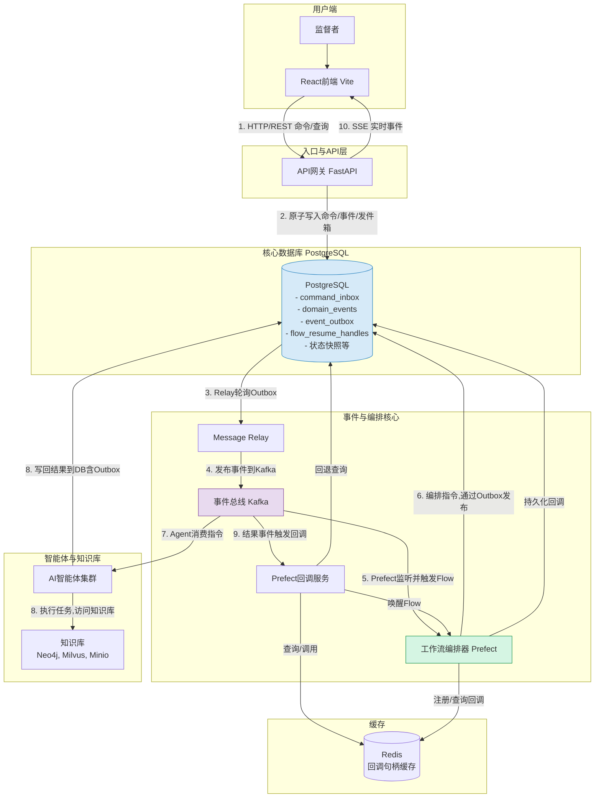
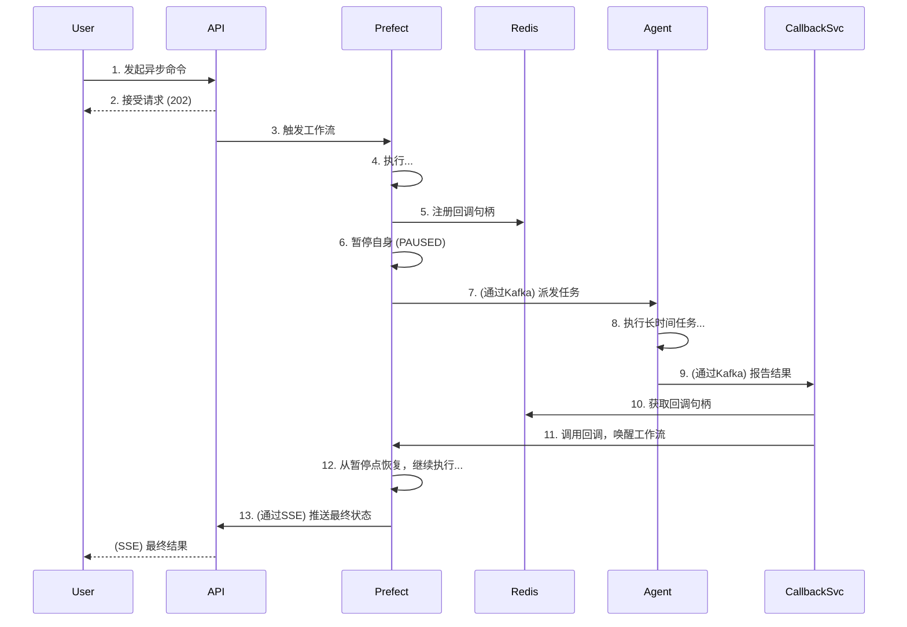
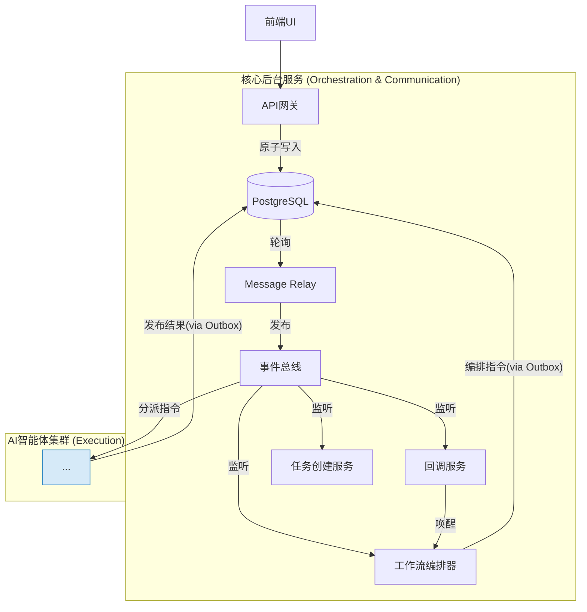
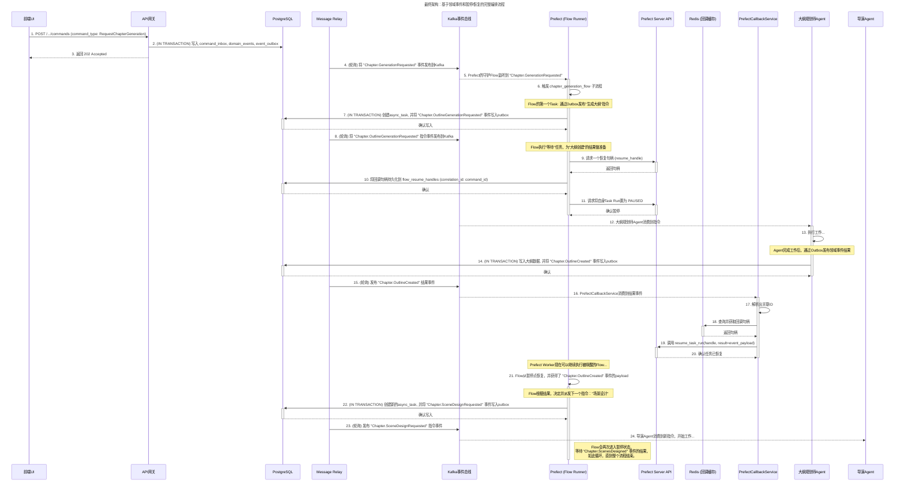
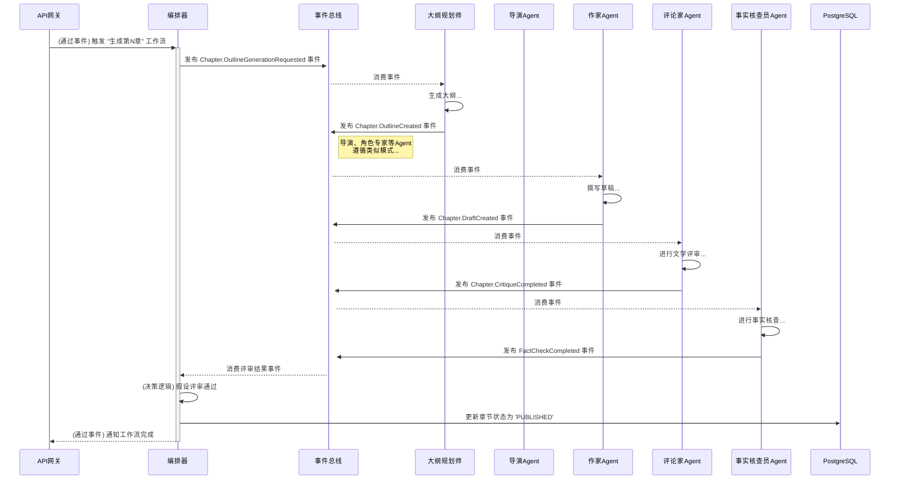
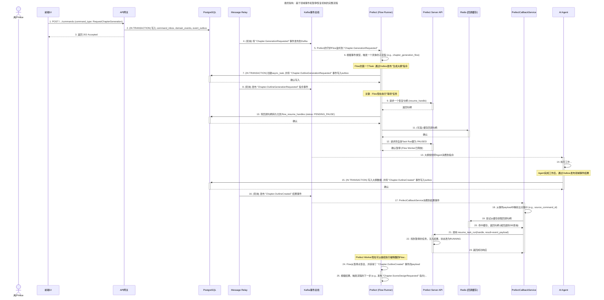

# 多智能体网络小说自动写作系统 全栈架构文档

## Introduction

本文档概述了“多智能体网络小说自动写作系统”的完整全栈架构，包括后端服务、前端实现及其集成方式。它将作为所有AI开发智能体的唯一技术事实来源，确保整个技术栈的一致性。

### 启动模板或现有项目

本项目将采用**分步模板策略**进行初始化。我们将使用 **Vite** 官方提供的 **React + TypeScript** 模板来创建前端应用，并将其集成到一个手动配置的、基于 **pnpm workspaces** 的Monorepo中。后端Python服务将在此Monorepo中从头开始设置。

### Change Log

| Date | Version | Description                                                                                                    | Author              |
| :--- | :------ | :------------------------------------------------------------------------------------------------------------- | :------------------ |
|      | 1.0     | Initial Draft                                                                                                  | Winston (Architect) |
|      | 1.1     | 集成Neo4j管理世界观关系                                                                                        | Winston (Architect) |
|      | 1.2     | 根据PRD v1.3和front-end-spec v1.2更新，重点调整数据模型、API接口、数据库模式以支持项目仪表盘和项目级知识库。   | Winston (Architect) |
|      | 1.3     | **重大更新**: 全面重构数据库模式以支持多智能体追踪、工作流编排、版本控制和动态配置。采纳了关于外键的混合策略。 | Winston (Architect) |
|      | 1.4     | **最终定稿**: 根据最终审查意见，对数据库模式进行硬化，增加索引、触发器、完整性约束和分区策略规划。             | Winston (Architect) |

## High Level Architecture

### 技术摘要

本系统将构建为一个基于**事件驱动的微服务架构**，部署在云平台上。前端采用**React (Vite)** 构建的单页应用（SPA），通过一个**API网关**与后端进行通信。后端由一系列解耦的、容器化的**Python智能体（Agent）服务**组成，它们通过 **Kafka** 事件总线进行异步协作。整个创作流程由 **Prefect** 进行编排。数据存储采用混合模式，使用 **PostgreSQL** 进行结构化属性数据存储，**Milvus** 进行向量相似性搜索，**Neo4j** 管理复杂的关系数据（如特定书籍的世界观和角色关系），以及 **Minio** 进行对象存储。

### 平台与基础设施选择

- **平台:** 我们将采用**平台无关的云原生方法**。所有服务都将被容器化（Docker），使其可以部署在任何支持容器的主流云平台（如AWS, GCP, Azure）或本地环境中。
- **关键服务:**
  - **计算:** 容器运行服务（如 Kubernetes, ECS, 或 Docker Swarm）。
  - **消息队列:** 一个托管的Kafka集群或自部署的Kafka。
  - **数据库:** 托管的PostgreSQL、Milvus和**Neo4j**服务。
  - **对象存储:** 兼容S3的存储服务（如AWS S3或自部署的Minio）。
- **部署宿主和区域:** MVP阶段将在本地通过Docker Compose进行开发和测试。生产部署的区域将根据目标用户地理位置和成本效益另行决定。

### 仓库结构

- **结构:** **Monorepo**。
- **Monorepo工具:** **pnpm workspaces**。
- **包组织:**
  - `apps/`: 存放可独立部署的应用，如 `frontend`, `backend` (包含API Gateway和所有Agent服务)。

### High Level Architecture



### 1. 组件交互与技术概览图 (Component Interaction & Tech Overview)

这张图是我们架构的核心视图，展示了所有关键服务模块、它们之间的主要交互路径以及所使用的核心技术。

```mermaid
graph TD
    subgraph "用户端"
        User[监督者] --> FE[React前端 (Vite)];
    end

    subgraph "入口与API层"
        APIGW[API网关 (FastAPI)];
        FE -- "1. HTTP/REST (命令/查询)" --> APIGW;
        APIGW -- "10. SSE (实时事件)" --> FE;
    end

    subgraph "核心数据库 (PostgreSQL)"
        DB[(PostgreSQL<br/>- command_inbox<br/>- domain_events<br/>- event_outbox<br/>- flow_resume_handles<br/>- 状态快照等)];
    end

    subgraph "事件与编排核心"
        Relay[Message Relay];
        Kafka[事件总线 (Kafka)];
        Prefect[工作流编排器 (Prefect)];
        CallbackSvc[Prefect回调服务];
    end

    subgraph "智能体与知识库"
        Agents[AI智能体集群];
        KnowledgeBase[知识库<br/>(Neo4j, Milvus, Minio)];
    end

    subgraph "缓存"
        Cache[(Redis<br/>回调句柄缓存)];
    end

    %% 核心数据流
    APIGW -- "2. 原子写入命令/事件/发件箱" --> DB;
    DB -- "3. Relay轮询Outbox" --> Relay;
    Relay -- "4. 发布事件到Kafka" --> Kafka;

    Kafka -- "5. Prefect监听并触发Flow" --> Prefect;
    Prefect -- "6. 编排指令,通过Outbox发布" --> DB;

    Kafka -- "7. Agent消费指令" --> Agents;
    Agents -- "8. 执行任务,访问知识库" --> KnowledgeBase;
    Agents -- "8. 写回结果到DB(含Outbox)" --> DB;

    Kafka -- "9. 结果事件触发回调" --> CallbackSvc;
    CallbackSvc -- "查询/调用" --> Cache;
    CallbackSvc -- "回退查询" --> DB;
    CallbackSvc -- "唤醒Flow" --> Prefect;

    Prefect -- "注册/查询回调" --> Cache;
    Prefect -- "持久化回调" --> DB;

    style DB fill:#D6EAF8,stroke:#2E86C1
    style Kafka fill:#E8DAEF,stroke:#884EA0
    style Prefect fill:#D5F5E3,stroke:#229954
```

### 2. C4模型 - 容器图 (C4 Model - Container Diagram)

这张图从更高的层次描绘了系统的**可部署单元（容器）**以及它们之间的技术交互，非常适合向新加入的开发者或运维人员介绍系统的整体结构。

```mermaid
!theme C4
C4Container
    Person(user, "监督者/作者", "通过Web浏览器与系统交互")

    System_Boundary(b1, "多智能体写作系统") {
        Container(spa, "单页应用 (SPA)", "JavaScript, React", "提供用户界面")
        Container(api, "API网关", "Python, FastAPI", "处理所有入站请求, 提供SSE")
        Container(agents, "AI智能体集群", "Python", "一组执行具体创作任务的微服务")
        Container(prefect, "工作流引擎", "Python, Prefect", "编排复杂的业务流程")
        Container(relay, "消息中继服务", "Python", "可靠地将数据库事件发布到Kafka")
        Container(callback, "回调服务", "Python", "监听结果事件以恢复暂停的工作流")
    }

    System_Ext(kafka, "事件总线", "Apache Kafka")
    System_Db(db, "主数据库", "PostgreSQL")
    System_Db(neo4j, "图数据库", "Neo4j")
    System_Db(milvus, "向量数据库", "Milvus")
    System_Db(redis, "缓存数据库", "Redis")
    System_Db(minio, "对象存储", "Minio (S3-compatible)")
    System_Ext(llm, "大语言模型API", "OpenAI, Anthropic, etc.")

    Rel(user, spa, "使用", "HTTPS")
    Rel(spa, api, "API调用", "HTTPS/JSON")
    Rel(api, spa, "SSE事件推送")

    Rel(api, db, "读/写", "TCP/IP")
    Rel(api, prefect, "触发/查询工作流", "HTTP")

    Rel(relay, db, "轮询[event_outbox]", "TCP/IP")
    Rel(relay, kafka, "发布事件")

    Rel(prefect, kafka, "监听/发布事件")
    Rel(prefect, redis, "注册/查询回调")
    Rel(prefect, db, "持久化回调")

    Rel(callback, kafka, "监听结果事件")
    Rel(callback, redis, "查询回调")
    Rel(callback, db, "回退查询")
    Rel(callback, prefect, "恢复工作流", "HTTP")

    Rel(agents, kafka, "消费指令/发布结果")
    Rel(agents, db, "读/写")
    Rel(agents, neo4j, "读/写")
    Rel(agents, milvus, "读/写")
    Rel(agents, minio, "读/写")
    Rel(agents, llm, "调用", "HTTPS")
```

### 3. 核心数据流图 (Core Data Flow Diagram - DFD)

这张图专注于**数据本身**，展示了“小说章节”这份核心数据是如何在系统中一步步被创建、处理和存储的，忽略了具体的服务实现细节。

```mermaid
graph TD
    A[用户命令: "生成下一章"] --> B{1. 命令处理};
    B --> C[2. 创建异步任务];
    C --> D{3. 编排工作流};
    D -- "生成大纲指令" --> E[4. 大纲生成];
    E -- "大纲内容" --> F[5. 场景设计];
    F -- "场景卡" --> G[6. 角色互动设计];
    G -- "对话与动作" --> H[7. 章节草稿撰写];
    H -- "章节草稿" --> I{8. 并行评审};
    I -- "评分/问题" --> J{9. 决策};
    J -- "不通过" --> K[10. 修订草稿];
    K -- "修订版草稿" --> I;
    J -- "通过" --> L[11. 最终章节内容];

    subgraph "持久化存储"
        M[(PostgreSQL)];
        N[(Minio)];
        O[(Neo4j/Milvus)];
    end

    E -- "写入" --> M & N;
    F -- "写入" --> M & N;
    G -- "写入" --> M & N;
    H -- "写入" --> M & N;
    I -- "写入评审结果" --> M;
    K -- "写入新版本" --> M & N;
    L -- "更新最终状态" --> M;

    E & F & G & H & K -- "访问知识库" --> O;
```

### 4. 概括性时序图 (Simplified Sequence Diagram)

这张图是我们之前详细时序图的高度概括版本，用于快速理解一个核心异步流程的交互顺序，特别是“暂停-恢复”模式。



### 架构模式

- **整体架构: 事件驱动微服务 (Event-Driven Microservices)**
  - 服务之间通过异步消息（Kafka事件）进行解耦，提高了系统的整体弹性和可扩展性。

- **前端模式: 单页应用 (Single-Page Application - SPA)**
  - 通过React和Vite构建，为用户提供流畅、动态、类似桌面应用的交互体验，包含项目仪表盘和项目详情等复杂视图。

- **后端模式: 智能体模式 (Agent Model)**
  - 每个核心业务能力被封装为一个独立的、具有特定技能的自主智能体微服务（如作家Agent、评论家Agent）。

- **集成模式: API网关 (API Gateway)**
  - 为前端提供一个统一、安全且简化的入口点，以与复杂的后端微服务和工作流系统进行交互。

- **知识表示: 混合数据模型 (Hybrid Data Model)**
  - 采用多种数据库来最有效地处理不同类型的数据：结构化属性和元数据使用**PostgreSQL**；文本内容的向量相似性搜索使用**Milvus**；而特定于项目的、复杂的实体间关系和知识图谱则由**Neo4j**负责管理。

- **核心实现模式 (Core Implementation Patterns):**
  - **命令查询责任分离 (CQRS):** 严格分离用户的写操作（通过`command_inbox`发起的命令）和读操作（对`genesis_sessions`等状态快照表的查询），优化了系统的性能和复杂性管理。
  - **事件溯源 (Event Sourcing):** 以`domain_events`表作为整个系统不可变的、单一的事实来源。所有状态变更都是对这些历史事件响应的结果，提供了极高的可审计性。
  - **事务性发件箱 (Transactional Outbox):** 通过`event_outbox`表，利用数据库的原子事务，保证了本地数据状态的变更与向分布式消息系统（Kafka）发布事件这两个动作之间的最终一致性。
  - **命令收件箱 (Command Inbox):** 通过`command_inbox`表和数据库的唯一性约束，为所有需要异步处理的、有副作用的命令提供了可靠的幂等性保证，从根本上防止了重复提交。
  - **工作流编排 - 暂停与恢复模式 (Pause and Resume):** Prefect工作流通过一个持久化（PostgreSQL）和缓存（Redis）的回调句柄系统，实现了与外部异步事件（如AI任务完成或用户反馈）的非阻塞式交互，极大地提高了系统资源的利用效率。

## Tech Stack

以下表格定义了本项目将要使用的全部核心技术及其具体版本。所有开发工作都必须严格遵守此技术栈，以确保兼容性和稳定性。

### Tech Stack表

| 类别             | 技术           | 版本                   | 用途                                       | 理由                                                   |
| :--------------- | :------------- | :--------------------- | :----------------------------------------- | :----------------------------------------------------- |
| **前端语言**     | TypeScript     | `~5.2.2`               | 前端开发语言                               | 提供强类型安全，与React生态完美集成。                  |
| **前端框架**     | React          | `~18.2.0`              | 构建用户界面                               | 业界标准，生态系统成熟，性能优秀。                     |
| **UI组件库**     | Shadcn UI      | `~0.8.0`               | 基础UI组件                                 | 提供可高度定制、符合设计系统的无头组件。               |
| **状态管理**     | Zustand        | `~4.5.0`               | 前端全局状态管理                           | 轻量、简洁、基于Hooks，避免了Redux的样板代码。         |
| **数据请求**     | TanStack Query | `~5.25.0`              | 服务端状态管理                             | 极大地简化了数据获取、缓存、同步和更新的逻辑。         |
| **前端路由**     | React Router   | `~6.22.0`              | 客户端路由                                 | React官方推荐的路由解决方案，功能强大。                |
| **构建工具**     | Vite           | `~5.2.0`               | 前端开发与构建                             | 提供极速的开发服务器和优化的构建输出。                 |
| **CSS方案**      | Tailwind CSS   | `~3.4.1`               | UI样式                                     | 提供原子化的CSS类，开发效率高，与Shadcn UI集成良好。   |
| **包管理器**     | pnpm           | `~8.15.0`              | Monorepo依赖管理                           | 速度快，节省磁盘空间，对Monorepo支持优秀。             |
| **后端语言**     | Python         | `~3.11`                | 后端与Agent开发                            | AI/ML生态系统无与伦比，异步性能良好。                  |
| **后端框架**     | FastAPI        | `~0.115.13`            | API网关与服务                              | 高性能，基于Pydantic的自动校验和文档生成。             |
| **数据校验**     | Pydantic       | `~2.11.7`              | 数据模型与校验                             | 提供运行时的数据类型强制，是FastAPI的核心。            |
| **工作流编排**   | Prefect        | `~2.19.0`              | 业务流程编排                               | Python原生，对数据密集型和动态工作流支持良好。         |
| **事件总线**     | Apache Kafka   | `3.7.0` (镜像)         | 智能体间异步通信                           | 高吞吐量、持久化的分布式消息系统，业界标准。           |
| **关系型数据库** | PostgreSQL     | `16` (镜像)            | 核心元数据与属性存储                       | 功能强大，可靠，支持丰富的JSON操作。                   |
| **向量数据库**   | Milvus         | `2.4.0` (镜像)         | 上下文检索                                 | 专为向量相似性搜索设计，性能卓越。                     |
| **图数据库**     | Neo4j          | `5.x` (最新稳定版镜像) | 存储和查询**项目级**复杂的世界观、角色关系 | 强大的图数据处理能力，支持复杂的关系分析和一致性校验。 |
| **对象存储**     | Minio          | `LATEST` (镜像)        | 存储小说内容等大文件                       | 兼容S3协议的开源解决方案，便于本地部署。               |
| **缓存**         | Redis          | `7.2` (镜像)           | 缓存与临时数据                             | 高性能的内存数据库，用途广泛。                         |
| **LLM网关**      | LiteLLM        | `~1.34.0`              | 统一调用大模型API                          | 支持多种模型，提供统一的接口和成本控制。               |
| **可观测性**     | Langfuse       | `~2.25.0`              | LLM应用追踪与调试                          | 提供对复杂Agent流程的端到端可见性。                    |
| **测试框架**     | Vitest, Pytest | `~1.4.0`, `~8.1.0`     | 前后端单元/集成测试                        | 分别是Vite和Python生态中最主流、最强大的测试框架。     |

## Data Models

以下是本系统的核心数据模型定义。前端类型定义在 `apps/frontend/src/types/` 中，后端模型在 `apps/backend/src/models/` 中实现。属性主要存储在PostgreSQL，**特定于项目的知识图谱关系主要存储在Neo4j**。

### AgentActivity (活动日志) - PostgreSQL

- **目的:** 记录系统中由智能体执行的每一个有意义的事件或操作。
- **TypeScript 接口 (对应PG表):**
  ```typescript
  interface AgentActivity {
    id: string; // 活动的唯一标识符 (UUID)
    workflow_run_id?: string; // 关联的工作流运行ID (UUID)
    novel_id: string; // 关联的小说ID (UUID)
    target_entity_id?: string; // 活动所针对的目标实体的ID (如 chapter_id, character_id)
    target_entity_type?: string; // 目标实体的类型 (如 'CHAPTER', 'CHARACTER')
    agent_type?:
      | "worldsmith"
      | "plotmaster"
      | "outliner"
      | "director"
      | "character_expert"
      | "worldbuilder"
      | "writer"
      | "critic"
      | "fact_checker"
      | "rewriter"; // 执行活动的Agent类型
    activity_type: string; // 活动的具体类型 (如 'CREATE', 'UPDATE', 'GENERATE_OUTLINE')
    status: "STARTED" | "IN_PROGRESS" | "COMPLETED" | "FAILED" | "RETRYING"; // 活动的当前状态
    input_data?: any; // 活动的输入数据 (JSONB)
    output_data?: any; // 活动的输出数据 (JSONB)
    error_details?: any; // 如果失败，记录错误详情 (JSONB)
    started_at: Date; // 活动开始时间
    completed_at?: Date; // 活动完成时间
    duration_seconds?: number; // 活动持续时间（秒），由数据库自动计算
    llm_tokens_used?: number; // 本次活动消耗的LLM Token数量
    llm_cost_estimate?: number; // 本次活动估算的LLM成本
    retry_count: number; // 活动重试次数
  }
  ```

### Novel (小说) - PostgreSQL & Neo4j Node :Novel

- **目的:** 代表一个独立的小说项目，是所有其他数据的根实体。
- **TypeScript 接口 (属性部分，对应PG表):**
  ```typescript
  interface Novel {
    id: string; // 小说的唯一标识符 (UUID), 主键
    title: string; // 小说标题
    theme: string; // 小说主题
    writing_style: string; // 写作风格描述
    status: "GENESIS" | "GENERATING" | "PAUSED" | "COMPLETED" | "FAILED"; // 小说的当前状态
    target_chapters: number; // 目标总章节数
    completed_chapters: number; // 已完成章节数
    version: number; // 版本号，用于乐观锁控制并发更新
    created_by_agent_type?: string; // 创建此小说的Agent类型 (通常是 'worldsmith')
    updated_by_agent_type?: string; // 最后更新此小说元数据的Agent类型
    created_at: Date; // 创建时间
    updated_at: Date; // 最后更新时间
  }
  ```
- **Neo4j Node `:Novel` 核心属性:** `app_id: string` (对应PG的 `novels.id`), `title: string`。

### Chapter (章节) - PostgreSQL & Neo4j Node :Chapter

- **目的:** 代表小说中的一个独立章节的元数据。实际内容存储在 `chapter_versions` 表中。
- **TypeScript 接口 (属性部分，对应PG表):**
  ```typescript
  interface Chapter {
    id: string; // 章节的唯一标识符 (UUID), 主键
    novel_id: string; // 所属小说的ID (UUID), 外键
    chapter_number: number; // 章节序号
    title: string; // 章节标题
    status: "DRAFT" | "REVIEWING" | "REVISING" | "PUBLISHED"; // 章节的当前状态
    published_version_id?: string; // 指向当前已发布版本的ID (来自 chapter_versions 表)
    version: number; // 版本号，用于乐观锁
    created_by_agent_type?: string; // 创建此章节记录的Agent类型
    updated_by_agent_type?: string; // 最后更新此章节元数据的Agent类型
    created_at: Date; // 创建时间
    updated_at: Date; // 最后更新时间
  }
  ```
- **Neo4j Node `:Chapter` 核心属性:** `app_id: string` (对应PG的 `chapters.id`), `chapter_number: integer`, `title: string`。
- **Neo4j关系示例:** `(:Chapter {app_id: 'chapter_uuid'})-[:BELONGS_TO_NOVEL]->(:Novel {app_id: 'novel_uuid'})`

### ChapterVersion (章节版本) - PostgreSQL

- **目的:** 存储一个章节的每一次具体内容的迭代版本。
- **TypeScript 接口 (对应PG表):**
  ```typescript
  interface ChapterVersion {
    id: string; // 章节版本的唯一标识符 (UUID), 主键
    chapter_id: string; // 所属章节的ID (UUID), 外键
    version_number: number; // 版本号
    content_url: string; // 指向Minio中存储的该版本章节文本内容的URL
    word_count?: number; // 该版本的字数
    created_by_agent_type: string; // 创建此版本的Agent类型 (如 'writer', 'rewriter')
    change_reason?: string; // (可选) 修改原因，如“根据评论家意见修改”
    parent_version_id?: string; // (可选) 指向上一个版本的ID，形成版本链
    metadata?: any; // (可选) 与此版本相关的其他元数据 (JSONB)
    created_at: Date; // 创建时间
  }
  ```

### GenesisSession (创世会话) - PostgreSQL

- **目的:** 作为创世流程的“状态快照”，用于高效查询当前流程的状态。它的状态由`domain_events`驱动更新。
- **TypeScript 接口:**
  ```typescript
  interface GenesisSession {
    id: string; // UUID, 会话的唯一标识符
    novel_id?: string; // UUID, 流程完成后关联的小说ID
    user_id?: string; // UUID, 关联的用户
    status: "IN_PROGRESS" | "COMPLETED" | "ABANDONED"; // 整个会话的状态
    current_stage:
      | "CONCEPT_SELECTION"
      | "STORY_CONCEPTION"
      | "WORLDVIEW"
      | "CHARACTERS"
      | "PLOT_OUTLINE"
      | "FINISHED"; // 当前所处的业务阶段
    confirmed_data: any; // JSONB, 存储每个阶段已确认的最终数据
    created_at: Date;
    updated_at: Date;
  }
  ```

### Character (角色) - PostgreSQL & Neo4j Node :Character

- **目的:** 代表小说中的一个角色，包含其所有核心设定。
- **TypeScript 接口 (属性部分，对应PG表):**
  ```typescript
  interface Character {
    id: string; // 角色的唯一标识符 (UUID), 主键
    novel_id: string; // 所属小说的ID (UUID), 外键
    name: string; // 角色名称
    role: "PROTAGONIST" | "ANTAGONIST" | "ALLY" | "SUPPORTING"; // 角色定位
    description: string; // 外貌、性格等简述
    background_story: string; // 背景故事
    personality_traits: string[]; // 性格特点列表
    goals: string[]; // 角色的主要目标列表
    version: number; // 版本号，用于乐观锁
    created_by_agent_type?: string; // 创建此角色的Agent类型
    updated_by_agent_type?: string; // 最后更新此角色的Agent类型
    created_at: Date; // 创建时间
    updated_at: Date; // 最后更新时间
  }
  ```
- **Neo4j Node `:Character` 核心属性:** `app_id: string` (对应PG的 `characters.id`), `name: string`, `role: string`。
- **Neo4j关系示例:** `(:Character {app_id: 'char1_uuid'})-[:APPEARS_IN_NOVEL]->(:Novel {app_id: 'novel_uuid'})`, `(:Character {app_id: 'char1_uuid'})-[:INTERACTS_WITH {type: "FRIENDSHIP", in_chapter: 5}]->(:Character {app_id: 'char2_uuid'})`

### WorldviewEntry (世界观条目) - PostgreSQL & Neo4j Node :WorldviewEntry

- **目的:** 代表世界观中的一个独立设定条目（如地点、组织、物品、概念等）。
- **TypeScript 接口 (属性部分，对应PG表):**
  ```typescript
  interface WorldviewEntry {
    id: string; // 世界观条目的唯一标识符 (UUID), 主键
    novel_id: string; // 所属小说的ID (UUID), 外键
    entry_type:
      | "LOCATION"
      | "ORGANIZATION"
      | "TECHNOLOGY"
      | "LAW"
      | "CONCEPT"
      | "EVENT"
      | "ITEM"; // 条目类型
    name: string; // 条目名称
    description: string; // 详细描述
    tags?: string[]; // 标签，用于分类和检索
    version: number; // 版本号，用于乐观锁
    created_by_agent_type?: string; // 创建此条目的Agent类型
    updated_by_agent_type?: string; // 最后更新此条目的Agent类型
    created_at: Date; // 创建时间
    updated_at: Date; // 最后更新时间
  }
  ```
- **Neo4j Node `:WorldviewEntry` 核心属性:** `app_id: string` (对应PG的 `worldview_entries.id`), `name: string`, `entry_type: string`。
- **Neo4j关系示例:** `(:WorldviewEntry {name:'Kyoto'})-[:PART_OF_NOVEL_WORLDVIEW]->(:Novel)`, `(:Character)-[:RESIDES_IN]->(:WorldviewEntry {name:'Kyoto'})`

### Review (评审) - PostgreSQL

- **目的:** 记录一次对章节草稿的评审结果。
- **TypeScript 接口 (对应PG表):**
  ```typescript
  interface Review {
    id: string; // 评审记录的唯一标识符 (UUID)
    chapter_id: string; // 所属章节的ID (UUID), 外键
    chapter_version_id: string; // 评审针对的具体章节版本的ID (UUID), 外键
    workflow_run_id?: string; // 关联的工作流运行ID (UUID)
    agent_type: string; // 执行评审的Agent类型 (如 'critic', 'fact_checker')
    review_type: "CRITIC" | "FACT_CHECK"; // 评审类型
    score?: number; // 评论家评分 (可选)
    comment?: string; // 评论家评语 (可选)
    is_consistent?: boolean; // 事实核查员判断是否一致 (可选)
    issues_found?: string[]; // 事实核查员发现的问题列表 (可选)
    created_at: Date; // 创建时间
  }
  ```

### StoryArc (故事弧) - PostgreSQL & Neo4j Node :StoryArc

- **目的:** 代表一个主要的情节线或故事阶段。
- **TypeScript 接口 (属性部分，对应PG表):**
  ```typescript
  interface StoryArc {
    id: string; // 故事弧的唯一标识符 (UUID), 主键
    novel_id: string; // 所属小说的ID (UUID), 外键
    title: string; // 故事弧标题
    summary: string; // 故事弧摘要
    start_chapter_number?: number; // 开始章节号
    end_chapter_number?: number; // 结束章节号
    status: "PLANNED" | "ACTIVE" | "COMPLETED"; // 故事弧状态
    version: number; // 版本号，用于乐观锁
    created_by_agent_type?: string; // 创建此故事弧的Agent类型
    updated_by_agent_type?: string; // 最后更新此故事弧的Agent类型
    created_at: Date; // 创建时间
    updated_at: Date; // 最后更新时间
  }
  ```
- **Neo4j Node `:StoryArc` 核心属性:** `app_id: string` (对应PG的 `story_arcs.id`), `title: string`。
- **Neo4j关系示例:** `(:StoryArc)-[:PART_OF_NOVEL_PLOT]->(:Novel)`, `(:StoryArc)-[:PRECEDES_ARC]->(:StoryArc)`

### Neo4j 关系模型概念

Neo4j将用于存储**每个小说项目内部**的实体间的复杂关系，例如：

- **角色间关系:** `(:Character)-[:KNOWS {strength: 0.8, sentiment: "positive"}]->(:Character)`
- **角色与地点:** `(:Character)-[:LOCATED_IN {start_chapter: 1, end_chapter: 5, duration_description: "童年时期"}]->(:WorldviewEntry {entry_type: "LOCATION"})`
- **事件顺序:** `(:WorldviewEntry {entry_type: "EVENT", name: "大灾变"})-[:PRECEDES_EVENT]->(:WorldviewEntry {entry_type: "EVENT", name: "重建期"})`
- **章节与实体关联:**
  - `(:Chapter)-[:FEATURES_CHARACTER {role_in_chapter: "POV"}]->(:Character)`
  - `(:Chapter)-[:MENTIONS_LOCATION]->(:WorldviewEntry {entry_type: "LOCATION"})`
  - `(:Chapter)-[:DEVELOPS_ARC]->(:StoryArc)`
- **世界观条目间关系:**
  - `(:WorldviewEntry {entry_type:"ORGANIZATION", name:"光明教会"})-[:HOSTILE_TO]->(:WorldviewEntry {entry_type:"ORGANIZATION", name:"暗影兄弟会"})`
  - `(:WorldviewEntry {entry_type:"TECHNOLOGY", name:"曲速引擎"})-[:REQUIRES_MATERIAL]->(:WorldviewEntry {entry_type:"ITEM", name:"零点水晶"})`

## Components

本系统的组件可以分为两大类：**核心后台服务**，它们是构成系统骨架的技术组件；以及**AI智能体**，它们是执行具体业务逻辑的领域专家。

### 核心后台服务

这些服务是整个系统的技术底座，负责流程控制、消息传递和与用户交互。

1.  **API网关 (API Gateway)**
    - **责任:**
      - 作为前端UI与后端所有服务的唯一、安全的入口点。
      - 处理所有来自前端的HTTP请求，包括同步命令（如确认阶段）和异步命令（如请求AI生成）的接收。
      - 进行身份验证和授权。
      - **原子性地**将用户命令写入`command_inbox`，将领域事件写入`domain_events`，并将待发送的Kafka消息写入`event_outbox`。
      - 提供查询接口，供前端获取状态快照（如`genesis_sessions`）、业务数据（如小说列表、章节内容）以及项目级的Neo4j图数据。
      - 提供SSE（服务器发送事件）端点，用于向前端实时推送状态更新。
    - **关键接口 (部分，参考OpenAPI Spec):**
      - `POST /.../commands` (所有用户意图的统一入口)
      - `GET /genesis/sessions/{session_id}/state` (获取创世会话状态)
      - `GET /novels` (获取所有小说项目列表)
      - `GET /chapters/{id}` (获取章节详情)
      - `GET /events/stream` (SSE端点)
    - **依赖:** PostgreSQL (用于所有原子性写入和状态快照查询)。
    - **技术栈:** FastAPI, Python, Pydantic。

2.  **消息中继服务 (Message Relay Service)**
    - **责任:**
      - 作为数据库`event_outbox`表和Kafka之间的可靠桥梁。
      - 持续轮询`event_outbox`表，查找待发送的消息。
      - 将消息可靠地发布到Kafka对应的Topic。
      - 在确认Kafka接收成功后，更新`event_outbox`中消息的状态。
    - **技术栈:** Python, `kafka-python`, SQLAlchemy。

3.  **工作流编排器 (Workflow Orchestrator - Prefect)**
    - **责任:**
      - **系统的“大脑”**，负责编排所有复杂的、多步骤的业务流程。
      - 以一个或多个长时间运行的“守护Flow”的形式，**监听Kafka中的业务请求事件** (如 `Chapter.GenerationRequested`)。
      - 根据接收到的事件，触发并执行对应的业务工作流（Flow）。
      - 在Flow内部，通过执行任务（Task）来发布新的、更具体的指令事件到Kafka（通过`event_outbox`），从而驱动AI Agents工作。
      - 管理Flow的暂停与恢复，通过向`flow_resume_handles`表写入记录来**等待**外部事件（如用户反馈或AI任务完成）。
    - **技术栈:** Prefect, Python。

4.  **Prefect回调服务 (Prefect Callback Service)**
    - **责任:**
      - 作为外部事件系统与Prefect工作流之间的“唤醒”桥梁。
      - 监听所有“结果类”的Kafka事件 (如 `Chapter.OutlineCreated`)。
      - 当收到一个结果事件时，从`flow_resume_handles`表（并利用Redis缓存）中查找是否有正在等待此结果的暂停Flow。
      - 如果找到，则调用Prefect Server API来恢复对应的Flow，并将结果数据注入其中。
    - **技术栈:** Python, `kafka-python`, SQLAlchemy, Redis client, HTTP client。

5.  **任务创建服务 (Task Creator Service)**
    - **责任:**
      - 监听Kafka中需要创建异步技术任务的业务请求事件。
      - 在`async_tasks`表中创建一条任务记录。
      - 通过`event_outbox`模式，发布一个领域事件（如`Chapter.OutlineGenerationRequested`），该事件包含了新创建的`task_id`，用于通知AI Agent开始工作。
    - **技术栈:** Python, `kafka-python`, SQLAlchemy。
    - **注:** 在最终实现中，此服务的逻辑可以被吸收为Prefect Flow中的一个可复用任务（Task）。

### AI智能体 (AI Agents)

这些智能体是**系统的“肌肉”**，每个都是一个独立的微服务，负责执行具体的创作和分析任务。它们都通过消费Kafka中的指令事件来接收任务，并通过`event_outbox`模式来发布描述业务成果的领域事件。

6.  **世界铸造师 (Worldsmith Agent)**
    - **责任:** 在“创世阶段”与用户交互，根据用户输入或从零开始，生成小说的核心概念、世界观、角色和初始大纲的草案，并响应用户的迭代反馈。
    - **关键接口/事件:**
      - **订阅:** `Genesis.ConceptGenerationRequested`, `Genesis.WorldviewGenerationRequested`, etc.
      - **发布:** `Genesis.ConceptProposed`, `Genesis.WorldviewDrafted`, etc.
    - **依赖:** 大模型API (通过LiteLLM), PostgreSQL, Neo4j。
    - **技术栈:** Python, Pydantic, LiteLLM。

7.  **剧情策划师 (PlotMaster Agent)**
    - **责任:** 进行高层次、战略性的剧情规划。周期性地分析故事全局，并发布“高层剧情指令”。
    - **关键接口/事件:**
      - **订阅:** `Novel.StrategicReviewRequested`
      - **发布:** `Novel.PlotDirectiveCreated`
    - **依赖:** 知识库 (PostgreSQL, Milvus, Neo4j) 用于获取故事全局信息。
    - **技术栈:** Python, Pydantic。

8.  **大纲规划师 (Outliner Agent)**
    - **责任:** 将高层的剧情指令或简单的“下一章”请求，转化为具体的、结构化的章节情节大纲。
    - **关键接口/事件:**
      - **订阅:** `Chapter.OutlineGenerationRequested`
      - **发布:** `Chapter.OutlineCreated`
    - **依赖:** 大模型API (通过LiteLLM), 知识库 (获取上一章结尾和相关上下文)。
    - **技术栈:** Python, Pydantic, LiteLLM。

9.  **导演 (Director Agent)**
    - **责任:** 将章节大纲分解为更小的场景序列，并为每个场景定义核心目标、节奏、视角（POV）和关键转折点。
    - **关键接口/事件:**
      - **订阅:** `Chapter.SceneDesignRequested`
      - **发布:** `Chapter.ScenesDesigned`
    - **依赖:** 大模型API (通过LiteLLM), 知识库 (获取大纲)。
    - **技术栈:** Python, Pydantic, LiteLLM。

10. **角色专家 (CharacterExpert Agent)**
    - **责任:**
      - 根据场景设计，规划角色间的具体对话和互动。
      - 如果场景中需要新角色，负责创建其完整的角色卡。
      - 更新Neo4j中角色间的互动关系。
    - **关键接口/事件:**
      - **订阅:** `Chapter.CharacterInteractionDesignRequested`
      - **发布:** `Chapter.InteractionsDesigned`, `Character.ProfileCreated`
    - **依赖:** 大模型API (通过LiteLLM), 知识库 (PostgreSQL, Neo4j)。
    - **技术栈:** Python, Pydantic, LiteLLM。

11. **世界观构建师 (WorldBuilder Agent)**
    - **责任:** 在创作过程中，根据需要动态地扩展和丰富世界观设定，并确保其在知识库中的一致性。
    - **关键接口/事件:**
      - **订阅:** `KnowledgeBase.WorldviewExpansionRequested`
      - **发布:** `KnowledgeBase.WorldviewEntryCreated`
    - **依赖:** 大模型API (通过LiteLLM), 知识库 (PostgreSQL, Neo4j)。
    - **技术栈:** Python, Pydantic, LiteLLM。

12. **作家 (Writer Agent)**
    - **责任:** 最终的“执笔者”。严格遵循导演和角色专家的指令，调用大模型API将所有元素渲染成文笔流畅的章节草稿。
    - **关键接口/事件:**
      - **订阅:** `Chapter.DraftWritingRequested`
      - **发布:** `Chapter.DraftCreated`
    - **依赖:** 大模型API (通过LiteLLM), 知识库 (获取完整的创作指令), Minio (存储草稿)。
    - **技术栈:** Python, Pydantic, LiteLLM。

13. **评论家 (Critic Agent)**
    - **责任:** 对章节草稿的文学质量（如节奏感、趣味性、文笔）进行评估，并输出结构化的评分和改进建议。
    - **关键接口/事件:**
      - **订阅:** `Chapter.CritiqueRequested`
      - **发布:** `Chapter.CritiqueCompleted`
    - **依赖:** 大模型API (通过LiteLLM), 知识库 (获取草稿内容)。
    - **技术栈:** Python, Pydantic, LiteLLM。

14. **事实核查员 (FactChecker Agent)**
    - **责任:** 将章节草稿的内容与知识库（PostgreSQL, Neo4j, Milvus）中已确立的事实进行比对，报告任何不一致之处或逻辑矛盾。
    - **关键接口/事件:**
      - **订阅:** `Chapter.FactCheckRequested`
      - **发布:** `Chapter.FactCheckCompleted`
    - **依赖:** 大模型API (通过LiteLLM), 知识库 (PostgreSQL, Milvus, Neo4j)。
    - **技术栈:** Python, Pydantic, LiteLLM。

15. **改写者 (Rewriter Agent)**
    - **责任:** 根据评论家或事实核查员的反馈，对章节草稿进行针对性的修改和润色，并生成一个新的版本送回评审流程。
    - **关键接口/事件:**
      - **订阅:** `Chapter.RevisionRequested`
      - **发布:** `Chapter.DraftRevised`
    - **依赖:** 大模型API (通过LiteLLM), 知识库。
    - **技术栈:** Python, Pydantic, LiteLLM。

### Components图 (概念性)

这张图展示了核心后台服务与AI智能体集群之间的关系。



## External APIs

### 1. 大型语言模型 (LLM) API

- **目的:** 所有智能体执行其核心的自然语言理解、生成和评估任务。
- **API提供商 (示例):** OpenAI (GPT-4o, GPT-3.5-Turbo等), Anthropic (Claude 3 Opus, Sonnet, Haiku等), Google (Gemini Pro等)。
- **统一网关:** **LiteLLM**
  - **作用:** 所有对LLM API的调用都**必须**通过LiteLLM代理。
  - **好处:** 统一接口, 模型切换, 成本控制, 回退与重试, 日志与监控。
- **认证:** 每种LLM API都有其自己的认证机制（通常是API密钥）。这些密钥将安全地存储，并通过配置注入到LiteLLM中。Agent服务本身不直接持有这些密钥。
- **速率限制与配额:** 每个LLM提供商都有其速率限制和使用配额。LiteLLM可以帮助我们管理这些限制。
- **集成注意事项:** Prompt Engineering, 上下文管理, 错误处理。

## Event Naming Conventions

**核心原则:** 系统中的所有事件都必须是**领域事件（Domain Events）**。它们描述的是在业务领域中**已经发生的事实**，而不是技术实现或未来的指令。事件日志是系统的不可变历史记录，只追加、不修改。

### 1. 命名公式与聚合根 (Naming Formula & Aggregate Root)

所有事件名称必须严格遵循以下结构，并以**真正的聚合根（Aggregate Root）**为核心：

**`<Domain>.<AggregateRoot>.<OptionalSubAggregate>.<ActionInPastTense>`**

- **`<Domain>` (领域):** 事件所属的最高层级业务上下文。
  - **示例:** `Genesis`, `Novel`, `Chapter`, `Character`, `KnowledgeBase`, `Workflow`
- **`<AggregateRoot>` (聚合根):** 事件所直接关联的、具有独立生命周期的核心业务实体。**这是事件命名的锚点。**
  - **示例:** `Session` (对于创世流程), `Novel` (对于小说本身), `Chapter` (对于章节)
- **`<OptionalSubAggregate>` (可选子聚合/实体):** (可选) 用于提高可读性，描述与聚合根紧密相关，但在该事件中是焦点的实体。
  - **示例:** `Concept`, `Outline`, `Draft`, `Critique`
- **`<ActionInPastTense>` (过去式动作):** 描述已经发生的具体动作。**必须使用官方动词表中的词汇**。

**示例修正 (P0.1):**

- **旧:** `Genesis.ConceptGenerationRequested` (不准确，`Concept`不是根)
- **新:** `Genesis.Session.ConceptGenerationRequested` (准确，事件挂载在`GenesisSession`这个聚合根上)
- **旧:** `Chapter.CritiqueCompleted` (可接受，但可以更精确)
- **新:** `Chapter.Review.CritiqueCompleted` (更佳，明确了`Critique`是`Review`的一部分)

### 2. 官方动词表 (Controlled Verb Vocabulary)

为避免歧义和写法不一，所有`<ActionInPastTense>`**必须**从以下官方动词表中选择。

| 动词 (Verb)     | 含义                                                 | 适用场景示例                        |
| :-------------- | :--------------------------------------------------- | :---------------------------------- |
| **`Requested`** | 一个异步流程或操作**被请求**启动。                   | `Chapter.GenerationRequested`       |
| **`Created`**   | 一个**新的实体**被首次创建并持久化。                 | `Character.ProfileCreated`          |
| **`Proposed`**  | AI或系统**提出了一个草案**或建议，等待决策。         | `Genesis.Session.ConceptProposed`   |
| **`Submitted`** | 用户**提交了**一份数据或反馈。                       | `Genesis.Session.FeedbackSubmitted` |
| **`Confirmed`** | 一个草案或阶段被用户**最终确认**。                   | `Genesis.Session.StageConfirmed`    |
| **`Updated`**   | 一个已存在实体的**一个或多个属性**发生了变更。       | `Character.ProfileUpdated`          |
| **`Revised`**   | 一个已存在的草案（如章节）被**修订并生成了新版本**。 | `Chapter.DraftRevised`              |
| **`Completed`** | 一个定义明确的、有始有终的**任务或评审**已完成。     | `Chapter.Review.CritiqueCompleted`  |
| **`Finished`**  | 一个**完整的、多阶段的业务流程**已成功结束。         | `Genesis.Session.Finished`          |
| **`Failed`**    | 一个任务或流程因错误而**异常中止**。                 | `Workflow.TaskFailed`               |

### 3. 事件版本化策略 (Event Versioning Strategy)

为应对未来业务发展带来的事件结构变更，我们采用**字段版本化**策略，而非名称版本化。

- **策略:** 每个事件在`domain_events`表中都有一个`event_version`字段（默认为1）。
- **演进:**
  - 当需要对事件的`payload`进行**非破坏性变更**（如增加一个可选字段）时，可以直接修改，`event_version`**保持不变**。
  - 当需要进行**破坏性变更**（如删除字段、修改字段类型）时，**必须创建一个新的事件类型**，并将其`event_version`**递增为2**。例如，`Chapter.DraftCreated` (v1) -> `Chapter.DraftCreated` (v2)。
- **消费者责任:** 事件消费者必须能够识别和处理它们所知道的事件版本。对于不认识的新版本，它们应该优雅地忽略或记录警告。
- **禁止:** 严禁使用在事件名称后加`.v2`后缀的方式进行版本管理。

### 4. 强制事件结构 (Mandatory Event Structure)

所有发布到`domain_events`表的事件，其`payload`和`metadata`**必须**包含以下核心上下文字段，以便于追踪和关联。

- `event_id`: 事件自身的唯一标识符。
- `aggregate_id`: 事件所属聚合根的ID。
- `aggregate_type`: 事件所属聚合根的类型。
- `correlation_id`: 标识一个完整的业务流程（例如，从用户点击到所有副作用完成）。
- `causation_id`: 指向触发此事件的上一个事件的`event_id`，形成因果链。

- **说明:** 具体的`<ActionInPastTense>`体现在消息的`event_type`字段中，由消费者进行过滤，而不是通过不同的Topic来区分。

### 5. 处理复合动作 (Handling Compound Actions)

当一个操作在逻辑上需要更新多个聚合根时，**必须**将其拆分为多个独立的、原子的领域事件。

- **推荐模式:** 每个聚合根的变更都发布一个自己的事件。例如，一个动作既更新了角色，又推进了故事线，则应发布两个事件：`Character.ProfileUpdated` 和 `Novel.StorylineProgressed`。
- **编排:** 由上游的业务逻辑（如Prefect Flow）来保证这两个事件的发布。
- **避免:** 避免创建一个模糊的、如`System.StateChanged`的事件，然后在`payload`里塞入大量不同实体的变更。这会破坏事件的单一事实原则。

### 6. 死信队列 (Dead-Letter Queue - DLQ)

- **策略:** 所有事件消费者在处理事件失败后，**必须**采用带有**指数退避（Exponential Backoff）**策略的重试机制（例如，重试3次，间隔为1s, 2s, 4s）。
- **最终失败:** 如果达到最大重试次数后仍然失败，消费者**必须**将这个“毒丸”消息，连同最后的错误信息和堆栈跟踪，一起发送到一个专用的死信队列主题（如 `domain-events.dlq`）。
- **确认机制:** 消费者应采用**手动ACK**模式。只有在事件被成功处理（或成功发送到DLQ）后，才向Kafka确认消息消费，以防止消息丢失。

## Core Workflows

本章节通过一系列图表来描绘系统中的核心工作流程。我们将首先展示一个高层次的、面向业务的流程图，以帮助理解“系统在做什么”。随后，我们将提供一个详尽的、包含所有技术实现细节的权威时序图，以精确说明“系统是如何做的”。

### 1. 业务流程：创世流程 (Genesis Flow) - UI触发

这张图描绘了用户从开始创建一个新小说，到通过与AI的多轮交互，最终完成小说核心设定的完整业务旅程。



### 2. 业务流程：章节生成 (Chapter Generation) - 标准路径

这张图展示了一个章节从被请求生成，到经过各个专业Agent流水线处理，最终被评审完成的典型业务流程。



### 3. 技术实现：包含所有机制的权威时序图

这张最终的、最详尽的图表展示了我们系统所有核心技术组件是如何协同工作的，特别是**事务性发件箱**和**Prefect的暂停/恢复机制**。这是对系统“如何工作”的最精确描述。



## REST API Spec

```yaml
openapi: 3.0.0
info:
  title: 多智能体网络小说自动写作系统 - 控制API
  version: 2.2.0
  description: |
    用于前端UI与后端工作流系统交互的、基于命令驱动和状态查询的控制API。

    ## 核心交互模式
    1.  **发起操作:** 所有需要后台处理的用户意图，都通过向一个统一的命令端点 `POST /.../commands` 发送一个**命令**来完成。
    2.  **异步处理:** 对于耗时的操作（如AI生成），API会立即返回 `202 Accepted`，表示命令已被接收。
    3.  **实时更新:** 客户端应通过 `GET /events/stream` 订阅服务器发送事件（SSE），以接收所有任务的实时进度和状态更新。
    4.  **状态恢复:** 当UI需要恢复一个流程（如用户刷新页面）时，它应调用对应的状态查询端点（如 `GET /genesis/sessions/{id}/state`）来获取完整的当前上下文。

components:
  schemas:
    # --- Command & Task Schemas ---
    CommandRequest:
      type: object
      required: [command_type]
      properties:
        command_type:
          type: string
          description: "命令的唯一类型标识, e.g., 'RequestConceptGeneration', 'ConfirmStage'"
        payload:
          type: object
          description: "与命令相关的具体数据"
    CommandResponse:
      type: object
      properties:
        command_id:
          type: string
          format: uuid
          description: "被创建的命令的唯一ID"
        message:
          type: string
          description: "确认消息"
    AsyncTask:
      type: object
      properties:
        id:
          type: string
          format: uuid
        task_type:
          type: string
        status:
          type: string
          enum: [PENDING, RUNNING, COMPLETED, FAILED, CANCELLED]
        progress:
          type: number
          format: float
        result_data:
          type: object
        error_data:
          type: object
        created_at:
          type: string
          format: date-time
        updated_at:
          type: string
          format: date-time

    # --- Genesis Schemas ---
    GenesisSessionState:
      type: object
      properties:
        session_id:
          type: string
          format: uuid
        current_stage:
          type: string
          enum:
            [
              CONCEPT_SELECTION,
              STORY_CONCEPTION,
              WORLDVIEW,
              CHARACTERS,
              PLOT_OUTLINE,
              FINISHED,
            ]
        is_pending:
          type: boolean
          description: "当前会话是否正在等待一个后台任务或命令完成"
        pending_command_type:
          type: string
          nullable: true
          description: "如果is_pending为true, 当前等待的命令类型"
        confirmed_data:
          type: object
          description: "已确认的各阶段数据"
        last_result:
          type: object
          nullable: true
          description: "上一个完成的AI任务的结果，供UI展示"

    # --- Novel & Chapter Schemas ---
    Novel:
      type: object
      properties:
        id:
          type: string
          format: uuid
          description: 小说的唯一标识符 (UUID)
        title:
          type: string
          description: 小说标题
        theme:
          type: string
          description: 小说主题
        writing_style:
          type: string
          description: 小说写作风格
        status:
          type: string
          enum: [GENESIS, GENERATING, PAUSED, COMPLETED, FAILED]
          description: 小说的当前状态
        target_chapters:
          type: integer
          description: 目标总章节数
        completed_chapters:
          type: integer
          description: 已完成的章节数
        created_at:
          type: string
          format: date-time
          description: 创建时间戳
        updated_at:
          type: string
          format: date-time
          description: 最后更新时间戳
    Chapter:
      type: object
      properties:
        id:
          type: string
          format: uuid
          description: 章节的唯一标识符 (UUID)
        novel_id:
          type: string
          format: uuid
          description: 所属小说的ID
        chapter_number:
          type: integer
          description: 章节序号
        title:
          type: string
          description: 章节标题
        content_url:
          type: string
          format: url
          description: 指向Minio中存储的章节文本内容的URL
        status:
          type: string
          enum: [DRAFT, REVIEWING, REVISING, PUBLISHED]
          description: 章节的当前状态
        word_count:
          type: integer
          description: 章节字数
        created_at:
          type: string
          format: date-time
          description: 创建时间戳
        updated_at:
          type: string
          format: date-time
          description: 最后更新时间戳
    Review:
      type: object
      properties:
        id:
          type: string
          format: uuid
          description: 评审记录的唯一标识符 (UUID)
        chapter_id:
          type: string
          format: uuid
          description: 被评审章节的ID
        agent_type:
          type: string
          description: 执行评审的Agent的类型
        review_type:
          type: string
          enum: [CRITIC, FACT_CHECK]
          description: 评审类型
        score:
          type: number
          format: float
          description: 评论家评分 (可选)
        comment:
          type: string
          description: 评论家评语 (可选)
        is_consistent:
          type: boolean
          description: 事实核查员判断是否一致 (可选)
        issues_found:
          type: array
          items:
            type: string
          description: 事实核查员发现的问题列表 (可选)
        created_at:
          type: string
          format: date-time
          description: 评审创建时间戳
    ChapterDetail:
      type: object
      properties:
        chapter:
          $ref: "#/components/schemas/Chapter"
        reviews:
          type: array
          items:
            $ref: "#/components/schemas/Review"

    # --- Knowledge Base & Metrics Schemas ---
    WorldviewNode:
      type: object
      properties:
        id:
          type: string
          description: Neo4j内部节点ID
        app_id:
          type: string
          format: uuid
          description: 对应PostgreSQL中的实体ID
        labels:
          type: array
          items:
            type: string
          description: 节点的标签 (e.g., Character, Location)
        properties:
          type: object
          description: 节点的属性 (e.g., name, entry_type)
    WorldviewRelationship:
      type: object
      properties:
        id:
          type: string
          description: Neo4j内部关系ID
        type:
          type: string
          description: 关系的类型 (e.g., KNOWS, LOCATED_IN)
        startNodeAppId:
          type: string
          format: uuid
          description: 关系起始节点的app_id
        endNodeAppId:
          type: string
          format: uuid
          description: 关系结束节点的app_id
        properties:
          type: object
          description: 关系的属性
    Metrics:
      type: object
      properties:
        total_words_generated:
          type: integer
          description: 系统生成的总字数
        cost_per_10k_words:
          type: number
          format: float
          description: 每生成一万字的平均成本
        avg_chapter_generation_time_seconds:
          type: number
          format: float
          description: 生成一个章节的平均耗时（秒）
        chapter_revision_rate:
          type: number
          format: float
          description: 章节需要修订的比例

  securitySchemes:
    BearerAuth:
      type: http
      scheme: bearer
      bearerFormat: JWT

security:
  - BearerAuth: []

paths:
  /health:
    get:
      summary: 健康检查
      description: 检查API服务及其依赖项是否正常运行。
      responses:
        "200":
          description: 服务正常
          content:
            application/json:
              schema:
                type: object
                properties:
                  status:
                    type: string
                    example: ok

  # ================= GENESIS WORKFLOW =================
  /genesis/sessions:
    post:
      summary: 启动一个新的创世会话
      description: 开始一个新的小说项目，创建会话记录，并返回会话ID。
      responses:
        "201":
          description: 会话成功创建
          content:
            application/json:
              schema:
                type: object
                properties:
                  session_id:
                    type: string
                    format: uuid

  /genesis/sessions/{session_id}/state:
    get:
      summary: 获取或恢复一个创世会话的状态
      description: 当UI需要恢复创世流程时调用，以获取完整的当前上下文。
      parameters:
        - name: session_id
          in: path
          required: true
          schema:
            type: string
            format: uuid
      responses:
        "200":
          description: 创世会话的当前状态
          content:
            application/json:
              schema:
                $ref: "#/components/schemas/GenesisSessionState"
        "404":
          description: 会话未找到

  /genesis/sessions/{session_id}/commands:
    post:
      summary: 向创世会话发送一个命令
      description: |
        这是创世流程中所有用户意图的统一入口。
        - 对于异步命令 (如 `RequestConceptGeneration`), 返回 202 Accepted。
        - 对于同步命令 (如 `ConfirmStage`), 返回 200 OK。
      parameters:
        - name: session_id
          in: path
          required: true
          schema:
            type: string
            format: uuid
      requestBody:
        required: true
        content:
          application/json:
            schema:
              $ref: "#/components/schemas/CommandRequest"
      responses:
        "200":
          description: 同步命令成功执行
        "202":
          description: 异步命令已接受，正在后台处理
          content:
            application/json:
              schema:
                $ref: "#/components/schemas/CommandResponse"
        "409":
          description: 冲突。例如，当一个同类型的命令已在处理中时。

  # ================= NOVEL & CHAPTER WORKFLOWS =================
  /novels:
    get:
      summary: 获取所有小说项目列表
      description: 返回当前用户的所有小说项目及其基本信息。
      responses:
        "200":
          description: 成功获取小说列表
          content:
            application/json:
              schema:
                type: array
                items:
                  $ref: "#/components/schemas/Novel"

  /novels/{novel_id}/commands:
    post:
      summary: 向指定小说发送一个命令
      description: 用于触发针对已存在小说的操作，如“生成下一章”。
      parameters:
        - name: novel_id
          in: path
          required: true
          schema:
            type: string
            format: uuid
      requestBody:
        required: true
        content:
          application/json:
            schema:
              $ref: "#/components/schemas/CommandRequest"
      responses:
        "202":
          description: 异步命令已接受
          content:
            application/json:
              schema:
                $ref: "#/components/schemas/CommandResponse"

  /chapters/{chapter_id}:
    get:
      summary: 获取指定章节内容及其评审
      description: 返回特定章节的详细信息，包括其内容和所有相关的评审记录。
      parameters:
        - name: chapter_id
          in: path
          required: true
          schema:
            type: string
            format: uuid
      responses:
        "200":
          description: 成功获取章节详情
          content:
            application/json:
              schema:
                $ref: "#/components/schemas/ChapterDetail"

  /novels/{novel_id}/graph/worldview:
    get:
      summary: 获取指定小说的世界观图谱数据 (用于可视化)
      description: 从Neo4j中查询并返回特定小说的知识图谱数据。
      parameters:
        - name: novel_id
          in: path
          required: true
          schema:
            type: string
            format: uuid
      responses:
        "200":
          description: 成功获取图谱数据
          content:
            application/json:
              schema:
                type: object
                properties:
                  nodes:
                    type: array
                    items:
                      $ref: "#/components/schemas/WorldviewNode"
                  relationships:
                    type: array
                    items:
                      $ref: "#/components/schemas/WorldviewRelationship"

  # ================= GENERIC & UTILITY ENDPOINTS =================
  /tasks/{task_id}:
    get:
      summary: 查询指定异步任务的状态
      description: (可选的回退方案) 如果SSE连接中断，可以用此接口轮询任务状态。
      parameters:
        - name: task_id
          in: path
          required: true
          schema:
            type: string
            format: uuid
      responses:
        "200":
          description: 任务详情
          content:
            application/json:
              schema:
                $ref: "#/components/schemas/AsyncTask"

  /metrics:
    get:
      summary: 获取系统关键性能与成本指标
      description: 返回关于系统整体性能和成本的关键指标。
      responses:
        "200":
          description: 成功获取指标
          content:
            application/json:
              schema:
                $ref: "#/components/schemas/Metrics"

  /events/stream:
    get:
      summary: 订阅实时事件流 (SSE)
      description: |
        与此端点建立一个持久连接以接收服务器发送的实时事件。
        可以通过查询参数过滤你感兴趣的事件源。
      parameters:
        - name: context_id
          in: query
          schema:
            type: string
            format: uuid
          description: "只订阅与此上下文ID（如session_id）相关的事件"
      responses:
        "200":
          description: 成功建立事件流连接。
          content:
            text/event-stream:
              schema:
                type: string
                example: |
                  event: genesis.state.updated
                  data: {"session_id": "...", "current_stage": "STORY_CONCEPTION", "is_pending": false}

                  event: task.progress.updated
                  data: {"task_id": "...", "progress": 50.0, "message": "正在分析角色关系..."}
```

## Database Schema

### PostgreSQL

#### 核心设计原则

- **统一事件日志:** `domain_events` 表是整个系统所有业务事实的唯一、不可变来源。
- **状态快照:** 核心业务表（如 `novels`, `chapters`, `genesis_sessions`）存储实体的当前状态快照，用于高效查询，其状态由领域事件驱动更新。
- **可靠的异步通信:** `command_inbox` (幂等性), `event_outbox` (事务性事件发布), 和 `flow_resume_handles` (工作流恢复) 这三张表共同构成了我们健壮的异步通信和编排的基石。
- **混合外键策略:** 在代表核心领域模型的表之间保留数据库级外键约束以保证强一致性。在高吞吐量的日志和追踪类表中，则不使用外键以获得更好的写入性能和灵活性。

#### SQL 定义

```sql
-- 自动更新 'updated_at' 字段的函数
CREATE OR REPLACE FUNCTION trigger_set_timestamp()
RETURNS TRIGGER AS $$
BEGIN
  NEW.updated_at = NOW();
  RETURN NEW;
END;
$$ LANGUAGE plpgsql;

-- ENUM 类型定义
CREATE TYPE agent_type AS ENUM ('worldsmith', 'plotmaster', 'outliner', 'director', 'character_expert', 'worldbuilder', 'writer', 'critic', 'fact_checker', 'rewriter');
CREATE TYPE novel_status AS ENUM ('GENESIS', 'GENERATING', 'PAUSED', 'COMPLETED', 'FAILED');
CREATE TYPE chapter_status AS ENUM ('DRAFT', 'REVIEWING', 'REVISING', 'PUBLISHED');
CREATE TYPE command_status AS ENUM ('RECEIVED', 'PROCESSING', 'COMPLETED', 'FAILED');
CREATE TYPE task_status AS ENUM ('PENDING', 'RUNNING', 'COMPLETED', 'FAILED', 'CANCELLED');
CREATE TYPE outbox_status AS ENUM ('PENDING', 'SENT');
CREATE TYPE handle_status AS ENUM ('PENDING_PAUSE', 'PAUSED', 'RESUMED', 'EXPIRED');
CREATE TYPE genesis_status AS ENUM ('IN_PROGRESS', 'COMPLETED', 'ABANDONED');
CREATE TYPE genesis_stage AS ENUM ('CONCEPT_SELECTION', 'STORY_CONCEPTION', 'WORLDVIEW', 'CHARACTERS', 'PLOT_OUTLINE', 'FINISHED');

--- 核心业务实体表 ---

CREATE TABLE novels (
    id UUID PRIMARY KEY DEFAULT gen_random_uuid(), -- 小说唯一ID
    title VARCHAR(255) NOT NULL, -- 小说标题
    theme TEXT, -- 小说主题
    writing_style TEXT, -- 写作风格
    status novel_status NOT NULL DEFAULT 'GENESIS', -- 当前状态
    target_chapters INTEGER NOT NULL DEFAULT 0, -- 目标章节数
    completed_chapters INTEGER NOT NULL DEFAULT 0, -- 已完成章节数
    version INTEGER NOT NULL DEFAULT 1, -- 乐观锁版本号
    created_at TIMESTAMPTZ NOT NULL DEFAULT NOW(), -- 创建时间
    updated_at TIMESTAMPTZ NOT NULL DEFAULT NOW() -- 最后更新时间
);
COMMENT ON TABLE novels IS '存储每个独立小说项目的核心元数据。';

CREATE TABLE chapter_versions (
    id UUID PRIMARY KEY DEFAULT gen_random_uuid(), -- 章节版本的唯一ID
    chapter_id UUID NOT NULL, -- 关联的章节ID (外键后加)
    version_number INTEGER NOT NULL, -- 版本号，从1开始递增
    content_url TEXT NOT NULL, -- 指向Minio中该版本内容的URL
    word_count INTEGER, -- 该版本的字数
    created_by_agent_type agent_type NOT NULL, -- 创建此版本的Agent类型
    change_reason TEXT, -- (可选) 修改原因，如“根据评论家意见修改”
    parent_version_id UUID REFERENCES chapter_versions(id) ON DELETE SET NULL, -- 指向上一个版本的ID，形成版本链
    metadata JSONB, -- 存储与此版本相关的额外元数据
    created_at TIMESTAMPTZ NOT NULL DEFAULT NOW(), -- 版本创建时间
    UNIQUE(chapter_id, version_number)
);
COMMENT ON TABLE chapter_versions IS '存储一个章节的每一次具体内容的迭代版本，实现版本控制。';

CREATE TABLE chapters (
    id UUID PRIMARY KEY DEFAULT gen_random_uuid(), -- 章节唯一ID
    novel_id UUID NOT NULL REFERENCES novels(id) ON DELETE CASCADE, -- 所属小说的ID
    chapter_number INTEGER NOT NULL, -- 章节序号
    title VARCHAR(255), -- 章节标题
    status chapter_status NOT NULL DEFAULT 'DRAFT', -- 章节当前状态
    published_version_id UUID REFERENCES chapter_versions(id) ON DELETE SET NULL, -- 指向当前已发布版本的ID
    version INTEGER NOT NULL DEFAULT 1, -- 乐观锁版本号
    created_at TIMESTAMPTZ NOT NULL DEFAULT NOW(), -- 创建时间
    updated_at TIMESTAMPTZ NOT NULL DEFAULT NOW(), -- 最后更新时间
    UNIQUE (novel_id, chapter_number)
);
COMMENT ON TABLE chapters IS '存储章节的元数据，与具体的版本内容分离。';

ALTER TABLE chapter_versions ADD CONSTRAINT fk_chapter_versions_chapter_id FOREIGN KEY (chapter_id) REFERENCES chapters(id) ON DELETE CASCADE;
ALTER TABLE chapters ADD CONSTRAINT check_published_version CHECK (published_version_id IS NULL OR EXISTS (SELECT 1 FROM chapter_versions cv WHERE cv.id = chapters.published_version_id AND cv.chapter_id = chapters.id));

CREATE TABLE characters (
    id UUID PRIMARY KEY DEFAULT gen_random_uuid(), -- 角色唯一ID
    novel_id UUID NOT NULL REFERENCES novels(id) ON DELETE CASCADE, -- 所属小说的ID
    name VARCHAR(255) NOT NULL, -- 角色名称
    role VARCHAR(50), -- 角色定位 (如主角, 反派)
    description TEXT, -- 角色外貌、性格等简述
    background_story TEXT, -- 角色背景故事
    personality_traits TEXT[], -- 性格特点列表
    goals TEXT[], -- 角色的主要目标列表
    version INTEGER NOT NULL DEFAULT 1, -- 乐观锁版本号
    created_at TIMESTAMPTZ NOT NULL DEFAULT NOW(), -- 创建时间
    updated_at TIMESTAMPTZ NOT NULL DEFAULT NOW() -- 最后更新时间
);
COMMENT ON TABLE characters IS '存储小说中所有角色的详细设定信息。';

CREATE TABLE worldview_entries (
    id UUID PRIMARY KEY DEFAULT gen_random_uuid(), -- 世界观条目唯一ID
    novel_id UUID NOT NULL REFERENCES novels(id) ON DELETE CASCADE, -- 所属小শনেরID
    entry_type VARCHAR(50) NOT NULL, -- 条目类型 (如 'LOCATION', 'ORGANIZATION')
    name VARCHAR(255) NOT NULL, -- 条目名称
    description TEXT, -- 详细描述
    tags TEXT[], -- 标签，用于分类和检索
    version INTEGER NOT NULL DEFAULT 1, -- 乐观锁版本号
    created_at TIMESTAMPTZ NOT NULL DEFAULT NOW(), -- 创建时间
    updated_at TIMESTAMPTZ NOT NULL DEFAULT NOW(), -- 最后更新时间
    UNIQUE (novel_id, name, entry_type)
);
COMMENT ON TABLE worldview_entries IS '存储世界观中的所有设定条目，如地点、组织、物品等。';

CREATE TABLE story_arcs (
    id UUID PRIMARY KEY DEFAULT gen_random_uuid(), -- 故事弧唯一ID
    novel_id UUID NOT NULL REFERENCES novels(id) ON DELETE CASCADE, -- 所属小说的ID
    title VARCHAR(255) NOT NULL, -- 故事弧标题
    summary TEXT, -- 故事弧摘要
    start_chapter_number INTEGER, -- 开始章节号
    end_chapter_number INTEGER, -- 结束章节号
    status VARCHAR(50) DEFAULT 'PLANNED', -- 状态 (如 'PLANNED', 'ACTIVE', 'COMPLETED')
    version INTEGER NOT NULL DEFAULT 1, -- 乐观锁版本号
    created_at TIMESTAMPTZ NOT NULL DEFAULT NOW(), -- 创建时间
    updated_at TIMESTAMPTZ NOT NULL DEFAULT NOW() -- 最后更新时间
);
COMMENT ON TABLE story_arcs IS '存储主要的情节线或故事阶段的规划。';

CREATE TABLE reviews (
    id UUID PRIMARY KEY DEFAULT gen_random_uuid(), -- 评审记录唯一ID
    chapter_id UUID NOT NULL REFERENCES chapters(id) ON DELETE CASCADE, -- 关联的章节ID
    chapter_version_id UUID NOT NULL REFERENCES chapter_versions(id) ON DELETE CASCADE, -- 评审针对的具体章节版本ID
    agent_type agent_type NOT NULL, -- 执行评审的Agent类型
    review_type VARCHAR(50) NOT NULL, -- 评审类型 (如 'CRITIC', 'FACT_CHECK')
    score NUMERIC(3, 1), -- 评论家评分
    comment TEXT, -- 评论家评语
    is_consistent BOOLEAN, -- 事实核查员判断是否一致
    issues_found TEXT[], -- 事实核查员发现的问题列表
    created_at TIMESTAMPTZ NOT NULL DEFAULT NOW() -- 评审创建时间
);
COMMENT ON TABLE reviews IS '记录每一次对章节草稿的评审结果。';

--- 状态快照表 ---

CREATE TABLE genesis_sessions (
    id UUID PRIMARY KEY DEFAULT gen_random_uuid(), -- 会话的唯一标识符
    novel_id UUID REFERENCES novels(id) ON DELETE SET NULL, -- 流程完成后关联的小说ID
    user_id UUID, -- 关联的用户ID
    status genesis_status NOT NULL DEFAULT 'IN_PROGRESS', -- 整个会话的状态
    current_stage genesis_stage NOT NULL DEFAULT 'CONCEPT_SELECTION', -- 当前所处的业务阶段
    confirmed_data JSONB, -- 存储每个阶段已确认的最终数据
    version INTEGER NOT NULL DEFAULT 1, -- 乐观锁版本号
    created_at TIMESTAMPTZ NOT NULL DEFAULT NOW(),
    updated_at TIMESTAMPTZ NOT NULL DEFAULT NOW()
);
COMMENT ON TABLE genesis_sessions IS '作为创世流程的“状态快照”，用于高效查询当前流程的状态，其状态由领域事件驱动更新。';

--- 核心架构机制表 ---

CREATE TABLE domain_events (
    id BIGSERIAL PRIMARY KEY, -- 使用自增整数，保证事件的严格顺序
    event_id UUID NOT NULL UNIQUE DEFAULT gen_random_uuid(), -- 事件的全局唯一标识符
    correlation_id UUID, -- 用于追踪一个完整的业务流程或请求链
    causation_id UUID,   -- 指向触发此事件的上一个事件的event_id，形成因果链
    event_type TEXT NOT NULL, -- 事件的唯一类型标识 (e.g., 'genesis.concept.proposed')
    event_version INTEGER NOT NULL DEFAULT 1, -- 事件模型的版本号
    aggregate_type TEXT NOT NULL, -- 聚合根类型 (e.g., 'GENESIS_SESSION', 'NOVEL')
    aggregate_id TEXT NOT NULL,   -- 聚合根的ID
    payload JSONB, -- 事件的具体数据
    metadata JSONB, -- 附加元数据 (如 user_id, source_service)
    created_at TIMESTAMPTZ NOT NULL DEFAULT NOW()
);
COMMENT ON TABLE domain_events IS '统一的领域事件日志，是整个系统所有业务事实的唯一、不可变来源（Source of Truth）。';

CREATE TABLE command_inbox (
    id UUID PRIMARY KEY DEFAULT gen_random_uuid(), -- 命令的唯一ID
    session_id UUID NOT NULL, -- 关联的会话ID，用于限定作用域
    command_type TEXT NOT NULL, -- 命令类型 (e.g., 'RequestConceptGeneration')
    idempotency_key TEXT NOT NULL, -- 用于防止重复的幂等键
    payload JSONB, -- 命令的参数
    status command_status NOT NULL DEFAULT 'RECEIVED', -- 命令处理状态
    created_at TIMESTAMPTZ NOT NULL DEFAULT NOW()
);
COMMENT ON TABLE command_inbox IS '命令收件箱，通过唯一性约束为需要异步处理的命令提供幂等性保证。';
CREATE UNIQUE INDEX idx_command_inbox_unique_pending_command ON command_inbox (session_id, command_type) WHERE status IN ('RECEIVED', 'PROCESSING');


CREATE TABLE async_tasks (
    id UUID PRIMARY KEY DEFAULT gen_random_uuid(), -- 任务的唯一ID
    task_type TEXT NOT NULL, -- 任务类型 (e.g., 'genesis.concept_generation')
    triggered_by_command_id UUID, -- 触发此任务的命令ID
    status task_status NOT NULL DEFAULT 'PENDING', -- 任务执行状态
    progress DECIMAL(5, 2) NOT NULL DEFAULT 0.0, -- 任务进度
    input_data JSONB, -- 任务的输入参数
    result_data JSONB, -- 任务成功后的结果
    error_data JSONB, -- 任务失败时的错误信息
    created_at TIMESTAMPTZ NOT NULL DEFAULT NOW(),
    updated_at TIMESTAMPTZ NOT NULL DEFAULT NOW()
);
COMMENT ON TABLE async_tasks IS '通用的异步任务表，用于追踪所有后台技术任务（如调用LLM）的执行状态。';

CREATE TABLE event_outbox (
    id UUID PRIMARY KEY DEFAULT gen_random_uuid(), -- 发件箱记录ID
    topic TEXT NOT NULL, -- 目标Kafka主题
    key TEXT, -- Kafka消息的Key
    payload JSONB NOT NULL, -- 消息的完整内容
    status outbox_status NOT NULL DEFAULT 'PENDING', -- 消息发送状态
    created_at TIMESTAMPTZ NOT NULL DEFAULT NOW()
);
COMMENT ON TABLE event_outbox IS '事务性发件箱，保证数据库写入与向Kafka发布事件之间的原子性。';

CREATE TABLE flow_resume_handles (
    id UUID PRIMARY KEY DEFAULT gen_random_uuid(), -- 句柄记录ID
    correlation_id TEXT NOT NULL, -- 用于查找的关联ID (如task_id, command_id)
    resume_handle JSONB NOT NULL, -- Prefect提供的、用于恢复的完整JSON对象
    status handle_status NOT NULL DEFAULT 'PENDING_PAUSE', -- 回调句柄的状态
    resume_payload JSONB, -- 用于存储提前到达的恢复数据，解决竞态条件
    expires_at TIMESTAMPTZ, -- 过期时间
    created_at TIMESTAMPTZ NOT NULL DEFAULT NOW(),
    updated_at TIMESTAMPTZ NOT NULL DEFAULT NOW()
);
COMMENT ON TABLE flow_resume_handles IS '持久化存储Prefect工作流的暂停/恢复句柄，以应对缓存失效，确保系统容错性。';
CREATE UNIQUE INDEX idx_flow_resume_handles_unique_correlation ON flow_resume_handles (correlation_id) WHERE status IN ('PENDING_PAUSE', 'PAUSED');

--- 索引与触发器 ---

-- 性能关键索引
CREATE INDEX idx_domain_events_aggregate ON domain_events(aggregate_type, aggregate_id);
CREATE INDEX idx_async_tasks_status_type ON async_tasks(status, task_type);
CREATE INDEX idx_reviews_chapter_version ON reviews(chapter_id, chapter_version_id);

-- 为所有有 updated_at 的表创建触发器
CREATE TRIGGER set_timestamp_novels BEFORE UPDATE ON novels FOR EACH ROW EXECUTE FUNCTION trigger_set_timestamp();
CREATE TRIGGER set_timestamp_chapters BEFORE UPDATE ON chapters FOR EACH ROW EXECUTE FUNCTION trigger_set_timestamp();
CREATE TRIGGER set_timestamp_characters BEFORE UPDATE ON characters FOR EACH ROW EXECUTE FUNCTION trigger_set_timestamp();
CREATE TRIGGER set_timestamp_worldview_entries BEFORE UPDATE ON worldview_entries FOR EACH ROW EXECUTE FUNCTION trigger_set_timestamp();
CREATE TRIGGER set_timestamp_story_arcs BEFORE UPDATE ON story_arcs FOR EACH ROW EXECUTE FUNCTION trigger_set_timestamp();
CREATE TRIGGER set_timestamp_genesis_sessions BEFORE UPDATE ON genesis_sessions FOR EACH ROW EXECUTE FUNCTION trigger_set_timestamp();
CREATE TRIGGER set_timestamp_async_tasks BEFORE UPDATE ON async_tasks FOR EACH ROW EXECUTE FUNCTION trigger_set_timestamp();
CREATE TRIGGER set_timestamp_flow_resume_handles BEFORE UPDATE ON flow_resume_handles FOR EACH ROW EXECUTE FUNCTION trigger_set_timestamp();

```

### Neo4j

- **核心原则:** Neo4j用于存储和查询**每个小说项目内部的**知识图谱。它的核心价值在于管理和推理实体之间复杂的、动态演变的关系，这是传统关系型数据库难以高效处理的。
  - **关联性:** 所有Neo4j中的核心节点都应有一个 `app_id` 属性，其值对应其在PostgreSQL中对应表的主键ID，以便于跨数据库关联和数据补充。
  - **数据职责:** PostgreSQL负责存储实体的核心“属性”和“版本化内容”，而Neo4j专注于存储这些实体之间的“关系”、“上下文”和“随时间演变的互动状态”。
  - **范围隔离:** 所有图数据都必须通过关系连接到唯一的 `:Novel` 节点，确保每个小说的知识图谱是完全隔离的。

- **节点标签 (Node Labels) - 示例:**
  - `:Novel` (属性: `app_id: string` (来自PG `novels.id`), `title: string`) - 图谱的根节点。
  - `:Chapter` (属性: `app_id: string` (来自PG `chapters.id`), `chapter_number: integer`, `title: string`) - 章节的元数据节点。
  - `:ChapterVersion` (属性: `app_id: string` (来自PG `chapter_versions.id`), `version_number: integer`, `created_by_agent_type: string`) - 代表一个具体的章节版本，是大多数事件和互动的关联点。
  - `:Character` (属性: `app_id: string` (来自PG `characters.id`), `name: string`, `role: string`) - 角色节点。
  - `:WorldviewEntry` (属性: `app_id: string` (来自PG `worldview_entries.id`), `name: string`, `entry_type: string`) - 世界观实体，如地点、组织、物品等。
  - `:StoryArc` (属性: `app_id: string` (来自PG `story_arcs.id`), `title: string`, `status: string`) - 故事弧线节点。
  - `:Outline` (属性: `app_id: string` (来自PG `outlines.id`), `version: integer`) - 大纲节点。
  - `:SceneCard` (属性: `app_id: string` (来自PG `scene_cards.id`), `scene_number: integer`) - 场景卡节点。
  - `:Interaction` (属性: `app_id: string` (来自PG `character_interactions.id`), `interaction_type: string`) - 具体的互动事件节点，如对话。
  - `:Review` (属性: `app_id: string` (来自PG `reviews.id`), `agent_type: string`, `score: float`, `is_consistent: boolean`) - 评审结果节点。
  - `:PlotPoint` (属性: `description: string`, `significance: float`) - (可选) 用于更细致的情节跟踪，可能没有直接的PG对应。

- **关系类型 (Relationship Types) - 示例 (所有关系都应隐含地属于某个Novel的上下文):**
  - **结构性关系 (Structural Relationships):**
    - `(:Chapter)-[:BELONGS_TO_NOVEL]->(:Novel)`
    - `(:Character)-[:APPEARS_IN_NOVEL]->(:Novel)`
    - `(:WorldviewEntry)-[:PART_OF_WORLDVIEW]->(:Novel)`
    - `(:StoryArc)-[:PART_OF_PLOT]->(:Novel)`
    - `(:ChapterVersion)-[:VERSION_OF]->(:Chapter)`
    - `(:Outline)-[:OUTLINE_FOR]->(:ChapterVersion)`
    - `(:SceneCard)-[:SCENE_IN]->(:Outline)`
    - `(:Interaction)-[:INTERACTION_IN]->(:SceneCard)`
    - `(:Review)-[:REVIEWS]->(:ChapterVersion)`
  - **时序与因果关系 (Temporal & Causal Relationships):**
    - `(:Chapter)-[:PRECEDES {order: 1}]->(:Chapter {order: 2})`
    - `(:StoryArc)-[:PRECEDES_ARC]->(:StoryArc)`
    - `(:WorldviewEntry {entry_type: 'EVENT'})-[:LEADS_TO_EVENT]->(:WorldviewEntry {entry_type: 'EVENT'})`
    - `(:PlotPoint)-[:CAUSES]->(:PlotPoint)`
  - **角色关系 (Character Relationships):**
    - `(:Character)-[:HAS_RELATIONSHIP {type: 'FRIENDLY', strength: 0.9, since_chapter: 5}]->(:Character)`
    - `(:Character)-[:HAS_RELATIONSHIP {type: 'HOSTILE', reason: 'Betrayal'}]->(:Character)`
    - `(:Character)-[:MEMBER_OF]->(:WorldviewEntry {entry_type:'ORGANIZATION'})`
    - `(:Character)-[:HAS_GOAL]->(:PlotPoint)`
  - **互动与事件关系 (Interaction & Event Relationships):**
    - `(:ChapterVersion)-[:FEATURES_CHARACTER]->(:Character)`
    - `(:ChapterVersion)-[:TAKES_PLACE_IN]->(:WorldviewEntry {entry_type:'LOCATION'})`
    - `(:Interaction)-[:INVOLVES]->(:Character)`
    - `(:Character)-[:USED_ITEM_IN {chapter_version_id: '...'}]->(:WorldviewEntry {entry_type:'ITEM'})`
    - `(:ChapterVersion)-[:ADVANCES_ARC]->(:StoryArc)`
    - `(:ChapterVersion)-[:REVEALS_INFO_ABOUT]->(:WorldviewEntry)`

- **Cypher 查询示例 (展示图数据库的威力):**
  - **简单查询 (角色出场章节):**
    ```cypher
    MATCH (c:Character {name: '艾拉'})<-[:FEATURES_CHARACTER]-(cv:ChapterVersion)-[:VERSION_OF]->(chap:Chapter)
    WHERE (chap)-[:BELONGS_TO_NOVEL]->(:Novel {app_id: '指定小说ID'})
    RETURN chap.chapter_number, chap.title
    ORDER BY chap.chapter_number;
    ```
  - **中等查询 (复杂关系查找):** 找出在“暗影森林”中出现过，并且是“光明教会”敌人的所有角色。
    ```cypher
    MATCH (c:Character)-[:APPEARS_IN_NOVEL]->(:Novel {app_id: '指定小说ID'}),
          (c)-[:TAKES_PLACE_IN]->(:WorldviewEntry {name: '暗影森林'}),
          (c)-[:HAS_RELATIONSHIP {type: 'HOSTILE'}]->(:WorldviewEntry {name: '光明教会', entry_type: 'ORGANIZATION'})
    RETURN c.name, c.role;
    ```
  - **复杂查询 (事实一致性检查):** 检查角色“艾拉”在第5章的版本中，是否既有在“北境”的互动，又有在“南都”的互动（逻辑矛盾）。
    ```cypher
    MATCH (cv:ChapterVersion)-[:VERSION_OF]->(:Chapter {chapter_number: 5}),
          (cv)-[:BELONGS_TO_NOVEL]->(:Novel {app_id: '指定小说ID'})
    MATCH (cv)-[:FEATURES_CHARACTER]->(c:Character {name: '艾拉'})
    MATCH (c)<-[:INVOLVES]-(:Interaction)-[:INTERACTION_IN]->(:SceneCard)-[:SCENE_IN]->(:Outline)-[:OUTLINE_FOR]->(cv),
          (interaction_location:WorldviewEntry {entry_type: 'LOCATION'})<-[:TAKES_PLACE_IN]-(cv)
    WITH interaction_location.name AS location_name
    RETURN count(DISTINCT location_name) > 1 AS has_contradiction, collect(DISTINCT location_name) AS locations;
    ```

- **索引策略 (Indexing Strategy):**
  - 为了保证查询性能，必须为节点上频繁用于查找的属性创建索引。
  - **必须创建的索引:**
    - `CREATE INDEX novel_app_id FOR (n:Novel) ON (n.app_id);`
    - `CREATE INDEX chapter_app_id FOR (c:Chapter) ON (c.app_id);`
    - `CREATE INDEX character_app_id FOR (c:Character) ON (c.app_id);`
    - `CREATE INDEX worldview_app_id FOR (w:WorldviewEntry) ON (w.app_id);`
  - **推荐创建的索引:**
    - `CREATE INDEX character_name FOR (c:Character) ON (c.name);`
    - `CREATE INDEX worldview_name_type FOR (w:WorldviewEntry) ON (w.name, w.entry_type);`

- **数据同步策略 (Data Synchronization Strategy):**
  - **挑战:** 保持PostgreSQL（作为事实来源 Source of Truth）和Neo4j（作为关系视图）之间的数据同步至关重要。
  - **方案1 (双写模式 - MVP适用):** 应用层的服务在完成一个业务逻辑时，同时向PostgreSQL和Neo4j进行写入。例如，创建一个新角色时，服务先在PG中插入记录，成功后获取ID，再在Neo4j中创建对应的节点。
    - **优点:** 实现简单直接。
    - **缺点:** 缺乏事务保证，可能导致数据不一致（例如PG写入成功，Neo4j写入失败）。
  - **方案2 (事件驱动的CDC模式 - 长期推荐):**
    1.  所有数据变更只写入PostgreSQL。
    2.  使用变更数据捕获（Change Data Capture, CDC）工具（如 Debezium）监控PostgreSQL的预写日志（WAL）。
    3.  Debezium将数据变更（INSERT, UPDATE, DELETE）作为事件发布到Kafka。
    4.  创建一个专门的“图同步服务（Graph Sync Service）”，订阅这些Kafka事件。
    5.  该服务根据接收到的事件，在Neo4j中创建、更新或删除相应的节点和关系。
    - **优点:** 高度解耦、可靠、可扩展，保证最终一致性。
    - **缺点:** 架构更复杂，需要引入额外的组件。

### WorldviewEntry 的关系模型详解

`WorldviewEntry` 是知识图谱中最多样化的节点，代表了世界观中的所有非角色实体，如地点、组织、物品、概念等。因此，它拥有最丰富的关系类型，用于构建一个逻辑严密、细节丰富的虚拟世界。

以下是 `WorldviewEntry` 节点作为关系起点或终点的详细关系类型列表：

#### 1. 结构性与层级关系 (Structural & Hierarchical)

这些关系定义了世界观条目之间的基本结构和归属。

- **`(:WorldviewEntry)-[:PART_OF_WORLDVIEW]->(:Novel)`**
  - **含义:** 声明一个世界观条目属于某部小说的世界观。这是所有世界观条目的根关系。
  - **示例:** `(:WorldviewEntry {name: '霍格沃茨'})-[:PART_OF_WORLDVIEW]->(:Novel {title: '哈利·波特'})`

- **`(:WorldviewEntry)-[:CONTAINS]->(:WorldviewEntry)`**
  - **含义:** 表示一个实体在物理上或概念上包含另一个实体。常用于地点、组织等。
  - **示例 (地点):** `(:WorldviewEntry {name: '英国', entry_type: 'LOCATION'})-[:CONTAINS]->(:WorldviewEntry {name: '伦敦', entry_type: 'LOCATION'})`
  - **示例 (组织):** `(:WorldviewEntry {name: '魔法部', entry_type: 'ORGANIZATION'})-[:CONTAINS]->(:WorldviewEntry {name: '傲罗办公室', entry_type: 'ORGANIZATION'})`

- **`(:WorldviewEntry)-[:DERIVED_FROM]->(:WorldviewEntry)`**
  - **含义:** 表示一个概念、技术或律法源自于另一个。
  - **示例:** `(:WorldviewEntry {name: '曲速引擎', entry_type: 'TECHNOLOGY'})-[:DERIVED_FROM]->(:WorldviewEntry {name: '空间折叠理论', entry_type: 'CONCEPT'})`

#### 2. 实体间交互关系 (Inter-Entity Interactions)

这些关系描述了不同世界观条目之间的动态或静态互动。

- **`(:WorldviewEntry)-[:HOSTILE_TO | ALLIED_WITH | NEUTRAL_TO]->(:WorldviewEntry)`**
  - **含义:** 定义组织、国家等实体之间的阵营关系。
  - **属性示例:** `{ since_year: 1941, reason: "Territorial dispute" }`
  - **示例:** `(:WorldviewEntry {name: '光明教会'})-[:HOSTILE_TO]->(:WorldviewEntry {name: '暗影兄弟会'})`

- **`(:WorldviewEntry)-[:REQUIRES]->(:WorldviewEntry)`**
  - **含义:** 表示一个技术、物品或事件的发生需要另一个物品、技术或概念作为前提。
  - **示例:** `(:WorldviewEntry {name: '传送法术', entry_type: 'TECHNOLOGY'})-[:REQUIRES]->(:WorldviewEntry {name: '魔力水晶', entry_type: 'ITEM'})`

- **`(:WorldviewEntry)-[:PRODUCES | YIELDS]->(:WorldviewEntry)`**
  - **含义:** 表示一个地点、组织或技术能够产出某种物品或资源。
  - **示例:** `(:WorldviewEntry {name: '矮人矿山', entry_type: 'LOCATION'})-[:PRODUCES]->(:WorldviewEntry {name: '秘银', entry_type: 'ITEM'})`

- **`(:WorldviewEntry)-[:GOVERNED_BY]->(:WorldviewEntry)`**
  - **含义:** 表示一个地点或组织受到某个律法或另一个组织的管辖。
  - **示例:** `(:WorldviewEntry {name: '对角巷', entry_type: 'LOCATION'})-[:GOVERNED_BY]->(:WorldviewEntry {name: '魔法不滥用法', entry_type: 'LAW'})`

#### 3. 与角色（Character）的交互关系

这些关系将非生命实体与角色紧密联系起来。

- **`(:Character)-[:MEMBER_OF | LEADS | FOUNDED]->(:WorldviewEntry {entry_type: 'ORGANIZATION'})`**
  - **含义:** 定义角色与组织之间的关系。
  - **属性示例:** `{ rank: 'Captain', join_chapter: 3 }`
  - **示例:** `(:Character {name: '阿拉贡'})-[:MEMBER_OF]->(:WorldviewEntry {name: '护戒远征队'})`

- **`(:Character)-[:RESIDES_IN | BORN_IN | DIED_IN]->(:WorldviewEntry {entry_type: 'LOCATION'})`**
  - **含义:** 定义角色的关键生命事件发生的地点。
  - **属性示例:** `{ start_year: 20, end_year: 35, duration_description: "青年时期" }`
  - **示例:** `(:Character {name: '弗罗多'})-[:RESIDES_IN]->(:WorldviewEntry {name: '夏尔'})`

- **`(:Character)-[:POSSESSES | OWNS]->(:WorldviewEntry {entry_type: 'ITEM'})`**
  - **含义:** 表示角色拥有某个特定物品。
  - **属性示例:** `{ acquisition_method: "Inherited", acquisition_chapter: 1 }`
  - **示例:** `(:Character {name: '哈利'})-[:POSSESSES]->(:WorldviewEntry {name: '隐形斗篷'})`

- **`(:Character)-[:USED_ITEM_IN {chapter_version_id: '...'}]->(:WorldviewEntry {entry_type: 'ITEM'})`**
  - **含义:** 记录角色在特定章节版本中使用过某个物品。这是一个事件性关系。
  - **示例:** `(:Character {name: '赫敏'})-[:USED_ITEM_IN {chapter_version_id: '...'}]->(:WorldviewEntry {name: '时间转换器'})`

- **`(:Character)-[:BELIEVES_IN]->(:WorldviewEntry {entry_type: 'CONCEPT'})`**
  - **含义:** 表示角色的信仰或所遵循的理念。
  - **示例:** `(:Character {name: '奈德·史塔克'})-[:BELIEVES_IN]->(:WorldviewEntry {name: '荣誉高于一切'})`

#### 4. 与章节版本（ChapterVersion）的叙事关系

这些关系将世界观实体嵌入到具体的故事叙述中。

- **`(:ChapterVersion)-[:TAKES_PLACE_IN]->(:WorldviewEntry {entry_type: 'LOCATION'})`**
  - **含义:** 表明某个章节版本的主要故事发生在某个地点。
  - **示例:** `(:ChapterVersion {version_number: 1, chapter_id: '...' })-[:TAKES_PLACE_IN]->(:WorldviewEntry {name: '禁林'})`

- **`(:ChapterVersion)-[:MENTIONS]->(:WorldviewEntry)`**
  - **含义:** 表示某个章节版本中提到了一个世界观条目，但故事不一定发生在那里。用于追踪信息的分布。
  - **示例:** `(:ChapterVersion { ... })-[:MENTIONS]->(:WorldviewEntry {name: '瓦雷利亚'})`

- **`(:ChapterVersion)-[:REVEALS_INFO_ABOUT]->(:WorldviewEntry)`**
  - **含义:** 表示某个章节版本揭示了关于某个世界观条目的关键信息或背景故事。
  - **属性示例:** `{ info_summary: "揭示了魂器的制作方法" }`
  - **示例:** `(:ChapterVersion { ... })-[:REVEALS_INFO_ABOUT]->(:WorldviewEntry {name: '魂器', entry_type: 'CONCEPT'})`

- **`(:ChapterVersion)-[:AFFECTS_STATUS_OF]->(:WorldviewEntry)`**
  - **含义:** 表示某个章节版本的事件改变了一个世界观实体的状态。
  - **属性示例:** `{ change_description: "从繁荣变为废墟" }`
  - **示例:** `(:ChapterVersion { ... })-[:AFFECTS_STATUS_OF]->(:WorldviewEntry {name: '临冬城', entry_type: 'LOCATION'})`

通过这些丰富的关系，Neo4j能够构建一个动态、互联的世界观知识库，为 `FactCheckerAgent` 提供强大的事实核查依据，也为 `PlotMasterAgent` 和 `OutlinerAgent` 在规划后续情节时提供无限的灵感和素材。

## Source Tree

```plaintext
novel-ai-writer/
├── .github/                    # CI/CD 工作流 (GitHub Actions)
│   └── workflows/
│       └── main.yml            # 主CI/CD流水线
├── .vscode/                    # VSCode 编辑器特定配置 (可选)
│   └── settings.json
├── apps/                       # 存放可独立部署的应用
│   ├── frontend/               # React + Vite 前端应用
│   │   ├── public/             # 静态资源
│   │   ├── src/
│   │   │   ├── assets/         # 图片、字体等
│   │   │   ├── components/     # UI组件
│   │   │   │   ├── custom/     # 项目自定义业务组件 (e.g., ProjectCard, NovelReader)
│   │   │   │   └── ui/         # 从Shadcn UI复制和定制的基础组件
│   │   │   ├── config/         # 前端特定配置 (e.g., API base URL)
│   │   │   ├── hooks/          # 自定义React Hooks (e.g., useProjectList, useChapterDetails)
│   │   │   ├── layouts/        # 页面布局组件 (e.g., DashboardLayout, ProjectDetailLayout)
│   │   │   ├── pages/          # 页面级组件 (路由目标)
│   │   │   │   ├── dashboard/  # 项目仪表盘页面
│   │   │   │   │   └── index.tsx
│   │   │   │   ├── projects/
│   │   │   │   │   └── [id]/     # 项目详情页 (动态路由)
│   │   │   │   │       ├── overview/
│   │   │   │   │       ├── chapters/
│   │   │   │   │       │   └── [chapterId]/ # 章节阅读器
│   │   │   │   │       ├── knowledge-base/
│   │   │   │   │       └── settings/
│   │   │   │   ├── create-novel/ # 创世向导页面
│   │   │   │   ├── global-monitoring/
│   │   │   │   └── settings/     # 用户设置页面
│   │   │   ├── services/       # API调用服务 (e.g., novelService.ts, chapterService.ts, graphService.ts)
│   │   │   ├── store/          # Zustand状态管理 (e.g., authStore.ts, projectStore.ts)
│   │   │   ├── styles/         # 全局样式, Tailwind配置
│   │   │   ├── types/          # 前端类型定义
│   │   │   │   ├── models/     # 数据模型类型
│   │   │   │   ├── api/        # API 请求/响应类型
│   │   │   │   ├── events/     # 事件类型
│   │   │   │   ├── enums/      # 枚举类型
│   │   │   │   └── index.ts    # 类型导出入口
│   │   │   ├── utils/          # 前端工具函数
│   │   │   └── App.tsx
│   │   │   └── main.tsx
│   │   ├── index.html
│   │   ├── package.json
│   │   ├── tsconfig.json
│   │   ├── vite.config.ts
│   │   └── vitest.config.ts
│   └── backend/                # 统一的后端服务 (API Gateway和所有Agent服务)
│       ├── src/
│       │   ├── api/            # API Gateway模块
│       │   │   ├── routes/     # API路由 (e.g., v1/genesis.py, v1/novels.py)
│       │   │   ├── middleware/ # 中间件
│       │   │   └── main.py     # API Gateway入口
│       │   ├── agents/         # 所有Agent服务
│       │   │   ├── worldsmith/      # 世界铸造师Agent
│       │   │   ├── plotmaster/      # 剧情策划师Agent
│       │   │   ├── outliner/        # 大纲规划师Agent
│       │   │   ├── director/        # 导演Agent
│       │   │   ├── characterexpert/ # 角色专家Agent
│       │   │   ├── worldbuilder/    # 世界观构建师Agent
│       │   │   ├── writer/          # 作家Agent
│       │   │   ├── critic/          # 评论家Agent
│       │   │   ├── factchecker/     # 事实核查员Agent
│       │   │   └── rewriter/        # 改写者Agent
│       │   ├── core/           # 核心配置, 共享功能
│       │   │   ├── config.py   # 统一配置管理
│       │   │   ├── database.py # 数据库连接
│       │   │   └── messaging.py # Kafka等消息队列
│       │   ├── models/         # 数据模型定义
│       │   │   ├── __init__.py
│       │   │   ├── db.py       # 数据库模型 (SQLAlchemy)
│       │   │   ├── api.py      # API 请求/响应模型 (Pydantic)
│       │   │   ├── events.py   # 事件模型
│       │   │   └── sse.py      # SSE 事件模型
│       │   └── common/         # 共享业务逻辑
│       │       └── services/   # 共享服务 (e.g., neo4j_service.py)
│       ├── tests/              # 统一测试目录
│       ├── pyproject.toml      # 后端统一依赖配置
│       └── Dockerfile          # 统一Dockerfile (通过SERVICE_TYPE环境变量选择服务)
├── infrastructure/             # Terraform IaC 代码
│   └── modules/
│       ├── vpc/
│       ├── kafka/
│       ├── postgresql/
│       ├── milvus/
│       ├── neo4j/
│       └── ecs_fargate/
├── docs/                       # 项目文档
│   ├── project-brief.md
│   ├── prd.md
│   ├── front-end-spec.md
│   └── architecture.md         # (本文档)
├── scripts/                    # 项目级脚本 (如: 启动所有服务, 清理, 生成类型)
├── .dockerignore
├── .env.example                # 环境变量模板
├── .eslintignore
├── .eslintrc.js                # Monorepo根ESLint配置
├── .gitignore
├── .prettierignore
├── .prettierrc.js              # Monorepo根Prettier配置
├── docker-compose.yml          # Docker Compose配置 (包含Neo4j)
├── package.json                # Monorepo根package.json (pnpm)
├── pnpm-workspace.yaml         # pnpm工作区定义
├── README.md
└── tsconfig.json               # Monorepo根TypeScript配置 (用于路径映射等)
```

## Backend Architecture: Unified Structure

### 后端统一架构说明

为了简化开发、部署和维护，所有后端服务（API Gateway和所有Agent服务）已整合到统一的代码库中：

- **单一代码库:** 所有后端服务位于 `apps/backend/` 目录下。
- **共享依赖:** 使用单一的 `pyproject.toml` 管理所有Python依赖。
- **代码复用:** Agent服务可以轻松共享 `core` 和 `common` 模块中的功能。
- **灵活部署:** 通过 `SERVICE_TYPE` 环境变量决定运行哪个服务：
  - `SERVICE_TYPE=api-gateway` - 运行API Gateway
  - `SERVICE_TYPE=agent-worldsmith` - 运行世界铸造师Agent
  - `SERVICE_TYPE=agent-plotmaster` - 运行剧情策划师Agent
  - 其他Agent服务类推
- **统一Docker镜像:** 一个Dockerfile可以构建包含所有服务的镜像，部署时通过环境变量选择具体服务。

### 服务启动示例

```bash
# 本地开发
cd apps/backend
uvicorn src.api.main:app --reload  # API Gateway
python -m src.agents.worldsmith.main  # Agent服务

# Docker部署
docker build -t infinite-scribe-backend ./apps/backend
docker run -e SERVICE_TYPE=api-gateway infinite-scribe-backend
docker run -e SERVICE_TYPE=agent-worldsmith infinite-scribe-backend
```

## Infrastructure and Deployment

### 基础设施即代码 (Infrastructure as Code - IaC)

- **工具:** **Terraform**
  - **版本:** Terraform `~1.7.0`
- **位置:** 所有IaC代码将存放在Monorepo的 `infrastructure/` 目录下。
- **方法:**
  - 为每个环境（开发、预发布、生产）创建独立的Terraform工作区。
  - 核心基础设施（如VPC、Kafka集群、PostgreSQL, Milvus, **Neo4j实例**）将作为基础模块进行管理。
  - 应用服务（如Agent容器、API网关）的部署将引用这些基础模块。

### 部署策略

- **策略:** **基于容器的蓝绿部署 (Blue/Green Deployment)** 或 **金丝雀发布 (Canary Releases)**。
- **CI/CD平台:** **GitHub Actions**。
- **流水线配置:** 位于 `.github/workflows/main.yml`。
  - **阶段:** 代码检出 -> Lint/Test -> 构建Docker镜像 -> 推送镜像 -> (可选)安全扫描 -> Terraform应用 -> 部署服务 -> E2E测试 -> 流量切换/增加。

### 环境

| 环境名称               | 用途                           | 部署方式                                      | 数据库/事件总线/图库                       |
| :--------------------- | :----------------------------- | :-------------------------------------------- | :----------------------------------------- |
| **本地 (Local)**       | 日常开发与单元测试             | `docker-compose up`                           | 本地Docker容器 (含Neo4j)                   |
| **开发 (Development)** | 共享的开发/集成测试环境        | CI/CD自动部署 (来自`develop`分支)             | 专用的云上开发实例 (含Neo4j)               |
| **预发布 (Staging)**   | 模拟生产环境，进行UAT和E2E测试 | CI/CD自动部署 (来自`release/*`分支或手动触发) | 生产环境的精确副本 (含Neo4j，数据可能脱敏) |
| **生产 (Production)**  | 最终用户访问的实时环境         | CI/CD手动批准部署 (来自`main`分支)            | 高可用的生产级云实例 (含Neo4j)             |

### 环境提升流程


### 回滚策略

- **主要方法:** 蓝绿切换, Docker镜像回滚。
- **触发条件:** 关键KPI恶化, E2E测试失败, 大量用户负面反馈。
- **恢复时间目标 (RTO):** 生产环境回滚操作应在 **15分钟内** 完成。

## Error Handling Strategy

### 总体方法

- **错误模型:** **基于异常 (Exception-based)**。
- **异常层级:** 后端定义基础 `AppException`；前端使用标准 `Error`。
- **错误传递:** 服务内部捕获/重抛；服务间通过Kafka DLQ；API网关转HTTP错误。

### 日志标准

- **库:** Python `logging` (JSON格式), 前端 `console.error()`。
- **格式:** 结构化 (时间戳, 服务名/Agent ID, 日志级别, 相关ID, 错误消息, 堆栈跟踪)。
- **日志级别:** ERROR, WARNING, INFO, DEBUG。
- **必需上下文:** 相关ID (UUID), 服务上下文, (脱敏)用户上下文。

### 错误处理模式

#### External APIs错误 (特别是LLM API)

- **重试策略:** LiteLLM配置指数退避重试。
- **熔断器 (Circuit Breaker):** LiteLLM配置模型/提供商自动切换。
- **超时配置:** 为LLM API调用设置合理超时。
- **错误翻译:** Agent服务将LiteLLM错误翻译为业务异常。

#### 业务逻辑错误

- **自定义异常:** 定义清晰的业务异常。
- **用户友好错误:** API网关转换错误为用户友好消息和错误码。
- **错误码:** 考虑为API响应定义统一内部错误码。

#### 数据一致性

- **事务策略 (PostgreSQL):** 关键写操作使用事务。
- **补偿逻辑 (Saga Pattern - 后MVP):** 为跨服务长时间流程考虑。
- **幂等性:** 所有事件消费者必须设计为幂等。

## Coding Standards

### 核心标准

- **语言与运行时版本:** Python `~3.11`, TypeScript `~5.2.2`, Node.js `~20.x.x`。
- **代码风格与Linting:**
  - **Python:** `Ruff` (Linter), `Black` (Formatter)。
  - **TypeScript/JavaScript:** `ESLint` (共享配置), `Prettier` (共享配置)。
  - **强制执行:** Git提交钩子和CI流水线。
- **测试文件组织:** Python (`test_*.py` 或 `*_test.py`), TypeScript (`*.test.ts(x)` 或 `*.spec.ts(x)`), 与被测模块同级。

### 命名约定

| 元素             | 约定                            | Python示例                             | TypeScript示例                       |
| :--------------- | :------------------------------ | :------------------------------------- | :----------------------------------- |
| 变量             | snake_case (Py), camelCase (TS) | `user_name`                            | `userName`                           |
| 函数/方法        | snake_case (Py), camelCase (TS) | `get_user_data()`                      | `getUserData()`                      |
| 类名             | PascalCase                      | `UserDataProcessor`                    | `UserDataProcessor`                  |
| 常量             | UPPER_SNAKE_CASE                | `MAX_RETRIES`                          | `MAX_RETRIES`                        |
| 文件名 (Py)      | snake_case.py                   | `user_service.py`                      | N/A                                  |
| 文件名 (TS)      | kebab-case.ts 或 PascalCase.tsx | N/A                                    | `user-service.ts`, `UserProfile.tsx` |
| Pydantic模型字段 | snake_case                      | `class User(BaseModel): user_id: UUID` | N/A                                  |

### 关键规则 (AI智能体必须严格遵守)

- **1. 禁止硬编码敏感信息:** 通过环境变量或配置服务加载。
- **2. 严格的类型提示:** Python类型提示, TypeScript `strict`模式。
- **3. 优先使用异步/非阻塞IO:** Python后端使用 `async/await`。
- **4. 结构化日志记录:** 使用项目定义的结构化日志格式，含相关ID。
- **5. 错误处理规范:** 遵循定义的错误处理策略。
- **6. 遵循Monorepo结构:** 代码放置在正确位置，类型定义在各自的应用中。
- **7. 事件驱动通信:** Agent间通信必须通过Kafka。
- **8. 幂等性设计:** 事件消费者逻辑必须幂等。
- **9. Neo4j操作封装:** 对Neo4j的操作应通过专门的知识图谱服务进行封装 (例如在 `apps/backend/src/common/services/neo4j_service.py`)，避免在各个Agent中直接编写复杂的Cypher查询。所有查询必须与 `novel_id` 关联。

### 语言特定指南

- **Python:** 依赖在 `pyproject.toml` 中声明（遵循PEP 517/518标准）。使用 `uv` 作为包管理器，建议独立虚拟环境。
- **TypeScript:** 利用 `tsconfig.json` 的 `paths` 别名引用共享包。

## Test Strategy and Standards

### 测试理念

- **测试驱动开发 (TDD) / 行为驱动开发 (BDD) - 鼓励但不强制。**
- **覆盖率目标:** 单元测试核心逻辑 **85%**。集成测试覆盖关键交互。
- **测试金字塔:** (如图所示)
  ```text
          /\
         /  \
        /E2E \
       /______\
      /        \
     /集成测试 \
    /__________\
   /            \
  /  单元测试    \
  /______________\
  ```

### 测试类型与组织

#### 1. 单元测试 (Unit Tests)

- **框架:** Python: `Pytest ~8.1.0`; TypeScript: `Vitest ~1.4.0`。
- **文件约定:** (如编码标准中所述)。
- **模拟库:** Python: `unittest.mock`, `pytest-mock`; TypeScript: `Vitest`内置。
- **AI要求:** 为所有公开函数/方法生成测试，覆盖正常、边界、错误情况，遵循AAA，模拟所有外部依赖。

#### 2. 集成测试 (Integration Tests)

- **范围:** API网关与Agent交互, Agent与Kafka交互, Agent与数据库(PG, Milvus, Neo4j)交互。
- **位置:** 各自服务的 `tests/integration` 目录。
- **测试基础设施:** 使用 `testcontainers` 启动临时的PG, Milvus, Neo4j, Kafka实例。模拟LiteLLM或测试与真实LiteLLM(模拟后端)的集成。

#### 3. 端到端测试 (End-to-End Tests)

- **框架:** Playwright `~1.42.0`。
- **范围:** MVP阶段覆盖“创世流程”和“单章节生成与查看”。
- **环境:** 预发布 (Staging) 环境。

### 测试数据管理

- **单元测试:** 硬编码模拟数据。
- **集成测试:** 数据工厂/固件创建数据，测试后清理/回滚。
- **端到端测试:** 专用可重置E2E数据库或测试用例自管理数据。

### 持续测试

- **CI集成:** 单元、集成测试在每次提交/PR时自动运行 (GitHub Actions)。E2E测试在合并到`develop`/`release`后触发。
- **性能测试 (后MVP):** `k6` 或 `Locust`。
- **安全测试 (后MVP):** SAST/DAST工具。

## Security

### 输入验证

- **库:** Pydantic (后端), Zod/Yup (前端)。
- **位置:** 前后端双重验证。后端验证是最后防线。
- **规则:** 严格验证所有外部输入，白名单优先。

### 认证与授权 (Authentication & Authorization)

- **方法 (API网关):** JWT。考虑 `Auth0`, `Keycloak` 或自定义实现。
- **存储 (前端):** JWT存入安全的 `HttpOnly` Cookie。
- **授权:** RBAC。API端点声明所需权限。
- **密码:** 强哈希算法 (`bcrypt` 或 `Argon2`) 加盐存储。

### 密钥管理 (Secrets Management)

- **开发:** `.env` 文件 (加入 `.gitignore`)。
- **生产:** **必须**使用专用密钥管理服务 (HashiCorp Vault, AWS Secrets Manager等)。
- **代码要求:** 严禁硬编码密钥，严禁日志中出现密钥。

### API安全

- **速率限制:** API网关实现 (如 `slowapi` for FastAPI)。
- **CORS策略:** API网关配置严格CORS。
- **安全头:** API响应包含推荐安全头。
- **HTTPS强制:** 生产环境流量必须HTTPS。

### 数据保护

- **传输中加密:** 所有外部通信必须TLS/SSL (HTTPS)。
- **静态加密 (后MVP):** 考虑对PG, Minio, Neo4j中的敏感数据进行静态加密。
- **PII处理:** (如果适用) 遵循相关隐私法规。
- **日志限制:** 敏感数据不入日志。

### 依赖安全

- **扫描工具:** CI/CD集成漏洞扫描 (`npm audit`/`pnpm audit`, `pip-audit`/`Safety`)。
- **更新策略:** 定期审查和更新依赖。
- **审批流程:** 新依赖需安全评估。

### Security测试 (后MVP)

- **SAST:** `Bandit` (Python), `ESLint`安全插件。
- **DAST:** OWASP ZAP。
- **渗透测试:** 定期第三方渗透测试。
