# 系统架构概览

## 🏗️ 整体架构

### 核心模块关系图

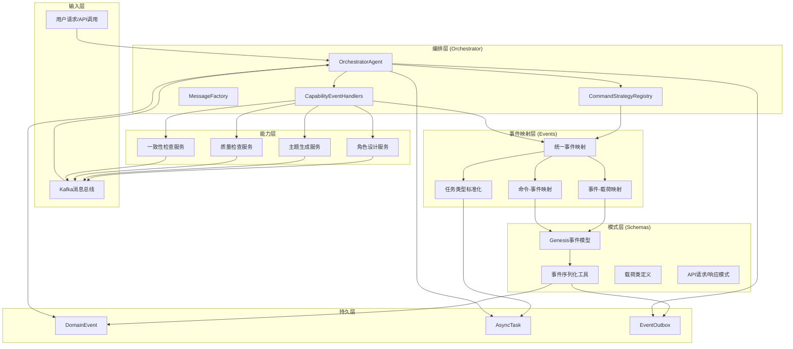

## 🔄 事件处理流程

### 1. 命令处理流程

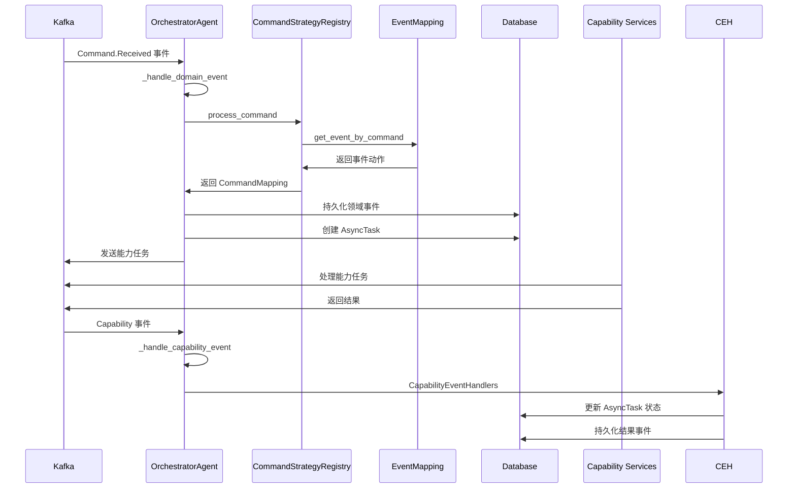

### 2. 事件映射和序列化流程

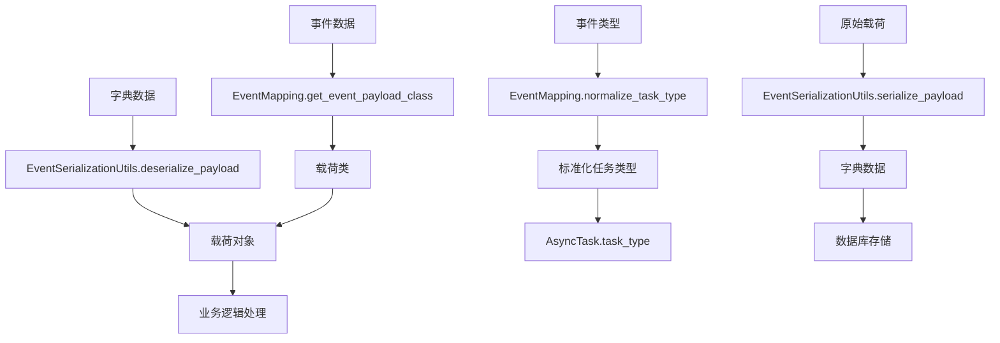

## 📊 模块依赖关系

### 核心依赖图

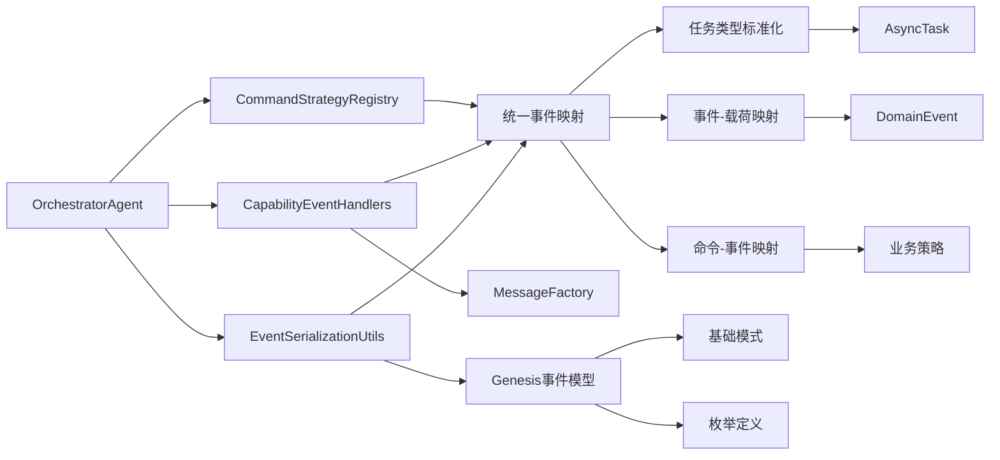

### 数据流向图

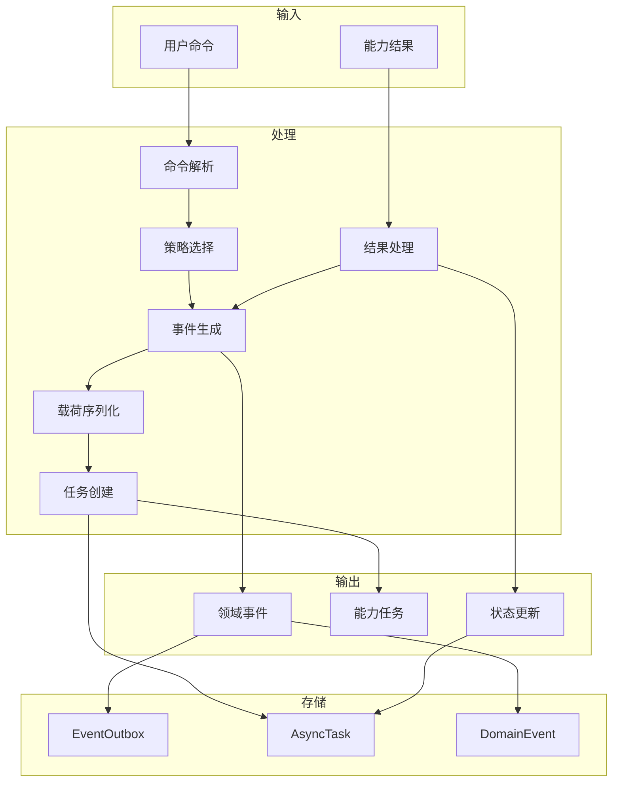

## 🏛️ 架构原则

### 1. 分层架构

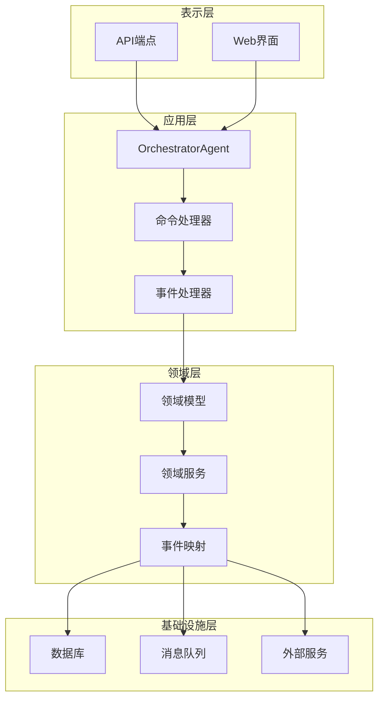

### 2. 事件驱动架构

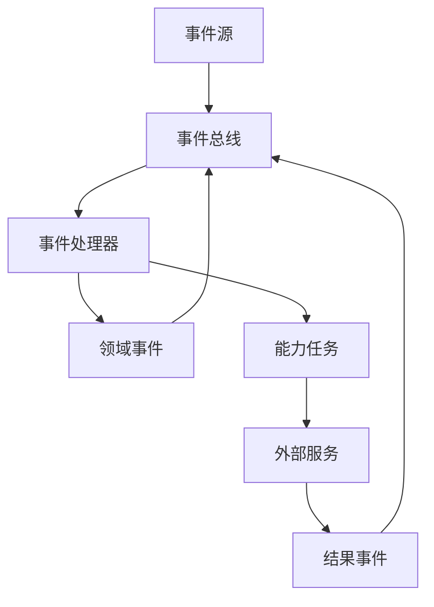

### 3. 策略模式

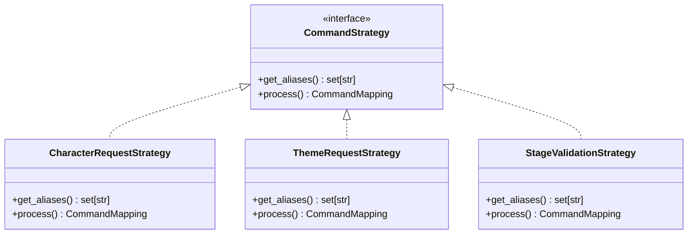

## 🔄 状态管理

### 任务状态流转

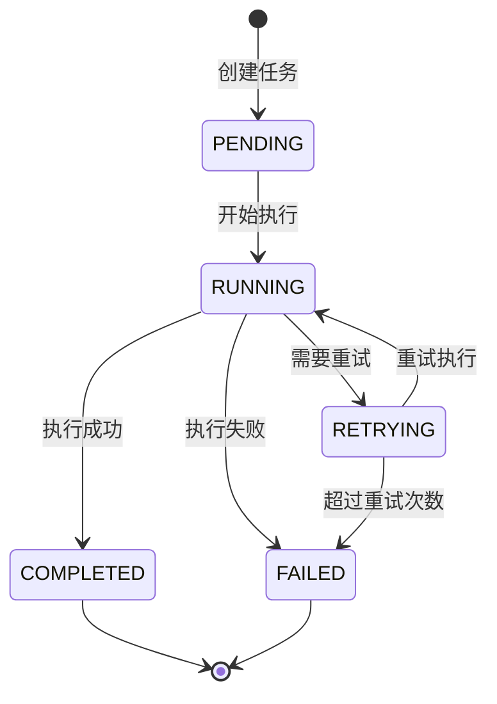

### 事件处理状态

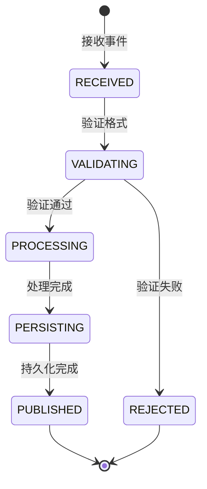

## 📈 性能考虑

### 并发处理

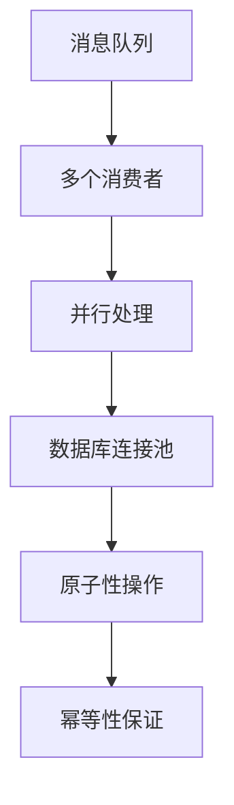

### 缓存策略

```mermaid
graph TD
    A[映射表缓存] --> B[内存缓存]
    B --> C[快速查找]
    C --> D[O(1)时间复杂度]
    
    E[载荷类缓存] --> F[类对象缓存]
    F --> G[避免重复反射]
    G --> H[提升性能]
```

## 🔒 安全性考虑

### 输入验证

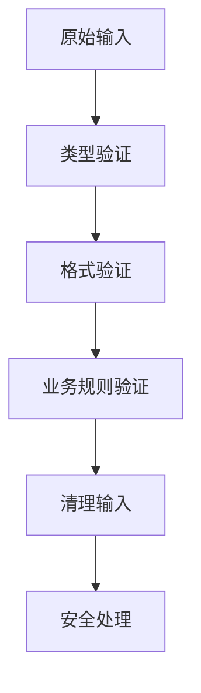

### 权限控制

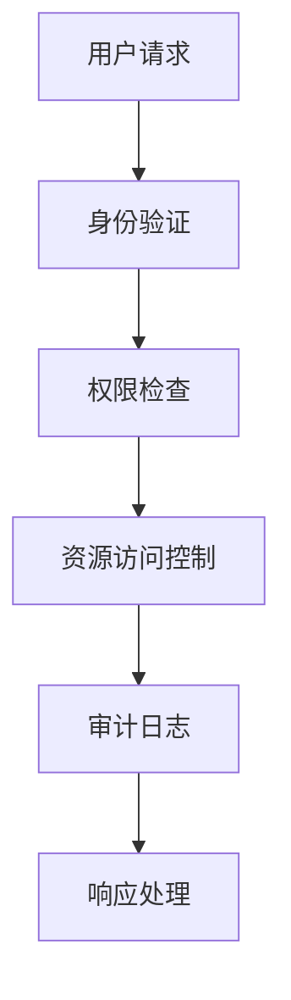

这个架构图展示了整个系统的核心组件和它们之间的关系，重点关注了最近提交中修改的 orchestrator、events 和 schemas 模块。