# Components

## 1. API网关 (API Gateway)

*   **责任:**
    *   作为前端UI与后端所有服务的唯一入口点。
    *   处理所有来自前端的HTTP请求。
    *   进行身份验证和授权。
    *   将前端指令（如“开始创世”、“生成章节”）转化为对Prefect工作流的调用。
    *   提供查询接口，供前端获取工作流状态、结果数据（如章节内容、**项目列表**）、以及**特定项目的Neo4j图数据**。
*   **关键接口 (部分，参考OpenAPI Spec):**
    *   `POST /genesis/start`
    *   `POST /genesis/{session_id}/...`
    *   `GET /novels` (新增，获取所有小说项目列表)
    *   `POST /novels/{novel_id}/generate-chapter`
    *   `GET /chapters/{chapter_id}`
    *   `GET /workflows/{task_id}/status` (查询工作流状态)
    *   `GET /metrics`
    *   `GET /health`
    *   `GET /novels/{novel_id}/graph/worldview` (新增，查询指定小说的Neo4j世界观图数据)
*   **依赖:** PostgreSQL (用于存储创世数据、小说元数据), **Neo4j (用于查询项目级关系图谱)**, Prefect (用于触发工作流), Kafka (可选，用于发布某些UI触发的即时事件)。
*   **技术栈:** FastAPI, Python, Pydantic。

## 2. 世界铸造师Agent (Worldsmith Agent)
*   **责任:**
    *   在“创世阶段”与人类监督者（通过API网关和UI）交互。
    *   根据用户的核心创意，调用大模型API生成小说主题、世界观、核心角色阵容和初始剧情弧光的草案。
    *   辅助用户完成这些初始设定的迭代和确认。
    *   将最终确认的设定属性写入PostgreSQL，并在Neo4j中创建对应的节点和初始关系 (所有操作均与 `novel_id` 关联)。
*   **关键接口/事件:**
    *   **订阅:** (通过内部调用或事件) `GenesisStep.Requested` (例如，请求生成世界观建议，包含 `novel_id`)。
    *   **发布:** (通过内部调用或事件) `GenesisStep.SuggestionProvided` (包含AI生成的草案)。
*   **依赖:** 大模型API (通过LiteLLM), PostgreSQL, Neo4j (操作均与 `novel_id` 关联)。
*   **技术栈:** Python, Pydantic, LiteLLM。

## 3. 剧情策划师Agent (PlotMaster Agent)
*   **责任:**
    *   进行高层次的、战略性的剧情规划 (针对特定 `novel_id`)。
    *   周期性地（或按需）分析故事的整体进展、节奏和角色弧光。
    *   发布“高层剧情指令”，如引入新角色、开启新支线、制造情节转折等。
*   **关键接口/事件:**
    *   **订阅:** `Novel.AnalysisRequested` (含 `novel_id`), `Chapter.Completed` (含 `novel_id`, 用于计数和触发周期性评估)。
    *   **发布:** `PlotDirective.Created` (包含具体的剧情指令, 关联 `novel_id`)。
*   **依赖:** 知识库 (PostgreSQL, Milvus, Neo4j - 所有查询均基于 `novel_id`) 用于获取故事全局信息。
*   **技术栈:** Python, Pydantic。

## 4. 大纲规划师Agent (Outliner Agent)
*   **责任:**
    *   将高层的剧情指令（来自PlotMaster）或简单的“下一章”请求 (均含 `novel_id`)，转化为具体的章节情节大纲。
*   **关键接口/事件:**
    *   **订阅:** `OutlineGeneration.Requested` (含 `novel_id`), `PlotDirective.Created` (含 `novel_id`)。
    *   **发布:** `Outline.Created` (包含章节大纲, 关联 `novel_id`, `chapter_id`)。
*   **依赖:** 大模型API (通过LiteLLM), 知识库 (基于 `novel_id` 获取上一章结尾和相关上下文)。
*   **技术栈:** Python, Pydantic, LiteLLM。

## 5. 导演Agent (Director Agent)
*   **责任:**
    *   将章节大纲 (关联 `novel_id`, `chapter_id`) 分解为更小的场景序列。
    *   为每个场景定义核心目标、节奏（紧张、平缓等）、视角（POV）和关键转折点。
*   **关键接口/事件:**
    *   **订阅:** `SceneDesign.Requested` (含 `novel_id`, `chapter_id`), `Outline.Created` (含 `novel_id`, `chapter_id`)。
    *   **发布:** `SceneDesign.Completed` (包含场景卡序列, 关联 `novel_id`, `chapter_id`)。
*   **依赖:** 大模型API (通过LiteLLM), 知识库 (基于 `novel_id` 获取大纲)。
*   **技术栈:** Python, Pydantic, LiteLLM。

## 6. 角色专家Agent (CharacterExpert Agent)
*   **责任:**
    *   根据场景设计 (关联 `novel_id`, `chapter_id`)，规划角色间的具体对话和互动。
    *   如果场景中出现新角色，负责创建其完整的角色卡（属性入PG, 节点入Neo4j - 均关联 `novel_id`）并触发持久化。
    *   更新Neo4j中角色间的互动关系 (基于 `novel_id`)。
*   **关键接口/事件:**
    *   **订阅:** `CharacterInteractionDesign.Requested` (含 `novel_id`, `chapter_id`), `SceneDesign.Completed` (含 `novel_id`, `chapter_id`)。
    *   **发布:** `CharacterInteraction.Designed` (关联 `novel_id`, `chapter_id`), `Character.Created` (如果创建了新角色, 关联 `novel_id`)。
*   **依赖:** 大模型API (通过LiteLLM), 知识库 (PostgreSQL获取场景卡、角色属性; Neo4j获取和更新角色关系 - 均基于 `novel_id`)。
*   **技术栈:** Python, Pydantic, LiteLLM。

## 7. 世界观构建师Agent (WorldBuilder Agent)
*   **责任:**
    *   在创作过程中，根据需要（例如，导演或作家Agent发现设定不足，针对特定 `novel_id`）扩展和丰富世界观设定。
    *   确保新的设定属性写入PostgreSQL，并在Neo4j中创建对应的节点和关系 (均关联 `novel_id`)。
*   **关键接口/事件:**
    *   **订阅:** `WorldviewExpansion.Requested` (含 `novel_id`)。
    *   **发布:** `WorldviewEntry.Created` (关联 `novel_id`)。
*   **依赖:** 大模型API (通过LiteLLM), 知识库 (PostgreSQL获取现有世界观属性; Neo4j获取和更新关系 - 均基于 `novel_id`)。
*   **技术栈:** Python, Pydantic, LiteLLM。

## 8. 作家Agent (Writer Agent)
*   **责任:**
    *   严格遵循导演的场景和节奏指令，并结合角色专家的对话设计 (均关联 `novel_id`, `chapter_id`)，调用大模型API将所有元素渲染成最终的章节草稿。
*   **关键接口/事件:**
    *   **订阅:** `ChapterWriting.Requested` (含 `novel_id`, `chapter_id`), `SceneDesign.Completed` (含 `novel_id`, `chapter_id`), `CharacterInteraction.Designed` (含 `novel_id`, `chapter_id`)。
    *   **发布:** `Chapter.Drafted` (包含章节草稿的URL和元数据, 关联 `novel_id`, `chapter_id`)。
*   **依赖:** 大模型API (通过LiteLLM), 知识库 (基于 `novel_id` 获取完整的创作指令), Minio (存储草稿, 路径含 `novel_id`)。
*   **技术栈:** Python, Pydantic, LiteLLM。

## 9. 评论家Agent (Critic Agent)
*   **责任:**
    *   对章节草稿 (关联 `novel_id`, `chapter_id`) 的文学质量、节奏感、趣味性和是否符合导演要求进行评估。
    *   输出结构化的评分和具体的改进建议。
*   **关键接口/事件:**
    *   **订阅:** `Critique.Requested` (含 `novel_id`, `chapter_id`), `Chapter.Drafted` (含 `novel_id`, `chapter_id`)。
    *   **发布:** `Critique.Completed` (包含评分和评论, 关联 `chapter_id`)。
*   **依赖:** 大模型API (通过LiteLLM), 知识库 (基于 `novel_id` 获取草稿内容)。
*   **技术栈:** Python, Pydantic, LiteLLM。

## 10. 事实核查员Agent (FactChecker Agent)
*   **责任:**
    *   将章节草稿的内容 (关联 `novel_id`, `chapter_id`) 与知识库中已确立的世界观（PG属性）、角色设定（PG属性）和历史情节（Neo4j关系 - 均基于 `novel_id`）进行比对。
    *   报告任何发现的不一致之处或逻辑矛盾。
*   **关键接口/事件:**
    *   **订阅:** `FactCheck.Requested` (含 `novel_id`, `chapter_id`), `Chapter.Drafted` (含 `novel_id`, `chapter_id`)。
    *   **发布:** `FactCheck.Completed` (包含一致性报告和问题列表, 关联 `chapter_id`)。
*   **依赖:** 大模型API (通过LiteLLM), 知识库 (PostgreSQL, Milvus, Neo4j - 所有查询均基于 `novel_id`)。
*   **技术栈:** Python, Pydantic, LiteLLM。

## 11. 改写者Agent (Rewriter Agent)
*   **责任:**
    *   根据评论家Agent的评分和建议，或事实核查员Agent的报告 (均关联 `chapter_id`)，对章节草稿进行针对性的修改和润色。
*   **关键接口/事件:**
    *   **订阅:** `Revision.Requested` (通常包含草稿、评论和问题报告, 关联 `chapter_id`)。
    *   **发布:** `Chapter.Revised` (修改后的草稿，将重新进入评审流程, 关联 `chapter_id`)。
*   **依赖:** 大模型API (通过LiteLLM), 知识库 (基于 `novel_id`)。
*   **技术栈:** Python, Pydantic, LiteLLM。

## Components图

```mermaid
graph TD
    UI[前端UI<br/>仪表盘, 项目详情] --> APIGW[API网关]

    subgraph "编排层"
        Orchestrator[Prefect工作流]
    end

    APIGW --> Orchestrator

    subgraph "事件总线 (Kafka)"
        KafkaBus[Kafka]
    end

    Orchestrator -- "触发任务" --> KafkaBus
    
    subgraph "智能体集群"
        WS[世界铸造师]
        PM[剧情策划师]
        OL[大纲规划师]
        DIR[导演]
        CE[角色专家]
        WB[世界观构建师]
        WR[作家]
        CR[评论家]
        FC[事实核查员]
        RW[改写者]
    end

    KafkaBus --> WS & PM & OL & DIR & CE & WB & WR & CR & FC & RW
    WS & PM & OL & DIR & CE & WB & WR & CR & FC & RW --> KafkaBus

    subgraph "支撑服务"
        LLMGW[LiteLLM网关]
        LGF[Langfuse]
    end
    
    subgraph "存储层 (按项目隔离)"
        PG[(PostgreSQL<br/>小说/章节/角色属性)]
        MV[(Milvus<br/>项目级文本向量)]
        N4J[("Neo4j<br/>项目级知识图谱<br/>(世界观,角色关系,情节)")]
        MN[(Minio<br/>章节文本,大纲文件)]
    end

    WS & PM & OL & DIR & CE & WB & WR & CR & FC & RW -- "LLM调用" --> LLMGW
    WS & PM & OL & DIR & CE & WB & WR & CR & FC & RW -- "数据交互 (novel_id scoped)" --> PG & MV & N4J & MN
    LLMGW -- "日志/追踪" --> LGF
    APIGW -- "数据查询 (novel_id scoped)" --> PG & N4J


    classDef agent fill:#D6EAF8,stroke:#2E86C1,stroke-width:2px;
    classDef support fill:#E8F8F5,stroke:#1ABC9C,stroke-width:2px;
    class WS,PM,OL,DIR,CE,WB,WR,CR,FC,RW agent;
    class LLMGW,LGF support;
```

