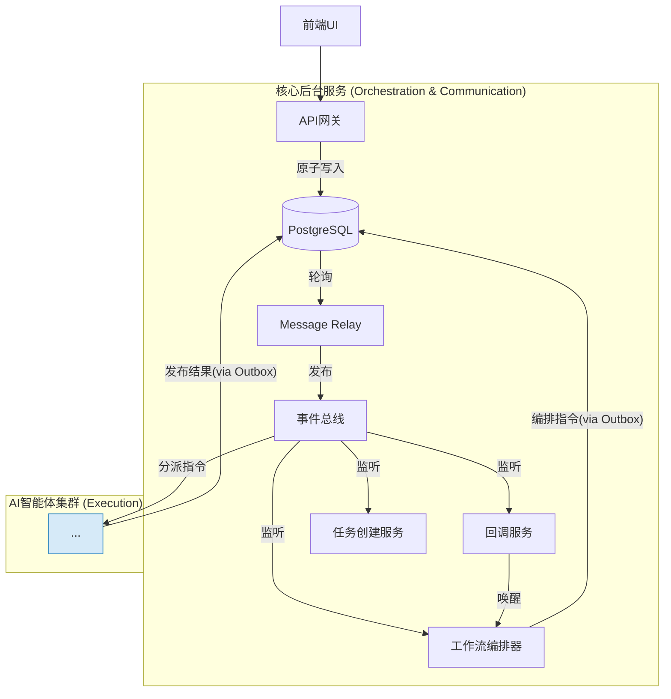

# Components

本系统的组件可以分为两大类：**核心后台服务**，它们是构成系统骨架的技术组件；以及**AI智能体**，它们是执行具体业务逻辑的领域专家。

## 核心后台服务

这些服务是整个系统的技术底座，负责流程控制、消息传递和与用户交互。

1.  **API网关 (API Gateway)**
    *   **责任:**
        *   作为前端UI与后端所有服务的唯一、安全的入口点。
        *   处理所有来自前端的HTTP请求，包括同步命令（如确认阶段）和异步命令（如请求AI生成）的接收。
        *   进行身份验证和授权。
        *   **原子性地**将用户命令写入`command_inbox`，将领域事件写入`domain_events`，并将待发送的Kafka消息写入`event_outbox`。
        *   提供查询接口，供前端获取状态快照（如`genesis_sessions`）、业务数据（如小说列表、章节内容）以及项目级的Neo4j图数据。
        *   提供SSE（服务器发送事件）端点，用于向前端实时推送状态更新。
    *   **关键接口 (部分，参考OpenAPI Spec):**
        *   `POST /.../commands` (所有用户意图的统一入口)
        *   `GET /genesis/sessions/{session_id}/state` (获取创世会话状态)
        *   `GET /novels` (获取所有小说项目列表)
        *   `GET /chapters/{id}` (获取章节详情)
        *   `GET /events/stream` (SSE端点)
    *   **依赖:** PostgreSQL (用于所有原子性写入和状态快照查询)。
    *   **技术栈:** FastAPI, Python, Pydantic。

2.  **消息中继服务 (Message Relay Service)**
    *   **责任:**
        *   作为数据库`event_outbox`表和Kafka之间的可靠桥梁。
        *   持续轮询`event_outbox`表，查找待发送的消息。
        *   将消息可靠地发布到Kafka对应的Topic。
        *   在确认Kafka接收成功后，更新`event_outbox`中消息的状态。
    *   **技术栈:** Python, `kafka-python`, SQLAlchemy。

3.  **工作流编排器 (Workflow Orchestrator - Prefect)**
    *   **责任:**
        *   **系统的“大脑”**，负责编排所有复杂的、多步骤的业务流程。
        *   以一个或多个长时间运行的“守护Flow”的形式，**监听Kafka中的业务请求事件** (如 `Chapter.GenerationRequested`)。
        *   根据接收到的事件，触发并执行对应的业务工作流（Flow）。
        *   在Flow内部，通过执行任务（Task）来发布新的、更具体的指令事件到Kafka（通过`event_outbox`），从而驱动AI Agents工作。
        *   管理Flow的暂停与恢复，通过向`flow_resume_handles`表写入记录来**等待**外部事件（如用户反馈或AI任务完成）。
    *   **技术栈:** Prefect, Python。

4.  **Prefect回调服务 (Prefect Callback Service)**
    *   **责任:**
        *   作为外部事件系统与Prefect工作流之间的“唤醒”桥梁。
        *   监听所有“结果类”的Kafka事件 (如 `Chapter.OutlineCreated`)。
        *   当收到一个结果事件时，从`flow_resume_handles`表（并利用Redis缓存）中查找是否有正在等待此结果的暂停Flow。
        *   如果找到，则调用Prefect Server API来恢复对应的Flow，并将结果数据注入其中。
    *   **技术栈:** Python, `kafka-python`, SQLAlchemy, Redis client, HTTP client。

5.  **任务创建服务 (Task Creator Service)**
    *   **责任:**
        *   监听Kafka中需要创建异步技术任务的业务请求事件。
        *   在`async_tasks`表中创建一条任务记录。
        *   通过`event_outbox`模式，发布一个领域事件（如`Chapter.OutlineGenerationRequested`），该事件包含了新创建的`task_id`，用于通知AI Agent开始工作。
    *   **技术栈:** Python, `kafka-python`, SQLAlchemy。
    *   **注:** 在最终实现中，此服务的逻辑可以被吸收为Prefect Flow中的一个可复用任务（Task）。

## AI智能体 (AI Agents)

这些智能体是**系统的“肌肉”**，每个都是一个独立的微服务，负责执行具体的创作和分析任务。它们都通过消费Kafka中的指令事件来接收任务，并通过`event_outbox`模式来发布描述业务成果的领域事件。

6.  **世界铸造师 (Worldsmith Agent)**
    *   **责任:** 在“创世阶段”与用户交互，根据用户输入或从零开始，生成小说的核心概念、世界观、角色和初始大纲的草案，并响应用户的迭代反馈。
    *   **关键接口/事件:**
        *   **订阅:** `Genesis.ConceptGenerationRequested`, `Genesis.WorldviewGenerationRequested`, etc.
        *   **发布:** `Genesis.ConceptProposed`, `Genesis.WorldviewDrafted`, etc.
    *   **依赖:** 大模型API (通过LiteLLM), PostgreSQL, Neo4j。
    *   **技术栈:** Python, Pydantic, LiteLLM。

7.  **剧情策划师 (PlotMaster Agent)**
    *   **责任:** 进行高层次、战略性的剧情规划。周期性地分析故事全局，并发布“高层剧情指令”。
    *   **关键接口/事件:**
        *   **订阅:** `Novel.StrategicReviewRequested`
        *   **发布:** `Novel.PlotDirectiveCreated`
    *   **依赖:** 知识库 (PostgreSQL, Milvus, Neo4j) 用于获取故事全局信息。
    *   **技术栈:** Python, Pydantic。

8.  **大纲规划师 (Outliner Agent)**
    *   **责任:** 将高层的剧情指令或简单的“下一章”请求，转化为具体的、结构化的章节情节大纲。
    *   **关键接口/事件:**
        *   **订阅:** `Chapter.OutlineGenerationRequested`
        *   **发布:** `Chapter.OutlineCreated`
    *   **依赖:** 大模型API (通过LiteLLM), 知识库 (获取上一章结尾和相关上下文)。
    *   **技术栈:** Python, Pydantic, LiteLLM。

9.  **导演 (Director Agent)**
    *   **责任:** 将章节大纲分解为更小的场景序列，并为每个场景定义核心目标、节奏、视角（POV）和关键转折点。
    *   **关键接口/事件:**
        *   **订阅:** `Chapter.SceneDesignRequested`
        *   **发布:** `Chapter.ScenesDesigned`
    *   **依赖:** 大模型API (通过LiteLLM), 知识库 (获取大纲)。
    *   **技术栈:** Python, Pydantic, LiteLLM。

10. **角色专家 (CharacterExpert Agent)**
    *   **责任:**
        *   根据场景设计，规划角色间的具体对话和互动。
        *   如果场景中需要新角色，负责创建其完整的角色卡。
        *   更新Neo4j中角色间的互动关系。
    *   **关键接口/事件:**
        *   **订阅:** `Chapter.CharacterInteractionDesignRequested`
        *   **发布:** `Chapter.InteractionsDesigned`, `Character.ProfileCreated`
    *   **依赖:** 大模型API (通过LiteLLM), 知识库 (PostgreSQL, Neo4j)。
    *   **技术栈:** Python, Pydantic, LiteLLM。

11. **世界观构建师 (WorldBuilder Agent)**
    *   **责任:** 在创作过程中，根据需要动态地扩展和丰富世界观设定，并确保其在知识库中的一致性。
    *   **关键接口/事件:**
        *   **订阅:** `KnowledgeBase.WorldviewExpansionRequested`
        *   **发布:** `KnowledgeBase.WorldviewEntryCreated`
    *   **依赖:** 大模型API (通过LiteLLM), 知识库 (PostgreSQL, Neo4j)。
    *   **技术栈:** Python, Pydantic, LiteLLM。

12. **作家 (Writer Agent)**
    *   **责任:** 最终的“执笔者”。严格遵循导演和角色专家的指令，调用大模型API将所有元素渲染成文笔流畅的章节草稿。
    *   **关键接口/事件:**
        *   **订阅:** `Chapter.DraftWritingRequested`
        *   **发布:** `Chapter.DraftCreated`
    *   **依赖:** 大模型API (通过LiteLLM), 知识库 (获取完整的创作指令), Minio (存储草稿)。
    *   **技术栈:** Python, Pydantic, LiteLLM。

13. **评论家 (Critic Agent)**
    *   **责任:** 对章节草稿的文学质量（如节奏感、趣味性、文笔）进行评估，并输出结构化的评分和改进建议。
    *   **关键接口/事件:**
        *   **订阅:** `Chapter.CritiqueRequested`
        *   **发布:** `Chapter.CritiqueCompleted`
    *   **依赖:** 大模型API (通过LiteLLM), 知识库 (获取草稿内容)。
    *   **技术栈:** Python, Pydantic, LiteLLM。

14. **事实核查员 (FactChecker Agent)**
    *   **责任:** 将章节草稿的内容与知识库（PostgreSQL, Neo4j, Milvus）中已确立的事实进行比对，报告任何不一致之处或逻辑矛盾。
    *   **关键接口/事件:**
        *   **订阅:** `Chapter.FactCheckRequested`
        *   **发布:** `Chapter.FactCheckCompleted`
    *   **依赖:** 大模型API (通过LiteLLM), 知识库 (PostgreSQL, Milvus, Neo4j)。
    *   **技术栈:** Python, Pydantic, LiteLLM。

15. **改写者 (Rewriter Agent)**
    *   **责任:** 根据评论家或事实核查员的反馈，对章节草稿进行针对性的修改和润色，并生成一个新的版本送回评审流程。
    *   **关键接口/事件:**
        *   **订阅:** `Chapter.RevisionRequested`
        *   **发布:** `Chapter.DraftRevised`
    *   **依赖:** 大模型API (通过LiteLLM), 知识库。
    *   **技术栈:** Python, Pydantic, LiteLLM。

## Components图 (概念性)

这张图展示了核心后台服务与AI智能体集群之间的关系。

