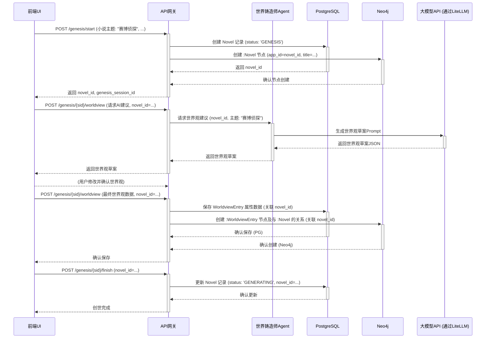
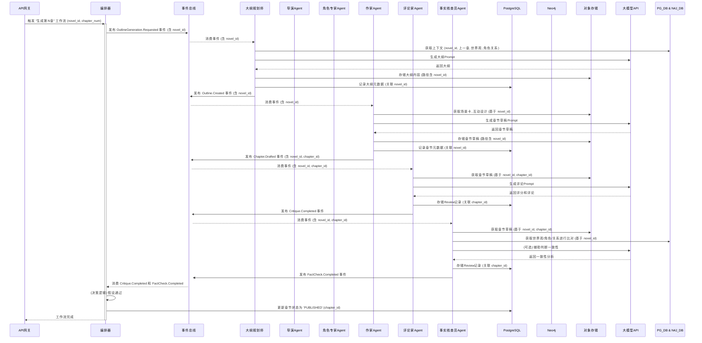

# Core Workflows

## 1. 创世流程 (Genesis Flow) - UI触发

```mermaid
sequenceDiagram
    participant UI as 前端UI
    participant APIGW as API网关
    participant WS_Agent as 世界铸造师Agent
    participant PG_DB as PostgreSQL
    participant N4J_DB as Neo4j
    participant LLM as 大模型API (通过LiteLLM)

    UI->>+APIGW: POST /genesis/start (小说主题: "赛博侦探", ...)
    APIGW->>+PG_DB: 创建 Novel 记录 (status: 'GENESIS')
    APIGW->>+N4J_DB: 创建 :Novel 节点 (app_id=novel_id, title=...)
    PG_DB-->>-APIGW: 返回 novel_id
    N4J_DB-->>-APIGW: 确认节点创建
    APIGW-->>-UI: 返回 novel_id, genesis_session_id

    UI->>+APIGW: POST /genesis/{sid}/worldview (请求AI建议, novel_id=...)
    APIGW->>+WS_Agent: 请求世界观建议 (novel_id, 主题: "赛博侦探")
    WS_Agent->>+LLM: 生成世界观草案Prompt
    LLM-->>-WS_Agent: 返回世界观草案JSON
    WS_Agent-->>-APIGW: 返回世界观草案
    APIGW-->>-UI: 返回世界观草案

    UI-->>APIGW: (用户修改并确认世界观)
    UI->>+APIGW: POST /genesis/{sid}/worldview (最终世界观数据, novel_id=...)
    APIGW->>+PG_DB: 保存 WorldviewEntry 属性数据 (关联 novel_id)
    APIGW->>+N4J_DB: 创建 :WorldviewEntry 节点及与 :Novel 的关系 (关联 novel_id)
    PG_DB-->>-APIGW: 确认保存 (PG)
    N4J_DB-->>-APIGW: 确认创建 (Neo4j)
    APIGW-->>-UI: 确认保存

    %% ... 角色设定和初始剧情流程类似，所有操作都带 novel_id ...

    UI->>+APIGW: POST /genesis/{sid}/finish (novel_id=...)
    APIGW->>+PG_DB: 更新 Novel 记录 (status: 'GENERATING', novel_id=...)
    PG_DB-->>-APIGW: 确认更新
    APIGW-->>-UI: 创世完成
```

## 2. 章节生成流程 (Chapter Generation Flow) - 标准路径

```mermaid
sequenceDiagram
    participant APIGW as API网关
    participant Prefect as 编排器
    participant Kafka as 事件总线
    participant OL_Agent as 大纲规划师
    participant DIR_Agent as 导演Agent
    participant CE_Agent as 角色专家Agent
    participant WR_Agent as 作家Agent
    participant CR_Agent as 评论家Agent
    participant FC_Agent as 事实核查员Agent
    participant PG_DB as PostgreSQL
    participant N4J_DB as Neo4j
    participant Minio as 对象存储
    participant LLM as 大模型API

    APIGW->>+Prefect: 触发 "生成第N章" 工作流 (novel_id, chapter_num)
    Prefect->>+Kafka: 发布 OutlineGeneration.Requested 事件 (含 novel_id)
    
    Kafka-->>OL_Agent: 消费事件 (含 novel_id)
    OL_Agent->>PG_DB & N4J_DB: 获取上下文 (novel_id, 上一章, 世界观, 角色关系)
    OL_Agent->>LLM: 生成大纲Prompt
    LLM-->>OL_Agent: 返回大纲
    OL_Agent->>Minio: 存储大纲内容 (路径含 novel_id)
    OL_Agent->>PG_DB: 记录大纲元数据 (关联 novel_id)
    OL_Agent->>+Kafka: 发布 Outline.Created 事件 (含 novel_id)
    
    %% ... 后续Agent交互类似，所有数据操作和知识库查询都基于 novel_id ...

    Kafka-->>WR_Agent: 消费事件 (含 novel_id)
    WR_Agent->>Minio: 获取场景卡, 互动设计 (基于 novel_id)
    WR_Agent->>LLM: 生成章节草稿Prompt
    LLM-->>WR_Agent: 返回章节草稿
    WR_Agent->>Minio: 存储章节草稿 (路径含 novel_id)
    WR_Agent->>PG_DB: 记录章节元数据 (关联 novel_id)
    WR_Agent->>+Kafka: 发布 Chapter.Drafted 事件 (含 novel_id, chapter_id)

    Kafka-->>CR_Agent: 消费事件 (含 novel_id, chapter_id)
    CR_Agent->>Minio: 获取章节草稿 (基于 novel_id, chapter_id)
    CR_Agent->>LLM: 生成评论Prompt
    LLM-->>CR_Agent: 返回评分和评论
    CR_Agent->>PG_DB: 存储Review记录 (关联 chapter_id)
    CR_Agent->>+Kafka: 发布 Critique.Completed 事件
    
    Kafka-->>FC_Agent: 消费事件 (含 novel_id, chapter_id)
    FC_Agent->>Minio: 获取章节草稿 (基于 novel_id, chapter_id)
    FC_Agent->>PG_DB & N4J_DB: 获取世界观/角色/关系进行比对 (基于 novel_id)
    FC_Agent->>LLM: (可选) 辅助判断一致性
    LLM-->>FC_Agent: 返回一致性分析
    FC_Agent->>PG_DB: 存储Review记录 (关联 chapter_id)
    FC_Agent->>+Kafka: 发布 FactCheck.Completed 事件

    Kafka-->>Prefect: 消费 Critique.Completed 和 FactCheck.Completed
    Prefect->>Prefect: (决策逻辑) 假设通过
    Prefect->>PG_DB: 更新章节状态为 'PUBLISHED' (chapter_id)
    Prefect-->>-APIGW: 工作流完成
```
