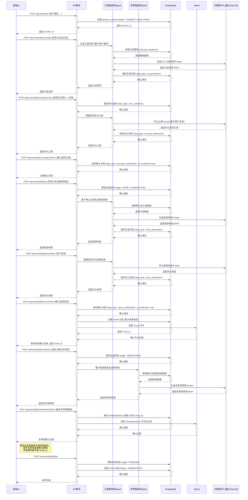
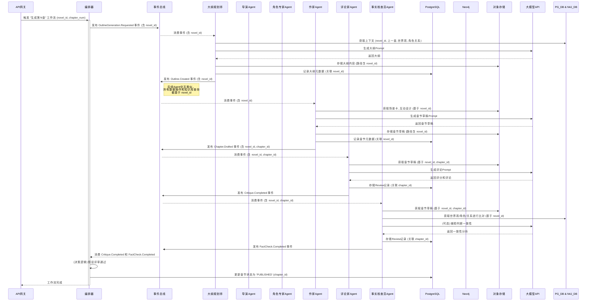
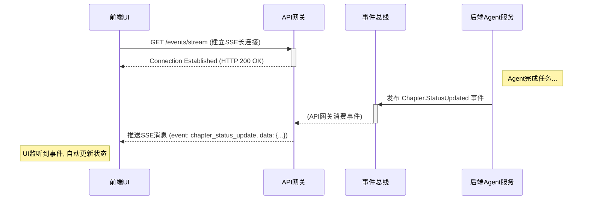

# Core Workflows

## 1. 创世流程 (Genesis Flow) - UI触发

```mermaid
sequenceDiagram
    participant UI as 前端UI
    participant APIGW as API网关
    participant CS_Agent as 立意构思师Agent
    participant WS_Agent as 世界铸造师Agent
    participant PG_DB as PostgreSQL
    participant N4J_DB as Neo4j
    participant LLM as 大模型API (通过LiteLLM)

    %% 阶段1: 立意选择 (CONCEPT_SELECTION)
    %% 用户在UI上填写小说的基本信息并点击"开始创世"
    UI->>+APIGW: POST /genesis/start (用户偏好, ...)
    
    %% API网关创建创世会话，设置为立意选择阶段
    APIGW->>+PG_DB: 创建 genesis_session (stage: 'CONCEPT_SELECTION')
    PG_DB-->>-APIGW: 返回 session_id
    APIGW-->>-UI: 返回 session_id

    %% AI生成立意选项
    UI->>+APIGW: POST /genesis/{sid}/concepts (请求AI生成立意)
    APIGW->>+CS_Agent: 生成立意选项 (基于用户偏好)
    CS_Agent->>+PG_DB: 获取立意模板 (concept_templates)
    PG_DB-->>-CS_Agent: 返回模板数据
    CS_Agent->>+LLM: 生成10个立意选项Prompt
    LLM-->>-CS_Agent: 返回立意选项JSON
    CS_Agent->>+PG_DB: 保存生成步骤 (step_type: 'ai_generation')
    PG_DB-->>-CS_Agent: 确认保存
    CS_Agent-->>-APIGW: 返回立意选项
    APIGW-->>-UI: 返回立意选项

    %% 用户选择并提供反馈 (可能多次迭代)
    UI->>+APIGW: POST /genesis/{sid}/concepts/select (选择的立意ID + 反馈)
    APIGW->>+PG_DB: 保存用户选择 (step_type: 'user_selection')
    PG_DB-->>-APIGW: 确认保存
    APIGW->>+CS_Agent: 根据反馈优化立意
    CS_Agent->>+LLM: 优化立意Prompt (基于用户反馈)
    LLM-->>-CS_Agent: 返回优化后的立意
    CS_Agent->>+PG_DB: 保存优化步骤 (step_type: 'concept_refinement')
    PG_DB-->>-CS_Agent: 确认保存
    CS_Agent-->>-APIGW: 返回优化立意
    APIGW-->>-UI: 返回优化立意

    %% 用户确认最终立意
    UI->>+APIGW: POST /genesis/{sid}/concepts/confirm (确认最终立意)
    APIGW->>+PG_DB: 保存确认步骤 (step_type: 'concept_confirmation', is_confirmed: true)
    PG_DB-->>-APIGW: 确认保存
    APIGW-->>-UI: 立意确认完成

    %% 阶段2: 故事构思 (STORY_CONCEPTION)
    UI->>+APIGW: POST /genesis/{sid}/story (请求AI生成故事构思)
    APIGW->>+PG_DB: 更新会话阶段 (stage: 'STORY_CONCEPTION')
    PG_DB-->>-APIGW: 确认更新
    APIGW->>+CS_Agent: 基于确认立意生成故事构思
    CS_Agent->>+PG_DB: 获取确认的立意数据
    PG_DB-->>-CS_Agent: 返回立意数据
    CS_Agent->>+LLM: 生成故事构思Prompt
    LLM-->>-CS_Agent: 返回故事构思JSON
    CS_Agent->>+PG_DB: 保存生成步骤 (step_type: 'story_generation')
    PG_DB-->>-CS_Agent: 确认保存
    CS_Agent-->>-APIGW: 返回故事构思
    APIGW-->>-UI: 返回故事构思

    %% 用户反馈并优化故事构思 (可选)
    UI->>+APIGW: POST /genesis/{sid}/story/refine (用户反馈)
    APIGW->>+CS_Agent: 根据反馈优化故事构思
    CS_Agent->>+LLM: 优化故事构思Prompt
    LLM-->>-CS_Agent: 返回优化构思
    CS_Agent->>+PG_DB: 保存优化步骤 (step_type: 'story_refinement')
    PG_DB-->>-CS_Agent: 确认保存
    CS_Agent-->>-APIGW: 返回优化构思
    APIGW-->>-UI: 返回优化构思

    %% 用户确认最终故事构思
    UI->>+APIGW: POST /genesis/{sid}/story/confirm (确认故事构思)
    APIGW->>+PG_DB: 保存确认步骤 (step_type: 'story_confirmation', is_confirmed: true)
    PG_DB-->>-APIGW: 确认保存
    APIGW->>+PG_DB: 创建 Novel 记录 (基于故事构思)
    APIGW->>+N4J_DB: 创建 :Novel 节点
    PG_DB-->>-APIGW: 返回 novel_id
    N4J_DB-->>-APIGW: 确认节点创建
    APIGW-->>-UI: 故事构思确认完成, 返回 novel_id

    %% 阶段3: 世界观设计 (WORLDVIEW)
    UI->>+APIGW: POST /genesis/{sid}/worldview (请求AI建议世界观)
    APIGW->>+PG_DB: 更新会话阶段 (stage: 'WORLDVIEW')
    PG_DB-->>-APIGW: 确认更新
    APIGW->>+WS_Agent: 基于故事构思生成世界观
    WS_Agent->>+PG_DB: 获取确认的故事构思数据
    PG_DB-->>-WS_Agent: 返回构思数据
    WS_Agent->>+LLM: 生成世界观草案Prompt
    LLM-->>-WS_Agent: 返回世界观草案JSON
    WS_Agent-->>-APIGW: 返回世界观草案
    APIGW-->>-UI: 返回世界观草案

    %% 用户确认世界观
    UI->>+APIGW: POST /genesis/{sid}/worldview/confirm (最终世界观数据)
    APIGW->>+PG_DB: 保存 WorldviewEntry 数据 (关联 novel_id)
    APIGW->>+N4J_DB: 创建 :WorldviewEntry 节点及关系
    PG_DB-->>-APIGW: 确认保存
    N4J_DB-->>-APIGW: 确认创建
    APIGW-->>-UI: 世界观确认完成

    %% 后续阶段 (CHARACTERS, PLOT_OUTLINE)
    Note right of UI: 角色设定和剧情大纲流程类似，<br/>基于前序阶段的确认数据<br/>所有操作都关联 novel_id

    %% 完成创世流程
    UI->>+APIGW: POST /genesis/{sid}/finish
    APIGW->>+PG_DB: 更新会话状态 (stage: 'FINISHED')
    APIGW->>+PG_DB: 更新 Novel 状态 (status: 'GENERATING')
    PG_DB-->>-APIGW: 确认更新
    APIGW-->>-UI: 创世完成
```

## 2. 章节生成流程 (Chapter Generation Flow) - 标准路径

```mermaid
sequenceDiagram
    participant APIGW as API网关
    participant Prefect as 编排器
    participant Kafka as 事件总线
    participant OL_Agent as 大纲规划师
    participant DIR_Agent as 导演Agent
    participant CE_Agent as 角色专家Agent
    participant WR_Agent as 作家Agent
    participant CR_Agent as 评论家Agent
    participant FC_Agent as 事实核查员Agent
    participant PG_DB as PostgreSQL
    participant N4J_DB as Neo4j
    participant Minio as 对象存储
    participant LLM as 大模型API

    %% 流程由API网关触发，调用Prefect启动一个工作流
    APIGW->>+Prefect: 触发 "生成第N章" 工作流 (novel_id, chapter_num)
    
    %% Prefect作为编排器，发布第一个任务事件到Kafka
    Prefect->>+Kafka: 发布 OutlineGeneration.Requested 事件 (含 novel_id)
    
    %% 大纲规划师Agent消费该事件，开始工作
    Kafka-->>OL_Agent: 消费事件 (含 novel_id)
    
    %% Agent从知识库（PG和Neo4j）中检索必要的上下文信息
    OL_Agent->>PG_DB & N4J_DB: 获取上下文 (novel_id, 上一章, 世界观, 角色关系)
    
    %% Agent调用大模型生成大纲
    OL_Agent->>LLM: 生成大纲Prompt
    LLM-->>OL_Agent: 返回大纲
    
    %% Agent将产出物存储到对象存储和数据库
    OL_Agent->>Minio: 存储大纲内容 (路径含 novel_id)
    OL_Agent->>PG_DB: 记录大纲元数据 (关联 novel_id)
    
    %% Agent发布完成事件，触发工作流的下一步
    OL_Agent->>+Kafka: 发布 Outline.Created 事件 (含 novel_id)
    
    %% ... 后续的导演、角色专家等Agent遵循类似的模式 ...
    %% 消费上一步的完成事件 -> 检索上下文 -> 调用LLM -> 持久化产出 -> 发布自己的完成事件
    Note right of Kafka: 后续Agent交互类似，<br/>所有数据操作和知识库查询<br/>都基于 novel_id
    
    %% 作家Agent完成最终草稿的撰写
    Kafka-->>WR_Agent: 消费事件 (含 novel_id)
    WR_Agent->>Minio: 获取场景卡, 互动设计 (基于 novel_id)
    WR_Agent->>LLM: 生成章节草稿Prompt
    LLM-->>WR_Agent: 返回章节草稿
    WR_Agent->>Minio: 存储章节草稿 (路径含 novel_id)
    WR_Agent->>PG_DB: 记录章节元数据 (关联 novel_id)
    WR_Agent->>+Kafka: 发布 Chapter.Drafted 事件 (含 novel_id, chapter_id)

    %% 评论家Agent和事实核查员Agent并行开始评审
    Kafka-->>CR_Agent: 消费事件 (含 novel_id, chapter_id)
    CR_Agent->>Minio: 获取章节草稿 (基于 novel_id, chapter_id)
    CR_Agent->>LLM: 生成评论Prompt
    LLM-->>CR_Agent: 返回评分和评论
    CR_Agent->>PG_DB: 存储Review记录 (关联 chapter_id)
    CR_Agent->>+Kafka: 发布 Critique.Completed 事件
    
    Kafka-->>FC_Agent: 消费事件 (含 novel_id, chapter_id)
    FC_Agent->>Minio: 获取章节草稿 (基于 novel_id, chapter_id)
    FC_Agent->>PG_DB & N4J_DB: 获取世界观/角色/关系进行比对 (基于 novel_id)
    FC_Agent->>LLM: (可选) 辅助判断一致性
    LLM-->>FC_Agent: 返回一致性分析
    FC_Agent->>PG_DB: 存储Review记录 (关联 chapter_id)
    FC_Agent->>+Kafka: 发布 FactCheck.Completed 事件

    %% Prefect编排器等待两个评审事件都完成后，进行决策
    Kafka-->>Prefect: 消费 Critique.Completed 和 FactCheck.Completed
    Prefect->>Prefect: (决策逻辑) 假设评审通过
    
    %% 决策通过后，更新章节最终状态
    Prefect->>PG_DB: 更新章节状态为 'PUBLISHED' (chapter_id)
    
    %% 通知API网关，工作流已完成，UI可以更新最终状态
    Prefect-->>-APIGW: 工作流完成
```

## 3. SSE实时更新流程 (SSE Real-time Update Flow)

```mermaid
sequenceDiagram
    participant UI as 前端UI
    participant APIGW as API网关
    participant Kafka as 事件总线
    participant Agent as 后端Agent服务

    UI->>+APIGW: GET /events/stream (建立SSE长连接)
    APIGW-->>-UI: Connection Established (HTTP 200 OK)

    Note right of Agent: Agent完成任务...
    Agent->>+Kafka: 发布 Chapter.StatusUpdated 事件
    Kafka-->>-APIGW: (API网关消费事件)
    APIGW-->>UI: 推送SSE消息 (event: chapter_status_update, data: {...})

    Note left of UI: UI监听到事件, 自动更新状态
```