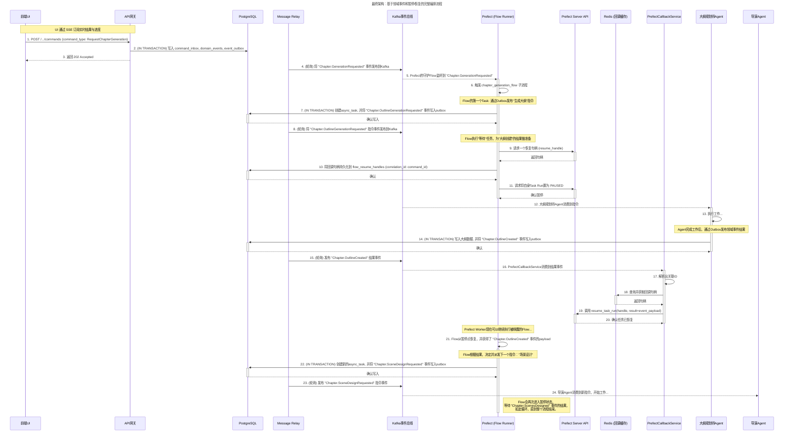
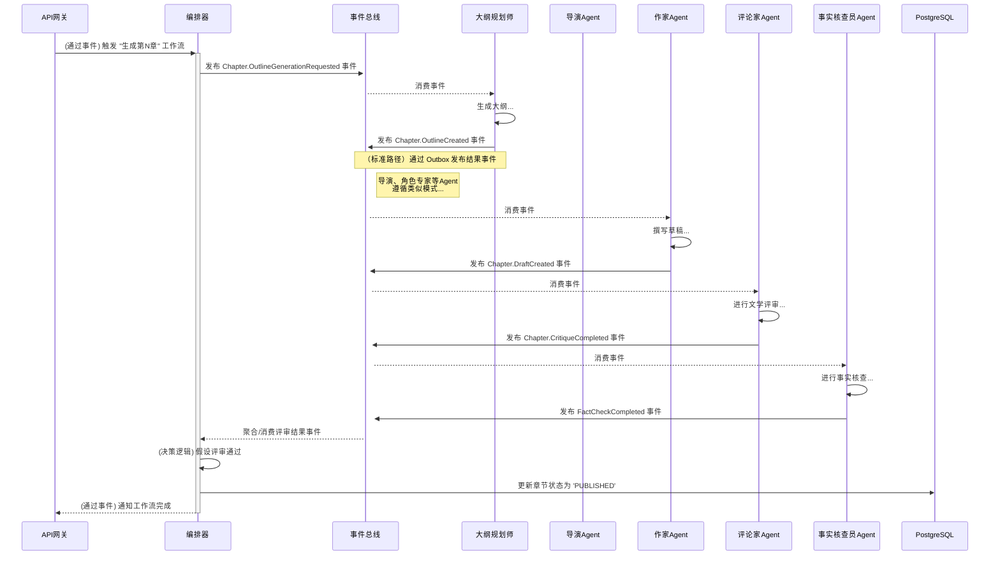
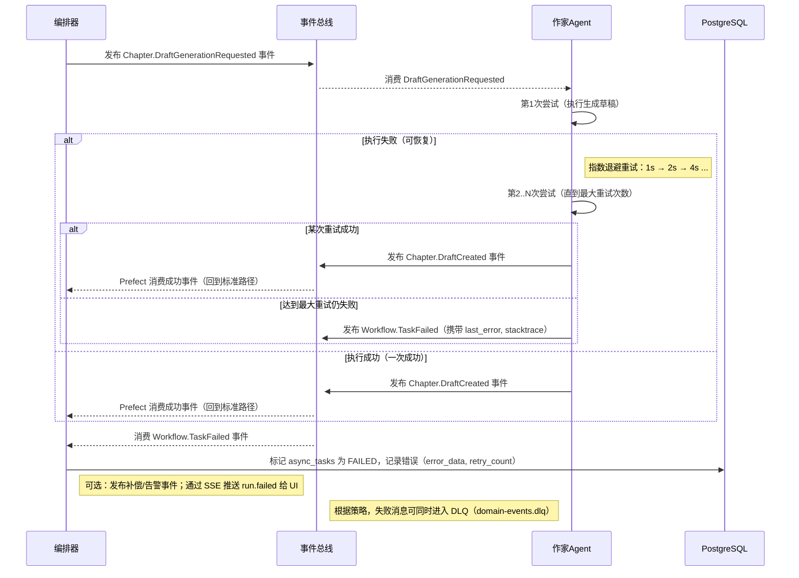
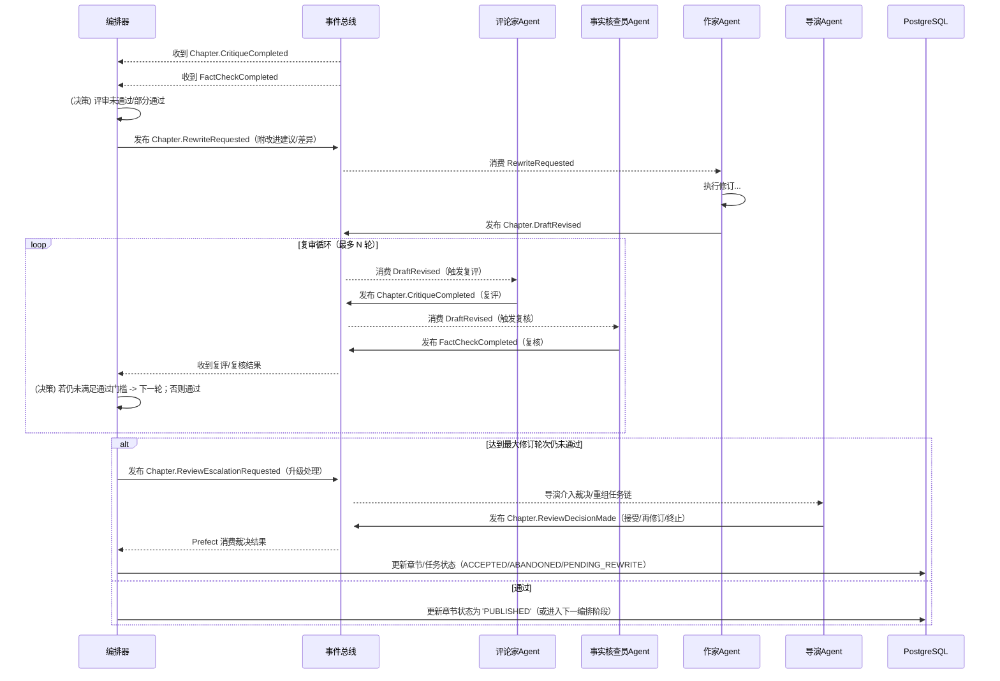
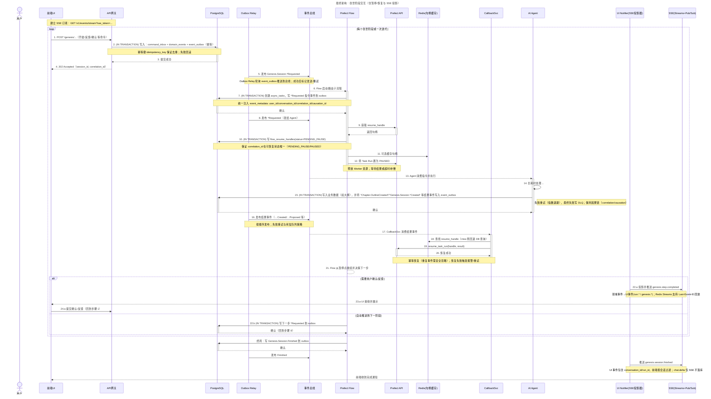

# Core Workflows

本章节通过一系列图表来描绘系统中的核心工作流程。我们将首先展示一个高层次的、面向业务的流程图，以帮助理解“系统在做什么”。随后，我们将提供一个详尽的、包含所有技术实现细节的权威时序图，以精确说明“系统是如何做的”。

## 1. 业务流程：创世流程 (Genesis Flow) - UI触发

这张图描绘了用户从开始创建一个新小说，到通过与AI的多轮交互，最终完成小说核心设定的完整业务旅程。

## 2. 业务流程：章节生成 (Chapter Generation) - 标准路径

这张图展示了一个章节从被请求生成，到经过各个专业Agent流水线处理，最终被评审完成的典型业务流程。

### 2.1 异常路径：失败与重试（简图）

下图展示章节生成过程中，Agent 执行失败时的重试、最终失败（DLQ）与编排侧处理的最小路径。

### 2.2 异常路径：评审失败/部分通过 → 修订分支（简图）

当评审（文学/事实）未通过或仅部分通过时，进入修订循环；超过上限后执行升级策略。

### 2.3 默认策略参数建议（指导性）

- 最大修订轮次: 2–3 轮（`max_revision_rounds`）。
- 评审通过门槛: 严格通过（CR 和 FC 均通过），或配置“部分通过 + 风险标记”。
- Agent 重试: 每个 Agent 内部失败重试 3 次（指数退避 1s/2s/4s）。
- 评审超时: 单轮 10–15 分钟；超时视作失败并触发修订或升级。
- 升级策略: 达到最大修订轮次或累计超时后，发布 `ReviewEscalationRequested`，由导演/人工规则裁决。
- 数据一致性: 重要状态变更需 (IN TRANSACTION) 落库，并通过 Outbox 发布领域事件，保持因果链（correlation/causation）。

## 3. 技术实现：包含所有机制的权威时序图

这张最终的、最详尽的图表展示了我们系统所有核心技术组件是如何协同工作的，特别是**事务性发件箱**和**Prefect的暂停/恢复机制**。这是对系统“如何工作”的最精确描述。

