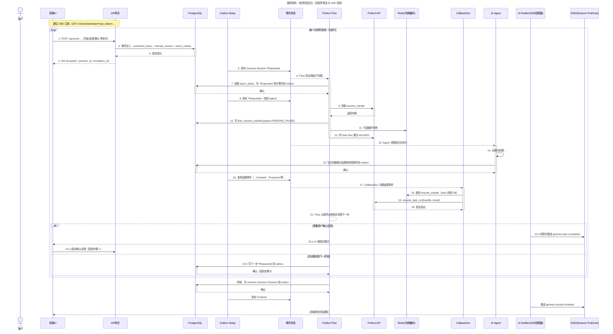

# Core Workflows

本章节通过一系列图表来描绘系统中的核心工作流程。我们将首先展示一个高层次的、面向业务的流程图，以帮助理解“系统在做什么”。随后，我们将提供一个详尽的、包含所有技术实现细节的权威时序图，以精确说明“系统是如何做的”。

## 1. 业务流程：创世流程 (Genesis Flow) - UI触发

这张图描绘了用户从开始创建一个新小说，到通过与AI的多轮交互，最终完成小说核心设定的完整业务旅程。

## 2. 业务流程：章节生成 (Chapter Generation) - 标准路径

这张图展示了一个章节从被请求生成，到经过各个专业Agent流水线处理，最终被评审完成的典型业务流程。

## 3. 技术实现：包含所有机制的权威时序图

这张最终的、最详尽的图表展示了我们系统所有核心技术组件是如何协同工作的，特别是**事务性发件箱**和**Prefect的暂停/恢复机制**。这是对系统“如何工作”的最精确描述。

