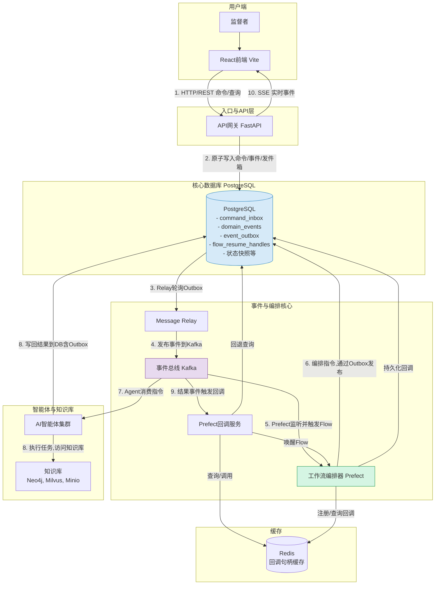
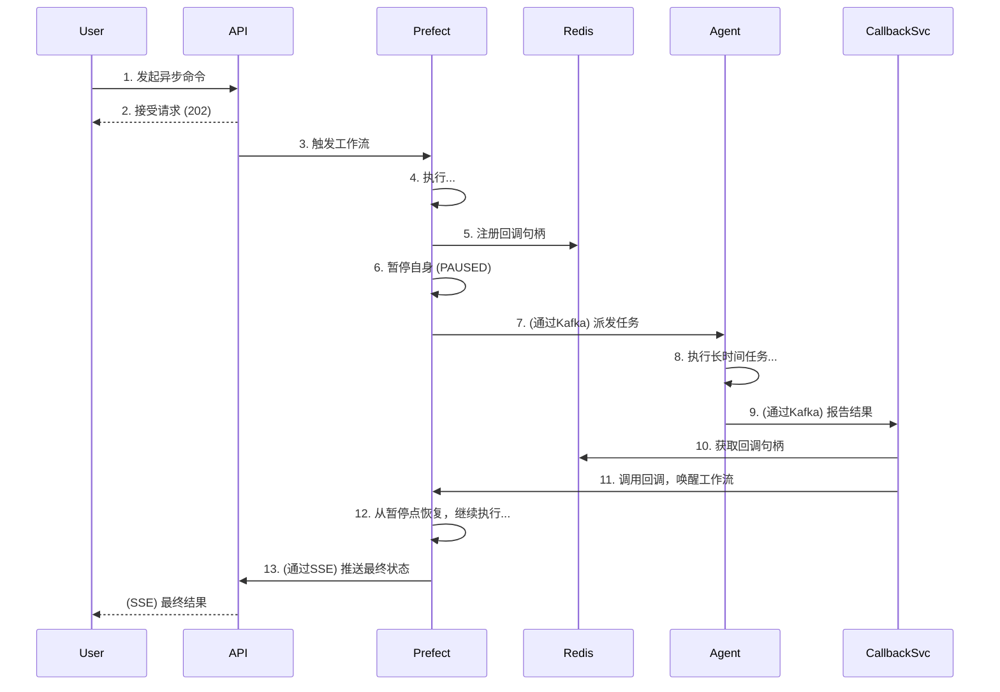

# High Level Architecture

## 技术摘要

本系统将构建为一个基于**事件驱动的微服务架构**，部署在云平台上。前端采用**React (Vite)** 构建的单页应用（SPA），通过一个**API网关**与后端进行通信。后端由一系列解耦的、容器化的**Python智能体（Agent）服务**组成，它们通过 **Kafka** 事件总线进行异步协作。整个创作流程由 **Prefect** 进行编排。数据存储采用混合模式，使用 **PostgreSQL** 进行结构化属性数据存储，**Milvus** 进行向量相似性搜索，**Neo4j** 管理复杂的关系数据（如特定书籍的世界观和角色关系），以及 **Minio** 进行对象存储。

## 平台与基础设施选择

*   **平台:** 我们将采用**平台无关的云原生方法**。所有服务都将被容器化（Docker），使其可以部署在任何支持容器的主流云平台（如AWS, GCP, Azure）或本地环境中。
*   **关键服务:**
    *   **计算:** 容器运行服务（如 Kubernetes, ECS, 或 Docker Swarm）。
    *   **消息队列:** 一个托管的Kafka集群或自部署的Kafka。
    *   **数据库:** 托管的PostgreSQL、Milvus和**Neo4j**服务。
    *   **对象存储:** 兼容S3的存储服务（如AWS S3或自部署的Minio）。
*   **部署宿主和区域:** MVP阶段将在本地通过Docker Compose进行开发和测试。生产部署的区域将根据目标用户地理位置和成本效益另行决定。

## 仓库结构

*   **结构:** **Monorepo**。
*   **Monorepo工具:** **pnpm workspaces**。
*   **包组织:**
    *   `apps/`: 存放可独立部署的应用，如 `frontend`, `backend` (包含API Gateway和所有Agent服务)。

## High Level Architecture



## 1. 组件交互与技术概览图 (Component Interaction & Tech Overview)

这张图是我们架构的核心视图，展示了所有关键服务模块、它们之间的主要交互路径以及所使用的核心技术。

```mermaid
graph TD
    subgraph "用户端"
        User[监督者] --> FE[React前端 (Vite)];
    end

    subgraph "入口与API层"
        APIGW[API网关 (FastAPI)];
        FE -- "1. HTTP/REST (命令/查询)" --> APIGW;
        APIGW -- "10. SSE (实时事件)" --> FE;
    end

    subgraph "核心数据库 (PostgreSQL)"
        DB[(PostgreSQL<br/>- command_inbox<br/>- domain_events<br/>- event_outbox<br/>- flow_resume_handles<br/>- 状态快照等)];
    end

    subgraph "事件与编排核心"
        Relay[Message Relay];
        Kafka[事件总线 (Kafka)];
        Prefect[工作流编排器 (Prefect)];
        CallbackSvc[Prefect回调服务];
    end

    subgraph "智能体与知识库"
        Agents[AI智能体集群];
        KnowledgeBase[知识库<br/>(Neo4j, Milvus, Minio)];
    end
    
    subgraph "缓存"
        Cache[(Redis<br/>回调句柄缓存)];
    end

    %% 核心数据流
    APIGW -- "2. 原子写入命令/事件/发件箱" --> DB;
    DB -- "3. Relay轮询Outbox" --> Relay;
    Relay -- "4. 发布事件到Kafka" --> Kafka;
    
    Kafka -- "5. Prefect监听并触发Flow" --> Prefect;
    Prefect -- "6. 编排指令,通过Outbox发布" --> DB;
    
    Kafka -- "7. Agent消费指令" --> Agents;
    Agents -- "8. 执行任务,访问知识库" --> KnowledgeBase;
    Agents -- "8. 写回结果到DB(含Outbox)" --> DB;
    
    Kafka -- "9. 结果事件触发回调" --> CallbackSvc;
    CallbackSvc -- "查询/调用" --> Cache;
    CallbackSvc -- "回退查询" --> DB;
    CallbackSvc -- "唤醒Flow" --> Prefect;
    
    Prefect -- "注册/查询回调" --> Cache;
    Prefect -- "持久化回调" --> DB;

    style DB fill:#D6EAF8,stroke:#2E86C1
    style Kafka fill:#E8DAEF,stroke:#884EA0
    style Prefect fill:#D5F5E3,stroke:#229954
```

## 2. C4模型 - 容器图 (C4 Model - Container Diagram)

这张图从更高的层次描绘了系统的**可部署单元（容器）**以及它们之间的技术交互，非常适合向新加入的开发者或运维人员介绍系统的整体结构。

```mermaid
!theme C4
C4Container
    Person(user, "监督者/作者", "通过Web浏览器与系统交互")
    
    System_Boundary(b1, "多智能体写作系统") {
        Container(spa, "单页应用 (SPA)", "JavaScript, React", "提供用户界面")
        Container(api, "API网关", "Python, FastAPI", "处理所有入站请求, 提供SSE")
        Container(agents, "AI智能体集群", "Python", "一组执行具体创作任务的微服务")
        Container(prefect, "工作流引擎", "Python, Prefect", "编排复杂的业务流程")
        Container(relay, "消息中继服务", "Python", "可靠地将数据库事件发布到Kafka")
        Container(callback, "回调服务", "Python", "监听结果事件以恢复暂停的工作流")
    }

    System_Ext(kafka, "事件总线", "Apache Kafka")
    System_Db(db, "主数据库", "PostgreSQL")
    System_Db(neo4j, "图数据库", "Neo4j")
    System_Db(milvus, "向量数据库", "Milvus")
    System_Db(redis, "缓存数据库", "Redis")
    System_Db(minio, "对象存储", "Minio (S3-compatible)")
    System_Ext(llm, "大语言模型API", "OpenAI, Anthropic, etc.")

    Rel(user, spa, "使用", "HTTPS")
    Rel(spa, api, "API调用", "HTTPS/JSON")
    Rel(api, spa, "SSE事件推送")

    Rel(api, db, "读/写", "TCP/IP")
    Rel(api, prefect, "触发/查询工作流", "HTTP")

    Rel(relay, db, "轮询[event_outbox]", "TCP/IP")
    Rel(relay, kafka, "发布事件")

    Rel(prefect, kafka, "监听/发布事件")
    Rel(prefect, redis, "注册/查询回调")
    Rel(prefect, db, "持久化回调")

    Rel(callback, kafka, "监听结果事件")
    Rel(callback, redis, "查询回调")
    Rel(callback, db, "回退查询")
    Rel(callback, prefect, "恢复工作流", "HTTP")

    Rel(agents, kafka, "消费指令/发布结果")
    Rel(agents, db, "读/写")
    Rel(agents, neo4j, "读/写")
    Rel(agents, milvus, "读/写")
    Rel(agents, minio, "读/写")
    Rel(agents, llm, "调用", "HTTPS")
```

## 3. 核心数据流图 (Core Data Flow Diagram - DFD)

这张图专注于**数据本身**，展示了“小说章节”这份核心数据是如何在系统中一步步被创建、处理和存储的，忽略了具体的服务实现细节。

```mermaid
graph TD
    A[用户命令: "生成下一章"] --> B{1. 命令处理};
    B --> C[2. 创建异步任务];
    C --> D{3. 编排工作流};
    D -- "生成大纲指令" --> E[4. 大纲生成];
    E -- "大纲内容" --> F[5. 场景设计];
    F -- "场景卡" --> G[6. 角色互动设计];
    G -- "对话与动作" --> H[7. 章节草稿撰写];
    H -- "章节草稿" --> I{8. 并行评审};
    I -- "评分/问题" --> J{9. 决策};
    J -- "不通过" --> K[10. 修订草稿];
    K -- "修订版草稿" --> I;
    J -- "通过" --> L[11. 最终章节内容];

    subgraph "持久化存储"
        M[(PostgreSQL)];
        N[(Minio)];
        O[(Neo4j/Milvus)];
    end

    E -- "写入" --> M & N;
    F -- "写入" --> M & N;
    G -- "写入" --> M & N;
    H -- "写入" --> M & N;
    I -- "写入评审结果" --> M;
    K -- "写入新版本" --> M & N;
    L -- "更新最终状态" --> M;
    
    E & F & G & H & K -- "访问知识库" --> O;
```

## 4. 概括性时序图 (Simplified Sequence Diagram)

这张图是我们之前详细时序图的高度概括版本，用于快速理解一个核心异步流程的交互顺序，特别是“暂停-恢复”模式。



## 架构模式

*   **整体架构: 事件驱动微服务 (Event-Driven Microservices)**
    *   服务之间通过异步消息（Kafka事件）进行解耦，提高了系统的整体弹性和可扩展性。

*   **前端模式: 单页应用 (Single-Page Application - SPA)**
    *   通过React和Vite构建，为用户提供流畅、动态、类似桌面应用的交互体验，包含项目仪表盘和项目详情等复杂视图。

*   **后端模式: 智能体模式 (Agent Model)**
    *   每个核心业务能力被封装为一个独立的、具有特定技能的自主智能体微服务（如作家Agent、评论家Agent）。

*   **集成模式: API网关 (API Gateway)**
    *   为前端提供一个统一、安全且简化的入口点，以与复杂的后端微服务和工作流系统进行交互。

*   **知识表示: 混合数据模型 (Hybrid Data Model)**
    *   采用多种数据库来最有效地处理不同类型的数据：结构化属性和元数据使用**PostgreSQL**；文本内容的向量相似性搜索使用**Milvus**；而特定于项目的、复杂的实体间关系和知识图谱则由**Neo4j**负责管理。

*   **核心实现模式 (Core Implementation Patterns):**
    *   **命令查询责任分离 (CQRS):** 严格分离用户的写操作（通过`command_inbox`发起的命令）和读操作（对`genesis_sessions`等状态快照表的查询），优化了系统的性能和复杂性管理。
    *   **事件溯源 (Event Sourcing):** 以`domain_events`表作为整个系统不可变的、单一的事实来源。所有状态变更都是对这些历史事件响应的结果，提供了极高的可审计性。
    *   **事务性发件箱 (Transactional Outbox):** 通过`event_outbox`表，利用数据库的原子事务，保证了本地数据状态的变更与向分布式消息系统（Kafka）发布事件这两个动作之间的最终一致性。
    *   **命令收件箱 (Command Inbox):** 通过`command_inbox`表和数据库的唯一性约束，为所有需要异步处理的、有副作用的命令提供了可靠的幂等性保证，从根本上防止了重复提交。
    *   **工作流编排 - 暂停与恢复模式 (Pause and Resume):** Prefect工作流通过一个持久化（PostgreSQL）和缓存（Redis）的回调句柄系统，实现了与外部异步事件（如AI任务完成或用户反馈）的非阻塞式交互，极大地提高了系统资源的利用效率。
