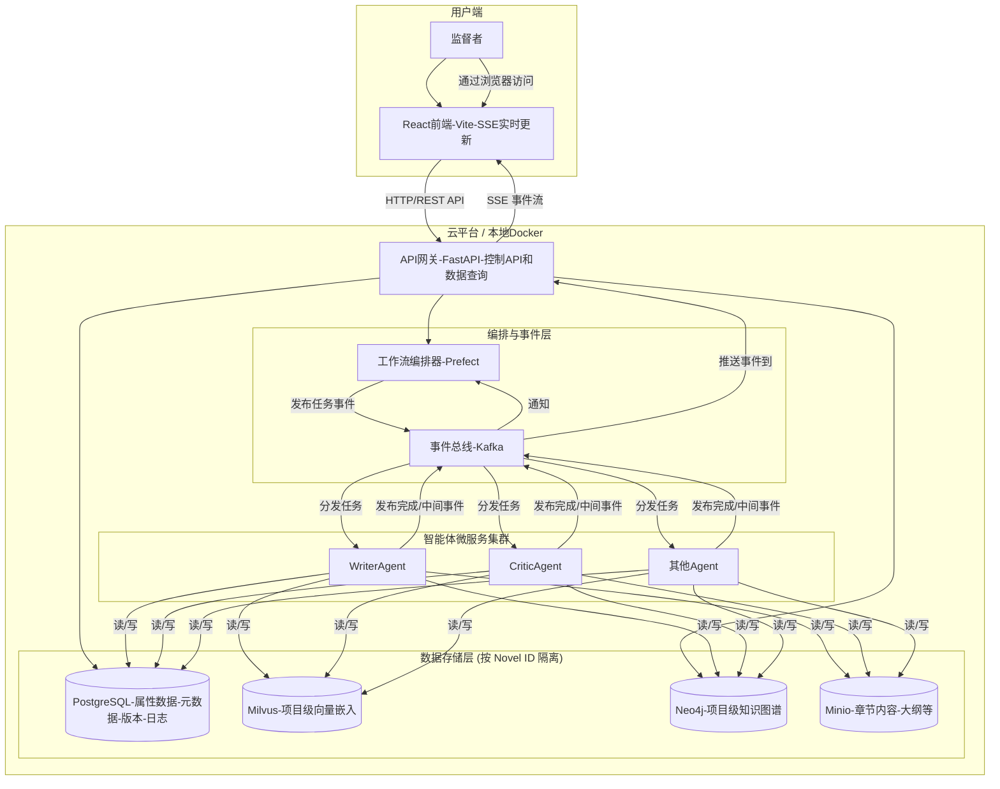

# High Level Architecture

## 技术摘要

本系统将构建为一个基于**事件驱动的微服务架构**，部署在云平台上。前端采用**React (Vite)** 构建的单页应用（SPA），通过一个**API网关**与后端进行通信。后端由一系列解耦的、容器化的**Python智能体（Agent）服务**组成，它们通过 **Kafka** 事件总线进行异步协作。整个创作流程由 **Prefect** 进行编排。数据存储采用混合模式，使用 **PostgreSQL** 进行结构化属性数据存储，**Milvus** 进行向量相似性搜索，**Neo4j** 管理复杂的关系数据（如特定书籍的世界观和角色关系），以及 **Minio** 进行对象存储。

## 平台与基础设施选择

*   **平台:** 我们将采用**平台无关的云原生方法**。所有服务都将被容器化（Docker），使其可以部署在任何支持容器的主流云平台（如AWS, GCP, Azure）或本地环境中。
*   **关键服务:**
    *   **计算:** 容器运行服务（如 Kubernetes, ECS, 或 Docker Swarm）。
    *   **消息队列:** 一个托管的Kafka集群或自部署的Kafka。
    *   **数据库:** 托管的PostgreSQL、Milvus和**Neo4j**服务。
    *   **对象存储:** 兼容S3的存储服务（如AWS S3或自部署的Minio）。
*   **部署宿主和区域:** MVP阶段将在本地通过Docker Compose进行开发和测试。生产部署的区域将根据目标用户地理位置和成本效益另行决定。

## 仓库结构

*   **结构:** **Monorepo**。
*   **Monorepo工具:** **pnpm workspaces**。
*   **包组织:**
    *   `apps/`: 存放可独立部署的应用，如 `frontend`, `backend` (包含API Gateway和所有Agent服务)。
    *   `packages/`: 存放共享的代码库，如 `shared-types`, `eslint-config`, `common-utils` 等。

## High Level Architecture

## 架构模式

*   **整体架构:** **事件驱动微服务 (Event-Driven Microservices)** - 服务之间通过异步消息解耦，提高了系统的弹性和可扩展性。
*   **前端模式:** **单页应用 (Single-Page Application - SPA)** - 提供流畅的、类似桌面应用的交互体验，包含项目仪表盘和项目详情视图。
*   **后端模式:** **智能体模式 (Agent Model)** - 每个服务都是一个具有特定技能的自主智能体。
*   **集成模式:** **API网关 (API Gateway)** - 为前端提供一个统一、简化的入口点来与复杂的后端系统交互。
*   **知识表示:** **混合数据模型 (Hybrid Data Model)** - 结构化属性使用PostgreSQL，向量相似性使用Milvus，**特定于项目的复杂关系和知识图谱使用Neo4j**。
