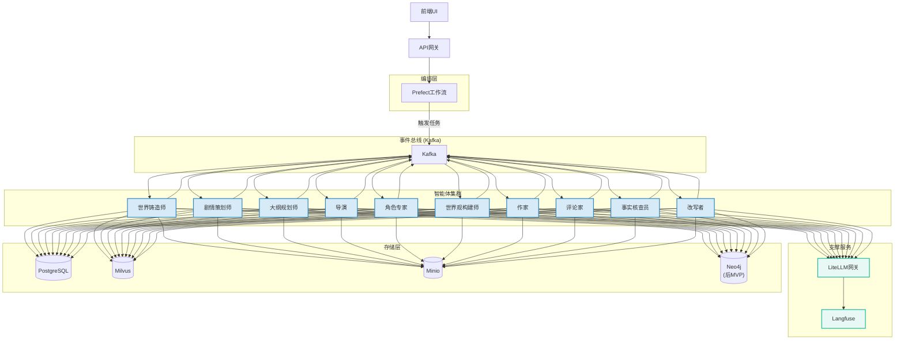
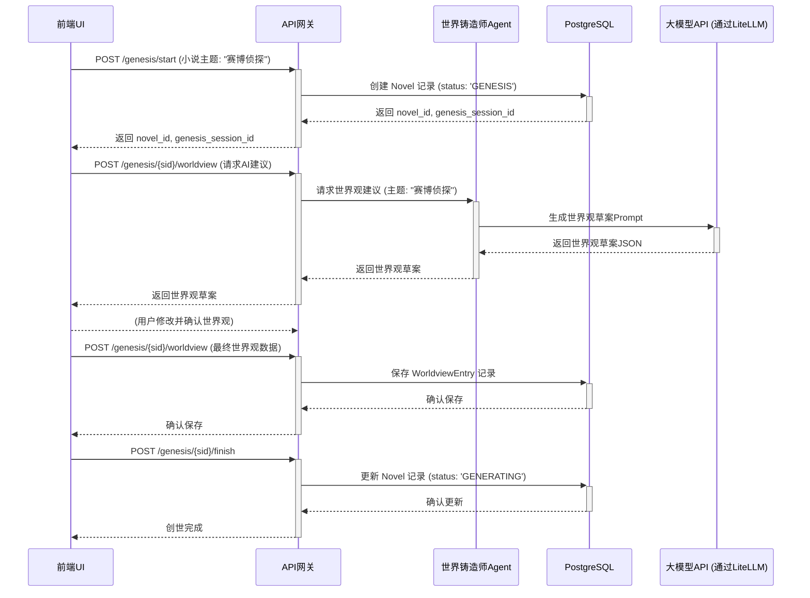
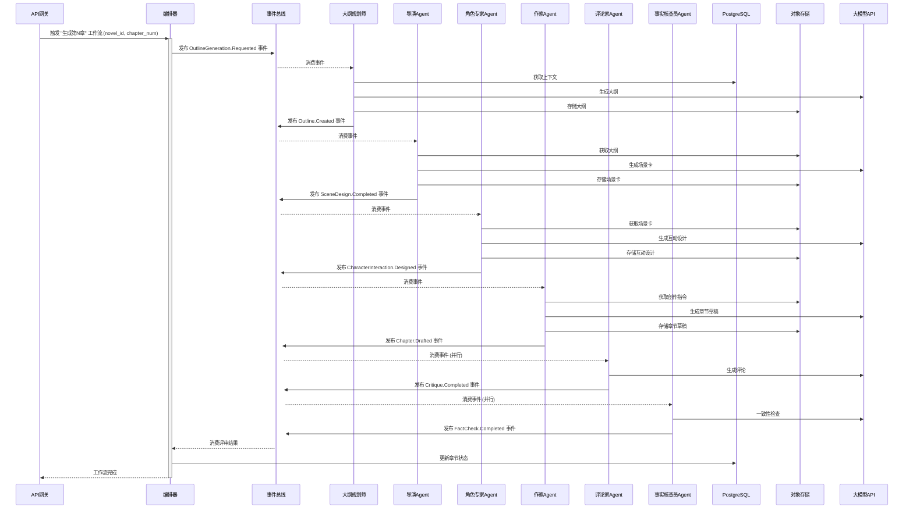
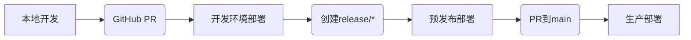

# 多智能体网络小说自动写作系统 全栈架构文档

## 简介

本文档概述了“多智能体网络小说自动写作系统”的完整全栈架构，包括后端服务、前端实现及其集成方式。它将作为所有AI开发智能体的唯一技术事实来源，确保整个技术栈的一致性。

### 启动模板或现有项目

本项目将采用**分步模板策略**进行初始化。我们将使用 **Vite** 官方提供的 **React + TypeScript** 模板来创建前端应用，并将其集成到一个手动配置的、基于 **pnpm workspaces** 的Monorepo中。后端Python服务将在此Monorepo中从头开始设置。

### Change Log

| Date | Version | Description | Author |
| :--- | :------ | :---------- | :----- |
|      | 1.0     | Initial Draft | Winston (Architect) |

## 高层架构

### 技术摘要

本系统将构建为一个基于**事件驱动的微服务架构**，部署在云平台上。前端采用**React (Vite)** 构建的单页应用（SPA），通过一个**API网关**与后端进行通信。后端由一系列解耦的、容器化的**Python智能体（Agent）服务**组成，它们通过 **Kafka** 事件总线进行异步协作。整个创作流程由 **Prefect** 进行编排。数据存储采用混合模式，使用 **PostgreSQL** 进行结构化数据存储，**Milvus** 进行向量相似性搜索，以及 **Minio** 进行对象存储。

### 平台与基础设施选择

*   **平台:** 我们将采用**平台无关的云原生方法**。所有服务都将被容器化（Docker），使其可以部署在任何支持容器的主流云平台（如AWS, GCP, Azure）或本地环境中。
*   **关键服务:**
    *   **计算:** 容器运行服务（如 Kubernetes, ECS, 或 Docker Swarm）。
    *   **消息队列:** 一个托管的Kafka集群或自部署的Kafka。
    *   **数据库:** 托管的PostgreSQL和Milvus服务。
    *   **对象存储:** 兼容S3的存储服务（如AWS S3或自部署的Minio）。
*   **部署宿主和区域:** MVP阶段将在本地通过Docker Compose进行开发和测试。生产部署的区域将根据目标用户地理位置和成本效益另行决定。

### 仓库结构

*   **结构:** **Monorepo**。
*   **Monorepo工具:** **pnpm workspaces**。
*   **包组织:**
    *   `apps/`: 存放可独立部署的应用，如 `frontend`, `api-gateway`, `writer-agent` 等。
    *   `packages/`: 存放共享的代码库，如 `shared-types`, `eslint-config`, `common-utils` 等。

### 高层架构图

```mermaid
graph TD
    subgraph "用户端"
        User[监督者] --> FE[React前端 (Vite)]
    end

    subgraph "云平台 / 本地Docker"
        FE --> APIGW[API网关 (FastAPI)]
        
        subgraph "数据存储层"
            DB[(PostgreSQL)]
            VDB[(Milvus)]
            S3[(Minio)]
        end

        subgraph "编排与事件层"
            Orchestrator[编排器 (Prefect)]
            Broker[事件总线 (Kafka)]
        end

        subgraph "智能体微服务集群"
            Agent1[WriterAgent]
            Agent2[CriticAgent]
            Agent3[...]
        end

        APIGW --> Orchestrator
        APIGW --> DB
        
        Orchestrator -- "发布任务事件" --> Broker
        Broker -- "分发任务" --> Agent1 & Agent2 & Agent3
        Agent1 & Agent2 & Agent3 -- "读/写" --> DB & VDB & S3
        Agent1 & Agent2 & Agent3 -- "发布完成事件" --> Broker
        Broker -- "通知" --> Orchestrator
    end

    User -- "通过浏览器访问" --> FE
```

### 架构模式

*   **整体架构:** **事件驱动微服务 (Event-Driven Microservices)** - 服务之间通过异步消息解耦，提高了系统的弹性和可扩展性。
*   **前端模式:** **单页应用 (Single-Page Application - SPA)** - 提供流畅的、类似桌面应用的交互体验。
*   **后端模式:** **智能体模式 (Agent Model)** - 每个服务都是一个具有特定技能的自主智能体。
*   **集成模式:** **API网关 (API Gateway)** - 为前端提供一个统一、简化的入口点来与复杂的后端系统交互。

## 技术栈

以下表格定义了本项目将要使用的全部核心技术及其具体版本。所有开发工作都必须严格遵守此技术栈，以确保兼容性和稳定性。

### 技术栈表

| 类别 | 技术 | 版本 | 用途 | 理由 |
| :--- | :--- | :--- | :--- | :--- |
| **前端语言** | TypeScript | `~5.2.2` | 前端开发语言 | 提供强类型安全，与React生态完美集成。 |
| **前端框架** | React | `~18.2.0` | 构建用户界面 | 业界标准，生态系统成熟，性能优秀。 |
| **UI组件库** | Shadcn UI | `~0.8.0` | 基础UI组件 | 提供可高度定制、符合设计系统的无头组件。 |
| **状态管理** | Zustand | `~4.5.0` | 前端全局状态管理 | 轻量、简洁、基于Hooks，避免了Redux的样板代码。 |
| **数据请求** | TanStack Query | `~5.25.0`| 服务端状态管理 | 极大地简化了数据获取、缓存、同步和更新的逻辑。 |
| **前端路由** | React Router | `~6.22.0` | 客户端路由 | React官方推荐的路由解决方案，功能强大。 |
| **构建工具** | Vite | `~5.2.0` | 前端开发与构建 | 提供极速的开发服务器和优化的构建输出。 |
| **CSS方案** | Tailwind CSS | `~3.4.1` | UI样式 | 提供原子化的CSS类，开发效率高，与Shadcn UI集成良好。 |
| **包管理器** | pnpm | `~8.15.0`| Monorepo依赖管理 | 速度快，节省磁盘空间，对Monorepo支持优秀。 |
| **后端语言** | Python | `~3.11` | 后端与Agent开发 | AI/ML生态系统无与伦比，异步性能良好。 |
| **后端框架** | FastAPI | `~0.110.0`| API网关与服务 | 高性能，基于Pydantic的自动校验和文档生成。 |
| **数据校验** | Pydantic | `~2.6.0` | 数据模型与校验 | 提供运行时的数据类型强制，是FastAPI的核心。 |
| **工作流编排** | Prefect | `~2.19.0`| 业务流程编排 | Python原生，对数据密集型和动态工作流支持良好。 |
| **事件总线** | Apache Kafka | `3.7.0` (镜像) | 智能体间异步通信 | 高吞吐量、持久化的分布式消息系统，业界标准。 |
| **关系型数据库**| PostgreSQL | `16` (镜像) | 核心元数据存储 | 功能强大，可靠，支持丰富的JSON操作。 |
| **向量数据库** | Milvus | `2.4.0` (镜像) | 上下文检索 | 专为向量相似性搜索设计，性能卓越。 |
| **对象存储** | Minio | `LATEST` (镜像) | 存储小说内容等大文件 | 兼容S3协议的开源解决方案，便于本地部署。 |
| **缓存** | Redis | `7.2` (镜像) | 缓存与临时数据 | 高性能的内存数据库，用途广泛。 |
| **LLM网关** | LiteLLM | `~1.34.0`| 统一调用大模型API | 支持多种模型，提供统一的接口和成本控制。 |
| **可观测性** | Langfuse | `~2.25.0`| LLM应用追踪与调试 | 提供对复杂Agent流程的端到端可见性。 |
| **测试框架** | Vitest, Pytest | `~1.4.0`, `~8.1.0` | 前后端单元/集成测试 | 分别是Vite和Python生态中最主流、最强大的测试框架。 |

## 数据模型

以下是本系统的核心数据模型定义。这些模型将在 `packages/shared-types` 中实现，供前后端共同使用。

### Novel (小说)

*   **目的:** 代表一个独立的小说项目，是所有其他数据的根实体。
*   **TypeScript 接口:**
    ```typescript
    interface Novel {
      id: string; // UUID
      title: string;
      theme: string; // 主题
      writing_style: string; // 风格
      status: 'GENESIS' | 'GENERATING' | 'PAUSED' | 'COMPLETED' | 'FAILED';
      target_chapters: number;
      completed_chapters: number;
      created_at: Date;
      updated_at: Date;
    }
    ```
*   **关系:**
    *   拥有多个 `WorldviewEntry` (1:N)
    *   拥有多个 `Character` (1:N)
    *   拥有多个 `Chapter` (1:N)
    *   拥有多个 `StoryArc` (1:N)

### Chapter (章节)

*   **目的:** 代表小说中的一个独立章节。
*   **TypeScript 接口:**
    ```typescript
    interface Chapter {
      id: string; // UUID
      novel_id: string;
      chapter_number: number;
      title: string;
      content_url: string; // 指向Minio中存储章节内容的链接
      status: 'DRAFT' | 'REVIEWING' | 'REVISING' | 'PUBLISHED';
      word_count: number;
      created_at: Date;
      updated_at: Date;
    }
    ```
*   **关系:**
    *   属于一个 `Novel` (N:1)
    *   拥有多个 `Review` (1:N)

### Character (角色)

*   **目的:** 代表小说中的一个角色，包含其所有核心设定。
*   **TypeScript 接口:**
    ```typescript
    interface Character {
      id: string; // UUID
      novel_id: string;
      name: string;
      role: 'PROTAGONIST' | 'ANTAGONIST' | 'ALLY' | 'SUPPORTING'; // 角色定位
      description: string; // 简短描述
      background_story: string; // 背景故事
      personality_traits: string[]; // 性格标签
      goals: string[]; // 角色的目标
      // ... 其他自定义字段
      created_at: Date;
      updated_at: Date;
    }
    ```
*   **关系:**
    *   属于一个 `Novel` (N:1)

### WorldviewEntry (世界观条目)

*   **目的:** 代表世界观中的一个独立设定条目。
*   **TypeScript 接口:**
    ```typescript
    interface WorldviewEntry {
      id: string; // UUID
      novel_id: string;
      entry_type: 'LOCATION' | 'ORGANIZATION' | 'TECHNOLOGY' | 'LAW'; // 条目类型
      name: string;
      description: string;
      created_at: Date;
      updated_at: Date;
    }
    ```
*   **关系:**
    *   属于一个 `Novel` (N:1)

### Review (评审)

*   **目的:** 记录一次对章节草稿的评审结果。
*   **TypeScript 接口:**
    ```typescript
    interface Review {
      id: string; // UUID
      chapter_id: string;
      agent_id: string; // 进行评审的Agent ID
      review_type: 'CRITIC' | 'FACT_CHECK'; // 评审类型
      score?: number; // 评论家评分
      comment?: string; // 评论家评语
      is_consistent?: boolean; // 事实核查员结果
      issues_found?: string[]; // 事实核查员发现的问题
      created_at: Date;
    }
    ```
*   **关系:**
    *   属于一个 `Chapter` (N:1)

## 组件

### 1. API网关 (API Gateway)

*   **责任:**
    *   作为前端UI与后端所有服务的唯一入口点。
    *   处理所有来自前端的HTTP请求。
    *   进行身份验证和授权。
    *   将前端指令（如“开始创世”、“生成章节”）转化为对Prefect工作流的调用。
    *   提供查询接口，供前端获取工作流状态和结果数据（如章节内容）。
*   **关键接口:**
    *   `POST /genesis/start`
    *   `POST /genesis/{session_id}/...` (用于创世流程的各个步骤)
    *   `POST /novels/{novel_id}/generate-chapter`
    *   `GET /chapters/{chapter_id}`
    *   `GET /metrics`
    *   `GET /health`
*   **依赖:** PostgreSQL (用于存储创世数据、小说元数据), Prefect (用于触发工作流), Kafka (可选，用于发布某些UI触发的即时事件)。
*   **技术栈:** FastAPI, Python, Pydantic。

### 2. 世界铸造师Agent (Worldsmith Agent)
*   **责任:** 与人类监督者交互，辅助完成小说初始设定。
*   **依赖:** 大模型API, PostgreSQL。
*   **技术栈:** Python, Pydantic, LiteLLM。

### 3. 剧情策划师Agent (PlotMaster Agent)
*   **责任:** 进行高层战略剧情规划，发布剧情指令。
*   **依赖:** 知识库 (PostgreSQL, Milvus, Neo4j - 后MVP)。
*   **技术栈:** Python, Pydantic。

### 4. 大纲规划师Agent (Outliner Agent)
*   **责任:** 将剧情指令转化为具体章节情节大纲。
*   **依赖:** 大模型API, 知识库。
*   **技术栈:** Python, Pydantic, LiteLLM。

### 5. 导演Agent (Director Agent)
*   **责任:** 将章节大纲分解为场景序列，设定节奏和视角。
*   **依赖:** 大模型API, 知识库。
*   **技术栈:** Python, Pydantic, LiteLLM。

### 6. 角色专家Agent (CharacterExpert Agent)
*   **责任:** 创建新角色卡，规划角色在场景中的对话与互动。
*   **依赖:** 大模型API, 知识库。
*   **技术栈:** Python, Pydantic, LiteLLM。

### 7. 世界观构建师Agent (WorldBuilder Agent)
*   **责任:** 扩展和丰富世界观设定，并持久化。
*   **依赖:** 大模型API, 知识库。
*   **技术栈:** Python, Pydantic, LiteLLM。

### 8. 作家Agent (Writer Agent)
*   **责任:** 将场景和对话渲染成最终的章节草稿。
*   **依赖:** 大模型API, 知识库, Minio。
*   **技术栈:** Python, Pydantic, LiteLLM。

### 9. 评论家Agent (Critic Agent)
*   **责任:** 评估草稿的文学质量、节奏和趣味性。
*   **依赖:** 大模型API, 知识库。
*   **技术栈:** Python, Pydantic, LiteLLM。

### 10. 事实核查员Agent (FactChecker Agent)
*   **责任:** 检查草稿内容与知识库中既定事实的一致性。
*   **依赖:** 大模型API, 知识库。
*   **技术栈:** Python, Pydantic, LiteLLM。

### 11. 改写者Agent (Rewriter Agent)
*   **责任:** 根据评审结果对草稿进行修改和润色。
*   **依赖:** 大模型API, 知识库。
*   **技术栈:** Python, Pydantic, LiteLLM。

### 组件图 (简化版)



## 外部API

### 1. 大型语言模型 (LLM) API
*   **目的:** 所有智能体执行其核心的自然语言理解、生成和评估任务。
*   **API提供商 (示例):** OpenAI, Anthropic, Google等。
*   **统一网关:** **LiteLLM** - 统一接口, 模型切换, 成本控制, 日志监控。
*   **认证:** 通过LiteLLM配置和管理各提供商的API密钥。
*   **集成注意事项:** Prompt Engineering, 上下文管理, 错误处理。

## 核心工作流

### 1. 创世流程 (Genesis Flow) - UI触发


### 2. 章节生成流程 (Chapter Generation Flow) - 标准路径


## REST API Spec
```yaml
openapi: 3.0.0
info:
  title: 多智能体网络小说自动写作系统 - 控制API
  version: v1.0.0
  description: 用于前端UI与后端工作流系统交互的控制API。
servers:
  - url: http://localhost:8000/api/v1
    description: 本地开发服务器
components:
  schemas:
    Novel:
      type: object
      properties:
        id: { type: string, format: uuid }
        title: { type: string }
        # ... (其他Novel字段)
    Chapter:
      type: object
      properties:
        id: { type: string, format: uuid }
        # ... (其他Chapter字段)
    # ... (其他Schema定义如GenesisStartRequest, GenesisStartResponse等)
  securitySchemes:
    BearerAuth:
      type: http
      scheme: bearer
      bearerFormat: JWT
security:
  - BearerAuth: []
paths:
  /health:
    get:
      summary: 健康检查
      responses:
        '200': { description: 服务正常 }
  /genesis/start:
    post:
      summary: 启动新的创世流程
      # ... (请求体和响应定义)
  # ... (其他API端点定义)
```

## 数据库模式
```sql
-- Novels Table
CREATE TABLE novels (
    id UUID PRIMARY KEY DEFAULT gen_random_uuid(),
    title VARCHAR(255) NOT NULL,
    theme TEXT,
    writing_style TEXT,
    status VARCHAR(50) NOT NULL DEFAULT 'GENESIS' CHECK (status IN ('GENESIS', 'GENERATING', 'PAUSED', 'COMPLETED', 'FAILED')),
    target_chapters INTEGER NOT NULL DEFAULT 0,
    completed_chapters INTEGER NOT NULL DEFAULT 0,
    created_at TIMESTAMPTZ NOT NULL DEFAULT NOW(),
    updated_at TIMESTAMPTZ NOT NULL DEFAULT NOW()
);

-- Chapters Table
CREATE TABLE chapters (
    id UUID PRIMARY KEY DEFAULT gen_random_uuid(),
    novel_id UUID NOT NULL REFERENCES novels(id) ON DELETE CASCADE,
    chapter_number INTEGER NOT NULL,
    title VARCHAR(255),
    content_url TEXT, -- URL to content in Minio
    status VARCHAR(50) NOT NULL DEFAULT 'DRAFT' CHECK (status IN ('DRAFT', 'REVIEWING', 'REVISING', 'PUBLISHED')),
    word_count INTEGER DEFAULT 0,
    created_at TIMESTAMPTZ NOT NULL DEFAULT NOW(),
    updated_at TIMESTAMPTZ NOT NULL DEFAULT NOW(),
    UNIQUE (novel_id, chapter_number)
);

-- Characters Table
CREATE TABLE characters (
    id UUID PRIMARY KEY DEFAULT gen_random_uuid(),
    novel_id UUID NOT NULL REFERENCES novels(id) ON DELETE CASCADE,
    name VARCHAR(255) NOT NULL,
    role VARCHAR(50) CHECK (role IN ('PROTAGONIST', 'ANTAGONIST', 'ALLY', 'SUPPORTING')),
    description TEXT,
    background_story TEXT,
    personality_traits TEXT[], 
    goals TEXT[], 
    created_at TIMESTAMPTZ NOT NULL DEFAULT NOW(),
    updated_at TIMESTAMPTZ NOT NULL DEFAULT NOW()
);

-- Worldview Entries Table
CREATE TABLE worldview_entries (
    id UUID PRIMARY KEY DEFAULT gen_random_uuid(),
    novel_id UUID NOT NULL REFERENCES novels(id) ON DELETE CASCADE,
    entry_type VARCHAR(50) NOT NULL CHECK (entry_type IN ('LOCATION', 'ORGANIZATION', 'TECHNOLOGY', 'LAW', 'CONCEPT')),
    name VARCHAR(255) NOT NULL,
    description TEXT,
    created_at TIMESTAMPTZ NOT NULL DEFAULT NOW(),
    updated_at TIMESTAMPTZ NOT NULL DEFAULT NOW()
);

-- Reviews Table
CREATE TABLE reviews (
    id UUID PRIMARY KEY DEFAULT gen_random_uuid(),
    chapter_id UUID NOT NULL REFERENCES chapters(id) ON DELETE CASCADE,
    agent_id VARCHAR(255) NOT NULL, 
    review_type VARCHAR(50) NOT NULL CHECK (review_type IN ('CRITIC', 'FACT_CHECK')),
    score NUMERIC(3, 1), 
    comment TEXT, 
    is_consistent BOOLEAN, 
    issues_found TEXT[], 
    created_at TIMESTAMPTZ NOT NULL DEFAULT NOW()
);

-- Story Arcs Table
CREATE TABLE story_arcs (
    id UUID PRIMARY KEY DEFAULT gen_random_uuid(),
    novel_id UUID NOT NULL REFERENCES novels(id) ON DELETE CASCADE,
    title VARCHAR(255) NOT NULL,
    summary TEXT,
    start_chapter INTEGER,
    end_chapter INTEGER,
    status VARCHAR(50) DEFAULT 'PLANNED' CHECK (status IN ('PLANNED', 'ACTIVE', 'COMPLETED')),
    created_at TIMESTAMPTZ NOT NULL DEFAULT NOW(),
    updated_at TIMESTAMPTZ NOT NULL DEFAULT NOW()
);

-- Indexes and Triggers (as previously defined)
```

## 源代码树
```plaintext
novel-ai-writer/
├── .github/
│   └── workflows/
│       └── main.yml
├── apps/
│   ├── frontend/
│   │   ├── public/
│   │   ├── src/
│   │   │   ├── assets/
│   │   │   ├── components/
│   │   │   ├── config/
│   │   │   ├── hooks/
│   │   │   ├── layouts/
│   │   │   ├── pages/
│   │   │   ├── services/
│   │   │   ├── store/
│   │   │   ├── styles/
│   │   │   ├── types/
│   │   │   ├── utils/
│   │   │   └── App.tsx
│   │   │   └── main.tsx
│   │   ├── index.html
│   │   ├── package.json
│   │   └── vite.config.ts
│   ├── api-gateway/
│   │   ├── app/
│   │   └── Dockerfile
│   ├── worldsmith-agent/
│   │   └── Dockerfile
│   └── ... (其他Agent服务)
├── packages/
│   ├── shared-types/
│   │   ├── src/
│   │   └── package.json
│   ├── eslint-config-custom/
│   └── tsconfig-custom/
├── docs/
├── scripts/
├── docker-compose.yml
├── package.json
├── pnpm-workspace.yaml
└── README.md
```

## 基础设施与部署
### 基础设施即代码 (IaC)
*   **工具:** Terraform `~1.7.0`
*   **位置:** `infrastructure/`
### 部署策略
*   **策略:** 基于容器的蓝绿部署或金丝雀发布。
*   **CI/CD平台:** GitHub Actions (`.github/workflows/main.yml`)
### 环境
| 环境名称 | 用途 | 部署方式 | 数据库/事件总线 |
| :--- | :--- | :--- | :--- |
| 本地 | 开发与单元测试 | `docker-compose up` | 本地Docker |
| 开发 | 共享开发/集成 | CI/CD自动 (develop分支) | 云上开发实例 |
| 预发布 | UAT/E2E测试 | CI/CD自动 (release/*分支) | 生产副本 |
| 生产 | 实时环境 | CI/CD手动批准 (main分支) | 高可用生产实例 |
### 环境提升流程

### 回滚策略
*   **方法:** 蓝绿切换, Docker镜像回滚。
*   **RTO:** 15分钟内。

## 错误处理策略
### 总体方法
*   **模型:** 基于异常。
*   **传递:** 服务内部捕获/重抛；服务间通过DLQ；API网关转HTTP错误。
### 日志标准
*   **库:** Python `logging` (JSON), 前端 `console.error()`。
*   **格式:** 结构化 (时间戳, 服务名, 级别, 相关ID, 消息, 堆栈)。
### 错误处理模式
*   **外部API:** LiteLLM负责重试、熔断、超时。
*   **业务逻辑:** 自定义异常，API网关转用户友好错误。
*   **数据一致性:** PostgreSQL事务，后MVP考虑Saga。幂等性设计。

## 编码标准
### 核心标准
*   **语言版本:** Python `~3.11`, TypeScript `~5.2.2`。
*   **Linting/Formatting:** Ruff, Black (Python); ESLint, Prettier (TS)。强制执行。
### 命名约定
*   (如前定义)
### 关键规则
*   禁止硬编码敏感信息。
*   严格类型提示。
*   优先异步IO。
*   结构化日志。
*   规范错误处理。
*   遵循Monorepo。
*   事件驱动通信。
*   幂等性设计。

## 测试策略与标准
### 测试理念
*   **覆盖率目标:** 单元测试85%。
*   **测试金字塔:** (如图所示)
### 测试类型与组织
*   **单元测试:** Pytest (Python), Vitest (TS)。AAA模式，模拟外部依赖。
*   **集成测试:** 覆盖服务间交互。使用`testcontainers`。
*   **端到端测试:** Playwright。覆盖核心用户流程。
### 测试数据管理
*   单元: 硬编码。集成: 工厂/固件。E2E: 专用库或动态创建。
### 持续测试
*   CI集成 (GitHub Actions)。

## 安全
### 输入验证
*   **库:** Pydantic (后端), Zod/Yup (前端)。
*   **位置:** 前后端双重验证。
### 认证与授权
*   **方法:** JWT (API网关)。
*   **存储:** HttpOnly Cookie (前端)。
*   **授权:** RBAC。
### 密钥管理
*   **开发:** `.env`。
*   **生产:** 专用密钥管理服务。
### API安全
*   速率限制, 严格CORS, 安全头, HTTPS强制。
### 数据保护
*   传输中加密 (TLS/SSL)。
### 依赖安全
*   CI中集成漏洞扫描。定期更新。
