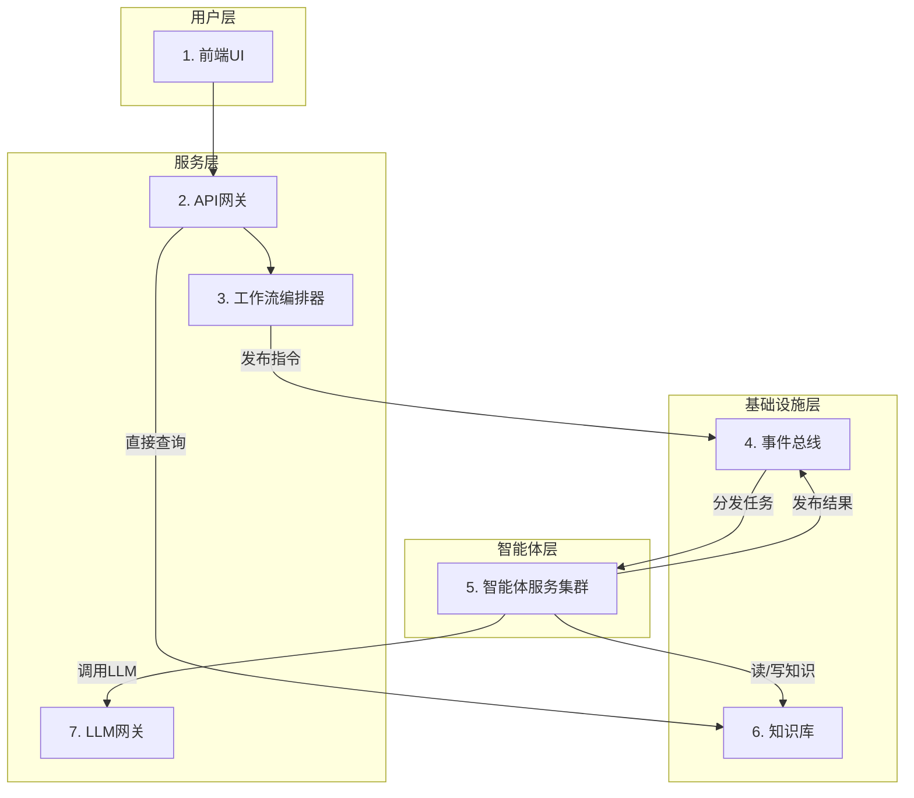

`# 多智能体网络小说自动写作系统 全栈架构文档

## 简介

本文档概述了“多智能体网络小说自动写作系统”的完整全栈架构，包括后端服务、前端实现及其集成方式。它将作为所有AI开发智能体的唯一技术事实来源，确保整个技术栈的一致性。

### 启动模板或现有项目

本项目将采用**分步模板策略**进行初始化。我们将使用 **Vite** 官方提供的 **React + TypeScript** 模板来创建前端应用，并将其集成到一个手动配置的、基于 **pnpm workspaces** 的Monorepo中。后端Python服务将在此Monorepo中从头开始设置。

### Change Log

| Date | Version | Description | Author |
| :--- | :------ | :---------- | :----- |
|      | 1.0     | Initial Draft | Winston (Architect) |

## 高层架构

### 技术摘要

本系统将构建为一个基于**事件驱动的微服务架构**，部署在云平台上。前端采用**React (Vite)** 构建的单页应用（SPA），通过一个**API网关**与后端进行通信。后端由一系列解耦的、容器化的**Python智能体（Agent）服务**组成，它们通过 **Kafka** 事件总线进行异步协作。整个创作流程由 **Prefect** 进行编排。数据存储采用混合模式，使用 **PostgreSQL** 进行结构化数据存储，**Milvus** 进行向量相似性搜索，以及 **Minio** 进行对象存储。

### 平台与基础设施选择

*   **平台:** 我们将采用**平台无关的云原生方法**。所有服务都将被容器化（Docker），使其可以部署在任何支持容器的主流云平台（如AWS, GCP, Azure）或本地环境中。
*   **关键服务:**
    *   **计算:** 容器运行服务（如 Kubernetes, ECS, 或 Docker Swarm）。
    *   **消息队列:** 一个托管的Kafka集群或自部署的Kafka。
    *   **数据库:** 托管的PostgreSQL和Milvus服务。
    *   **对象存储:** 兼容S3的存储服务（如AWS S3或自部署的Minio）。
*   **部署宿主和区域:** MVP阶段将在本地通过Docker Compose进行开发和测试。生产部署的区域将根据目标用户地理位置和成本效益另行决定。

### 仓库结构

*   **结构:** **Monorepo**。
*   **Monorepo工具:** **pnpm workspaces**。
*   **包组织:**
    *   `apps/`: 存放可独立部署的应用，如 `frontend`, `api-gateway`, `writer-agent` 等。
    *   `packages/`: 存放共享的代码库，如 `shared-types`, `eslint-config`, `common-utils` 等。

### 高层架构图

```mermaid
graph TD
    subgraph "用户端"
        User[监督者] --> FE[React前端 (Vite)]
    end

    subgraph "云平台 / 本地Docker"
        FE --> APIGW[API网关 (FastAPI)]
        
        subgraph "数据存储层"
            DB[(PostgreSQL)]
            VDB[(Milvus)]
            S3[(Minio)]
        end

        subgraph "编排与事件层"
            Orchestrator[编排器 (Prefect)]
            Broker[事件总线 (Kafka)]
        end

        subgraph "智能体微服务集群"
            Agent1[WriterAgent]
            Agent2[CriticAgent]
            Agent3[...]
        end

        APIGW --> Orchestrator
        APIGW --> DB
        
        Orchestrator -- "发布任务事件" --> Broker
        Broker -- "分发任务" --> Agent1 & Agent2 & Agent3
        Agent1 & Agent2 & Agent3 -- "读/写" --> DB & VDB & S3
        Agent1 & Agent2 & Agent3 -- "发布完成事件" --> Broker
        Broker -- "通知" --> Orchestrator
    end

    User -- "通过浏览器访问" --> FE
```

### 架构模式

*   **整体架构:** **事件驱动微服务 (Event-Driven Microservices)** - 服务之间通过异步消息解耦，提高了系统的弹性和可扩展性。
*   **前端模式:** **单页应用 (Single-Page Application - SPA)** - 提供流畅的、类似桌面应用的交互体验。
*   **后端模式:** **智能体模式 (Agent Model)** - 每个服务都是一个具有特定技能的自主智能体。
*   **集成模式:** **API网关 (API Gateway)** - 为前端提供一个统一、简化的入口点来与复杂的后端系统交互。

## 技术栈

以下表格定义了本项目将要使用的全部核心技术及其具体版本。所有开发工作都必须严格遵守此技术栈，以确保兼容性和稳定性。

### 技术栈表

| 类别 | 技术 | 版本 | 用途 | 理由 |
| :--- | :--- | :--- | :--- | :--- |
| **前端语言** | TypeScript | `~5.2.2` | 前端开发语言 | 提供强类型安全，与React生态完美集成。 |
| **前端框架** | React | `~18.2.0` | 构建用户界面 | 业界标准，生态系统成熟，性能优秀。 |
| **UI组件库** | Shadcn UI | `~0.8.0` | 基础UI组件 | 提供可高度定制、符合设计系统的无头组件。 |
| **状态管理** | Zustand | `~4.5.0` | 前端全局状态管理 | 轻量、简洁、基于Hooks，避免了Redux的样板代码。 |
| **数据请求** | TanStack Query | `~5.25.0`| 服务端状态管理 | 极大地简化了数据获取、缓存、同步和更新的逻辑。 |
| **前端路由** | React Router | `~6.22.0` | 客户端路由 | React官方推荐的路由解决方案，功能强大。 |
| **构建工具** | Vite | `~5.2.0` | 前端开发与构建 | 提供极速的开发服务器和优化的构建输出。 |
| **CSS方案** | Tailwind CSS | `~3.4.1` | UI样式 | 提供原子化的CSS类，开发效率高，与Shadcn UI集成良好。 |
| **包管理器** | pnpm | `~8.15.0`| Monorepo依赖管理 | 速度快，节省磁盘空间，对Monorepo支持优秀。 |
| **后端语言** | Python | `~3.11` | 后端与Agent开发 | AI/ML生态系统无与伦比，异步性能良好。 |
| **后端框架** | FastAPI | `~0.115.13`| API网关与服务 | 高性能，基于Pydantic的自动校验和文档生成。 |
| **数据校验** | Pydantic | `~2.11.7` | 数据模型与校验 | 提供运行时的数据类型强制，是FastAPI的核心。 |
| **工作流编排** | Prefect | `~2.19.0`| 业务流程编排 | Python原生，对数据密集型和动态工作流支持良好。 |
| **事件总线** | Apache Kafka | `3.7.0` (镜像) | 智能体间异步通信 | 高吞吐量、持久化的分布式消息系统，业界标准。 |
| **关系型数据库**| PostgreSQL | `16` (镜像) | 核心元数据存储 | 功能强大，可靠，支持丰富的JSON操作。 |
| **向量数据库** | Milvus | `2.4.0` (镜像) | 上下文检索 | 专为向量相似性搜索设计，性能卓越。 |
| **对象存储** | Minio | `LATEST` (镜像) | 存储小说内容等大文件 | 兼容S3协议的开源解决方案，便于本地部署。 |
| **缓存** | Redis | `7.2` (镜像) | 缓存与临时数据 | 高性能的内存数据库，用途广泛。 |
| **LLM网关** | LiteLLM | `~1.34.0`| 统一调用大模型API | 支持多种模型，提供统一的接口和成本控制。 |
| **可观测性** | Langfuse | `~2.25.0`| LLM应用追踪与调试 | 提供对复杂Agent流程的端到端可见性。 |
| **测试框架** | Vitest, Pytest | `~1.4.0`, `~8.1.0` | 前后端单元/集成测试 | 分别是Vite和Python生态中最主流、最强大的测试框架。 |

## 数据模型

以下是本系统的核心数据模型定义。这些模型将在 `packages/shared-types` 中实现，供前后端共同使用。

### Novel (小说)

*   **目的:** 代表一个独立的小说项目，是所有其他数据的根实体。
*   **TypeScript 接口:**
    ```typescript
    interface Novel {
      id: string; // UUID
      title: string;
      theme: string; // 主题
      writing_style: string; // 风格
      status: 'GENESIS' | 'GENERATING' | 'PAUSED' | 'COMPLETED' | 'FAILED';
      target_chapters: number;
      completed_chapters: number;
      created_at: Date;
      updated_at: Date;
    }
    ```
*   **关系:**
    *   拥有多个 `WorldviewEntry` (1:N)
    *   拥有多个 `Character` (1:N)
    *   拥有多个 `Chapter` (1:N)
    *   拥有多个 `StoryArc` (1:N)

### Chapter (章节)

*   **目的:** 代表小说中的一个独立章节。
*   **TypeScript 接口:**
    ```typescript
    interface Chapter {
      id: string; // UUID
      novel_id: string;
      chapter_number: number;
      title: string;
      content_url: string; // 指向Minio中存储章节内容的链接
      status: 'DRAFT' | 'REVIEWING' | 'REVISING' | 'PUBLISHED';
      word_count: number;
      created_at: Date;
      updated_at: Date;
    }
    ```
*   **关系:**
    *   属于一个 `Novel` (N:1)
    *   拥有多个 `Review` (1:N)

### Character (角色)

*   **目的:** 代表小说中的一个角色，包含其所有核心设定。
*   **TypeScript 接口:**
    ```typescript
    interface Character {
      id: string; // UUID
      novel_id: string;
      name: string;
      role: 'PROTAGONIST' | 'ANTAGONIST' | 'ALLY' | 'SUPPORTING'; // 角色定位
      description: string; // 简短描述
      background_story: string; // 背景故事
      personality_traits: string[]; // 性格标签
      goals: string[]; // 角色的目标
      // ... 其他自定义字段
      created_at: Date;
      updated_at: Date;
    }
    ```
*   **关系:**
    *   属于一个 `Novel` (N:1)

### WorldviewEntry (世界观条目)

*   **目的:** 代表世界观中的一个独立设定条目。
*   **TypeScript 接口:**
    ```typescript
    interface WorldviewEntry {
      id: string; // UUID
      novel_id: string;
      entry_type: 'LOCATION' | 'ORGANIZATION' | 'TECHNOLOGY' | 'LAW'; // 条目类型
      name: string;
      description: string;
      created_at: Date;
      updated_at: Date;
    }
    ```
*   **关系:**
    *   属于一个 `Novel` (N:1)

### Review (评审)

*   **目的:** 记录一次对章节草稿的评审结果。
*   **TypeScript 接口:**
    ```typescript
    interface Review {
      id: string; // UUID
      chapter_id: string;
      agent_id: string; // 进行评审的Agent ID
      review_type: 'CRITIC' | 'FACT_CHECK'; // 评审类型
      score?: number; // 评论家评分
      comment?: string; // 评论家评语
      is_consistent?: boolean; // 事实核查员结果
      issues_found?: string[]; // 事实核查员发现的问题
      created_at: Date;
    }
    ```
*   **关系:**
    *   属于一个 `Chapter` (N:1)

## 组件

本系统采用微服务架构，每个AI智能体都是一个独立的组件。此外，还有一些核心的支撑组件。

### 1. 前端UI (Frontend UI)

*   **职责:** 为人类监督者提供一个图形化的交互界面。负责展示项目状态、触发创作流程、以及审查生成的内容。
*   **关键接口:** 通过REST API与“API网关”进行通信。
*   **依赖:** API网关。
*   **技术栈:** React, Vite, TypeScript, Shadcn UI, Tailwind CSS。

### 2. API网关 (API Gateway)

*   **职责:** 作为整个后端系统的统一入口。负责处理来自前端的HTTP请求，进行身份验证和授权，并将请求转化为对内部分析器或工作流编排器的调用。
*   **关键接口:**
    *   提供 `/genesis/*` 系列端点用于创世流程。
    *   提供 `/novels/*` 系列端点用于管理和触发小说生成。
    *   提供 `/metrics` 端点用于查询系统指标。
*   **依赖:** 编排器 (Prefect), 数据库 (PostgreSQL)。
*   **技术栈:** Python, FastAPI。

### 3. 工作流编排器 (Workflow Orchestrator)

*   **职责:** 系统的“大脑”。负责执行和管理所有复杂的、多步骤的创作工作流。它不执行具体业务逻辑，而是通过向事件总线发布任务事件来“指挥”各个智能体。
*   **关键接口:** 接收来自API网关的指令来启动工作流。
*   **依赖:** 事件总线 (Kafka)。
*   **技术栈:** Prefect。

### 4. 事件总线 (Event Bus)

*   **职责:** 系统的“中央神经系统”。所有智能体和服务之间的通信都通过它进行。它负责可靠地传递事件消息，实现服务间的解耦。
*   **关键接口:** 提供Topics供生产者发布消息和消费者订阅消息。
*   **依赖:** 无（核心基础设施）。
*   **技术栈:** Apache Kafka。

### 5. 智能体服务 (Agent Services)

这是一个组件类别，包含所有独立的AI智能体微服务。每个服务都遵循相同的模式：

*   **通用职责:** 订阅特定的请求事件，执行其专业任务（通常涉及调用LLM），然后发布一个完成事件。
*   **通用依赖:** 事件总线 (Kafka), 知识库 (数据库、对象存储、向量库), LLM网关。
*   **技术栈:** Python, Pydantic。
*   **具体组件:**
    *   世界铸造师 (WorldsmithAgent)
    *   剧情策划师 (PlotMasterAgent)
    *   大纲规划师 (OutlinerAgent)
    *   导演 (DirectorAgent)
    *   角色专家 (CharacterExpertAgent)
    *   世界观构建师 (WorldBuilderAgent)
    *   作家 (WriterAgent)
    *   评论家 (CriticAgent)
    *   事实核查员 (FactCheckerAgent)
    *   改写者 (RewriterAgent)

### 6. 知识库 (Knowledge Base)

这是一个逻辑上的组件，由多个物理数据存储服务构成。

*   **职责:** 持久化存储和检索小说创作过程中的所有数据和知识。
*   **关键接口:** 提供数据库连接和S3兼容的API。
*   **依赖:** 无（核心基础设施）。
*   **包含:** PostgreSQL, Milvus, Minio。

### 7. LLM网关 (LLM Gateway)

*   **职责:** 统一管理对所有外部大语言模型API的调用。负责API密钥管理、请求路由、成本计算和日志记录。
*   **关键接口:** 提供一个与OpenAI兼容的统一API接口。
*   **依赖:** 外部LLM服务 (OpenAI, Anthropic等)。
*   **技术栈:** LiteLLM。

### 组件关系图



## REST API 规范

```yaml
openapi: 3.0.3
info:
  title: "多智能体小说写作系统 - 控制API"
  description: "用于与小说自动写作后端系统交互的控制API，主要负责启动流程和查询状态。"
  version: "1.0.0"
servers:
  - url: "/api/v1"
    description: "API V1"

# 1. 创世流程 (Genesis Flow)
#-------------------------------------------
paths:
  /genesis/start:
    post:
      summary: "启动一个新的创世流程"
      description: "创建一个新的小说实体，并返回一个用于后续创世步骤的会话ID。"
      requestBody:
        required: true
        content:
          application/json:
            schema:
              type: object
              properties:
                title:
                  type: string
                  description: "小说标题"
                theme:
                  type: string
                  description: "小说主题"
                writing_style:
                  type: string
                  description: "写作风格"
      responses:
        '201':
          description: "创世流程成功启动"
          content:
            application/json:
              schema:
                type: object
                properties:
                  genesis_session_id:
                    type: string
                    format: uuid
                  novel_id:
                    type: string
                    format: uuid

  /genesis/{session_id}/worldview:
    post:
      summary: "提交世界观设定"
      parameters:
        - name: session_id
          in: path
          required: true
          schema:
            type: string
            format: uuid
      requestBody:
        description: "世界观条目列表"
        required: true
        content:
          application/json:
            schema:
              type: array
              items:
                $ref: '#/components/schemas/WorldviewEntryInput'
      responses:
        '200':
          description: "设定已保存"

  /genesis/{session_id}/characters:
    post:
      summary: "提交核心角色"
      parameters:
        - name: session_id
          in: path
          required: true
          schema:
            type: string
            format: uuid
      requestBody:
        description: "核心角色列表"
        required: true
        content:
          application/json:
            schema:
              type: array
              items:
                $ref: '#/components/schemas/CharacterInput'
      responses:
        '200':
          description: "角色已保存"

  /genesis/{session_id}/finish:
    post:
      summary: "完成创世流程"
      parameters:
        - name: session_id
          in: path
          required: true
          schema:
            type: string
            format: uuid
      responses:
        '200':
          description: "创世完成，小说进入待生成状态"
          content:
            application/json:
              schema:
                $ref: '#/components/schemas/Novel'

# 2. 小说与章节管理 (Novel & Chapter Management)
#-------------------------------------------
  /novels:
    get:
      summary: "获取所有小说项目列表"
      responses:
        '200':
          description: "成功返回小说列表"
          content:
            application/json:
              schema:
                type: array
                items:
                  $ref: '#/components/schemas/Novel'

  /novels/{novel_id}/generate-chapter:
    post:
      summary: "触发一个新章节的生成"
      parameters:
        - name: novel_id
          in: path
          required: true
          schema:
            type: string
            format: uuid
      responses:
        '202':
          description: "章节生成任务已接受并启动"
          content:
            application/json:
              schema:
                type: object
                properties:
                  task_id:
                    type: string
                  message:
                    type: string

  /chapters/{chapter_id}:
    get:
      summary: "获取特定章节的详情"
      parameters:
        - name: chapter_id
          in: path
          required: true
          schema:
            type: string
            format: uuid
      responses:
        '200':
          description: "成功返回章节详情"
          content:
            application/json:
              schema:
                type: object
                properties:
                  chapter:
                    $ref: '#/components/schemas/Chapter'
                  reviews:
                    type: array
                    items:
                      $ref: '#/components/schemas/Review'

# 3. 组件定义 (Schemas)
#-------------------------------------------
components:
  schemas:
    Novel:
      type: object
      properties:
        id: { type: string, format: uuid }
        title: { type: string }
        theme: { type: string }
        writing_style: { type: string }
        status: { type: string, enum: ['GENESIS', 'GENERATING', 'PAUSED', 'COMPLETED', 'FAILED'] }
        target_chapters: { type: integer }
        completed_chapters: { type: integer }
        created_at: { type: string, format: date-time }
        updated_at: { type: string, format: date-time }

    Chapter:
      type: object
      properties:
        id: { type: string, format: uuid }
        novel_id: { type: string, format: uuid }
        chapter_number: { type: integer }
        title: { type: string }
        content_url: { type: string, format: uri }
        status: { type: string, enum: ['DRAFT', 'REVIEWING', 'REVISING', 'PUBLISHED'] }
        word_count: { type: integer }
        created_at: { type: string, format: date-time }
        updated_at: { type: string, format: date-time }

    Review:
      type: object
      properties:
        id: { type: string, format: uuid }
        chapter_id: { type: string, format: uuid }
        agent_id: { type: string }
        review_type: { type: string, enum: ['CRITIC', 'FACT_CHECK'] }
        score: { type: number }
        comment: { type: string }
        is_consistent: { type: boolean }
        issues_found: { type: array, items: { type: string } }
        created_at: { type: string, format: date-time }

    WorldviewEntryInput:
      type: object
      properties:
        entry_type: { type: string, enum: ['LOCATION', 'ORGANIZATION', 'TECHNOLOGY', 'LAW'] }
        name: { type: string }
        description: { type: string }

    CharacterInput:
      type: object
      properties:
        name: { type: string }
        role: { type: string, enum: ['PROTAGONIST', 'ANTAGONIST', 'ALLY', 'SUPPORTING'] }
        description: { type: string }
        background_story: { type: string }
        personality_traits: { type: array, items: { type: string } }
        goals: { type: array, items: { type: string } }
```

## 数据库模式

以下是用于创建核心表的PostgreSQL模式。

```sql
-- 启用 UUID 扩展
CREATE EXTENSION IF NOT EXISTS "uuid-ossp";

-- 小说状态的枚举类型
CREATE TYPE novel_status AS ENUM ('GENESIS', 'GENERATING', 'PAUSED', 'COMPLETED', 'FAILED');

-- 章节状态的枚举类型
CREATE TYPE chapter_status AS ENUM ('DRAFT', 'REVIEWING', 'REVISING', 'PUBLISHED');

-- 角色定位的枚举类型
CREATE TYPE character_role AS ENUM ('PROTAGONIST', 'ANTAGONIST', 'ALLY', 'SUPPORTING');

-- 世界观条目类型的枚举类型
CREATE TYPE worldview_entry_type AS ENUM ('LOCATION', 'ORGANIZATION', 'TECHNOLOGY', 'LAW');

-- 评审类型的枚举类型
CREATE TYPE review_type AS ENUM ('CRITIC', 'FACT_CHECK');


-- 1. 小说表 (Novels)
CREATE TABLE novels (
    id UUID PRIMARY KEY DEFAULT uuid_generate_v4(),
    title VARCHAR(255) NOT NULL,
    theme TEXT,
    writing_style TEXT,
    status novel_status NOT NULL DEFAULT 'GENESIS',
    target_chapters INTEGER NOT NULL DEFAULT 1000,
    completed_chapters INTEGER NOT NULL DEFAULT 0,
    created_at TIMESTAMPTZ NOT NULL DEFAULT NOW(),
    updated_at TIMESTAMPTZ NOT NULL DEFAULT NOW()
);

-- 2. 角色表 (Characters)
CREATE TABLE characters (
    id UUID PRIMARY KEY DEFAULT uuid_generate_v4(),
    novel_id UUID NOT NULL REFERENCES novels(id) ON DELETE CASCADE,
    name VARCHAR(255) NOT NULL,
    role character_role NOT NULL,
    description TEXT,
    background_story TEXT,
    personality_traits TEXT[],
    goals TEXT[],
    created_at TIMESTAMPTZ NOT NULL DEFAULT NOW(),
    updated_at TIMESTAMPTZ NOT NULL DEFAULT NOW()
);

-- 3. 世界观条目表 (Worldview Entries)
CREATE TABLE worldview_entries (
    id UUID PRIMARY KEY DEFAULT uuid_generate_v4(),
    novel_id UUID NOT NULL REFERENCES novels(id) ON DELETE CASCADE,
    entry_type worldview_entry_type NOT NULL,
    name VARCHAR(255) NOT NULL,
    description TEXT,
    created_at TIMESTAMPTZ NOT NULL DEFAULT NOW(),
    updated_at TIMESTAMPTZ NOT NULL DEFAULT NOW()
);

-- 4. 章节表 (Chapters)
CREATE TABLE chapters (
    id UUID PRIMARY KEY DEFAULT uuid_generate_v4(),
    novel_id UUID NOT NULL REFERENCES novels(id) ON DELETE CASCADE,
    chapter_number INTEGER NOT NULL,
    title VARCHAR(255),
    content_url VARCHAR(1024), -- 指向 Minio 的链接
    status chapter_status NOT NULL DEFAULT 'DRAFT',
    word_count INTEGER DEFAULT 0,
    created_at TIMESTAMPTZ NOT NULL DEFAULT NOW(),
    updated_at TIMESTAMPTZ NOT NULL DEFAULT NOW(),
    UNIQUE(novel_id, chapter_number)
);

-- 5. 评审表 (Reviews)
CREATE TABLE reviews (
    id UUID PRIMARY KEY DEFAULT uuid_generate_v4(),
    chapter_id UUID NOT NULL REFERENCES chapters(id) ON DELETE CASCADE,
    agent_id VARCHAR(255) NOT NULL,
    review_type review_type NOT NULL,
    score NUMERIC(3, 1), -- 例如 7.5
    comment TEXT,
    is_consistent BOOLEAN,
    issues_found TEXT[],
    created_at TIMESTAMPTZ NOT NULL DEFAULT NOW()
);

-- 创建索引以提高查询性能
CREATE INDEX idx_characters_novel_id ON characters(novel_id);
CREATE INDEX idx_worldview_entries_novel_id ON worldview_entries(novel_id);
CREATE INDEX idx_chapters_novel_id ON chapters(novel_id);
CREATE INDEX idx_reviews_chapter_id ON reviews(chapter_id);

-- 自动更新 updated_at 时间戳的函数和触发器
CREATE OR REPLACE FUNCTION trigger_set_timestamp()
RETURNS TRIGGER AS $$
BEGIN
  NEW.updated_at = NOW();
  RETURN NEW;
END;
$$ LANGUAGE plpgsql;

-- 为每个表绑定触发器
CREATE TRIGGER set_timestamp
BEFORE UPDATE ON novels
FOR EACH ROW
EXECUTE PROCEDURE trigger_set_timestamp();

CREATE TRIGGER set_timestamp
BEFORE UPDATE ON characters
FOR EACH ROW
EXECUTE PROCEDURE trigger_set_timestamp();

CREATE TRIGGER set_timestamp
BEFORE UPDATE ON worldview_entries
FOR EACH ROW
EXECUTE PROCEDURE trigger_set_timestamp();

CREATE TRIGGER set_timestamp
BEFORE UPDATE ON chapters
FOR EACH ROW
EXECUTE PROCEDURE trigger_set_timestamp();

```

## 源代码树

本项目采用基于 `pnpm workspaces` 的Monorepo结构。

```plaintext
novel-ai-factory/
├── .github/                    # CI/CD 工作流
│   └── workflows/
│       └── ci.yml
├── .vscode/                    # VSCode 编辑器配置
│   └── settings.json
├── apps/                       # 独立部署的应用
│   ├── frontend/               # React 前端应用
│   │   ├── public/
│   │   └── src/
│   │       ├── api/            # API 请求服务
│   │       ├── assets/         # 静态资源 (图片, etc.)
│   │       ├── components/     # React 组件
│   │       │   ├── custom/     # 自定义业务组件 (e.g., NovelReader)
│   │       │   └── ui/         # Shadcn UI 基础组件
│   │       ├── hooks/          # 自定义 Hooks
│   │       ├── pages/          # 页面级组件 (路由)
│   │       ├── stores/         # Zustand 状态管理
│   │       ├── styles/         # 全局样式
│   │       └── utils/          # 前端工具函数
│   ├── api-gateway/            # API 网关服务 (FastAPI)
│   │   └── app/
│   │       ├── api/            # API 路由/端点
│   │       ├── core/           # 核心配置 (e.g., db session)
│   │       └── services/       # 与内部服务交互的逻辑
│   └── agents/                 # 所有Agent服务的父目录
│       ├── writer_agent/       # 作家Agent服务
│       ├── critic_agent/       # 评论家Agent服务
│       └── ...                 # 其他Agent服务...
├── packages/                   # 共享代码包
│   ├── shared-types/           # Pydantic模型, TypeScript接口, 事件Schemas
│   ├── eslint-config/          # 共享的ESLint配置
│   ├── tsconfig/               # 共享的TypeScript配置
│   ├── common-utils/           # 前后端通用的工具函数
│   └── knowledge_retriever/    # Python记忆与知识检索共享包
│       ├── knowledge_retriever/
│       │   ├── __init__.py
│       │   ├── retriever.py    # 主要的Retriever类
│       │   ├── postgres.py     # PostgreSQL查询逻辑
│       │   └── milvus.py       # Milvus搜索逻辑
│       └── pyproject.toml      # 包定义文件
├── docs/                       # 项目文档
│   ├── prd.md
│   ├── front-end-spec.md
│   └── architecture.md
├── scripts/                    # 项目脚本 (e.g., build, deploy)
├── .env.example                # 环境变量模板
├── .gitignore
├── docker-compose.yml          # 本地开发环境编排
├── package.json                # Monorepo 根 package.json
├── pnpm-workspace.yaml         # pnpm 工作区定义
└── README.md
```

## 基础设施与部署

### 基础设施即代码 (Infrastructure as Code - IaC)

*   **工具:** 我们将使用 **Docker Compose** (`docker-compose.yml`) 作为我们本地开发和测试环境的IaC工具。
*   **位置:** `docker-compose.yml` 文件位于项目根目录。
*   **方法:** 该文件将编排我们所有的服务容器（前端、API网关、所有Agents）以及所有后端依赖（Kafka, PostgreSQL, Milvus, Minio, Redis等），实现一键启动整个开发环境。对于生产环境，这些定义可以作为迁移到Kubernetes (Helm charts) 或其他容器编排平台的基础。

### 部署策略

*   **策略:** 我们将采用**基于容器的部署策略**。每个独立的应用（在`apps/`目录下）都将被构建成一个独立的Docker镜像。
*   **CI/CD平台:** 我们将使用 **GitHub Actions** 作为我们的CI/CD平台。工作流定义文件将位于 `.github/workflows/` 目录下。
*   **流水线配置:**
    *   **持续集成 (CI):** 当代码被推送到主分支或有新的拉取请求时，CI流水线将被触发。它会执行代码 linting、单元测试和集成测试，并为每个应用构建Docker镜像。
    *   **持续部署 (CD):** (后MVP) 当CI成功后，CD流水线将被触发，自动将新的Docker镜像部署到相应的环境。

### 环境

*   **1. 本地开发 (Local):**
    *   **目的:** 用于日常开发和调试。
    *   **运行方式:** 通过 `docker-compose up` 在本地机器上运行所有服务。
*   **2. 预生产/测试 (Staging):**
    *   **目的:** 一个与生产环境尽可能一致的、用于部署和测试新功能的环境。
    *   **运行方式:** 部署在云平台上，使用独立的数据库和资源。
*   **3. 生产 (Production):**
    *   **目的:** 面向最终用户的线上环境。
    *   **运行方式:** 部署在云平台上，具备高可用性、监控和告警。

### 环境提升流程

```
+----------+     +----------------+     +-----------+
|  Local   | --> | Pull Request   | --> |  Staging  |
| (开发)   |     | (代码审查, CI) |     | (自动化测试) |
+----------+     +----------------+     +-----------+
      ^                                      |
      |                                      v
+----------+     +----------------+     +------------+
|  Hotfix  | <-- | Manual Approve | <-- | Production |
| (紧急修复) |     | (手动批准)     |     | (线上环境)   |
+----------+     +----------------+     +------------+
```

### 回滚策略

*   **主要方法:** **重新部署上一个稳定版本的Docker镜像**。由于我们的服务是无状态的（状态都存储在数据库和Kafka中），回滚镜像是一种快速且安全的方式。
*   **触发条件:**
    *   部署后，关键健康检查失败。
    *   部署后，错误率（通过监控系统观察）在5分钟内飙升超过阈值。
    *   严重的功能性Bug被发现。
*   **恢复时间目标 (RTO):** 小于15分钟。

## 错误处理策略

### 通用方法

*   **错误模型:** 我们将采用**基于异常 (Exception-based)** 的错误处理模型。在Python后端，所有预期的业务错误都应定义为自定义异常类。
*   **异常层次结构:** 创建一个基础的 `AppException` 类，所有自定义业务异常（如 `InvalidInputError`, `ResourceNotFoundError`）都继承自它。
*   **错误传递:** 在服务内部，异常应被捕获并重新包装为更具体的异常向上抛出。在服务边界（如API端点或事件消费者），所有异常都必须被捕获并转化为统一的错误响应或日志。

### 日志记录标准

*   **库:** 所有Python服务将使用标准的 `logging` 模块，并配置为输出 **JSON格式** 的日志，以便于机器解析。
*   **日志级别:**
    *   `DEBUG`: 用于详细的开发调试信息。
    *   `INFO`: 用于记录关键的业务流程步骤（如“事件已接收”、“任务已完成”）。
    *   `WARNING`: 用于记录可恢复的、非关键的异常情况（如调用外部API时重试）。
    *   `ERROR`: 用于记录导致当前操作失败的、需要关注的错误。
    *   `CRITICAL`: 用于记录导致服务崩溃或不可用的严重错误。
*   **必要上下文:** 每条日志记录**必须**包含以下上下文信息：
    *   **`correlation_id`**: 一个唯一的ID，用于追踪一个请求或事件在整个系统中的调用链。
    *   **`service_name`**: 产生日志的服务名称（如 `writer-agent`）。
    *   **`task_id`**: (如果适用) 当前正在处理的任务或工作流的ID。

### 错误处理模式

#### 外部API错误 (LLM调用等)

*   **重试策略:** 对于可恢复的网络错误或速率限制错误（如HTTP 429, 503），必须实现一个带**指数退避（Exponential Backoff）**的自动重试机制（例如，重试3次，等待时间从1秒、2秒、4秒递增）。
*   **断路器 (Circuit Breaker):** (后MVP) 对于频繁失败的外部API调用，将实现断路器模式，在连续失败达到阈值后，暂时停止调用该API，并快速失败，以防止雪崩效应。
*   **超时配置:** 所有外部网络请求都必须设置一个合理的超时时间（例如，30秒），以防止进程被长时间挂起。

#### 业务逻辑错误

*   **自定义异常:** 使用特定的自定义异常来表示业务逻辑错误（例如，`ConsistencyCheckFailedError`）。
*   **面向用户的错误:** 在API网关层，所有内部的业务异常都必须被捕获，并转化为对用户友好的、不暴露内部细节的统一错误响应。
    *   **错误响应格式:**
        ```json
        {
          "error": {
            "code": "VALIDATION_ERROR",
            "message": "输入的角色名称已存在。",
            "details": { "field": "name" }
          }
        }
        ```

#### 数据一致性

*   **事务策略:** 所有对PostgreSQL的、涉及多步操作的写入，都必须包裹在数据库事务中，以保证原子性。
*   **幂等性 (Idempotency):** 对于可能被重复消费的Kafka事件，消费者逻辑必须被设计为幂等的。这意味着多次处理同一个事件应该与只处理一次产生相同的结果。这通常通过检查数据库中是否已存在某个结果来实现。

## 编码标准

这些标准是所有贡献者（包括人类和AI）在本项目中必须遵守的强制性规则。

### 核心标准

*   **语言与运行时:**
    *   **Python:** 必须使用 `3.11` 或更高版本。
    *   **TypeScript:** 必须使用 `~5.2.2` 或更高版本。
    *   **Node.js:** 必须使用 `LTS` 版本（如 `v20.x`）。
*   **代码风格与Linting:**
    *   **Python:** 必须使用 **Black** 进行代码格式化，使用 **Ruff** 进行linting。配置文件将放在Monorepo的根目录。
    *   **TypeScript/React:** 必须使用 **ESLint** 和 **Prettier**。共享配置文件将放在 `packages/eslint-config` 和根目录。
    *   **CI流程必须包含代码格式和linting检查**，不通过的拉取请求将被阻止合并。
*   **测试文件组织:**
    *   **Python:** 测试文件必须放在与被测试模块相对应的 `tests/` 目录下，并以 `test_` 开头。
    *   **React:** 测试文件必须与被测试的组件放在同一个目录下，并以 `.test.tsx` 结尾。

### 命名约定

| 元素 | 约定 | 示例 |
| :--- | :--- | :--- |
| Python变量/函数 | `snake_case` | `user_profile` |
| Python类 | `PascalCase` | `KnowledgeRetriever` |
| Python文件名 | `snake_case.py` | `data_models.py` |
| TypeScript变量/函数 | `camelCase` | `userProfile` |
| TypeScript接口/类/组件 | `PascalCase` | `NovelReader` |
| TypeScript文件名 | `kebab-case.ts(x)` | `novel-reader.tsx` |

### 关键规则 (MANDATORY)

*   **1. 严禁硬编码敏感信息:**
    *   **描述:** 任何API密钥、密码、访问凭证都**严禁**直接写入代码。
    *   **执行:** 必须通过环境变量加载，并由一个统一的配置模块进行管理。
*   **2. 共享类型的使用:**
    *   **描述:** 所有在服务间共享的数据结构（API载荷、Kafka事件体），其类型定义**必须**来自 `packages/shared-types` 包。
    *   **执行:** 严禁在各个服务中重复定义相同的模型。
*   **3. 共享工具库的使用:**
    *   **描述:** 所有通用的、与业务无关的工具函数（如日期格式化、ID生成），**必须**优先使用 `packages/common-utils` 中提供的函数。
    *   **执行:** 只有在共享库无法满足需求时，才可以在服务内部编写私有工具函数。
*   **4. 记忆服务的调用:**
    *   **描述:** 所有需要上下文检索的Agent，**必须**通过调用 `packages/knowledge_retriever` 中提供的服务来获取信息。
    *   **执行:** 严禁Agent服务直接连接数据库进行复杂的业务查询。
*   **5. 日志记录而非打印:**
    *   **描述:** 在生产代码中**严禁**使用 `print()` 或 `console.log()` 进行调试输出。
    *   **执行:** 必须使用配置好的、带上下文的结构化日志记录器。

## 测试策略和标准

### 测试理念

*   **测试金字塔:** 我们将遵循经典的测试金字塔模型。这意味着我们将拥有大量的、快速的**单元测试**作为基础，较少但关键的**集成测试**作为中间层，以及极少数的、覆盖核心流程的**端到端(E2E)测试**作为顶层。
*   **自动化优先:** 尽可能地将测试自动化，并集成到我们的CI/CD流水线中。手动测试仅用于探索性测试和无法自动化的UI/UX体验评估。
*   **覆盖率目标:**
    *   **单元测试:** 关键业务逻辑的代码覆盖率目标为 **80%** 以上。
    *   **集成测试:** 覆盖所有服务间的关键交互路径。

### 测试类型与组织

#### 1. 单元测试 (Unit Tests)

*   **目的:** 测试最小的可测试单元（如单个函数、类或React组件）的逻辑是否正确。
*   **框架:**
    *   **Python:** `pytest`
    *   **React/TS:** `Vitest` + `React Testing Library`
*   **文件位置与命名:**
    *   **Python:** `tests/test_module_name.py`
    *   **React:** `ComponentName.test.tsx` (与组件文件同目录)
*   **Mocking库:**
    *   **Python:** `unittest.mock`
    *   **React/TS:** `Vitest` 内置的 `vi.mock`
*   **AI智能体要求:**
    *   必须为所有公共方法和函数生成单元测试。
    *   测试用例必须覆盖正常路径、边界条件和预期的错误/异常情况。
    *   遵循 **AAA模式 (Arrange, Act, Assert)**。
    *   **必须** Mock所有外部依赖（如数据库连接、网络请求、对其他服务的调用）。

#### 2. 集成测试 (Integration Tests)

*   **目的:** 测试多个组件或服务在一起工作时是否正确。
*   **范围:**
    *   **API网关:** 测试端点能否正确调用内部服务并返回预期的响应。
    *   **事件流:** 测试一个Agent发布事件后，另一个Agent能否正确地消费并处理该事件。
    *   **数据库交互:** 测试服务能否正确地读写数据库。
*   **测试基础设施:**
    *   我们将使用 **Docker Compose** 在CI环境中启动一个包含所有真实后端依赖（PostgreSQL, Kafka, Milvus等）的测试环境。测试将在这个环境中运行，而不是使用内存替代品。

#### 3. 端到端测试 (End-to-End Tests)

*   **目的:** 模拟真实用户，从UI开始，验证整个系统的核心业务流程是否通畅。
*   **框架:** **Playwright** 或 **Cypress** (待定)。
*   **范围:**
    *   **核心流程1 (创世):** 从点击“创建新小说”按钮开始，到在仪表盘上看到新项目。
    *   **核心流程2 (生成):** 从在UI上点击“生成章节”按钮，到在阅读器中看到新生成的章节内容。
*   **环境:** E2E测试将在一个完整的“预生产(Staging)”环境中运行。

### 测试数据管理

*   **策略:** 我们将使用代码化的方式来管理测试数据。
*   **工具:**
    *   **Python:** 使用 **Factory Boy** 或自定义的工厂函数来创建测试用的数据对象。
    *   **数据库:** 使用 **Alembic** 或类似的迁移工具来管理测试数据库的Schema，并使用脚本来填充必要的种子数据。
*   **清理:** 每个测试用例运行后，都必须将数据库恢复到其初始状态，以确保测试之间的隔离性。

## 安全

### 输入验证

*   **验证库:**
    *   **后端 (FastAPI):** **Pydantic**。所有进入API网关的请求体、查询参数都必须通过Pydantic模型进行严格的类型和格式验证。
*   **验证位置:** **必须在服务边界进行验证**。API网关是抵御外部恶意输入的第一道防线，所有外部输入都必须在此处被净化。
*   **规则:**
    *   对所有用户输入持“零信任”态度。
    *   采用“白名单”验证，只允许已知的、安全的字符和格式通过，而不是试图过滤掉已知的危险字符（“黑名单”）。

### 身份验证与授权

*   **认证方法:** 我们将采用**基于JWT (JSON Web Token) 的Bearer Token认证**。用户登录后，API网关会签发一个包含用户ID和角色的、有时间限制的JWT。
*   **会话管理:** 前端将JWT存储在安全的、HttpOnly的Cookie中。后续所有对API的请求都必须在Authorization头中携带此Token。
*   **授权模式:** API网关将实现**基于角色的访问控制 (RBAC)**。每个需要保护的端点都必须声明其所需的最低角色（例如，`admin` 或 `user`）。网关中间件会负责解析JWT并验证用户角色是否满足要求。

### 密钥管理

*   **开发环境:** 敏感密钥（如LLM API密钥、数据库密码）将存储在项目根目录下的 `.env` 文件中。此文件**必须**被添加到 `.gitignore` 中，严禁提交到代码库。
*   **生产环境:** 将使用云服务商提供的密钥管理服务（如 AWS Secrets Manager, HashiCorp Vault）来安全地存储和注入密钥。
*   **代码要求:**
    *   **严禁**在代码或配置文件中硬编码任何密钥。
    *   应用只能通过环境变量或配置服务来访问密钥。
    *   **严禁**在日志或错误消息中打印任何密钥信息。

### API 安全

*   **速率限制:** API网关必须对所有需要身份验证的端点实施速率限制，以防止暴力破解和拒绝服务攻击（例如，每分钟最多100次请求）。
*   **CORS策略:** API网关必须配置严格的跨源资源共享（CORS）策略，仅允许来自我们前端应用域名的请求。
*   **安全头:** 所有API响应都必须包含推荐的安全头，如 `Strict-Transport-Security`, `X-Content-Type-Options`, `X-Frame-Options`。
*   **HTTPS:** 生产环境中的所有通信**必须**强制使用HTTPS。

### 依赖安全

*   **扫描工具:** 在CI/CD流水线中集成 **Dependabot** 或类似的依赖项扫描工具，以自动检测已知漏洞。
*   **更新策略:** 必须定期（至少每月一次）审查并更新所有项目的依赖项到最新的安全版本。

### 安全测试

*   **静态分析 (SAST):** 在CI流程中使用 **Ruff** 和 **Bandit** (针对Python) 等工具进行静态代码安全分析。
*   **动态分析 (DAST):** (后MVP) 定期使用动态应用安全测试工具对部署在Staging环境的应用进行扫描。`