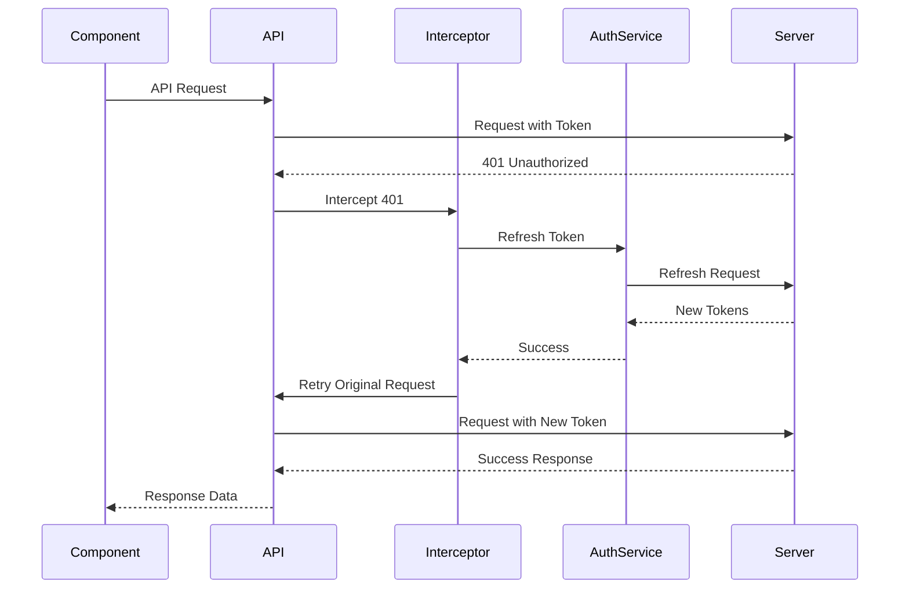

# 认证状态管理最佳实践 V3

## 版本变更日志

### V2 → V3 主要改进
- 增加类型安全的判定联合类型
- 添加并发请求和取消机制
- 完善 Token 刷新统一处理方案
- 补充安全注意事项和国际化支持
- 增加更多边界场景处理示例

### V1 → V2 关键变化
- **解决了 RequireAuth 组件卸载问题**：区分全局和本地 loading 状态
- **改进错误处理**：从抛出异常改为返回结果对象

## 核心原则

### 1. 职责分离
- **全局状态（Zustand/useAuth）**：管理用户会话、认证状态、用户信息
- **本地状态（组件）**：管理表单状态、UI 状态、临时错误、操作加载状态

#### 为什么选择 Zustand？
| 特性 | Zustand | Redux Toolkit | Jotai |
|------|---------|---------------|--------|
| 学习曲线 | ✅ 简单 | ❌ 较陡峭 | ⚠️ 中等 |
| 包体积 | ✅ 8KB | ❌ 40KB+ | ✅ 13KB |
| TypeScript | ✅ 优秀 | ✅ 优秀 | ✅ 优秀 |
| DevTools | ✅ 支持 | ✅ 内置 | ⚠️ 需插件 |
| 持久化 | ✅ 内置 | ⚠️ 需中间件 | ⚠️ 需插件 |

### 2. 错误处理策略
- **全局错误**：影响整个应用的错误（如 token 过期、未授权）
- **本地错误**：特定操作的错误（如表单验证、单次 API 调用失败）
- **重试策略**：关键操作应实现指数退避重试

### 3. Loading 状态管理
- **全局 isLoading**：仅用于影响整个应用的操作（如初始化认证、刷新 token）
- **本地 loading**：用于不影响页面结构的操作（如修改密码、更新资料）
- **避免幽灵 loading**：使用 `finally` 确保 loading 状态正确清理

## 类型定义

### 基础类型
```typescript
// types/auth.ts
export interface User {
    id: string;
    email: string;
    name: string;
    is_verified: boolean;
    created_at: string;
    updated_at: string;
}

export interface AuthState {
    user: User | null;
    isAuthenticated: boolean;
    isLoading: boolean;
    error: string | null;
}

export interface ApiError {
    detail: string;
    code?: string;
    field?: string;
}

// 使用判定联合类型实现更好的类型安全
export type Result<T = void> = 
    | { success: true; data: T }
    | { success: false; error: string; code?: string };

export type LoginResult = Result<{ user: User; access_token: string }>;
export type RegisterResult = Result<{ message: string }>;
export type OperationResult = Result;
```

## 推荐实现方案

### 1. 增强的 useAuth Hook
```typescript
// hooks/useAuth.ts
import { create } from 'zustand';
import { persist } from 'zustand/middleware';
import { authService } from '@/services/auth';
import { i18n } from '@/i18n';

interface AuthStore extends AuthState {
    // 使用 AbortController 管理请求
    abortControllers: Map<string, AbortController>;
    
    // Actions - 返回结果对象而不是抛出异常
    login: (credentials: LoginRequest) => Promise<LoginResult>;
    logout: () => Promise<OperationResult>;
    changePassword: (data: ChangePasswordRequest) => Promise<OperationResult>;
    refreshToken: () => Promise<OperationResult>;
    
    // 请求管理
    cancelRequest: (key: string) => void;
    cancelAllRequests: () => void;
}

export const useAuthStore = create<AuthStore>()(
    persist(
        (set, get) => ({
            // Initial state
            user: null,
            isAuthenticated: false,
            isLoading: false,
            error: null,
            abortControllers: new Map(),

            // 登录 - 设置全局 loading
            login: async (credentials) => {
                // 取消之前的登录请求
                get().cancelRequest('login');
                
                const controller = new AbortController();
                get().abortControllers.set('login', controller);
                
                set({ isLoading: true, error: null });
                
                try {
                    const response = await authService.login(credentials, {
                        signal: controller.signal
                    });
                    
                    set({
                        user: response.user,
                        isAuthenticated: true,
                        isLoading: false,
                        error: null,
                    });
                    
                    // 存储 token（推荐使用 httpOnly cookie）
                    if (response.refresh_token) {
                        await authService.storeRefreshToken(response.refresh_token);
                    }
                    
                    return { success: true, data: response };
                } catch (error: any) {
                    if (error.name === 'AbortError') {
                        return { success: false, error: 'Request cancelled' };
                    }
                    
                    const errorMessage = error?.detail || i18n.t('auth.errors.loginFailed');
                    set({
                        user: null,
                        isAuthenticated: false,
                        isLoading: false,
                        error: errorMessage,
                    });
                    
                    return { 
                        success: false, 
                        error: errorMessage,
                        code: error?.code 
                    };
                } finally {
                    get().abortControllers.delete('login');
                }
            },

            // 修改密码 - 不设置全局 loading
            changePassword: async (data) => {
                // 规则：永远不要在局部操作中设置全局 isLoading
                const controller = new AbortController();
                const requestKey = `changePassword-${Date.now()}`;
                get().abortControllers.set(requestKey, controller);
                
                try {
                    await authService.changePassword(data, {
                        signal: controller.signal
                    });
                    return { success: true, data: undefined };
                } catch (error: any) {
                    if (error.name === 'AbortError') {
                        return { success: false, error: 'Request cancelled' };
                    }
                    
                    const errorMessage = error?.detail || i18n.t('auth.errors.changePasswordFailed');
                    return { 
                        success: false, 
                        error: errorMessage,
                        code: error?.code 
                    };
                } finally {
                    get().abortControllers.delete(requestKey);
                }
            },

            // Token 刷新 - 设置全局 loading
            refreshToken: async () => {
                try {
                    await authService.refreshTokens();
                    const user = await authService.getCurrentUser();
                    
                    set({
                        user,
                        isAuthenticated: true,
                        error: null,
                    });
                    
                    return { success: true, data: undefined };
                } catch (error: any) {
                    set({
                        user: null,
                        isAuthenticated: false,
                        error: i18n.t('auth.errors.sessionExpired'),
                    });
                    
                    return { 
                        success: false, 
                        error: i18n.t('auth.errors.sessionExpired') 
                    };
                }
            },

            // 取消请求
            cancelRequest: (key: string) => {
                const controller = get().abortControllers.get(key);
                if (controller) {
                    controller.abort();
                    get().abortControllers.delete(key);
                }
            },

            cancelAllRequests: () => {
                get().abortControllers.forEach(controller => controller.abort());
                get().abortControllers.clear();
            },
        }),
        {
            name: 'auth-storage',
            // 仅持久化用户信息，不存储 token（安全考虑）
            partialize: (state) => ({
                user: state.user,
                isAuthenticated: state.isAuthenticated,
            }),
        }
    )
);
```

### 2. 组件使用方式（带并发控制）
```typescript
// pages/ChangePassword.tsx
import { useState, useRef } from 'react';
import { useAuth } from '@/hooks/useAuth';
import { Alert } from '@/components/ui/Alert';

const ChangePasswordPage = () => {
    const { changePassword } = useAuth();
    const [isLoading, setIsLoading] = useState(false);
    const [error, setError] = useState<string | null>(null);
    const requestIdRef = useRef(0);
    
    const onSubmit = async (data: ChangePasswordRequest) => {
        // 增加请求 ID 防止竞态条件
        const currentRequestId = ++requestIdRef.current;
        
        setError(null);
        setIsLoading(true);
        
        try {
            const result = await changePassword(data);
            
            // 确保是最新的请求
            if (currentRequestId !== requestIdRef.current) {
                return;
            }
            
            if (result.success) {
                // 处理成功
                navigate('/dashboard');
            } else {
                // 根据错误码显示不同消息
                const errorMessage = result.code === 'WEAK_PASSWORD' 
                    ? i18n.t('auth.errors.weakPassword')
                    : result.error;
                setError(errorMessage);
            }
        } catch (err) {
            // 处理意外错误（如网络错误）
            console.error('Unexpected error:', err);
            setError(i18n.t('common.errors.unexpected'));
        } finally {
            if (currentRequestId === requestIdRef.current) {
                setIsLoading(false);
            }
        }
    };
    
    return (
        <form onSubmit={handleSubmit(onSubmit)}>
            {error && <Alert variant="error" message={error} />}
            {/* 表单内容 */}
        </form>
    );
};
```

## Loading 状态使用指南

### 使用全局 isLoading 的场景
1. **用户登录** - 需要初始化整个应用状态
2. **用户登出** - 需要清理整个应用状态
3. **Token 刷新** - 可能影响所有 API 调用
4. **获取当前用户** - 初始化应用时需要

### 使用本地 loading 的场景
1. **修改密码** - 不影响认证状态
2. **更新个人资料** - 不影响认证状态（除非更新关键信息）
3. **重发验证邮件** - 不影响认证状态
4. **表单提交** - 局部操作
5. **表格分页/搜索** - 局部数据加载
6. **文件上传** - 独立的进度状态

### ❌ 反例：错误的全局 loading 使用
```typescript
// 错误：每个 API 调用都设置全局 loading
const fetchUserPosts = async () => {
    set({ isLoading: true }); // ❌ 不要这样做
    const posts = await api.getUserPosts();
    set({ isLoading: false });
};
```

### ✅ 正例：正确的局部 loading
```typescript
// 正确：使用组件本地状态
const [isLoadingPosts, setIsLoadingPosts] = useState(false);
const fetchUserPosts = async () => {
    setIsLoadingPosts(true); // ✅ 局部状态
    try {
        const posts = await api.getUserPosts();
        setPosts(posts);
    } finally {
        setIsLoadingPosts(false);
    }
};
```

## Token 刷新统一处理

### API 拦截器实现
```typescript
// services/api/interceptors.ts
import axios from 'axios';
import { useAuthStore } from '@/hooks/useAuth';

// Token 刷新队列，避免并发刷新
let isRefreshing = false;
let refreshSubscribers: ((token: string) => void)[] = [];

const subscribeTokenRefresh = (cb: (token: string) => void) => {
    refreshSubscribers.push(cb);
};

const onTokenRefreshed = (token: string) => {
    refreshSubscribers.forEach(cb => cb(token));
    refreshSubscribers = [];
};

// 响应拦截器
axios.interceptors.response.use(
    response => response,
    async error => {
        const originalRequest = error.config;
        
        if (error.response?.status === 401 && !originalRequest._retry) {
            if (isRefreshing) {
                // 等待 token 刷新完成
                return new Promise(resolve => {
                    subscribeTokenRefresh((token: string) => {
                        originalRequest.headers.Authorization = `Bearer ${token}`;
                        resolve(axios(originalRequest));
                    });
                });
            }
            
            originalRequest._retry = true;
            isRefreshing = true;
            
            try {
                const result = await useAuthStore.getState().refreshToken();
                
                if (result.success) {
                    const newToken = authService.getAccessToken();
                    onTokenRefreshed(newToken);
                    originalRequest.headers.Authorization = `Bearer ${newToken}`;
                    return axios(originalRequest);
                }
            } catch (refreshError) {
                // 刷新失败，跳转登录
                useAuthStore.getState().logout();
                window.location.href = '/login';
                return Promise.reject(refreshError);
            } finally {
                isRefreshing = false;
            }
        }
        
        return Promise.reject(error);
    }
);
```

### Token 刷新流程图


## RequireAuth 组件优化

### 支持 Token 刷新和多标签页同步
```typescript
// components/auth/RequireAuth.tsx
import { useEffect, useState } from 'react';
import { Navigate, useLocation } from 'react-router-dom';
import { useAuth } from '@/hooks/useAuth';
import { BroadcastChannel } from 'broadcast-channel';

interface RequireAuthProps {
    children: React.ReactNode;
    requireVerified?: boolean;
}

const authChannel = new BroadcastChannel('auth-sync');

const RequireAuth: React.FC<RequireAuthProps> = ({
    children,
    requireVerified = false
}) => {
    const { user, isAuthenticated, isLoading, refreshToken } = useAuth();
    const location = useLocation();
    const [isInitializing, setIsInitializing] = useState(true);
    
    useEffect(() => {
        // 监听其他标签页的认证状态变化
        const handleAuthSync = async (msg: { type: string; payload?: any }) => {
            if (msg.type === 'LOGOUT') {
                // 其他标签页登出，同步状态
                window.location.href = '/login';
            } else if (msg.type === 'LOGIN') {
                // 其他标签页登录，刷新当前页面状态
                await refreshToken();
            }
        };
        
        authChannel.addEventListener('message', handleAuthSync);
        
        return () => {
            authChannel.removeEventListener('message', handleAuthSync);
        };
    }, [refreshToken]);
    
    useEffect(() => {
        // 只在组件首次挂载时考虑 isLoading
        if (!isLoading) {
            setIsInitializing(false);
        }
    }, [isLoading]);

    // 只在初始化时显示加载状态
    if (isInitializing && isLoading) {
        return (
            <div className="min-h-screen flex items-center justify-center">
                <div className="animate-spin rounded-full h-32 w-32 border-b-2 border-primary" />
            </div>
        );
    }

    if (!isAuthenticated || !user) {
        // 广播登出事件
        authChannel.postMessage({ type: 'LOGOUT' });
        
        return (
            <Navigate
                to="/login"
                state={{ from: location }}
                replace
            />
        );
    }

    if (requireVerified && !user.is_verified) {
        return (
            <Navigate
                to="/verify-email"
                state={{ from: location }}
                replace
            />
        );
    }

    return <>{children}</>;
};

export default RequireAuth;
```

## 安全注意事项

### 1. Token 存储方案对比
| 方案 | 安全性 | 便利性 | 推荐场景 |
|------|--------|--------|----------|
| httpOnly Cookie | ✅ 高（防 XSS） | ⚠️ 需要 CSRF 防护 | Web 应用 |
| localStorage | ❌ 低（易受 XSS） | ✅ 高 | 不推荐 |
| sessionStorage | ⚠️ 中等 | ⚠️ 中等 | 临时会话 |
| 内存 | ✅ 高 | ❌ 低（刷新丢失） | 高安全要求 |

### 2. 推荐的安全实践
```typescript
// services/auth/tokenStorage.ts
class SecureTokenStorage {
    // 使用 httpOnly cookie 存储 refresh token
    storeRefreshToken(token: string) {
        // 由后端设置 httpOnly cookie
        // Set-Cookie: refreshToken=xxx; HttpOnly; Secure; SameSite=Strict
    }
    
    // Access token 存储在内存中
    private accessToken: string | null = null;
    
    setAccessToken(token: string) {
        this.accessToken = token;
    }
    
    getAccessToken(): string | null {
        return this.accessToken;
    }
    
    clearTokens() {
        this.accessToken = null;
        // 调用后端清除 cookie
    }
}
```

## 错误处理与国际化

### 错误消息国际化
```typescript
// i18n/locales/zh-CN/auth.json
{
    "auth": {
        "errors": {
            "loginFailed": "登录失败，请检查用户名和密码",
            "sessionExpired": "会话已过期，请重新登录",
            "weakPassword": "密码强度不足",
            "networkError": "网络连接错误，请稍后重试",
            "tooManyAttempts": "尝试次数过多，请稍后再试"
        }
    }
}

// 使用示例
const errorMessage = error.code 
    ? i18n.t(`auth.errors.${error.code}`, { defaultValue: error.detail })
    : error.detail;
```

### 重试机制实现
```typescript
// utils/retry.ts
export async function retryWithBackoff<T>(
    fn: () => Promise<T>,
    options: {
        maxRetries?: number;
        initialDelay?: number;
        maxDelay?: number;
        shouldRetry?: (error: any) => boolean;
    } = {}
): Promise<T> {
    const {
        maxRetries = 3,
        initialDelay = 1000,
        maxDelay = 10000,
        shouldRetry = (error) => error.code !== 'INVALID_CREDENTIALS'
    } = options;
    
    let lastError: any;
    
    for (let i = 0; i < maxRetries; i++) {
        try {
            return await fn();
        } catch (error) {
            lastError = error;
            
            if (!shouldRetry(error) || i === maxRetries - 1) {
                throw error;
            }
            
            const delay = Math.min(initialDelay * Math.pow(2, i), maxDelay);
            await new Promise(resolve => setTimeout(resolve, delay));
        }
    }
    
    throw lastError;
}
```

## 扩展与后续优化

### TODO 列表
1. **错误边界封装**
   ```typescript
   // 创建 withAuthErrorBoundary HOC
   export const withAuthErrorBoundary = (Component: React.ComponentType) => {
       return (props: any) => (
           <AuthErrorBoundary>
               <Component {...props} />
           </AuthErrorBoundary>
       );
   };
   ```

2. **与 React Query 集成**
   ```typescript
   // 复用认证状态管理思路
   const useAuthQuery = () => {
       return useQuery({
           queryKey: ['auth', 'user'],
           queryFn: authService.getCurrentUser,
           staleTime: 5 * 60 * 1000, // 5 分钟
           retry: (failureCount, error) => {
               if (error.status === 401) return false;
               return failureCount < 3;
           }
       });
   };
   ```

3. **性能监控集成**
   ```typescript
   // 添加认证操作的性能追踪
   const trackAuthPerformance = (operation: string, duration: number) => {
       // 发送到监控服务
   };
   ```

## 文件结构示例
```
src/
├── hooks/
│   ├── useAuth.ts          # Zustand store 和 hook
│   └── useAuthQuery.ts     # React Query 集成（可选）
├── services/
│   ├── auth/
│   │   ├── index.ts        # AuthService 主文件
│   │   ├── tokenStorage.ts # Token 存储逻辑
│   │   └── interceptors.ts # API 拦截器
│   └── api/
│       └── client.ts       # Axios 实例
├── components/
│   └── auth/
│       ├── RequireAuth.tsx # 路由守卫
│       └── AuthErrorBoundary.tsx
└── types/
    └── auth.ts            # 类型定义
```

## 总结

最佳实践核心要点：
1. ✅ 返回结果对象而不是抛出异常
2. ✅ 让组件管理自己的错误状态
3. ✅ 保持全局状态只用于真正的全局数据
4. ⭐ **区分全局 loading 和本地 loading 状态**
5. ⭐ **实现请求取消和并发控制**
6. ⭐ **统一的 Token 刷新机制**
7. ⭐ **安全的 Token 存储方案**
8. ⭐ **支持国际化和错误重试**

遵循这些原则可以构建健壮、安全、用户体验良好的认证系统。