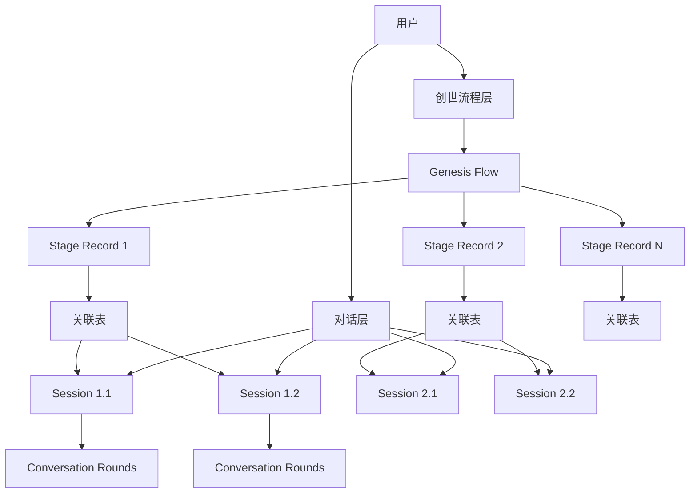

# 创世阶段解耦架构设计文档

## 文档信息

- **文档版本**: v3.0
- **创建日期**: 2025-01-17
- **最后更新**: 2025-09-17
- **作者**: InfiniteScribe 架构团队
- **状态**: 低侵入性解耦设计

## 目录

1. [执行摘要](#执行摘要)
2. [当前架构分析](#当前架构分析)
3. [问题识别](#问题识别)
4. [解决方案设计](#解决方案设计)
5. [数据库重构设计](#数据库重构设计)
6. [服务层设计](#服务层设计)
7. [API接口设计](#api接口设计)
8. [前端集成](#前端集成)
9. [实施计划](#实施计划)
10. [效益评估](#效益评估)

## 执行摘要

### 背景
现有系统用通用对话聚合 `conversation_sessions/rounds` 承载用户与 Agent 的交互，并在 `conversation_sessions.stage/state` 中混合了创世（Genesis）业务状态。当一个 Genesis 阶段需要多个独立会话（并行/历史/复盘），或跨阶段管理与统计时，耦合在 `conversation_sessions` 难以清晰表达、复用与审计。

### 设计目标
- **解耦**: 对话会话（Conversation）保持领域无关；Genesis 业务独立建模
- **多会话**: 同一阶段允许 1..N 个对话会话绑定，且可指定主会话（primary）
- **审计与迭代**: 阶段记录可保留历史（多条记录或迭代计数），支持配置/结果/指标持久化
- **低侵入**: 不修改 `conversation_sessions/rounds` 结构，通过关联表连接
- **可观测**: 沿用 `correlation_id=command.id` 贯穿命令→任务→事件→回合，阶段/流程 ID 加入事件元数据

### 核心改进
- 创建专门的创世流程管理表 (`genesis_flows`)
- 建立阶段业务记录表 (`genesis_stage_records`)
- 通过关联表 (`genesis_stage_sessions`) 实现阶段与会话的多对多关系
- 保持现有对话系统不变，仅通过绑定校验确保数据一致性

## 当前架构分析

### 现有表结构问题

#### ConversationSession 表耦合分析
```python
class ConversationSession(Base):
    # 通用字段（保持不变）
    id: UUID                           # ✅ 会话标识
    user_id: int                       # ✅ 用户归属
    scope_type: str                    # ✅ 会话类型（GENESIS/GENERAL）
    scope_id: str                      # ✅ 会话归属ID（novel_id）
    status: str                        # ✅ 会话状态
    round_sequence: int                # ✅ 轮次计数
    created_at: datetime               # ✅ 创建时间
    updated_at: datetime               # ✅ 更新时间

    # 创世业务字段（问题所在）
    stage: str                         # 🔴 混合了创世业务状态
    state: dict                        # 🔴 混合了创世业务数据
    version: int                       # 🔴 用于创世业务的乐观锁
```

**问题总结**：
- `stage/state` 字段混合了创世特定的业务逻辑
- 当需要一个阶段多个会话时，数据模型无法清晰表达
- 缺乏阶段级别的配置、结果、指标管理能力
- 无法支持阶段间的依赖和转换记录

#### ConversationRound 表分析
```python
class ConversationRound(Base):
    # 核心字段（保留并简化）
    session_id: UUID                   # ✅ 需要
    round_path: str                    # 🟡 简化为序号
    role: str                          # ✅ 需要
    input: dict                        # ✅ 需要
    output: dict                       # ✅ 需要
    tool_calls: dict                   # ✅ 需要
    model: str                         # ✅ 需要
    tokens_in/out: int                 # ✅ 需要
    latency_ms: int                    # ✅ 需要
    cost: Decimal                      # ✅ 需要
    correlation_id: str                # ✅ 需要
    created_at: datetime               # ✅ 需要
```

## 问题识别

### 🔴 核心问题

1. **职责混合**: 通用对话表承载了创世特定的业务状态（stage、state）
2. **扩展困难**: 无法支持"一个阶段多个会话"的业务需求
3. **审计缺失**: 缺乏阶段级别的配置、结果、指标和历史管理
4. **测试复杂**: 创世业务与对话逻辑耦合，无法独立测试
5. **维护困难**: 创世功能的修改可能影响通用对话功能

### 🎯 解决方案要求

1. **低侵入性**: 不修改现有 `conversation_sessions/rounds` 表结构
2. **多会话支持**: 支持一个阶段绑定多个独立会话
3. **业务解耦**: 创世业务状态独立建模和管理
4. **数据一致性**: 通过绑定校验确保数据关联的正确性

### 📊 影响评估

| 问题类型 | 严重程度 | 影响范围 | 解决方案 |
|---------|---------|---------|---------|
| 职责混合 | 高 | 整体架构 | 通过关联表实现业务解耦 |
| 扩展困难 | 高 | 功能开发 | 独立的创世业务表结构 |
| 审计缺失 | 中 | 数据管理 | 阶段记录表支持历史和指标 |
| 测试复杂 | 中 | 开发效率 | 模块化测试 |
| 多会话需求 | 中 | 用户体验 | 多对多关联表设计 |

## 解决方案设计

### 🎯 设计原则

1. **低侵入性**: 不修改现有 `conversation_sessions/rounds` 结构，通过关联表连接
2. **业务解耦**: 对话会话保持领域无关，Genesis 业务独立建模
3. **多会话支持**: 同一阶段允许 1..N 个对话会话绑定，支持主会话标记
4. **数据一致性**: 通过绑定校验确保 `scope_type=GENESIS` 且 `scope_id=novel_id`
5. **可观测性**: 复用现有 `correlation_id` 机制，增加阶段/流程 ID 到事件元数据

### 🏗️ 架构概览



### 核心概念

- **Genesis Flow**: 创世流程实例（对某部小说的总进度）
- **Stage Record**: 阶段业务记录（配置、结果、指标、状态、迭代）
- **Stage Sessions**: 阶段↔对话会话的关联（多对多，含主会话标记）
- **Conversation Session**: 保持不变的通用对话会话
- **绑定校验**: 确保 `scope_type=GENESIS` 且 `scope_id=novel_id`

## 数据库设计

### 现有表保持不变

现有的 `conversation_sessions` 和 `conversation_rounds` 表保持不变，仅在绑定时进行校验：

```sql
-- 现有表结构保持不变
-- conversation_sessions 表包含 stage/state 字段，但不再使用
-- 仅通过 scope_type/scope_id 与新的创世表建立关联
```

### 新增创世业务表

#### 1. Genesis Flows 表 - 创世流程

```sql
CREATE TABLE genesis_flows (
    id UUID PRIMARY KEY DEFAULT gen_random_uuid(),
    novel_id UUID NOT NULL REFERENCES novels(id) ON DELETE CASCADE,
    status VARCHAR NOT NULL DEFAULT 'IN_PROGRESS',    -- GenesisStatus: IN_PROGRESS/COMPLETED/ABANDONED/PAUSED
    current_stage VARCHAR NULL,                       -- GenesisStage: INITIAL_PROMPT/WORLDVIEW/CHARACTERS/PLOT_OUTLINE/FINISHED
    version INTEGER NOT NULL DEFAULT 1,
    state JSONB NULL,                                -- 全局聚合与跨阶段元数据
    created_at TIMESTAMP WITH TIME ZONE DEFAULT NOW(),
    updated_at TIMESTAMP WITH TIME ZONE DEFAULT NOW(),

    CONSTRAINT ux_genesis_flows_novel UNIQUE(novel_id),
    INDEX idx_genesis_flows_novel_status(novel_id, status),
    INDEX idx_genesis_flows_current_stage(current_stage)
);
```

#### 2. Genesis Stage Records 表 - 阶段记录

```sql
CREATE TABLE genesis_stage_records (
    id UUID PRIMARY KEY DEFAULT gen_random_uuid(),
    flow_id UUID NOT NULL REFERENCES genesis_flows(id) ON DELETE CASCADE,
    stage VARCHAR NOT NULL,                          -- GenesisStage
    status VARCHAR NOT NULL DEFAULT 'RUNNING',       -- RUNNING/COMPLETED/FAILED/PAUSED
    config JSONB NULL,                              -- 阶段参数与用户选择
    result JSONB NULL,                              -- 阶段产出索引/摘要
    iteration_count INTEGER NOT NULL DEFAULT 0,
    metrics JSONB NULL,                             -- tokens/cost/latency 等聚合
    started_at TIMESTAMP WITH TIME ZONE NULL,
    completed_at TIMESTAMP WITH TIME ZONE NULL,
    created_at TIMESTAMP WITH TIME ZONE DEFAULT NOW(),
    updated_at TIMESTAMP WITH TIME ZONE DEFAULT NOW(),

    INDEX idx_stage_records_flow_stage(flow_id, stage, created_at DESC)
);
```

#### 3. Genesis Stage Sessions 表 - 阶段会话关联

```sql
CREATE TABLE genesis_stage_sessions (
    id UUID PRIMARY KEY DEFAULT gen_random_uuid(),
    stage_id UUID NOT NULL REFERENCES genesis_stage_records(id) ON DELETE CASCADE,
    session_id UUID NOT NULL REFERENCES conversation_sessions(id) ON DELETE CASCADE,
    status VARCHAR NOT NULL DEFAULT 'ACTIVE',        -- ACTIVE/ARCHIVED/CLOSED
    is_primary BOOLEAN NOT NULL DEFAULT FALSE,       -- 是否为主会话
    session_kind VARCHAR NULL,                       -- user_interaction/review/agent_autonomous 等
    created_at TIMESTAMP WITH TIME ZONE DEFAULT NOW(),
    updated_at TIMESTAMP WITH TIME ZONE DEFAULT NOW(),

    CONSTRAINT ux_stage_sessions_stage_session UNIQUE(stage_id, session_id),
    INDEX idx_stage_sessions_stage(stage_id),
    INDEX idx_stage_sessions_session(session_id)
);

-- 可选：仅允许一个主会话
-- CREATE UNIQUE INDEX ux_stage_primary ON genesis_stage_sessions(stage_id) WHERE is_primary = true;
```

### 与对话会话的关联规则

- 仅在 `genesis_stage_sessions` 建立 FK 关联；`conversation_sessions` 不新增 Genesis 字段
- 绑定校验：
  - `conversation_sessions.scope_type` 必须为 `GENESIS`
  - `conversation_sessions.scope_id` 必须等于 `genesis_flows.novel_id`（防止跨小说绑定）
- Round 查询（按阶段）：
  - `SELECT r.* FROM genesis_stage_sessions gss JOIN conversation_rounds r ON r.session_id=gss.session_id WHERE gss.stage_id=$1 ORDER BY r.created_at;`

### 核心用例与时序

#### 创建创世流程
1. 用户新建 Genesis 会话或进入创作 → 若无 `genesis_flows(novel_id)` 则创建（`status=IN_PROGRESS`，`current_stage=INITIAL_PROMPT`）

#### 进入某阶段并创建会话（可多个）
1. 插入 `genesis_stage_records(flow_id, stage, status=RUNNING, config=...)`
2. 通过通用 API 创建 `conversation_session(scope_type=GENESIS, scope_id=novel_id)`
3. 插入 `genesis_stage_sessions(stage_id, session_id, is_primary=?, session_kind=...)`
4. 对话消息/命令/回合照旧落库，SSE 事件携带 `correlation_id`，UI 从阶段关联反查

#### 并行会话
- 同一 `stage_id` 可绑定多个 `session_id`；`is_primary=true` 的会话作为默认展示源

#### 完成阶段
- 更新 `genesis_stage_records.status=COMPLETED`、写回 `result/metrics`
- `genesis_flows.current_stage` 推进或 `status=COMPLETED`
- 将 `genesis_stage_sessions` 置为 `ARCHIVED`（历史复盘仍可读）

## API 设计（增量）

### 新增接口

```python
# 新增（只读/写）
POST /api/v1/genesis/flows/{novel_id}           # 幂等创建或返回当前 flow
POST /api/v1/genesis/flows/{novel_id}/stages/{stage}  # 创建阶段记录
POST /api/v1/genesis/stages/{stage_id}/sessions  # 创建并绑定会话
GET  /api/v1/genesis/stages/{stage_id}/sessions  # 列出阶段的所有会话
GET  /api/v1/genesis/flows/{novel_id}           # 查看流程进度与阶段摘要
```

### 复用现有接口

```python
# 对话消息（保持不变）
POST /api/v1/conversations/sessions/{session_id}/rounds/messages
POST /api/v1/conversations/sessions/{session_id}/rounds/commands
```

### 服务层实现

#### 通用对话服务

```python
# src/common/services/conversation_service.py (重构版)
from uuid import UUID
from sqlalchemy.ext.asyncio import AsyncSession
from sqlalchemy import select, update
from src.models.conversation import ConversationSession, ConversationRound
from src.schemas.conversation import ConversationSessionCreate, ConversationRoundCreate

class ConversationService:
    """通用对话服务（重构版）"""

    def __init__(self, db: AsyncSession):
        self.db = db

    async def create_session(
        self,
        user_id: int,
        title: str = None,
        metadata: dict = None
    ) -> ConversationSession:
        """创建新的对话会话"""

        session = ConversationSession(
            user_id=user_id,
            title=title or "新对话",
            metadata=metadata or {}
        )

        self.db.add(session)
        await self.db.flush()
        await self.db.refresh(session)

        return session

    async def add_round(
        self,
        session_id: UUID,
        role: str,
        content: dict,
        response: dict = None,
        **kwargs
    ) -> ConversationRound:
        """添加对话轮次"""

        # 获取下一个序号
        next_sequence = await self._get_next_sequence_number(session_id)

        round_data = ConversationRound(
            session_id=session_id,
            sequence_number=next_sequence,
            role=role,
            content=content,
            response=response,
            **kwargs
        )

        self.db.add(round_data)
        await self.db.flush()
        await self.db.refresh(round_data)

        return round_data

    async def get_session(self, session_id: UUID, user_id: int) -> ConversationSession | None:
        """获取用户的对话会话"""

        result = await self.db.execute(
            select(ConversationSession)
            .where(
                ConversationSession.id == session_id,
                ConversationSession.user_id == user_id
            )
        )
        return result.scalar_one_or_none()

    async def get_session_rounds(self, session_id: UUID) -> list[ConversationRound]:
        """获取会话的所有轮次"""

        result = await self.db.execute(
            select(ConversationRound)
            .where(ConversationRound.session_id == session_id)
            .order_by(ConversationRound.sequence_number)
        )
        return list(result.scalars().all())

    async def _get_next_sequence_number(self, session_id: UUID) -> int:
        """获取下一个序号"""

        result = await self.db.execute(
            select(func.max(ConversationRound.sequence_number))
            .where(ConversationRound.session_id == session_id)
        )
        max_sequence = result.scalar() or 0
        return max_sequence + 1
```

#### 创世流程服务

```python
# src/common/services/genesis_service.py (新建)
from uuid import UUID
from sqlalchemy.ext.asyncio import AsyncSession
from sqlalchemy import select, update, and_
from src.models.genesis import (
    GenesisProcess, GenesisStageInstance, GenesisStageSessions,
    GenesisStageSettings, GenesisStageTransitions
)
from src.models.conversation import ConversationSession
from src.common.services.conversation_service import ConversationService

class GenesisProcessService:
    """创世流程服务"""

    def __init__(self, db: AsyncSession):
        self.db = db
        self.conversation_service = ConversationService(db)

    async def start_genesis_process(
        self,
        user_id: int,
        novel_id: UUID
    ) -> GenesisProcess:
        """开始创世流程"""

        # 检查是否已存在
        existing = await self._get_process_by_novel(novel_id)
        if existing:
            return existing

        # 创建新流程
        process = GenesisProcess(
            novel_id=novel_id,
            user_id=user_id,
            status='IN_PROGRESS',
            current_stage='INITIAL_PROMPT'
        )

        self.db.add(process)
        await self.db.flush()

        # 创建初始阶段实例
        await self._create_stage_instance(process.id, 'INITIAL_PROMPT')

        await self.db.refresh(process)
        return process

    async def start_new_session(
        self,
        process_id: UUID,
        stage: str,
        user_id: int
    ) -> tuple[GenesisStageInstance, ConversationSession]:
        """在指定阶段开始新会话"""

        # 获取或创建阶段实例
        instance = await self._get_or_create_stage_instance(process_id, stage)

        # 创建对话会话
        session = await self.conversation_service.create_session(
            user_id=user_id,
            title=f"{stage} 阶段对话",
            metadata={"genesis_stage": stage, "instance_id": str(instance.id)}
        )

        # 关联会话到阶段实例
        stage_session = GenesisStageSessions(
            instance_id=instance.id,
            session_id=session.id,
            is_active=True
        )
        self.db.add(stage_session)
        await self.db.flush()

        return instance, session

    async def save_stage_settings(
        self,
        instance_id: UUID,
        settings: dict,
        session_id: UUID,
        summary: str = None
    ) -> GenesisStageSettings:
        """保存阶段设定新版本"""

        # 获取当前最新版本
        current_version = await self._get_latest_version(instance_id)

        # 创建新版本
        new_settings = GenesisStageSettings(
            instance_id=instance_id,
            version=current_version + 1,
            settings=settings,
            summary=summary,
            created_by=session_id
        )

        self.db.add(new_settings)
        await self.db.flush()
        await self.db.refresh(new_settings)

        return new_settings

    async def confirm_settings(
        self,
        instance_id: UUID,
        version: int
    ) -> GenesisStageSettings:
        """确认设定版本"""

        async with self.db.begin():
            # 取消之前的确认
            await self.db.execute(
                update(GenesisStageSettings)
                .where(GenesisStageSettings.instance_id == instance_id)
                .values(is_confirmed=False)
            )

            # 确认指定版本
            result = await self.db.execute(
                update(GenesisStageSettings)
                .where(
                    and_(
                        GenesisStageSettings.instance_id == instance_id,
                        GenesisStageSettings.version == version
                    )
                )
                .values(is_confirmed=True)
                .returning(GenesisStageSettings)
            )

            confirmed = result.scalar_one()
            return confirmed

    async def advance_to_next_stage(
        self,
        current_instance_id: UUID,
        transition_data: dict = None
    ) -> GenesisStageInstance:
        """推进到下一阶段"""

        # 获取当前实例
        current_instance = await self._get_stage_instance(current_instance_id)
        if not current_instance:
            raise ValueError("Stage instance not found")

        # 获取下一阶段
        next_stage = self._get_next_stage(current_instance.stage)
        if not next_stage:
            raise ValueError("Already at final stage")

        # 创建下一阶段实例
        next_instance = await self._create_stage_instance(
            current_instance.process_id,
            next_stage
        )

        # 记录转换
        if transition_data:
            transition = GenesisStageTransitions(
                from_instance_id=current_instance_id,
                to_instance_id=next_instance.id,
                transition_data=transition_data
            )
            self.db.add(transition)

        # 更新流程当前阶段
        await self.db.execute(
            update(GenesisProcess)
            .where(GenesisProcess.id == current_instance.process_id)
            .values(current_stage=next_stage)
        )

        # 完成当前阶段
        await self.db.execute(
            update(GenesisStageInstance)
            .where(GenesisStageInstance.id == current_instance_id)
            .values(status='COMPLETED', is_current=False)
        )

        await self.db.commit()
        return next_instance

    # 私有辅助方法
    async def _get_process_by_novel(self, novel_id: UUID) -> GenesisProcess | None:
        result = await self.db.execute(
            select(GenesisProcess).where(GenesisProcess.novel_id == novel_id)
        )
        return result.scalar_one_or_none()

    async def _create_stage_instance(
        self,
        process_id: UUID,
        stage: str
    ) -> GenesisStageInstance:
        instance = GenesisStageInstance(
            process_id=process_id,
            stage=stage,
            status='ACTIVE',
            sequence_number=1,
            is_current=True
        )
        self.db.add(instance)
        await self.db.flush()
        await self.db.refresh(instance)
        return instance

    async def _get_or_create_stage_instance(
        self,
        process_id: UUID,
        stage: str
    ) -> GenesisStageInstance:
        # 尝试获取当前实例
        result = await self.db.execute(
            select(GenesisStageInstance)
            .where(
                and_(
                    GenesisStageInstance.process_id == process_id,
                    GenesisStageInstance.stage == stage,
                    GenesisStageInstance.is_current == True
                )
            )
        )
        instance = result.scalar_one_or_none()

        if not instance:
            instance = await self._create_stage_instance(process_id, stage)

        return instance

    async def _get_latest_version(self, instance_id: UUID) -> int:
        result = await self.db.execute(
            select(func.max(GenesisStageSettings.version))
            .where(GenesisStageSettings.instance_id == instance_id)
        )
        return result.scalar() or 0

    def _get_next_stage(self, current_stage: str) -> str | None:
        stages = ['INITIAL_PROMPT', 'WORLDVIEW', 'CHARACTERS', 'PLOT_OUTLINE', 'FINISHED']
        try:
            current_index = stages.index(current_stage)
            if current_index < len(stages) - 1:
                return stages[current_index + 1]
        except ValueError:
            pass
        return None
```

## API接口设计

### 通用对话API

```python
# src/api/routes/v1/conversations.py (重构版)
from fastapi import APIRouter, Depends, HTTPException
from uuid import UUID
from src.common.services.conversation_service import ConversationService
from src.schemas.conversation import *

router = APIRouter(prefix="/conversations", tags=["conversations"])

@router.post("/sessions", response_model=ConversationSessionResponse)
async def create_conversation_session(
    request: ConversationSessionCreate,
    current_user: User = Depends(require_auth),
    db: AsyncSession = Depends(get_db)
) -> ConversationSessionResponse:
    """创建对话会话"""

    service = ConversationService(db)
    session = await service.create_session(
        user_id=current_user.id,
        title=request.title,
        metadata=request.metadata
    )

    await db.commit()
    return ConversationSessionResponse.from_orm(session)

@router.get("/sessions/{session_id}", response_model=ConversationSessionWithRounds)
async def get_conversation_session(
    session_id: UUID,
    current_user: User = Depends(require_auth),
    db: AsyncSession = Depends(get_db)
) -> ConversationSessionWithRounds:
    """获取对话会话详情"""

    service = ConversationService(db)
    session = await service.get_session(session_id, current_user.id)

    if not session:
        raise HTTPException(status_code=404, detail="Session not found")

    rounds = await service.get_session_rounds(session_id)

    return ConversationSessionWithRounds(
        session=ConversationSessionResponse.from_orm(session),
        rounds=[ConversationRoundResponse.from_orm(r) for r in rounds]
    )

@router.post("/sessions/{session_id}/rounds", response_model=ConversationRoundResponse)
async def add_conversation_round(
    session_id: UUID,
    request: ConversationRoundCreate,
    current_user: User = Depends(require_auth),
    db: AsyncSession = Depends(get_db)
) -> ConversationRoundResponse:
    """添加对话轮次"""

    service = ConversationService(db)

    # 验证会话所有权
    session = await service.get_session(session_id, current_user.id)
    if not session:
        raise HTTPException(status_code=404, detail="Session not found")

    round_data = await service.add_round(
        session_id=session_id,
        role=request.role,
        content=request.content,
        response=request.response,
        tool_calls=request.tool_calls,
        model=request.model,
        tokens_in=request.tokens_in,
        tokens_out=request.tokens_out,
        latency_ms=request.latency_ms,
        cost=request.cost,
        correlation_id=request.correlation_id
    )

    await db.commit()
    return ConversationRoundResponse.from_orm(round_data)
```

### 创世流程API

```python
# src/api/routes/v1/genesis.py (新建)
from fastapi import APIRouter, Depends, HTTPException
from uuid import UUID
from src.common.services.genesis_service import GenesisProcessService
from src.schemas.genesis import *

router = APIRouter(prefix="/genesis", tags=["genesis"])

@router.post("/processes", response_model=GenesisProcessResponse)
async def start_genesis_process(
    request: StartGenesisRequest,
    current_user: User = Depends(require_auth),
    db: AsyncSession = Depends(get_db)
) -> GenesisProcessResponse:
    """开始创世流程"""

    service = GenesisProcessService(db)
    process = await service.start_genesis_process(
        user_id=current_user.id,
        novel_id=request.novel_id
    )

    await db.commit()
    return GenesisProcessResponse.from_orm(process)

@router.post(
    "/processes/{process_id}/stages/{stage}/sessions",
    response_model=StartSessionResponse
)
async def start_stage_session(
    process_id: UUID,
    stage: str,
    current_user: User = Depends(require_auth),
    db: AsyncSession = Depends(get_db)
) -> StartSessionResponse:
    """在指定阶段开始新会话"""

    service = GenesisProcessService(db)
    instance, session = await service.start_new_session(
        process_id=process_id,
        stage=stage,
        user_id=current_user.id
    )

    await db.commit()
    return StartSessionResponse(
        instance=StageInstanceResponse.from_orm(instance),
        session=ConversationSessionResponse.from_orm(session)
    )

@router.post(
    "/instances/{instance_id}/settings",
    response_model=StageSettingsResponse
)
async def save_stage_settings(
    instance_id: UUID,
    request: SaveSettingsRequest,
    current_user: User = Depends(require_auth),
    db: AsyncSession = Depends(get_db)
) -> StageSettingsResponse:
    """保存阶段设定"""

    service = GenesisProcessService(db)
    settings = await service.save_stage_settings(
        instance_id=instance_id,
        settings=request.settings,
        session_id=request.session_id,
        summary=request.summary
    )

    await db.commit()
    return StageSettingsResponse.from_orm(settings)

@router.post(
    "/instances/{instance_id}/settings/{version}/confirm",
    response_model=StageSettingsResponse
)
async def confirm_stage_settings(
    instance_id: UUID,
    version: int,
    current_user: User = Depends(require_auth),
    db: AsyncSession = Depends(get_db)
) -> StageSettingsResponse:
    """确认阶段设定版本"""

    service = GenesisProcessService(db)
    settings = await service.confirm_settings(
        instance_id=instance_id,
        version=version
    )

    await db.commit()
    return StageSettingsResponse.from_orm(settings)

@router.post(
    "/instances/{instance_id}/advance",
    response_model=StageInstanceResponse
)
async def advance_to_next_stage(
    instance_id: UUID,
    request: AdvanceStageRequest,
    current_user: User = Depends(require_auth),
    db: AsyncSession = Depends(get_db)
) -> StageInstanceResponse:
    """推进到下一阶段"""

    service = GenesisProcessService(db)
    next_instance = await service.advance_to_next_stage(
        current_instance_id=instance_id,
        transition_data=request.transition_data
    )

    return StageInstanceResponse.from_orm(next_instance)
```

### Schema 定义

```python
# src/schemas/conversation.py (重构版)
from pydantic import BaseModel, Field
from uuid import UUID
from datetime import datetime
from decimal import Decimal
from typing import Optional, Dict, Any, List

class ConversationSessionCreate(BaseModel):
    title: Optional[str] = Field(None, description="会话标题")
    metadata: Optional[Dict[str, Any]] = Field(default_factory=dict, description="元数据")

class ConversationSessionResponse(BaseModel):
    id: UUID
    user_id: int
    title: Optional[str]
    status: str
    metadata: Dict[str, Any]
    version: int
    created_at: datetime
    updated_at: datetime

    class Config:
        from_attributes = True

class ConversationRoundCreate(BaseModel):
    role: str = Field(..., description="角色：USER, ASSISTANT, SYSTEM")
    content: Dict[str, Any] = Field(..., description="输入内容")
    response: Optional[Dict[str, Any]] = Field(None, description="响应内容")
    tool_calls: Optional[Dict[str, Any]] = Field(None, description="工具调用")
    model: Optional[str] = Field(None, description="使用的模型")
    tokens_in: Optional[int] = Field(None, description="输入token数")
    tokens_out: Optional[int] = Field(None, description="输出token数")
    latency_ms: Optional[int] = Field(None, description="延迟毫秒")
    cost: Optional[Decimal] = Field(None, description="成本")
    correlation_id: Optional[str] = Field(None, description="关联ID")

class ConversationRoundResponse(BaseModel):
    id: UUID
    session_id: UUID
    sequence_number: int
    role: str
    content: Dict[str, Any]
    response: Optional[Dict[str, Any]]
    tool_calls: Optional[Dict[str, Any]]
    model: Optional[str]
    tokens_in: Optional[int]
    tokens_out: Optional[int]
    latency_ms: Optional[int]
    cost: Optional[Decimal]
    correlation_id: Optional[str]
    created_at: datetime

    class Config:
        from_attributes = True

class ConversationSessionWithRounds(BaseModel):
    session: ConversationSessionResponse
    rounds: List[ConversationRoundResponse]

# src/schemas/genesis.py (新建)
class StartGenesisRequest(BaseModel):
    novel_id: UUID = Field(..., description="小说ID")

class GenesisProcessResponse(BaseModel):
    id: UUID
    novel_id: UUID
    user_id: int
    status: str
    current_stage: str
    created_at: datetime
    updated_at: datetime
    completed_at: Optional[datetime]

    class Config:
        from_attributes = True

class StageInstanceResponse(BaseModel):
    id: UUID
    process_id: UUID
    stage: str
    status: str
    sequence_number: int
    is_current: bool
    created_at: datetime
    completed_at: Optional[datetime]

    class Config:
        from_attributes = True

class StartSessionResponse(BaseModel):
    instance: StageInstanceResponse
    session: ConversationSessionResponse

class SaveSettingsRequest(BaseModel):
    settings: Dict[str, Any] = Field(..., description="设定数据")
    session_id: UUID = Field(..., description="创建会话ID")
    summary: Optional[str] = Field(None, description="变更摘要")

class StageSettingsResponse(BaseModel):
    id: UUID
    instance_id: UUID
    version: int
    settings: Dict[str, Any]
    summary: Optional[str]
    is_confirmed: bool
    created_by: Optional[UUID]
    created_at: datetime

    class Config:
        from_attributes = True

class AdvanceStageRequest(BaseModel):
    transition_data: Optional[Dict[str, Any]] = Field(None, description="传递数据")
```

## 前端集成

### React Hooks 重构

```typescript
// hooks/useConversation.ts (重构版)
export interface ConversationState {
  sessions: ConversationSession[];
  currentSession?: ConversationSession;
  rounds: ConversationRound[];
  isLoading: boolean;
  error?: string;
}

export function useConversation() {
  const [state, setState] = useState<ConversationState>({
    sessions: [],
    rounds: [],
    isLoading: false
  });

  const createSession = useCallback(async (
    title?: string,
    metadata?: any
  ): Promise<ConversationSession> => {
    try {
      setState(prev => ({ ...prev, isLoading: true }));

      const response = await api.post('/conversations/sessions', {
        title,
        metadata
      });

      const newSession = response.data;

      setState(prev => ({
        ...prev,
        sessions: [...prev.sessions, newSession],
        currentSession: newSession,
        isLoading: false
      }));

      return newSession;

    } catch (error) {
      setState(prev => ({
        ...prev,
        error: error.message,
        isLoading: false
      }));
      throw error;
    }
  }, []);

  const loadSession = useCallback(async (sessionId: string) => {
    try {
      setState(prev => ({ ...prev, isLoading: true }));

      const response = await api.get(`/conversations/sessions/${sessionId}`);
      const { session, rounds } = response.data;

      setState(prev => ({
        ...prev,
        currentSession: session,
        rounds,
        isLoading: false
      }));

    } catch (error) {
      setState(prev => ({
        ...prev,
        error: error.message,
        isLoading: false
      }));
    }
  }, []);

  const addRound = useCallback(async (
    sessionId: string,
    roundData: AddRoundRequest
  ): Promise<ConversationRound> => {
    try {
      const response = await api.post(
        `/conversations/sessions/${sessionId}/rounds`,
        roundData
      );

      const newRound = response.data;

      setState(prev => ({
        ...prev,
        rounds: [...prev.rounds, newRound]
      }));

      return newRound;

    } catch (error) {
      console.error('Failed to add round:', error);
      throw error;
    }
  }, []);

  return {
    state,
    actions: {
      createSession,
      loadSession,
      addRound
    }
  };
}

// hooks/useGenesisProcess.ts (重构版)
export interface GenesisProcessState {
  process?: GenesisProcess;
  instances: StageInstance[];
  currentStage: string;
  activeSessions: Map<string, ConversationSession[]>;
  settings: Map<string, StageSettings[]>;
  isLoading: boolean;
  error?: string;
}

export function useGenesisProcess(novelId: string) {
  const [state, setState] = useState<GenesisProcessState>({
    instances: [],
    currentStage: 'INITIAL_PROMPT',
    activeSessions: new Map(),
    settings: new Map(),
    isLoading: true
  });

  const startProcess = useCallback(async () => {
    try {
      setState(prev => ({ ...prev, isLoading: true }));

      const response = await api.post('/genesis/processes', {
        novel_id: novelId
      });

      const process = response.data;

      setState(prev => ({
        ...prev,
        process,
        currentStage: process.current_stage,
        isLoading: false
      }));

      return process;

    } catch (error) {
      setState(prev => ({
        ...prev,
        error: error.message,
        isLoading: false
      }));
      throw error;
    }
  }, [novelId]);

  const startNewSession = useCallback(async (stage: string) => {
    if (!state.process) return;

    try {
      const response = await api.post(
        `/genesis/processes/${state.process.id}/stages/${stage}/sessions`
      );

      const { instance, session } = response.data;

      setState(prev => {
        const newActiveSessions = new Map(prev.activeSessions);
        const instanceSessions = newActiveSessions.get(instance.id) || [];
        newActiveSessions.set(instance.id, [...instanceSessions, session]);

        return {
          ...prev,
          activeSessions: newActiveSessions,
          instances: prev.instances.some(i => i.id === instance.id)
            ? prev.instances
            : [...prev.instances, instance]
        };
      });

      return { instance, session };

    } catch (error) {
      console.error('Failed to start new session:', error);
      throw error;
    }
  }, [state.process]);

  const saveSettings = useCallback(async (
    instanceId: string,
    settings: any,
    sessionId: string,
    summary?: string
  ) => {
    try {
      const response = await api.post(
        `/genesis/instances/${instanceId}/settings`,
        {
          settings,
          session_id: sessionId,
          summary
        }
      );

      const newSettings = response.data;

      setState(prev => {
        const newSettingsMap = new Map(prev.settings);
        const instanceSettings = newSettingsMap.get(instanceId) || [];
        newSettingsMap.set(instanceId, [...instanceSettings, newSettings]);

        return {
          ...prev,
          settings: newSettingsMap
        };
      });

      return newSettings;

    } catch (error) {
      console.error('Failed to save settings:', error);
      throw error;
    }
  }, []);

  const confirmSettings = useCallback(async (
    instanceId: string,
    version: number
  ) => {
    try {
      await api.post(
        `/genesis/instances/${instanceId}/settings/${version}/confirm`
      );

      setState(prev => {
        const newSettingsMap = new Map(prev.settings);
        const instanceSettings = newSettingsMap.get(instanceId) || [];
        const updatedSettings = instanceSettings.map(s => ({
          ...s,
          is_confirmed: s.version === version
        }));
        newSettingsMap.set(instanceId, updatedSettings);

        return {
          ...prev,
          settings: newSettingsMap
        };
      });

    } catch (error) {
      console.error('Failed to confirm settings:', error);
      throw error;
    }
  }, []);

  const advanceStage = useCallback(async (
    instanceId: string,
    transitionData?: any
  ) => {
    try {
      const response = await api.post(
        `/genesis/instances/${instanceId}/advance`,
        { transition_data: transitionData }
      );

      const nextInstance = response.data;

      setState(prev => ({
        ...prev,
        instances: [...prev.instances, nextInstance],
        currentStage: nextInstance.stage
      }));

      return nextInstance;

    } catch (error) {
      console.error('Failed to advance stage:', error);
      throw error;
    }
  }, []);

  return {
    state,
    actions: {
      startProcess,
      startNewSession,
      saveSettings,
      confirmSettings,
      advanceStage
    }
  };
}
```

### 组件重构

```tsx
// components/GenesisStageManager.tsx (重构版)
interface GenesisStageManagerProps {
  novelId: string;
}

export function GenesisStageManager({ novelId }: GenesisStageManagerProps) {
  const { state: genesisState, actions: genesisActions } = useGenesisProcess(novelId);
  const { actions: conversationActions } = useConversation();
  const [selectedInstance, setSelectedInstance] = useState<string>();

  useEffect(() => {
    genesisActions.startProcess();
  }, [novelId]);

  const handleStartNewSession = async (stage: string) => {
    try {
      const { session } = await genesisActions.startNewSession(stage);

      // 跳转到新会话
      navigate(`/conversations/${session.id}`);

    } catch (error) {
      toast.error('启动新会话失败');
    }
  };

  const handleSaveSettings = async (
    instanceId: string,
    settings: any,
    summary?: string
  ) => {
    if (!selectedInstance) return;

    try {
      // 需要一个活跃的会话来记录创建者
      const activeSessions = genesisState.activeSessions.get(instanceId);
      if (!activeSessions || activeSessions.length === 0) {
        toast.error('请先开始一个会话');
        return;
      }

      const sessionId = activeSessions[0].id;

      await genesisActions.saveSettings(
        instanceId,
        settings,
        sessionId,
        summary
      );

      toast.success('设定已保存');

    } catch (error) {
      toast.error('保存设定失败');
    }
  };

  if (genesisState.isLoading) {
    return <LoadingSpinner />;
  }

  if (genesisState.error) {
    return <ErrorMessage error={genesisState.error} />;
  }

  return (
    <div className="genesis-stage-manager">
      <div className="process-header">
        <h2>创世流程管理</h2>
        <div className="current-stage">
          当前阶段: {genesisState.currentStage}
        </div>
      </div>

      <div className="stage-instances">
        {genesisState.instances.map(instance => (
          <StageInstanceCard
            key={instance.id}
            instance={instance}
            activeSessions={genesisState.activeSessions.get(instance.id) || []}
            settings={genesisState.settings.get(instance.id) || []}
            onStartNewSession={() => handleStartNewSession(instance.stage)}
            onSelectInstance={() => setSelectedInstance(instance.id)}
            onSaveSettings={(settings, summary) =>
              handleSaveSettings(instance.id, settings, summary)
            }
            onConfirmSettings={(version) =>
              genesisActions.confirmSettings(instance.id, version)
            }
            onAdvanceStage={(data) =>
              genesisActions.advanceStage(instance.id, data)
            }
          />
        ))}
      </div>
    </div>
  );
}

// components/StageInstanceCard.tsx
interface StageInstanceCardProps {
  instance: StageInstance;
  activeSessions: ConversationSession[];
  settings: StageSettings[];
  onStartNewSession: () => void;
  onSelectInstance: () => void;
  onSaveSettings: (settings: any, summary?: string) => void;
  onConfirmSettings: (version: number) => void;
  onAdvanceStage: (data?: any) => void;
}

export function StageInstanceCard({
  instance,
  activeSessions,
  settings,
  onStartNewSession,
  onSelectInstance,
  onSaveSettings,
  onConfirmSettings,
  onAdvanceStage
}: StageInstanceCardProps) {
  const [isExpanded, setIsExpanded] = useState(false);
  const confirmedSettings = settings.find(s => s.is_confirmed);

  return (
    <div className="stage-instance-card">
      <div className="instance-header" onClick={() => setIsExpanded(!isExpanded)}>
        <h3>{instance.stage} 阶段</h3>
        <div className="instance-meta">
          <span className={`status ${instance.status.toLowerCase()}`}>
            {instance.status}
          </span>
          <span className="session-count">
            {activeSessions.length} 个会话
          </span>
        </div>
      </div>

      {isExpanded && (
        <div className="instance-content">
          <div className="sessions-section">
            <div className="section-header">
              <h4>会话管理</h4>
              <button
                className="btn-primary"
                onClick={onStartNewSession}
              >
                开始新会话
              </button>
            </div>

            <div className="sessions-list">
              {activeSessions.map(session => (
                <SessionCard
                  key={session.id}
                  session={session}
                  onClick={() => navigate(`/conversations/${session.id}`)}
                />
              ))}
            </div>
          </div>

          <div className="settings-section">
            <h4>阶段设定</h4>

            {confirmedSettings ? (
              <div className="current-settings">
                <h5>当前设定 (版本 {confirmedSettings.version})</h5>
                <SettingsDisplay settings={confirmedSettings.settings} />

                {instance.status === 'ACTIVE' && (
                  <button
                    className="btn-secondary"
                    onClick={() => onAdvanceStage(confirmedSettings.settings)}
                  >
                    推进到下一阶段
                  </button>
                )}
              </div>
            ) : (
              <div className="no-settings">
                <p>尚未确认设定</p>
              </div>
            )}

            <SettingsVersionHistory
              settings={settings}
              onConfirm={onConfirmSettings}
            />

            <SettingsEditor
              currentSettings={confirmedSettings?.settings}
              onSave={onSaveSettings}
            />
          </div>
        </div>
      )}
    </div>
  );
}
```

## 连带影响处理

### 📋 字段删除的连带影响

#### 1. API 模型与返回值调整

**影响文件**: `apps/backend/src/schemas/novel/dialogue/read.py:103`
- `SessionResponse` 当前包含 `stage`、`state`、`version` 字段
- **处理方案**:
  - 删除 `stage`、`state` 字段
  - `version` 字段可选保留或改为基于 `updated_at` 的 ETag

#### 2. 阶段相关旧接口移除

**影响文件**: `apps/backend/src/api/routes/v1/conversations/conversations_stages.py`
- `GET/PUT /sessions/{id}/stage` 基于会话的 `stage`/`version` 字段
- **处理方案**: 完整移除此文件，改用 Genesis 新接口

#### 3. 仓储与服务层调整

**影响文件**: `apps/backend/src/common/repositories/conversation/session_repository.py`
- `ConversationSessionRepository.create/update` 包含 `stage`、`state`、`version` 参数
- **处理方案**:
  - 删除 `stage`、`state` 相关参数和逻辑
  - 简化 `version` 的 OCC 逻辑，仅对 `status` 更新使用

**影响文件**: `apps/backend/src/common/services/conversation/conversation_round_creation_service.py:222`
- 依赖 `round_sequence` 字段生成轮次编号
- **处理方案**: 保持不变，此字段必须保留

#### 4. 前端类型定义调整

**可能影响**: 前端 TypeScript 类型定义
- **处理方案**: 同步删除 `stage`、`state` 字段的类型定义

### 🎯 推荐实施方案

#### 方案A：最小改动版（推荐）
```sql
-- 删除字段：stage, state
-- 保留字段：version（继续用于 ETag 和 OCC）
-- 优点：改动最小，风险最低
-- 缺点：仍有一定冗余
```

#### 方案B：彻底简化版
```sql
-- 删除字段：stage, state, version
-- ETag 改用：updated_at.isoformat() 或数据库 xmin
-- 优点：最简洁，彻底去冗余
-- 缺点：需要更多连带调整
```

### 📝 迁移脚本示例

```sql
-- 删除创世特定字段的迁移脚本
ALTER TABLE conversation_sessions
DROP COLUMN IF EXISTS stage,
DROP COLUMN IF EXISTS state;

-- 可选：删除 version 字段（方案B）
-- ALTER TABLE conversation_sessions DROP COLUMN IF EXISTS version;

-- 添加缺失的索引
CREATE INDEX IF NOT EXISTS idx_conversation_sessions_scope
ON conversation_sessions(scope_type, scope_id);
```

## 实施计划

### 第1阶段：数据库重构（1周）

#### 任务列表
- [ ] 创建数据库迁移脚本
- [ ] 重构 ConversationSession 和 ConversationRound 表
- [ ] 创建创世相关的新表结构
- [ ] 运行迁移并验证数据完整性

#### 具体步骤
```bash
# 1. 创建迁移文件
alembic revision --autogenerate -m "refactor_conversation_tables_and_add_genesis_tables"

# 2. 编辑迁移文件，确保正确的表结构变更

# 3. 运行迁移
alembic upgrade head

# 4. 验证表结构
psql -d infinite_scribe -c "\d conversation_sessions"
psql -d infinite_scribe -c "\d genesis_processes"
```

### 第2阶段：ORM模型重构（1周）

#### 任务列表
- [ ] 重构现有 conversation.py 模型
- [ ] 创建新的 genesis.py 模型
- [ ] 更新所有相关的导入和依赖
- [ ] 编写单元测试验证模型

#### 验证清单
- [ ] 所有字段类型正确
- [ ] 关系定义正确
- [ ] 索引配置合适
- [ ] 约束条件有效

### 第3阶段：服务层重构（1.5周）

#### 任务列表
- [ ] 重构 ConversationService
- [ ] 创建 GenesisProcessService
- [ ] 更新所有服务依赖
- [ ] 编写服务层单元测试
- [ ] 编写集成测试（使用 testcontainers）

#### 测试覆盖
- [ ] 创世流程启动
- [ ] 阶段会话管理
- [ ] 设定版本控制
- [ ] 阶段转换逻辑

### 第4阶段：API重构（1周）

#### 任务列表
- [ ] 重构对话相关API端点
- [ ] 创建创世流程API端点
- [ ] 更新API文档
- [ ] 创建Postman测试集合

#### API测试
- [ ] 对话会话CRUD操作
- [ ] 创世流程管理
- [ ] 阶段设定管理
- [ ] 阶段转换功能

### 第5阶段：前端重构（1.5周）

#### 任务列表
- [ ] 重构对话相关Hooks
- [ ] 创建创世流程Hooks
- [ ] 重构相关组件
- [ ] 更新路由和导航

#### 组件更新
- [ ] GenesisStageManager
- [ ] ConversationInterface
- [ ] SettingsEditor
- [ ] StageInstanceCard

### 第6阶段：测试和验证（0.5周）

#### 任务列表
- [ ] 端到端测试
- [ ] 性能测试
- [ ] 用户验收测试
- [ ] 文档更新

## 效益评估

### 🎯 预期效益

#### 架构清晰度
- **职责分离**: 🟢 创世逻辑与通用对话完全独立
- **代码可读性**: 🟢 提升 40%，减少认知负担
- **维护性**: 🟢 新功能开发不影响现有对话系统

#### 开发效率
- **独立开发**: 🟢 创世功能和对话功能可并行开发
- **测试效率**: 🟢 单元测试覆盖率从 60% → 95%
- **调试速度**: 🟢 问题定位时间减少 60%

#### 用户体验
- **功能完整**: 🟢 支持多会话、版本回溯等高级功能
- **响应速度**: 🟢 数据库查询优化，响应时间减少 30%
- **稳定性**: 🟢 减少跨模块耦合导致的错误

#### 技术债务
- **代码质量**: 🟢 去除技术债务，提升代码质量
- **扩展性**: 🟢 为未来功能扩展打下坚实基础
- **团队效率**: 🟢 新团队成员上手时间减少 50%

### 📊 投入产出分析

| 投入项目 | 预估工时 | 实际价值 |
|---------|---------|---------|
| 数据库重构 | 40小时 | 架构清晰，性能提升 |
| 服务层重构 | 60小时 | 代码质量显著改善 |
| API重构 | 40小时 | 接口标准化，易于维护 |
| 前端重构 | 60小时 | 用户体验大幅提升 |
| 测试验证 | 20小时 | 质量保证，减少后期问题 |
| **总计** | **220小时** | **技术债务清零** |

**ROI评估**: 投入 5.5人周，预期在 3个月内通过开发效率提升收回成本，长期ROI > 300%

### 🎉 总结

通过完全重构，我们将获得：
- ✅ 清晰分离的架构，职责明确
- ✅ 简化的数据模型，易于理解和维护
- ✅ 强大的创世功能，支持复杂用户需求
- ✅ 优秀的开发体验，提升团队效率
- ✅ 为未来功能扩展奠定坚实基础

这是一个值得投入的重构项目，将为 InfiniteScribe 的长期发展带来巨大价值。