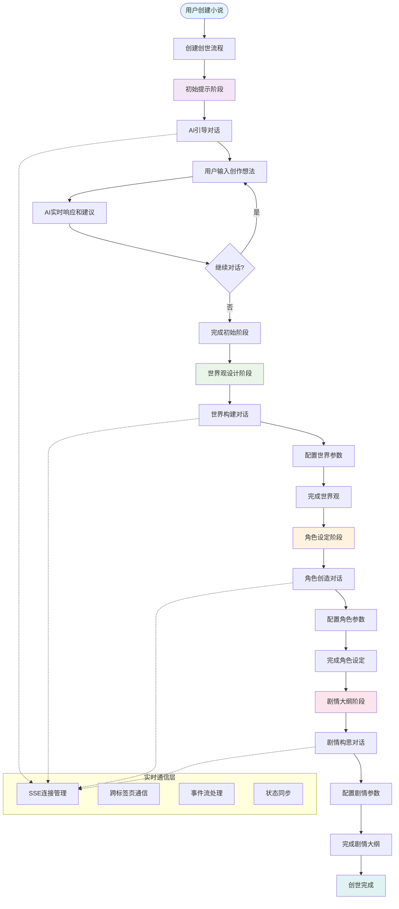
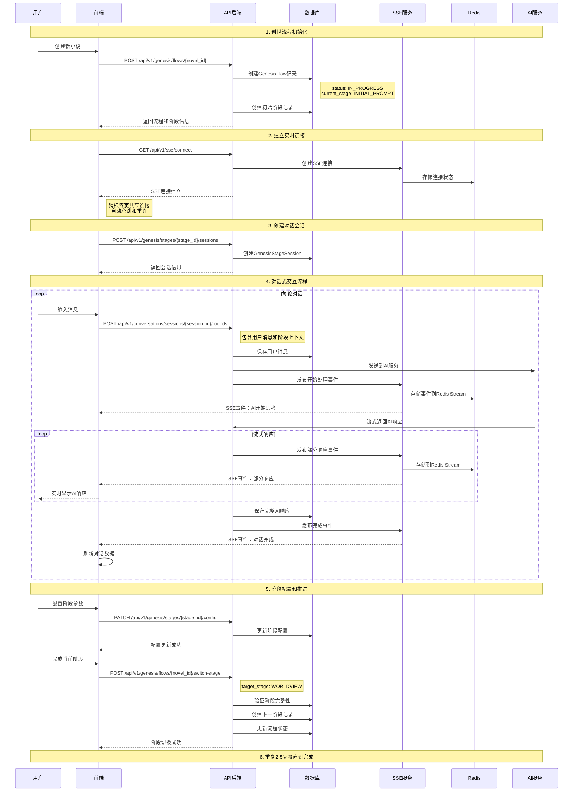
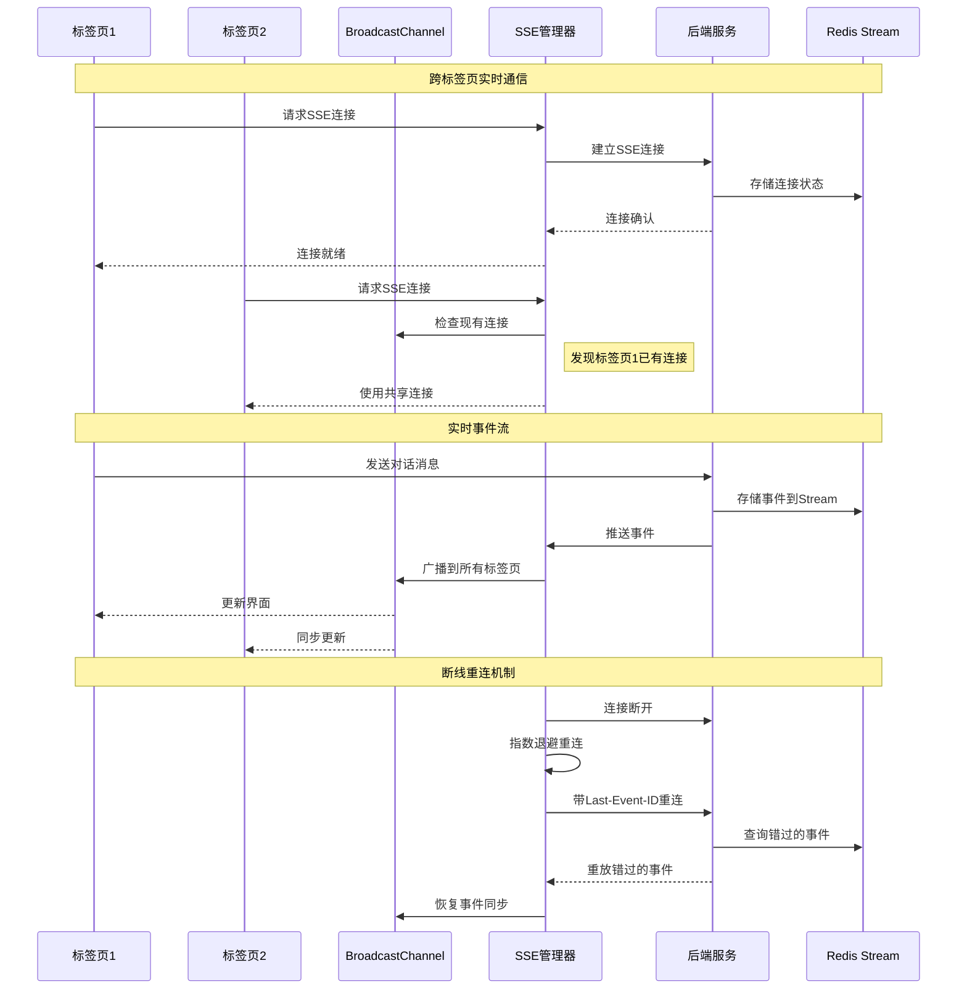
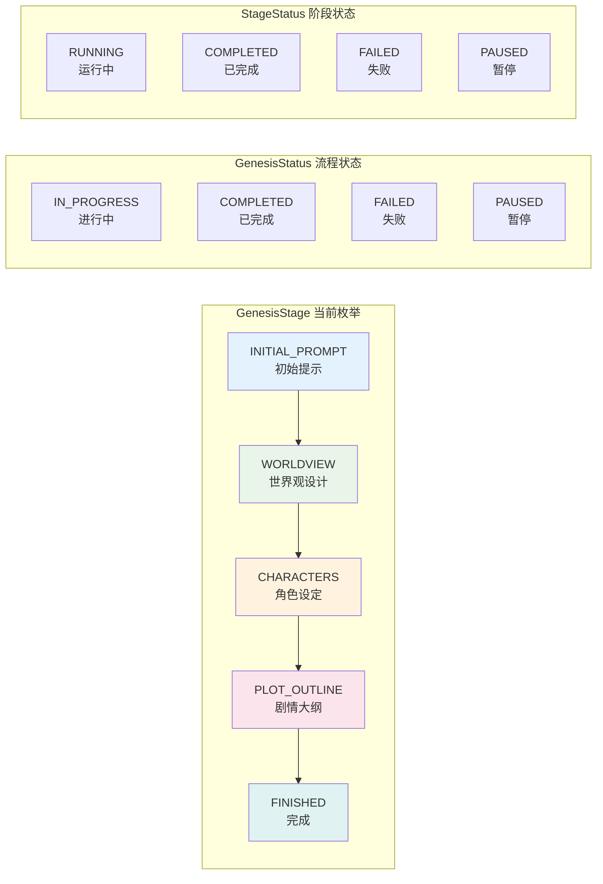
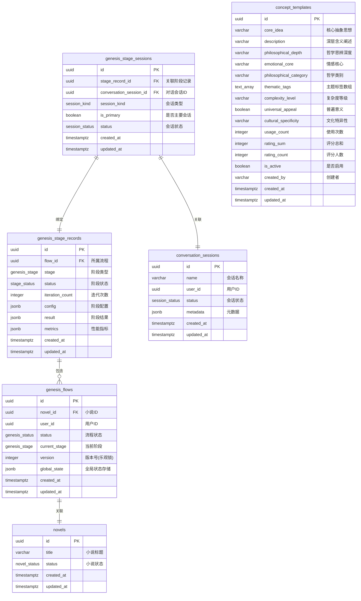
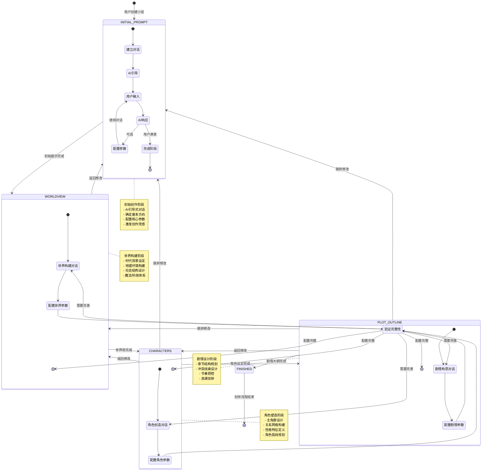

# 小说创世流程设计文档

## 概述

InfiniteScribe的小说创世流程是一个多阶段、实时交互的创作引导系统。通过AI助手与用户的对话式交互，逐步构建完整的小说框架，从初始灵感到详细的剧情大纲，为用户提供专业的创作指导和支持。

## 设计原则

### 1. 对话式创作体验
- 采用ChatGPT式的对话界面，自然流畅的交互体验
- AI助手主动引导，用户通过对话表达创作意图
- 实时响应和反馈，支持即时调整和优化

### 2. 分阶段渐进式构建
- 四个核心创作阶段：初始提示 → 世界观 → 角色设定 → 剧情大纲
- 每个阶段聚焦特定创作要素，避免信息过载
- 支持前进、后退和跳转，灵活的流程控制

### 3. 实时协作与状态同步
- 基于SSE的实时事件系统，支持多标签页同步
- 自动保存和状态恢复，防止创作内容丢失
- 跨设备访问，随时随地继续创作

## 当前流程架构

### 四阶段创世流程
```
初始提示(INITIAL_PROMPT) → 世界观(WORLDVIEW) → 角色设定(CHARACTERS) → 剧情大纲(PLOT_OUTLINE)
        ↓                        ↓               ↓                    ↓
✅ 创作灵感激发              ✅ 世界构建          ✅ 角色塑造          ✅ 情节设计
✅ 风格和方向确定            ✅ 背景设定          ✅ 关系网络          ✅ 结构规划
✅ AI引导启发               ✅ 规则体系          ✅ 性格特征          ✅ 冲突设计
```

### 流程优势
- **对话式引导**：AI主动提问和建议，降低创作门槛
- **阶段化推进**：每个阶段专注特定要素，避免信息过载
- **灵活导航**：支持跨阶段跳转，适应不同创作习惯
- **实时交互**：即时反馈和调整，提升创作效率
- **状态保持**：自动保存进度，支持断点续写

## 系统架构图



## 详细交互时序图

### 创世流程核心交互



### SSE实时通信架构



## 数据库架构设计

### 当前实现的枚举类型



### 当前数据库表结构



## API 接口设计

### 当前实现的核心API

#### 1. 创世流程管理

**创建流程**: `POST /api/v1/genesis/flows/{novel_id}`

```json
// 请求体 (可选)
{
  "initial_state": {}
}

// 响应
{
  "id": "uuid",
  "novel_id": "uuid",
  "user_id": "uuid",
  "status": "IN_PROGRESS",
  "current_stage": "INITIAL_PROMPT",
  "version": 1,
  "global_state": {},
  "created_at": "2024-01-01T00:00:00Z"
}
```

**获取流程**: `GET /api/v1/genesis/flows/{novel_id}`

**切换阶段**: `POST /api/v1/genesis/flows/{novel_id}/switch-stage`

```json
{
  "target_stage": "WORLDVIEW",
  "force": false  // 是否强制切换(跳过验证)
}
```

#### 2. 阶段管理

**创建会话**: `POST /api/v1/genesis/stages/{stage_id}/sessions`

```json
{
  "session_name": "初始创作对话",
  "session_kind": "CREATION",
  "is_primary": true
}
```

**更新配置**: `PATCH /api/v1/genesis/stages/{stage_id}/config`

```json
{
  "config": {
    "genre": "奇幻",
    "style": "第三人称",
    "target_word_count": 100000,
    "special_requirements": "包含魔法体系"
  }
}
```

#### 3. 对话交互

**发送消息**: `POST /api/v1/conversations/sessions/{session_id}/rounds`

```json
{
  "user_message": "我想写一个关于魔法学院的故事",
  "context": {
    "stage": "INITIAL_PROMPT",
    "iteration": 1
  }
}
```

### 计划中的哲学立意功能 🚧

> **重要**: 哲学立意驱动仍然是核心设计理念，计划作为可选的预阶段实现

#### 未来API设计 (概念选择阶段)

**获取哲学立意**: `GET /api/v1/genesis/concepts`

```json
{
  "philosophical_categories": ["存在主义", "人道主义"],
  "complexity_level": "medium",
  "count": 10
}

// 响应
{
  "concepts": [
    {
      "id": "uuid",
      "core_idea": "知识与无知的深刻对立",
      "description": "探讨知识如何改变一个人的命运",
      "philosophical_depth": "当个体获得超越同辈的知识时的孤独与责任",
      "emotional_core": "理解与被理解之间的渴望与隔阂",
      "thematic_tags": ["成长", "孤独", "责任"]
    }
  ]
}
```

**选择并优化立意**: `POST /api/v1/genesis/concepts/refine`

```json
{
  "selected_concept_ids": ["uuid1", "uuid2"],
  "user_feedback": "希望更突出主角的孤独感，加入友情元素",
  "action": "iterate" // 或 "confirm"
}
```

## 阶段配置架构

### 当前实现的配置模式

每个阶段都有对应的配置Schema，支持结构化参数设置：

#### 初始提示阶段 (InitialPromptConfig)
```json
{
  "genre": "奇幻",
  "style": "第三人称全知视角",
  "target_word_count": 100000,
  "special_requirements": "包含完整的魔法体系设定"
}
```

#### 世界观阶段 (WorldviewConfig)
```json
{
  "time_period": "现代",
  "geography": "架空大陆",
  "tech_magic_level": "高魔法低科技",
  "social_structure": "魔法师贵族制",
  "cultural_background": "欧洲中世纪风格"
}
```

#### 角色阶段 (CharactersConfig)
```json
{
  "protagonist_count": 1,
  "relationship_complexity": "中等",
  "personality_preferences": ["勇敢", "好奇", "善良"],
  "character_archetypes": ["智者导师", "忠诚伙伴", "神秘对手"]
}
```

#### 剧情大纲阶段 (PlotOutlineConfig)
```json
{
  "chapter_count": 30,
  "plot_complexity": "多线并行",
  "conflict_types": ["内心冲突", "人际冲突", "环境冲突"],
  "pacing_preference": "张弛有度"
}
```

## 状态转换图



## 用户体验设计要点

### 1. 对话式创作体验
- **自然交互**: ChatGPT式的对话界面，降低学习成本
- **AI主动引导**: 通过提问和建议帮助用户明确创作方向
- **实时反馈**: 即时响应和建议，保持创作流畅性
- **上下文记忆**: AI记住之前的对话内容，提供连贯指导

### 2. 渐进式深入设计
- **阶段化推进**: 四个明确阶段，避免信息过载
- **灵活导航**: 支持跨阶段跳转，适应不同创作习惯
- **配置与对话结合**: 结构化参数配置 + 自由对话讨论
- **可视化进度**: 清晰的进度指示和状态反馈

### 3. 实时协作体验
- **多标签页同步**: 跨浏览器标签页的状态一致性
- **断点续写**: 自动保存进度，支持随时暂停和恢复
- **即时更新**: 基于SSE的实时界面更新
- **离线缓存**: 关键数据本地缓存，提升加载速度

### 4. 专业创作支持
- **结构化配置**: 每个阶段都有专业的参数配置Schema
- **智能建议**: AI基于阶段特点提供针对性建议
- **模板支持**: 提供常见创作模式的配置模板
- **质量检查**: 阶段完整性验证，确保创作质量

## 技术实现要点

### 1. 实时通信架构
- **SSE连接管理**: 基于Redis Streams的持久化事件存储
- **跨标签页通信**: BroadcastChannel实现的Leader/Follower模式
- **断线重连机制**: 指数退避算法 + Last-Event-ID支持
- **事件回放**: 连接恢复时自动重放错过的事件

### 2. 对话式AI集成
- **上下文管理**: 会话级别的上下文保持和历史记录
- **流式响应**: 支持AI响应的实时流式显示
- **阶段感知**: AI根据当前创世阶段提供针对性指导
- **多轮对话**: 支持复杂的多轮交互和迭代优化

### 3. 数据架构设计
- **分层存储**: 流程 → 阶段记录 → 会话的三层架构
- **乐观锁机制**: 版本号控制的并发冲突解决
- **配置验证**: JSON Schema驱动的阶段配置验证
- **灵活扩展**: JSONB字段支持动态配置和结果存储

### 4. 前端状态管理
- **React Query**: 服务端状态的缓存和同步管理
- **Hook化封装**: 业务逻辑的可复用Hook封装
- **错误边界**: 优雅的错误处理和用户提示
- **性能优化**: 虚拟滚动和懒加载优化长对话列表

## 当前实现状态

### ✅ 已完成功能

**核心架构**:
- ✅ 四阶段创世流程 (INITIAL_PROMPT → WORLDVIEW → CHARACTERS → PLOT_OUTLINE)
- ✅ 对话式AI交互界面
- ✅ 实时SSE事件系统
- ✅ 跨标签页状态同步
- ✅ 阶段配置管理系统

**技术特性**:
- ✅ REST API完整实现
- ✅ React前端组件库
- ✅ 数据库模型和迁移
- ✅ 全面的错误处理
- ✅ 单元和集成测试

**用户体验**:
- ✅ 响应式UI设计
- ✅ 实时消息流
- ✅ 进度可视化
- ✅ 灵活的阶段导航

### 🚧 规划中功能

**哲学立意驱动** (高优先级):
> 响应用户反馈：哲学立意驱动仍然是核心价值，将作为创世流程的增强功能实现

- 🔄 概念模板系统的API接口开发
- 🔄 零输入启动的哲学立意选择界面
- 🔄 立意迭代优化机制
- 🔄 从立意到故事构思的转换流程

**增强特性**:
- 📱 移动端适配优化
- 🤝 多人协作功能
- 📊 创作数据分析
- 🎨 自定义主题和样式

## 部署检查清单

### 当前生产环境
- ✅ PostgreSQL数据库架构已部署
- ✅ Redis实时事件存储配置完成
- ✅ 后端API服务运行稳定
- ✅ 前端应用部署和CDN配置
- ✅ SSE服务健康监控

### 运维监控
- ✅ 应用性能监控 (APM)
- ✅ 数据库连接池监控
- ✅ Redis连接状态检查
- ✅ 错误日志聚合和告警
- ✅ 用户体验监控

## 总结

当前的创世流程实现已经提供了完整的对话式创作体验，通过以下核心优势显著提升了用户的创作体验：

### 🎯 核心价值
1. **对话式引导**: 降低创作门槛，AI主动引导用户表达创作想法
2. **阶段化构建**: 系统性地从灵感到框架，避免信息过载
3. **实时协作**: 基于现代Web技术的无缝多端同步体验
4. **专业支持**: 结构化配置确保创作质量和完整性

### 🚀 技术优势
- **企业级架构**: 可扩展的微服务设计，支持高并发用户
- **现代技术栈**: React 18 + TypeScript + FastAPI + PostgreSQL
- **实时通信**: 基于SSE的高性能实时事件系统
- **可靠性保证**: 完整的错误处理和监控体系

### 📈 未来发展
哲学立意驱动功能的加入将进一步提升创作深度，实现从"技术驱动"到"思想驱动"的创作体验升级，让每一部作品都具有深层的哲学内核和情感共鸣。