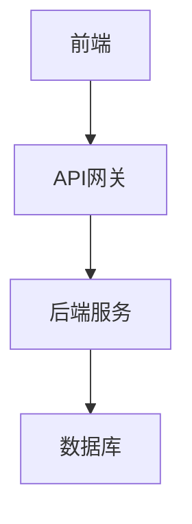
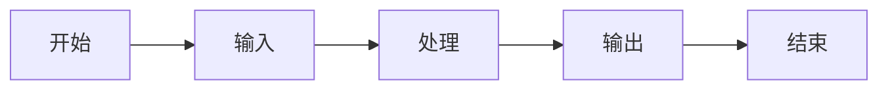
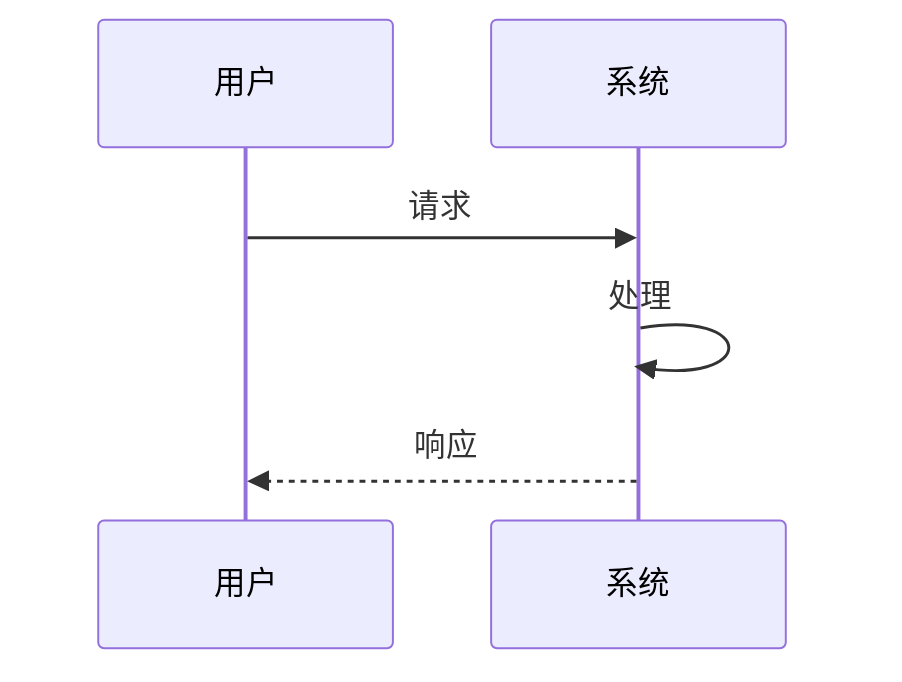
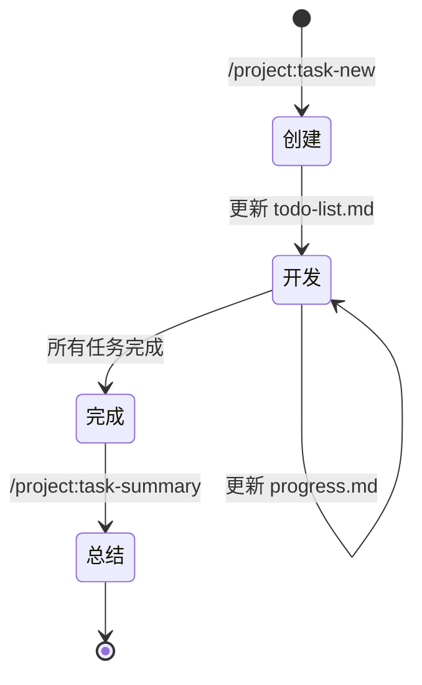

# 任务管理指南

本项目使用结构化的任务管理系统，通过 Claude Code 的自定义命令简化任务文档的创建和管理。

## 快速开始

### 1. 创建新任务

使用以下命令创建新任务：

```
/project:task-new <任务名称>
```

例如：
```
/project:task-new implement-user-auth
```

这将在 `docs/development/tasks/implement-user-auth/` 创建：
- README.md - 任务概述
- implementation-plan.md - 实现方案（含 Mermaid 图表）
- todo-list.md - 任务清单

### 2. 查看所有任务

```
/project:task-list
```

显示：
- 所有任务列表
- 各任务的完成进度
- 最近更新的任务

### 3. 查看特定任务

```
/project:task-review <任务名称>
```

例如：
```
/project:task-review concept-template-model
```

### 4. 创建任务总结

任务完成后，创建总结文档：

```
/project:task-summary <任务名称>
```

## 任务文档结构

每个任务包含以下文档：

### README.md
- 任务背景
- 目标
- 相关文件
- 参考资料

### implementation-plan.md
- 技术方案
- 架构设计（Mermaid 图表）
- 风险评估
- 测试计划

### todo-list.md
- 待办事项
- 进行中
- 已完成

### progress.md（可选）
- 日期记录
- 进度更新

### summary.md（任务完成后）
- 实现概述
- 最终架构（Mermaid 图表）
- 关键决策
- 经验教训
- 后续建议

## Mermaid 图表示例

### 架构图


### 流程图


### 时序图


## 最佳实践

1. **任务命名**：使用小写字母和连字符（如 `fix-database-connection`）
2. **及时更新**：开发过程中持续更新 todo-list.md
3. **图表优先**：在实现方案中使用 Mermaid 图表展示架构
4. **知识沉淀**：任务完成后必须创建 summary.md
5. **经验分享**：在总结中记录遇到的问题和解决方案

## 命令列表

| 命令 | 用途 |
|------|------|
| `/project:task` | 查看任务管理帮助 |
| `/project:task-new` | 创建新任务 |
| `/project:task-list` | 列出所有任务 |
| `/project:task-review` | 查看任务详情 |
| `/project:task-summary` | 创建任务总结 |

## 任务生命周期



通过这种结构化的任务管理方式，我们能够：
- 保持任务的上下文连贯性
- 促进团队协作和知识共享
- 形成项目的知识库
- 为未来的类似任务提供参考