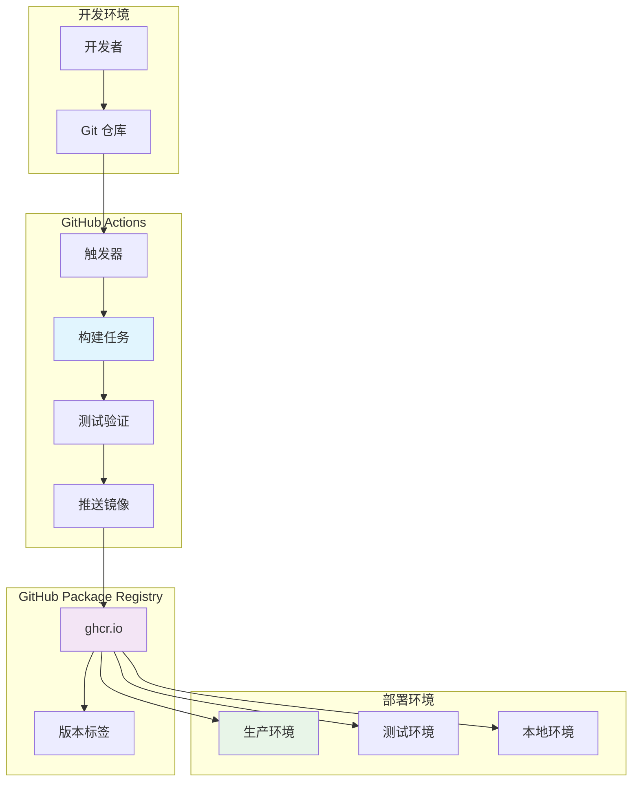
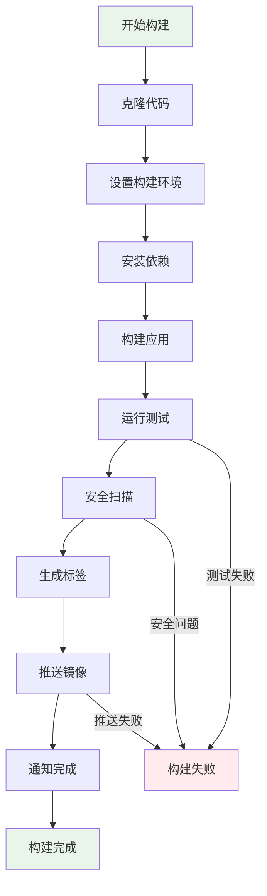
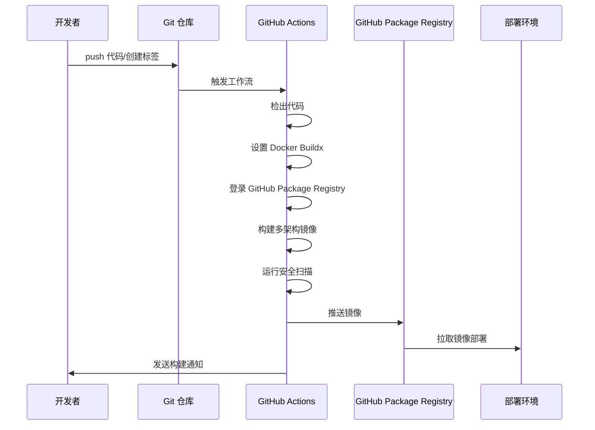
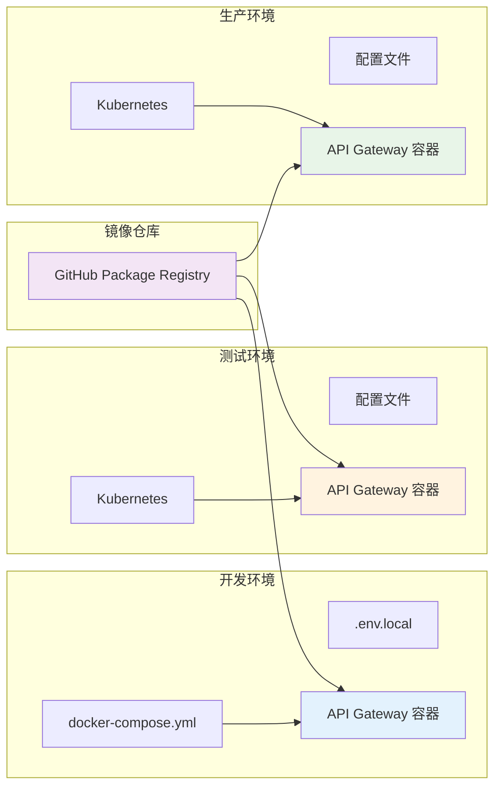

# API Gateway Docker 镜像构建与自动化部署实现方案

## 技术方案

### 1. Docker 镜像构建策略

采用多阶段构建（Multi-stage build）方案，分离构建环境和运行环境，优化镜像大小和安全性：

- **构建阶段**：使用 `python:3.11-slim` 基础镜像，安装 `uv` 包管理器，构建应用依赖
- **运行阶段**：使用轻量级基础镜像，仅包含运行时必需的文件和依赖
- **缓存优化**：合理组织 Dockerfile 层级，最大化构建缓存利用率

### 2. GitHub Actions 自动化流程

实现基于事件驱动的自动化构建和部署：

- **触发条件**：push 到 main/develop 分支、创建版本标签
- **构建矩阵**：支持多架构构建（amd64、arm64）
- **缓存策略**：使用 GitHub Actions 缓存加速构建过程
- **安全认证**：使用 GitHub Token 和 OIDC 进行安全认证

### 3. 版本管理策略

- **开发版本**：基于分支名称生成开发版本标签（如 `dev-main-abc123`）
- **发布版本**：基于 Git 标签生成语义化版本（如 `v1.0.0`、`v1.0.0-alpha.1`）
- **最新版本**：维护 `latest` 标签指向最新稳定版本

## 架构设计

### 系统架构图



### Docker 构建流程图



### GitHub Actions 工作流架构



### 多环境部署架构



## 技术实现细节

### 1. Dockerfile 多阶段构建（完整示例）

**现状**：当前 `apps/backend/Dockerfile` 为单阶段构建，包含复杂的 if-else CMD 逻辑。

**改进方案**：
```dockerfile
# ==================== Builder Stage ====================
FROM python:3.11-slim AS builder

# Install system dependencies for building
RUN apt-get update && apt-get install -y \
    build-essential \
    curl \
    && rm -rf /var/lib/apt/lists/*

# Set working directory
WORKDIR /app

# Install uv package manager
RUN pip install uv

# Copy dependency files
COPY ./pyproject.toml ./
COPY ./uv.lock ./

# Install Python dependencies
RUN uv sync --no-dev --frozen

# ==================== Runtime Stage ====================
FROM python:3.11-slim AS runtime

# Install minimal runtime dependencies
RUN apt-get update && apt-get install -y \
    curl \
    && rm -rf /var/lib/apt/lists/* \
    && apt-get clean

# Create non-root user for security
RUN groupadd -r appuser && useradd -r -g appuser appuser

# Set working directory
WORKDIR /app

# Copy Python dependencies from builder
COPY --from=builder /usr/local/lib/python3.11/site-packages /usr/local/lib/python3.11/site-packages
COPY --from=builder /usr/local/bin /usr/local/bin

# Copy application source code
COPY ./apps/backend/src/ ./src/

# Copy entrypoint script
COPY ./apps/backend/docker-entrypoint.sh ./
RUN chmod +x ./docker-entrypoint.sh

# Environment variables
ENV PYTHONUNBUFFERED=1
ENV PYTHONPATH=/app
ENV SERVICE_TYPE=${SERVICE_TYPE:-api-gateway}

# Change ownership to non-root user
RUN chown -R appuser:appuser /app

# Switch to non-root user
USER appuser

# Default port
EXPOSE 8000

# Health check
HEALTHCHECK --interval=30s --timeout=10s --start-period=30s --retries=3 \
    CMD curl -f http://localhost:8000/health || exit 1

# Use entrypoint script instead of complex CMD
ENTRYPOINT ["./docker-entrypoint.sh"]
CMD ["api-gateway"]
```

**配套的 docker-entrypoint.sh**：
```bash
#!/bin/bash
set -e

SERVICE_TYPE=${1:-$SERVICE_TYPE}

case "$SERVICE_TYPE" in
    "api-gateway")
        exec uvicorn src.api.main:app --host 0.0.0.0 --port 8000
        ;;
    "agent-worldsmith")
        exec python -m src.agents.worldsmith.main
        ;;
    "agent-plotmaster")
        exec python -m src.agents.plotmaster.main
        ;;
    "agent-outliner")
        exec python -m src.agents.outliner.main
        ;;
    "agent-director")
        exec python -m src.agents.director.main
        ;;
    "agent-characterexpert")
        exec python -m src.agents.characterexpert.main
        ;;
    "agent-worldbuilder")
        exec python -m src.agents.worldbuilder.main
        ;;
    "agent-writer")
        exec python -m src.agents.writer.main
        ;;
    "agent-critic")
        exec python -m src.agents.critic.main
        ;;
    "agent-factchecker")
        exec python -m src.agents.factchecker.main
        ;;
    "agent-rewriter")
        exec python -m src.agents.rewriter.main
        ;;
    *)
        echo "Unknown SERVICE_TYPE: $SERVICE_TYPE" >&2
        exit 1
        ;;
esac
```

### 2. GitHub Actions 工作流配置（完整示例）

```yaml
# .github/workflows/docker-build.yml
name: Docker Build and Push

on:
  push:
    branches: [main, develop]
    tags: ['v*']
  pull_request:
    branches: [main]

env:
  REGISTRY: ghcr.io
  IMAGE_NAME: ${{ github.repository }}

jobs:
  # 前置测试 job（确保代码质量）
  test:
    runs-on: ubuntu-latest
    steps:
      - name: Checkout code
        uses: actions/checkout@v4
      
      - name: Set up Python
        uses: actions/setup-python@v4
        with:
          python-version: '3.11'
      
      - name: Install dependencies
        run: |
          pip install uv
          uv sync --all-extras
      
      - name: Run tests
        run: |
          cd apps/backend
          uv run pytest tests/ -v
      
      - name: Run linting
        run: |
          cd apps/backend
          uv run ruff check src/
          uv run mypy src/ --ignore-missing-imports

  # Docker 构建和推送 job
  build:
    needs: test
    runs-on: ubuntu-latest
    permissions:
      contents: read
      packages: write
      security-events: write
    
    steps:
      - name: Checkout code
        uses: actions/checkout@v4
      
      - name: Set up QEMU
        uses: docker/setup-qemu-action@v3
      
      - name: Set up Docker Buildx
        uses: docker/setup-buildx-action@v3
      
      - name: Login to GitHub Container Registry
        if: github.event_name != 'pull_request'
        uses: docker/login-action@v3
        with:
          registry: ${{ env.REGISTRY }}
          username: ${{ github.actor }}
          password: ${{ secrets.GITHUB_TOKEN }}
      
      - name: Extract metadata
        id: meta
        uses: docker/metadata-action@v5
        with:
          images: ${{ env.REGISTRY }}/${{ env.IMAGE_NAME }}
          tags: |
            type=ref,event=branch
            type=ref,event=pr
            type=semver,pattern={{version}}
            type=semver,pattern={{major}}.{{minor}}
            type=semver,pattern={{major}}
            type=sha,prefix={{branch}}-
            type=raw,value=latest,enable={{is_default_branch}}
          labels: |
            org.opencontainers.image.title=Infinite Scribe API Gateway
            org.opencontainers.image.description=API Gateway and Agent Services
            org.opencontainers.image.vendor=Infinite Scribe Team
      
      - name: Build and push Docker image
        uses: docker/build-push-action@v5
        with:
          context: .
          file: ./apps/backend/Dockerfile
          platforms: linux/amd64,linux/arm64
          push: ${{ github.event_name != 'pull_request' }}
          tags: ${{ steps.meta.outputs.tags }}
          labels: ${{ steps.meta.outputs.labels }}
          cache-from: type=gha
          cache-to: type=gha,mode=max
          build-args: |
            BUILDKIT_INLINE_CACHE=1
      
      - name: Run Trivy vulnerability scanner
        uses: aquasecurity/trivy-action@master
        with:
          image-ref: ${{ env.REGISTRY }}/${{ env.IMAGE_NAME }}:${{ steps.meta.outputs.version }}
          format: 'sarif'
          output: 'trivy-results.sarif'
          exit-code: '1'
          vuln-type: 'os,library'
          severity: 'CRITICAL,HIGH'
      
      - name: Upload Trivy scan results to GitHub Security
        uses: github/codeql-action/upload-sarif@v2
        if: always()
        with:
          sarif_file: 'trivy-results.sarif'
      
      - name: Install Cosign
        if: github.event_name != 'pull_request'
        uses: sigstore/cosign-installer@v3
      
      - name: Sign container image
        if: github.event_name != 'pull_request'
        run: |
          cosign sign --yes ${{ env.REGISTRY }}/${{ env.IMAGE_NAME }}@${{ steps.build.outputs.digest }}
      
      - name: Generate SBOM
        if: github.event_name != 'pull_request'
        uses: anchore/sbom-action@v0
        with:
          image: ${{ env.REGISTRY }}/${{ env.IMAGE_NAME }}:${{ steps.meta.outputs.version }}
          format: spdx-json
          output-file: sbom.spdx.json
      
      - name: Upload SBOM to release
        if: github.event_name != 'pull_request' && startsWith(github.ref, 'refs/tags/')
        uses: actions/upload-artifact@v3
        with:
          name: sbom
          path: sbom.spdx.json

  # 清理旧镜像 job（可选）
  cleanup:
    needs: build
    runs-on: ubuntu-latest
    if: github.event_name != 'pull_request'
    permissions:
      packages: write
    
    steps:
      - name: Delete old container images
        uses: actions/delete-package-versions@v4
        with:
          package-name: ${{ env.IMAGE_NAME }}
          package-type: container
          min-versions-to-keep: 10
          delete-only-untagged-versions: true
```

### 3. 版本标签策略（基于 docker/metadata-action）

| 触发条件 | 镜像标签 | 说明 | metadata-action 配置 |
|---------|---------|------|---------------------|
| push main | `latest`, `main-{sha}` | 主分支最新版本 | `type=raw,value=latest,enable={{is_default_branch}}` + `type=sha,prefix={{branch}}-` |
| push develop | `develop`, `develop-{sha}` | 开发分支版本 | `type=ref,event=branch` + `type=sha,prefix={{branch}}-` |
| push tag v1.0.0 | `v1.0.0`, `1.0.0`, `1.0`, `1` | 语义化版本 | `type=semver,pattern={{version}}` + `type=semver,pattern={{major}}.{{minor}}` + `type=semver,pattern={{major}}` |
| PR | `pr-123` | 拉取请求版本 | `type=ref,event=pr` |

**版本清理策略**：
- 保留最新 10 个版本
- 自动清理未标记的版本
- SHA 标签仅保留最近 30 天
- 语义化版本永久保留

## 风险评估

### 高风险项

1. **构建失败风险**
   - 依赖安装失败
   - 网络连接问题
   - 缓存失效导致重复构建

2. **安全风险**
   - 镜像漏洞
   - 认证信息泄露
   - 恶意代码注入

3. **部署风险**
   - 镜像推送失败
   - 版本标签冲突
   - 存储空间不足

### 中等风险项

1. **性能风险**
   - 构建时间过长
   - 镜像体积过大
   - 多架构构建资源消耗

2. **维护风险**
   - 基础镜像更新延迟
   - 依赖版本兼容性
   - 文档更新不及时

### 应对策略

1. **构建稳定性**
   - 使用 GitHub Actions 缓存（`type=gha`）
   - 实现构建重试机制
   - 监控构建成功率和时间
   - 锁定 Actions 版本防止供应链攻击

2. **安全加固**
   - **漏洞扫描**：集成 Trivy 进行 OS 和依赖库扫描
   - **Secret 扫描**：使用 GitLeaks 或 TruffleHog 扫描代码中的敏感信息
   - **镜像签名**：使用 Cosign + OIDC 进行镜像签名验证
   - **SBOM 生成**：生成软件物料清单（SBOM）用于合规和追踪
   - **非 root 用户**：使用 appuser 用户运行容器
   - **最小化镜像**：移除不必要的系统包和文件
   - **访问控制**：使用 GITHUB_TOKEN 而非 PAT，配置最小权限

3. **性能优化**
   - 优化 Dockerfile 层级，依赖层放前面
   - 使用 .dockerignore 排除不必要文件
   - 实施多架构并行构建
   - 使用 BuildKit 缓存优化

## 测试计划

### 1. 本地测试

- **构建测试**：验证 Dockerfile 构建成功
- **运行测试**：确保容器能够正常启动和运行
- **功能测试**：验证 API Gateway 功能正常

### 2. 集成测试

- **GitHub Actions 测试**：验证自动化构建流程
- **镜像推送测试**：确保能够成功推送到 GitHub Package Registry
- **多架构测试**：验证不同架构镜像的兼容性

### 3. 端到端测试

- **部署测试**：在不同环境中拉取并部署镜像
- **性能测试**：评估容器化后的性能表现
- **安全测试**：扫描镜像漏洞和安全配置

### 4. 回归测试

- **版本兼容性测试**：验证不同版本镜像的兼容性
- **回滚测试**：确保能够快速回滚到之前版本
- **监控测试**：验证构建和部署监控功能

## 监控和维护

### 1. 构建监控

- GitHub Actions 构建状态监控
- 构建时间和成功率统计
- 镜像大小变化趋势

### 2. 安全监控

- 定期漏洞扫描
- 依赖更新监控
- 访问日志审计

### 3. 性能监控

- 镜像拉取性能
- 容器启动时间
- 资源使用情况

### 4. 自动化维护

- 定期更新基础镜像
- 清理过期镜像版本
- 更新安全补丁