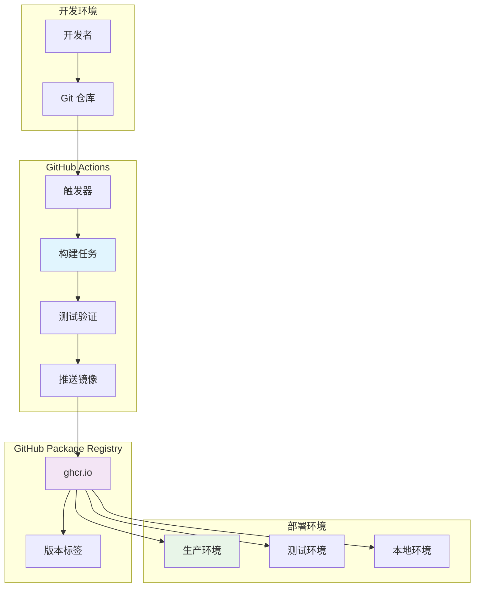
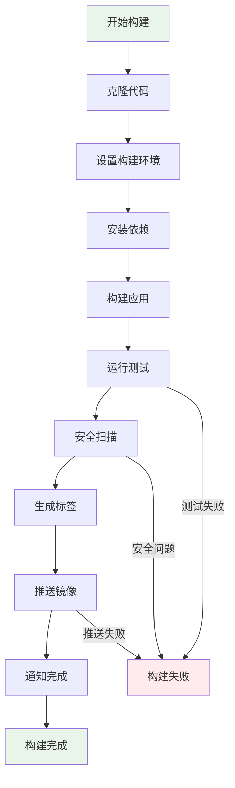
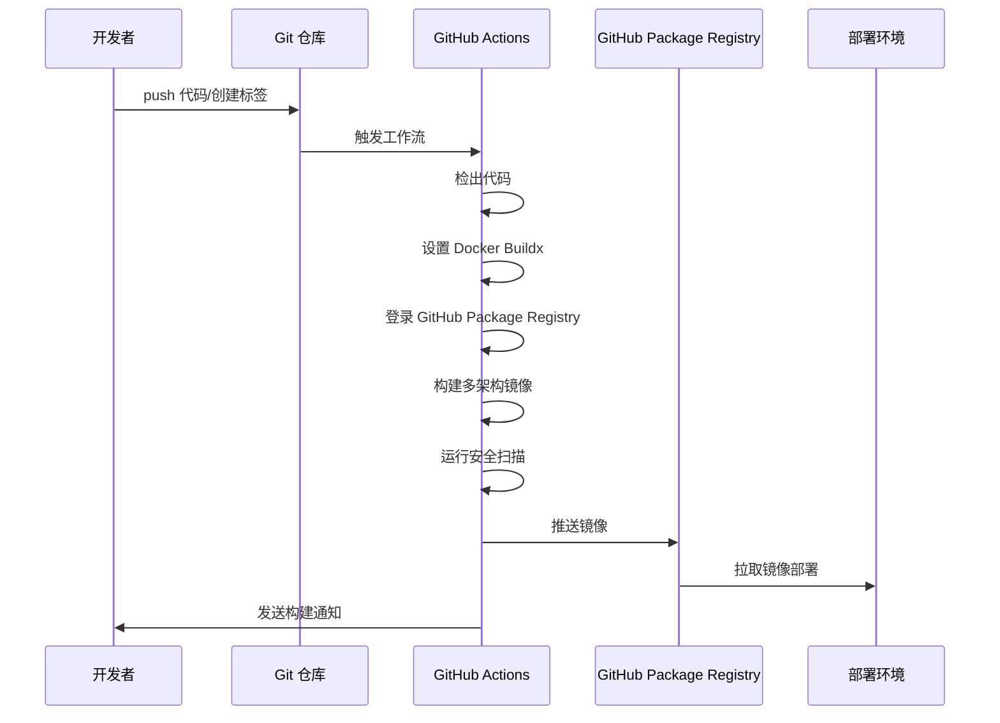
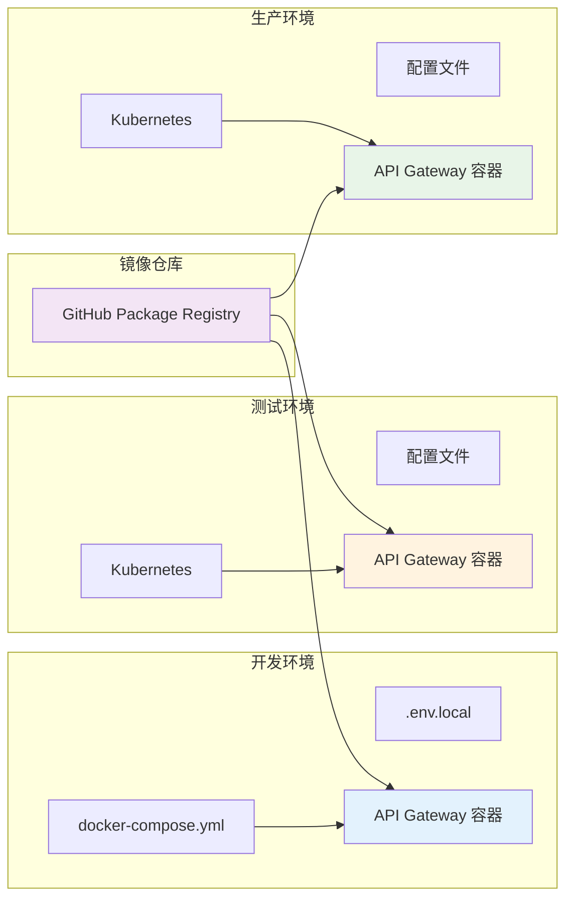

# API Gateway Docker 镜像构建与自动化部署实现方案

## 技术方案

### 1. Docker 镜像构建策略

采用多阶段构建（Multi-stage build）方案，分离构建环境和运行环境，优化镜像大小和安全性：

- **构建阶段**：使用 `python:3.11-slim` 基础镜像，安装 `uv` 包管理器，构建应用依赖
- **运行阶段**：使用轻量级基础镜像，仅包含运行时必需的文件和依赖
- **缓存优化**：合理组织 Dockerfile 层级，最大化构建缓存利用率

### 2. GitHub Actions 自动化流程

实现基于事件驱动的自动化构建和部署：

- **触发条件**：push 到 main/develop 分支、创建版本标签
- **构建矩阵**：支持多架构构建（amd64、arm64）
- **缓存策略**：使用 GitHub Actions 缓存加速构建过程
- **安全认证**：使用 GitHub Token 和 OIDC 进行安全认证

### 3. 版本管理策略

- **开发版本**：基于分支名称生成开发版本标签（如 `dev-main-abc123`）
- **发布版本**：基于 Git 标签生成语义化版本（如 `v1.0.0`、`v1.0.0-alpha.1`）
- **最新版本**：维护 `latest` 标签指向最新稳定版本

## 架构设计

### 系统架构图



### Docker 构建流程图



### GitHub Actions 工作流架构



### 多环境部署架构



## 技术实现细节

### 1. Dockerfile 设计

```dockerfile
# 多阶段构建示例结构
FROM python:3.11-slim as builder
# 构建阶段：安装 uv，构建依赖

FROM python:3.11-slim as runtime
# 运行阶段：仅包含运行时文件
```

### 2. GitHub Actions 工作流配置

```yaml
# .github/workflows/docker-build.yml 主要结构
name: Docker Build and Push
on:
  push:
    branches: [main, develop]
    tags: ['v*']
  pull_request:
    branches: [main]

jobs:
  build:
    runs-on: ubuntu-latest
    steps:
      - name: Checkout
      - name: Set up Docker Buildx
      - name: Login to GitHub Container Registry
      - name: Build and push
      - name: Security scan
```

### 3. 版本标签策略

| 触发条件 | 镜像标签 | 说明 |
|---------|---------|------|
| push main | `latest`, `main-{sha}` | 主分支最新版本 |
| push develop | `develop`, `develop-{sha}` | 开发分支版本 |
| push tag v1.0.0 | `v1.0.0`, `1.0.0`, `1.0`, `1` | 语义化版本 |
| PR | `pr-{number}` | 拉取请求版本 |

## 风险评估

### 高风险项

1. **构建失败风险**
   - 依赖安装失败
   - 网络连接问题
   - 缓存失效导致重复构建

2. **安全风险**
   - 镜像漏洞
   - 认证信息泄露
   - 恶意代码注入

3. **部署风险**
   - 镜像推送失败
   - 版本标签冲突
   - 存储空间不足

### 中等风险项

1. **性能风险**
   - 构建时间过长
   - 镜像体积过大
   - 多架构构建资源消耗

2. **维护风险**
   - 基础镜像更新延迟
   - 依赖版本兼容性
   - 文档更新不及时

### 应对策略

1. **构建稳定性**
   - 使用构建缓存
   - 实现构建重试机制
   - 监控构建成功率

2. **安全加固**
   - 定期扫描镜像漏洞
   - 使用最小化基础镜像
   - 实施访问控制

3. **性能优化**
   - 优化 Dockerfile 层级
   - 使用 .dockerignore 排除不必要文件
   - 实施并行构建

## 测试计划

### 1. 本地测试

- **构建测试**：验证 Dockerfile 构建成功
- **运行测试**：确保容器能够正常启动和运行
- **功能测试**：验证 API Gateway 功能正常

### 2. 集成测试

- **GitHub Actions 测试**：验证自动化构建流程
- **镜像推送测试**：确保能够成功推送到 GitHub Package Registry
- **多架构测试**：验证不同架构镜像的兼容性

### 3. 端到端测试

- **部署测试**：在不同环境中拉取并部署镜像
- **性能测试**：评估容器化后的性能表现
- **安全测试**：扫描镜像漏洞和安全配置

### 4. 回归测试

- **版本兼容性测试**：验证不同版本镜像的兼容性
- **回滚测试**：确保能够快速回滚到之前版本
- **监控测试**：验证构建和部署监控功能

## 监控和维护

### 1. 构建监控

- GitHub Actions 构建状态监控
- 构建时间和成功率统计
- 镜像大小变化趋势

### 2. 安全监控

- 定期漏洞扫描
- 依赖更新监控
- 访问日志审计

### 3. 性能监控

- 镜像拉取性能
- 容器启动时间
- 资源使用情况

### 4. 自动化维护

- 定期更新基础镜像
- 清理过期镜像版本
- 更新安全补丁