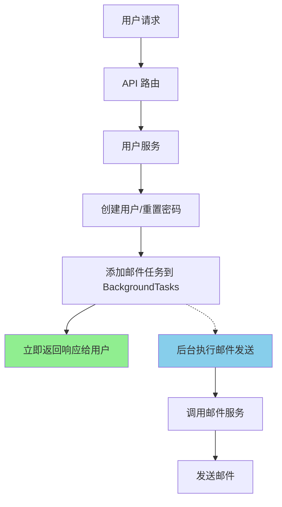
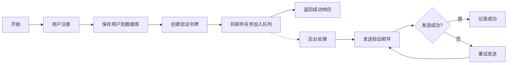
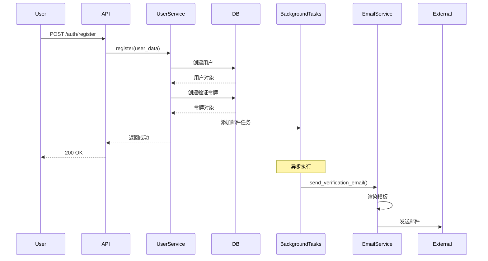

# 实现方案 - 使用 FastAPI BackgroundTasks

## 技术方案
使用 FastAPI 内置的 BackgroundTasks 功能实现邮件异步发送。这是一个轻量级的解决方案，适合当前的需求。

## 架构设计

### 系统架构图

### 流程图

### 时序图

## 实现步骤

### 1. 创建邮件任务包装器
创建一个专门处理邮件发送的异步任务包装器，支持重试和错误处理。

### 2. 修改 UserService
更新 `register` 和 `request_password_reset` 方法，使用 BackgroundTasks。

### 3. 更新 API 路由
在 API 路由中注入 BackgroundTasks 依赖。

### 4. 添加邮件发送状态跟踪
可选：在数据库中记录邮件发送状态，便于监控和问题排查。

## 风险评估
1. **进程终止风险**：如果应用在后台任务执行过程中被终止，任务会丢失
   - 缓解措施：使用 graceful shutdown，确保任务完成
   
2. **内存占用**：大量后台任务可能占用内存
   - 缓解措施：限制并发任务数量

3. **监控困难**：难以追踪任务执行状态
   - 缓解措施：添加详细日志和可选的数据库记录

## 测试计划
1. 单元测试：测试邮件任务包装器的重试逻辑
2. 集成测试：测试完整的注册流程，包括异步邮件发送
3. 压力测试：模拟大量并发注册，验证系统稳定性
4. 故障测试：模拟邮件服务故障，验证重试机制