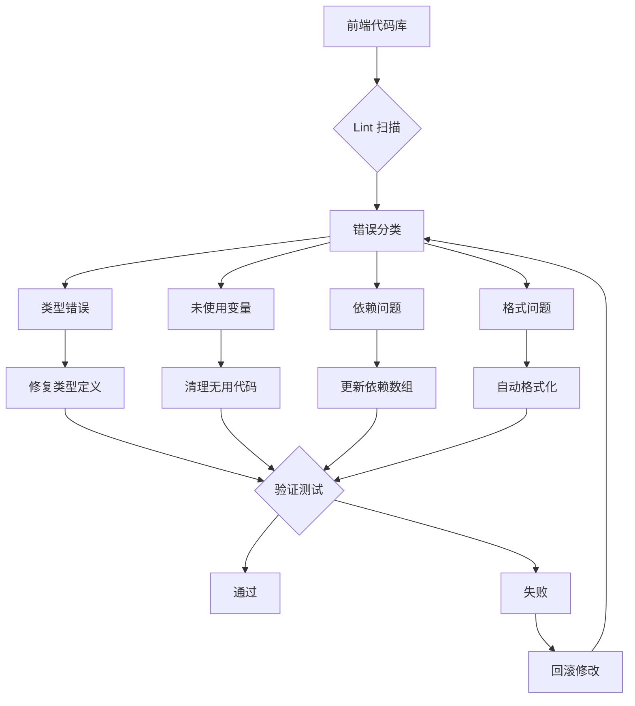
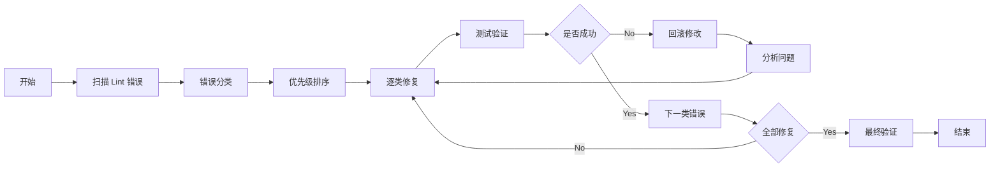
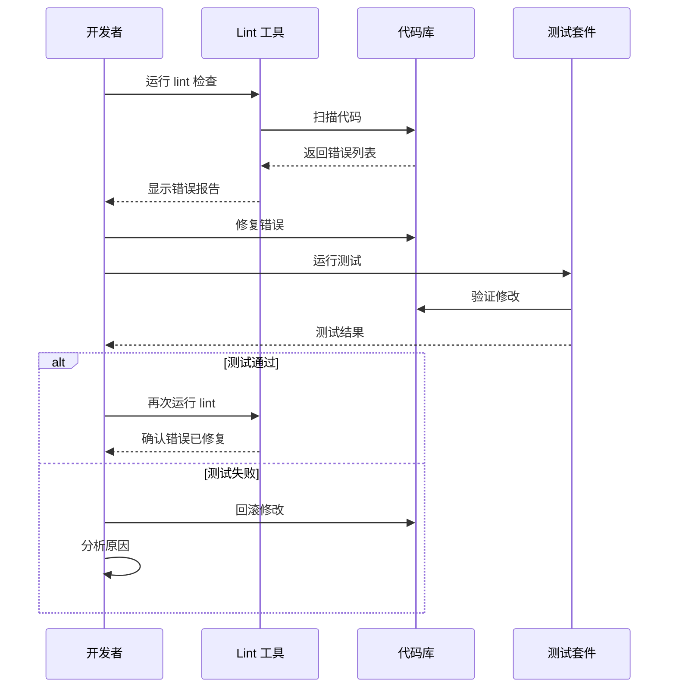

# 实现方案

## 技术方案

### 1. 错误扫描与分类
- 运行 `pnpm lint` 获取完整的 lint 错误列表
- 按照错误类型和严重程度进行分类
- 优先修复影响运行时的严重错误

### 2. 修复策略
- **类型错误**：修正 TypeScript 类型定义和使用
- **未使用变量**：移除或添加必要的使用
- **依赖问题**：修复 useEffect 等 Hook 的依赖数组
- **代码格式**：使用自动格式化工具统一处理

### 3. 验证方法
- 每修复一类错误后运行测试
- 确保修复不会引入新的问题
- 在本地环境运行应用验证功能

## 架构设计

### 系统架构图

### 流程图

### 时序图

## 风险评估

### 潜在风险
1. **功能回归**：修复 lint 错误可能影响现有功能
   - 应对：充分测试，小步修改

2. **依赖冲突**：更新依赖可能引入不兼容
   - 应对：谨慎更新，保持版本一致性

3. **代码逻辑改变**：修复逻辑错误可能改变业务行为
   - 应对：理解业务逻辑，咨询相关人员

## 测试计划

### 单元测试
- 运行现有单元测试套件
- 确保所有测试通过

### 集成测试
- 在本地环境运行完整应用
- 验证主要功能流程

### Lint 验证
- 确保 `pnpm lint` 无错误
- 运行 `pnpm typecheck` 验证类型

### 手动测试
- 关键功能的手动验证
- UI 组件的视觉检查