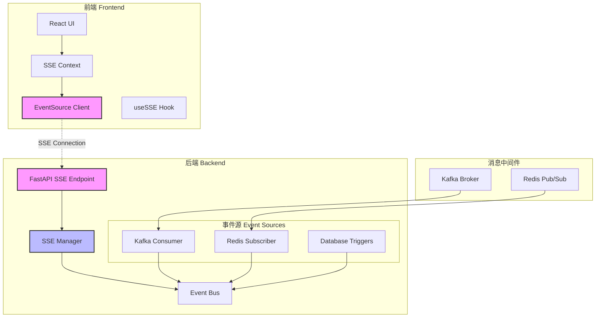
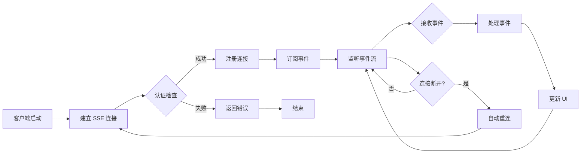
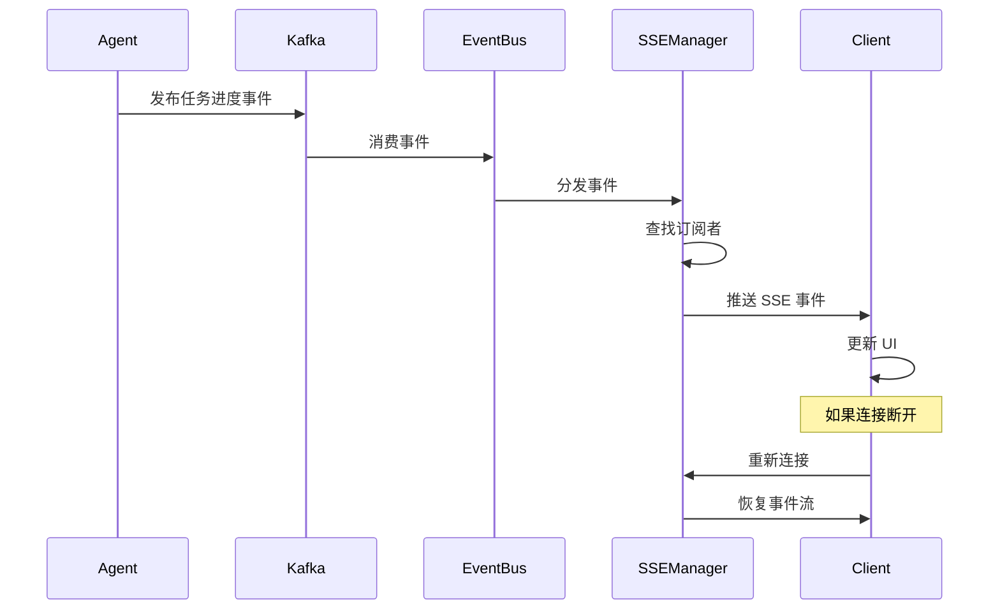
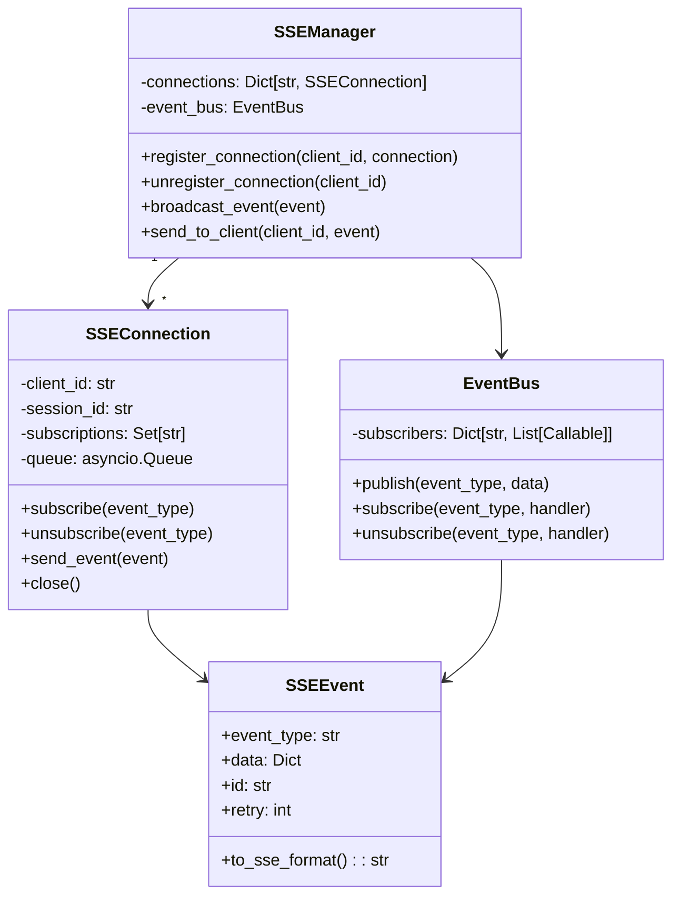

# SSE 实现方案

## 技术方案

### 1. 后端架构设计

采用分层架构实现 SSE：
- **API 层**：FastAPI SSE 端点，处理客户端连接
- **管理层**：SSEManager 管理连接池和事件分发
- **事件层**：EventBus 统一事件发布接口
- **集成层**：Kafka/Redis 订阅器，接收外部事件

### 2. 前端架构设计

基于 React Context 和 Hooks 实现：
- **SSEContext**：管理 SSE 连接生命周期
- **useSSE Hook**：订阅特定事件类型
- **EventHandler**：处理不同类型的事件
- **自动重连机制**：处理连接中断

### 3. 事件流设计

事件格式遵循标准 SSE 规范：
```
event: task.progress
data: {"task_id": "123", "progress": 50, "message": "Processing..."}
id: 1234567890
retry: 5000
```

## 架构设计

### 系统架构图



### SSE 连接流程图



### 事件处理时序图



### 组件类图



## 实现细节

### 后端实现要点

1. **连接管理**
   - 使用 asyncio.Queue 管理每个客户端的事件队列
   - 实现心跳机制检测断开的连接
   - 限制每个用户的最大连接数

2. **事件过滤**
   - 基于 session_id 过滤事件
   - 支持事件类型订阅
   - 实现权限检查

3. **性能优化**
   - 使用连接池管理数据库连接
   - 批量处理事件减少网络开销
   - 实现事件去重机制

### 前端实现要点

1. **连接管理**
   - 使用 React Context 全局管理 SSE 连接
   - 实现指数退避重连策略
   - 处理页面切换时的连接保持

2. **事件处理**
   - 使用事件总线模式分发事件
   - 实现事件缓存避免丢失
   - 支持离线事件队列

3. **错误处理**
   - 捕获网络错误并自动重试
   - 提供降级到轮询的备选方案
   - 显示连接状态指示器

## 风险评估

### 技术风险

1. **连接数限制**
   - 风险：大量并发连接可能耗尽服务器资源
   - 对策：实现连接池限制和负载均衡

2. **网络不稳定**
   - 风险：频繁断线重连影响用户体验
   - 对策：实现智能重连和事件缓存

3. **浏览器兼容性**
   - 风险：老版本浏览器不支持 EventSource
   - 对策：提供 polyfill 或降级方案

### 安全风险

1. **未授权访问**
   - 风险：恶意用户订阅他人事件
   - 对策：实现基于 JWT 的认证和权限检查

2. **DDoS 攻击**
   - 风险：大量连接请求导致服务不可用
   - 对策：实现速率限制和连接数限制

## 测试计划

### 单元测试

1. **后端测试**
   - SSEManager 连接管理功能
   - EventBus 事件分发逻辑
   - 事件过滤和权限检查

2. **前端测试**
   - SSE Context 状态管理
   - 重连逻辑测试
   - 事件处理器测试

### 集成测试

1. **端到端测试**
   - 完整的事件流测试
   - 断线重连测试
   - 并发连接测试

2. **性能测试**
   - 1000+ 并发连接测试
   - 事件吞吐量测试
   - 内存泄漏检测

### 兼容性测试

1. **浏览器测试**
   - Chrome/Firefox/Safari 最新版
   - Edge 兼容性测试
   - 移动端浏览器测试

2. **网络环境测试**
   - 弱网环境测试
   - 代理服务器测试
   - 防火墙穿透测试