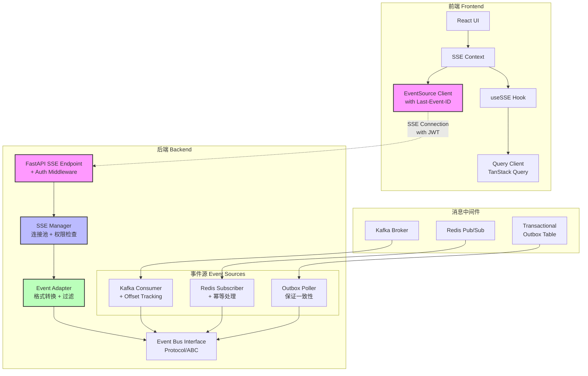

# SSE 实现方案

## 技术方案

### 1. 后端架构设计

采用分层架构实现 SSE：
- **API 层**：FastAPI SSE 端点，处理客户端连接
- **管理层**：SSEManager 管理连接池和事件分发
- **事件层**：EventBus 统一事件发布接口
- **集成层**：Kafka/Redis 订阅器，接收外部事件

### 2. 前端架构设计

基于 React Context 和 Hooks 实现：
- **SSEContext**：管理 SSE 连接生命周期
- **useSSE Hook**：订阅特定事件类型
- **EventHandler**：处理不同类型的事件
- **自动重连机制**：处理连接中断

### 3. 事件流设计

事件格式遵循标准 SSE 规范：
```
event: task.progress
data: {"task_id": "123", "progress": 50, "message": "Processing..."}
id: 1234567890
retry: 5000
```

## 架构设计

### 改进后的系统架构

基于评审建议，在原有架构基础上增加了以下改进：
1. 在 EventBus 和 SSEManager 之间新增 **Adapter/Formatter 层**
2. 增加了 **事件补偿机制** 支持断线重连后的事件重放
3. 明确了与 **Transactional Outbox** 的集成关系

### 系统架构图



### SSE 连接流程图


### 事件处理时序图


### 组件类图


## 实现细节

### 后端实现要点

1. **连接管理**
   - 使用 asyncio.Queue 管理每个客户端的事件队列
   - 实现心跳机制检测断开的连接
   - 限制每个用户的最大连接数

2. **事件过滤与授权**
   - **多标签订阅**：连接建立后通过 POST /events/subscribe 动态增删 filter set
   - **RBAC 检查**：在 JWT 中包含 user_id，SSEManager 中进行权限验证
   - **分级广播**：SystemNotification 等全局事件使用单独 channel
   - 支持同时订阅多个 novel/task 的事件

3. **性能优化**
   - 使用连接池管理数据库连接
   - 批量处理事件减少网络开销
   - 实现事件去重机制
   - **背压机制**：当队列长度 > N 时，丢弃低优先级事件或合并增量（如进度条只保留最后一条）
   - **心跳保活**：每 15 秒发送 `:\n\n` 保持连接活跃，前端 30 秒无数据则重连
   - **连接限制**：设置 --max-clients 参数，超出限制回退到轮询模式

### 前端实现要点

1. **连接管理**
   - 使用 React Context 全局管理 SSE 连接
   - 实现指数退避重连策略
   - 处理页面切换时的连接保持

2. **事件处理**
   - 使用事件总线模式分发事件
   - 实现事件缓存避免丢失
   - 支持离线事件队列

3. **错误处理**
   - 捕获网络错误并自动重试
   - 提供降级到轮询的备选方案
   - 显示连接状态指示器

4. **与 TanStack Query 集成**
   - 约定事件字段 `entity_type` + `action`
   - 前端统一映射到 `queryClient.invalidateQueries(['entity_type', id])`
   - 减少手工 wiring，自动处理缓存失效

## 数据模型设计

### 事件模型架构决策

经过分析，SSE 事件模型将放置在 `packages/shared-types/src/sse_events.py` 中，原因如下：

1. **关注点分离**
   - `events.py` - 专注于 Kafka 事件（微服务间通信）
   - `sse_events.py` - 专注于 SSE 事件（服务器到浏览器推送）
   - 两种事件用途和格式完全不同，应该分开管理

2. **格式差异**
   ```python
   # Kafka 事件 - 复杂业务对象
   class NovelCreatedEvent(BaseEvent):
       novel_data: NovelModel
       created_by: str
   
   # SSE 事件 - W3C 标准文本流格式
   class SSEMessage(BaseModel):
       event: str  # 事件类型
       data: Dict[str, Any]  # 事件数据（将序列化为 JSON）
       id: Optional[str]  # 事件 ID
       retry: Optional[int]  # 重连延迟
   ```

3. **前后端共享需求**
   - SSE 事件类型需要在 TypeScript 中定义
   - 确保前后端类型安全和契约一致性

### SSE 事件类型定义

```python
# packages/shared-types/src/sse_events.py

# 基础 SSE 消息格式
class SSEMessage(BaseModel):
    """SSE 消息格式（遵循 W3C 规范）"""
    event: str  # 事件类型，使用 kebab-case.verb-past 格式（如 task.progress-updated）
    data: Dict[str, Any]  # 事件数据
    id: Optional[str] = None  # 事件 ID，格式：{source}:{partition}:{offset}
    retry: Optional[int] = None  # 重连延迟（毫秒）
    scope: Literal["user", "session", "novel", "global"]  # 事件作用域，用于前端路由
    version: str = "1.0"  # 事件版本，用于兼容性
    
    def to_sse_format(self) -> str:
        """转换为标准 SSE 文本格式"""
        lines = []
        if self.id:
            lines.append(f"id: {self.id}")
        lines.append(f"event: {self.event}")
        # 添加 scope 和 version 到 data
        data_with_meta = {
            **self.data,
            "_scope": self.scope,
            "_version": self.version
        }
        lines.append(f"data: {json.dumps(data_with_meta, ensure_ascii=False)}")
        if self.retry:
            lines.append(f"retry: {self.retry}")
        lines.append("")  # 空行结束
        return "\n".join(lines)

# 具体事件类型
class TaskProgressEvent(BaseModel):
    """任务进度更新"""
    task_id: str
    progress: int  # 0-100
    message: Optional[str]

class TaskStatusChangeEvent(BaseModel):
    """任务状态变更"""
    task_id: str
    old_status: str
    new_status: str
    timestamp: datetime

class SystemNotificationEvent(BaseModel):
    """系统通知"""
    level: Literal["info", "warning", "error"]
    title: str
    message: str

class ContentUpdateEvent(BaseModel):
    """内容更新通知"""
    entity_type: str  # "novel", "chapter", "character" 等
    entity_id: str
    action: Literal["created", "updated", "deleted"]
    summary: Optional[str]

class ErrorEvent(BaseModel):
    """错误/告警事件"""
    level: Literal["warning", "error", "critical"]
    code: str  # 错误码，如 "SSE_CONNECTION_LIMIT"
    message: str  # 用户友好的错误信息
    correlation_id: Optional[str] = None  # 关联请求 ID，用于追踪
    details: Optional[Dict[str, Any]] = None  # 额外的错误上下文
```

### TypeScript 类型定义

相应的 TypeScript 类型将添加到 `packages/shared-types/src/index.ts`：

```typescript
// SSE 事件类型
export interface SSEMessage {
  event: string;  // kebab-case.verb-past 格式
  data: Record<string, any> & {
    _scope: 'user' | 'session' | 'novel' | 'global';
    _version: string;
  };
  id?: string;
  retry?: number;
}

export interface TaskProgressEvent {
  task_id: string;
  progress: number;
  message?: string;
  task_type?: string;
}

export interface TaskStatusChangeEvent {
  task_id: string;
  old_status: string;
  new_status: string;
  timestamp: string;
}

export interface ErrorEvent {
  level: 'warning' | 'error' | 'critical';
  code: string;
  message: string;
  correlation_id?: string;
  details?: Record<string, any>;
}

// ... 其他事件类型
```

## 事件补偿机制（P0）

### 设计原理

为保证断线重连后不丢失事件，实现基于 `Last-Event-ID` 的事件补偿：

1. **事件 ID 设计**
   - 使用 Kafka offset 或递增 cursor 作为事件 ID
   - 格式：`{source}:{partition}:{offset}` 或 `{timestamp}:{sequence}`

2. **客户端重连流程**
   ```javascript
   const eventSource = new EventSource('/api/v1/events/stream', {
     headers: {
       'Authorization': `Bearer ${token}`,
       'Last-Event-ID': lastEventId  // 断线前最后接收的事件 ID
     }
   });
   ```

3. **服务端事件重放**
   ```python
   async def replay_events(last_event_id: str, client_id: str):
       # 解析 last_event_id 获取 offset
       source, partition, offset = parse_event_id(last_event_id)
       
       # 从 Kafka 重放事件
       if source == "kafka":
           events = await kafka_consumer.seek_and_fetch(partition, offset)
       # 从 Redis Stream 重放
       elif source == "redis":
           events = await redis.xrange(stream_key, start=offset)
       
       # 过滤并推送给客户端
       for event in events:
           if await check_permission(event, client_id):
               await send_to_client(client_id, event)
   ```

4. **事件缓存策略**
   - 在 Redis 中维护最近 N 分钟的事件缓存
   - 使用 Redis Stream 或 Sorted Set 存储
   - 超过时间窗口的事件从 Kafka 获取

## Kafka → SSE 事件映射（P0）

### 映射规则表

| Kafka Event Type | SSE Event | 过滤 Key | Scope | 数据转换 |
|-----------------|-----------|----------|-------|----------|
| NovelCreatedEvent | novel.created | user_id | user | 精简为 {id, title, status} |
| ChapterDraftCreatedEvent | chapter.draft-created | novel_id | novel | 包含 {chapter_id, number, title} |
| TaskProgressUpdateEvent | task.progress-updated | task_id, user_id | session | 保留 {progress, message, task_type} |
| GenesisStepCompletedEvent | genesis.step-completed | session_id | session | 提取 {stage, status, summary} |
| WorkflowStatusChangedEvent | workflow.status-changed | novel_id | novel | 状态转换信息 |
| SystemMaintenanceEvent | system.maintenance-scheduled | - | global | 通知内容 |
| TaskFailedEvent | task.failed | task_id, user_id | session | 错误信息（转为 ErrorEvent）|

### 事件格式规范

1. **事件命名约定**
   - 使用 `kebab-case.verb-past` 格式，与 Kafka DomainEvent 保持一致
   - 域名使用 kebab-case，动作使用过去时
   - 示例：`task.progress-updated`, `novel.status-changed`, `chapter.draft-created`
   - 错误事件：`error.connection-limit-exceeded`, `error.auth-failed`

2. **事件作用域（scope）**
   - `user` - 仅推送给特定用户
   - `session` - 推送给特定会话
   - `novel` - 推送给订阅特定小说的用户
   - `global` - 系统级广播

3. **错误事件格式**
   ```python
   class SSEErrorEvent(BaseModel):
       """SSE 错误事件"""
       level: Literal["warning", "error", "critical"]
       code: str  # 错误码
       message: str  # 用户友好的错误信息
       correlation_id: Optional[str]  # 关联请求 ID
       retry_after: Optional[int]  # 建议重试时间（秒）
   ```

## 风险评估

### 技术风险

1. **连接数限制**
   - 风险：大量并发连接可能耗尽服务器资源
   - 对策：实现连接池限制和负载均衡

2. **网络不稳定**
   - 风险：频繁断线重连影响用户体验
   - 对策：实现智能重连和事件缓存

3. **浏览器兼容性**
   - 风险：老版本浏览器不支持 EventSource
   - 对策：提供 polyfill 或降级方案

### 安全风险

1. **未授权访问**
   - 风险：恶意用户订阅他人事件
   - 对策：实现基于 JWT 的认证和权限检查

2. **DDoS 攻击**
   - 风险：大量连接请求导致服务不可用
   - 对策：实现速率限制和连接数限制

## 测试计划

### 单元测试

1. **后端测试**
   - SSEManager 连接管理功能
   - EventBus 事件分发逻辑
   - 事件过滤和权限检查

2. **前端测试**
   - SSE Context 状态管理
   - 重连逻辑测试
   - 事件处理器测试

### 集成测试

1. **端到端测试**
   - 完整的事件流测试
   - 断线重连测试
   - 并发连接测试

2. **性能测试**
   - 1000+ 并发连接测试
   - 事件吞吐量测试
   - 内存泄漏检测

### 兼容性测试

1. **浏览器测试**
   - Chrome/Firefox/Safari 最新版
   - Edge 兼容性测试
   - 移动端浏览器测试

2. **网络环境测试**
   - 弱网环境测试
   - 代理服务器测试
   - 防火墙穿透测试

## 性能与资源管理

### 内存估算
- 单连接内存占用：Queue + 缓冲区 ≈ 10-50 KB
- 10k 连接场景：平均队列 20 条 × 1KB/条 = ~200 MB（可接受）
- 建议使用 uvloop 或 trio 降低调度开销

### 监控指标（基础版）
```python
# 核心指标（无需 Prometheus，可用内存变量）
sse_metrics = {
    "current_connections": 0,
    "total_connections": 0,
    "events_sent": 0,
    "queue_overflow_count": 0,
    "max_queue_size": 0,
    "connection_errors": 0
}
```

## 结构化日志（MVP）

```python
# SSE 连接生命周期日志
logger.info("sse_connection_established", extra={
    "client_id": client_id,
    "user_id": user_id,
    "ip": client_ip,
    "user_agent": user_agent,
    "last_event_id": last_event_id
})

logger.info("sse_connection_closed", extra={
    "client_id": client_id,
    "duration": duration,
    "events_sent": events_sent,
    "reason": close_reason
})
```