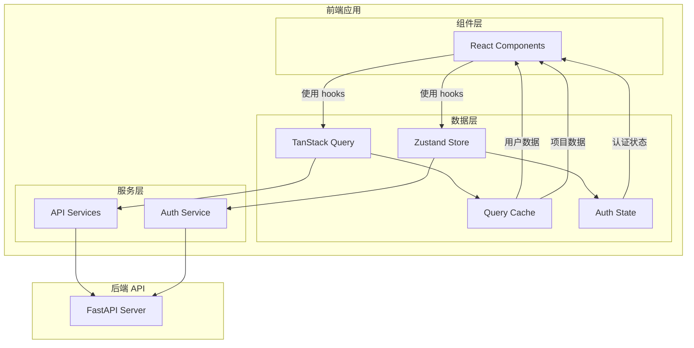
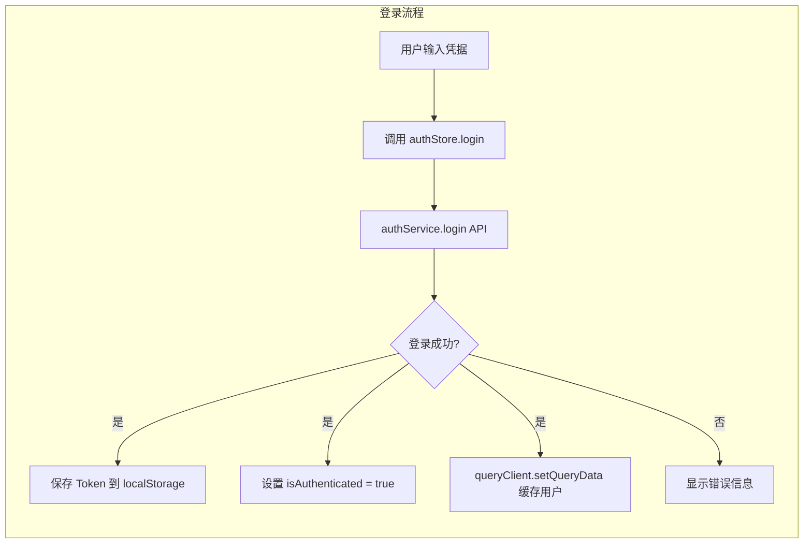
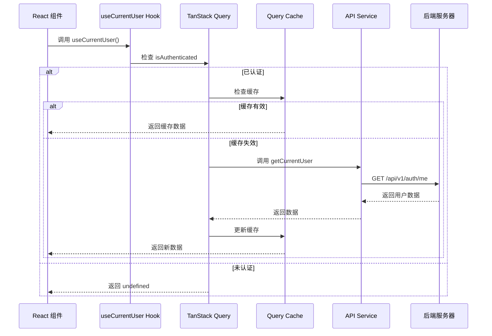
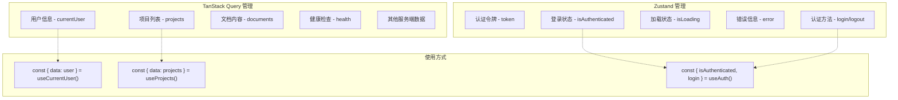

# 实现方案

## 技术方案

### 1. 核心概念
- **Server State**: 来自服务器的数据，由 TanStack Query 统一管理
- **Client State**: 客户端状态（认证令牌、登录状态），由 Zustand 管理
- **单一数据源**: 每种数据只在一个地方存储，避免同步问题

### 2. 实现步骤

#### 2.1 配置 QueryClient 和 Provider
```typescript
// src/lib/queryClient.ts
import { QueryClient } from '@tanstack/react-query'

export const queryClient = new QueryClient({
  defaultOptions: {
    queries: {
      staleTime: 1000 * 60 * 5, // 5分钟默认值
      cacheTime: 1000 * 60 * 10, // 10分钟默认值
      retry: 1,
      refetchOnWindowFocus: false,
    },
    mutations: {
      retry: 0, // mutations 不重试
    },
  },
})

// 资源特定的配置
export const queryOptions = {
  user: {
    staleTime: 1000 * 60 * 10, // 用户数据10分钟新鲜
    cacheTime: 1000 * 60 * 30, // 缓存30分钟
  },
  projects: {
    staleTime: 1000 * 60 * 2, // 项目列表2分钟新鲜
    cacheTime: 1000 * 60 * 10,
  },
  health: {
    staleTime: 1000 * 30, // 健康检查30秒
    cacheTime: 1000 * 60,
  },
}
```

#### 2.2 创建 useCurrentUser Hook
```typescript
// src/hooks/useCurrentUser.ts
export const useCurrentUser = () => {
  const { isAuthenticated } = useAuthStore()
  
  return useQuery({
    queryKey: ['currentUser'],
    queryFn: authService.getCurrentUser,
    enabled: isAuthenticated,
    ...queryOptions.user,
    // 处理 token 过期的情况
    onError: (error: any) => {
      if (error.status_code === 401) {
        // Token 过期，触发刷新或登出
        useAuthStore.getState().handleTokenExpired()
      }
    },
  })
}
```

#### 2.3 改造 Auth Store
```typescript
// src/hooks/useAuth.ts
interface AuthStore {
  // 只保留认证相关状态
  isAuthenticated: boolean
  isLoading: boolean
  error: string | null
  
  // 认证操作
  login: (credentials: LoginRequest) => Promise<LoginResult>
  logout: () => Promise<void>
  refreshToken: () => Promise<void>
  handleTokenExpired: () => Promise<void>
  
  // 不再存储 user 对象
}

// 实现示例
const login = async (credentials: LoginRequest) => {
  try {
    const { user, access_token, refresh_token } = await authService.login(credentials)
    
    // 保存 token
    authService.setTokens(access_token, refresh_token)
    set({ isAuthenticated: true, error: null })
    
    // 写入用户数据到 Query Cache
    queryClient.setQueryData(['currentUser'], user)
    
    return { success: true, data: { user, access_token, refresh_token } }
  } catch (error) {
    const apiError = error as ApiError
    set({ isAuthenticated: false, error: apiError.detail })
    return { success: false, error: apiError.detail }
  }
}

const logout = async () => {
  try {
    await authService.logout()
  } finally {
    // 清理认证状态
    authService.clearTokens()
    set({ isAuthenticated: false, error: null })
    
    // 清理所有缓存
    queryClient.removeQueries({ queryKey: ['currentUser'] })
    queryClient.clear() // 清理所有其他缓存的数据
  }
}
```

#### 2.4 创建 Mutation Hooks
```typescript
// src/hooks/useAuthMutations.ts
export const useLogin = () => {
  return useMutation({
    mutationFn: authService.login,
    onSuccess: (data) => {
      // 更新认证状态
      useAuthStore.getState().setAuthenticated(true)
      // 设置用户缓存
      queryClient.setQueryData(['currentUser'], data.user)
    },
    onError: (error: ApiError) => {
      useAuthStore.getState().setError(error.detail)
    },
  })
}

export const useUpdateProfile = () => {
  return useMutation({
    mutationFn: authService.updateProfile,
    onSuccess: (updatedUser) => {
      // 更新缓存中的用户数据
      queryClient.setQueryData(['currentUser'], updatedUser)
    },
    // 乐观更新示例
    onMutate: async (newData) => {
      // 取消相关查询
      await queryClient.cancelQueries({ queryKey: ['currentUser'] })
      
      // 保存当前数据快照
      const previousUser = queryClient.getQueryData(['currentUser'])
      
      // 乐观更新
      queryClient.setQueryData(['currentUser'], (old: User) => ({
        ...old,
        ...newData,
      }))
      
      // 返回快照，用于错误回滚
      return { previousUser }
    },
    onError: (err, newData, context) => {
      // 回滚到之前的数据
      queryClient.setQueryData(['currentUser'], context?.previousUser)
    },
    onSettled: () => {
      // 无论成功失败，都重新获取最新数据
      queryClient.invalidateQueries({ queryKey: ['currentUser'] })
    },
  })
}
```

## 架构设计

### 系统架构图


### 数据流图


### 组件数据获取流程


### 状态管理职责划分


## 迁移策略

### 第一阶段：基础设施
1. 配置 QueryClient
2. 在 App.tsx 添加 QueryClientProvider
3. 创建 useCurrentUser hook

### 第二阶段：认证流程改造
1. 修改 login 方法，登录成功后设置 Query Cache
2. 修改 logout 方法，清理 Query Cache
3. 修改 useAuth hook，移除 user 状态

### 第三阶段：组件迁移（按风险从低到高）
1. **低风险组件**（先行验证）
   - 导航栏用户信息显示
   - Profile 页面（只读展示）
   - Dashboard 欢迎信息

2. **中风险组件**
   - RequireAuth 组件（核心但改动简单）
   - ChangePassword 页面（涉及状态更新）
   
3. **高风险组件**
   - 登录/注册流程
   - Token 刷新逻辑
   - 错误边界处理

4. **迁移模板**
   ```typescript
   // 旧代码
   const { user, isLoading } = useAuth()
   
   // 新代码
   const { data: user, isLoading, error } = useCurrentUser()
   ```

## 风险评估

### 技术风险
1. **缓存一致性**: 需要在适当时机使缓存失效
   - 缓解措施：使用 invalidateQueries 在关键操作后刷新
   
2. **性能影响**: 初次加载可能有额外请求
   - 缓解措施：合理设置 staleTime 和 cacheTime

3. **迁移复杂度**: 需要修改多个组件
   - 缓解措施：分阶段迁移，保持向后兼容

### 业务风险
1. **用户体验**: 迁移过程中可能出现数据不一致
   - 缓解措施：充分测试，分步上线

## 测试计划

### 测试覆盖率目标
- 单元测试覆盖率：≥ 85%
- 集成测试覆盖率：≥ 70%
- E2E 测试：覆盖所有关键用户流程

### 单元测试
- 测试 useCurrentUser hook 的各种场景
  - 未认证状态返回 undefined
  - 认证后正确获取数据
  - 缓存命中测试
  - 错误处理测试
- 测试认证流程的缓存设置
  - login 成功后缓存写入
  - token 过期后的处理
- 测试 logout 的缓存清理
- 测试 mutation hooks（乐观更新、错误回滚）

### 集成测试
- 测试完整的登录/登出流程
- 测试 token 刷新时的数据同步
- 测试多组件间的数据一致性
- 测试并发请求的缓存行为
- 测试网络错误的降级处理

### E2E 测试
- 确保现有的认证相关 E2E 测试通过
- 添加数据同步相关的测试场景
  - 多标签页数据同步
  - 离线/在线切换
  - Session 过期处理

### 手动测试清单
- [ ] 登录后用户信息正确显示
- [ ] 刷新页面后用户信息保持
- [ ] 修改个人资料后所有组件更新
- [ ] 登出后缓存正确清理
- [ ] Token 过期时的处理正确
- [ ] 网络断开重连后数据恢复
- [ ] 多标签页登出同步