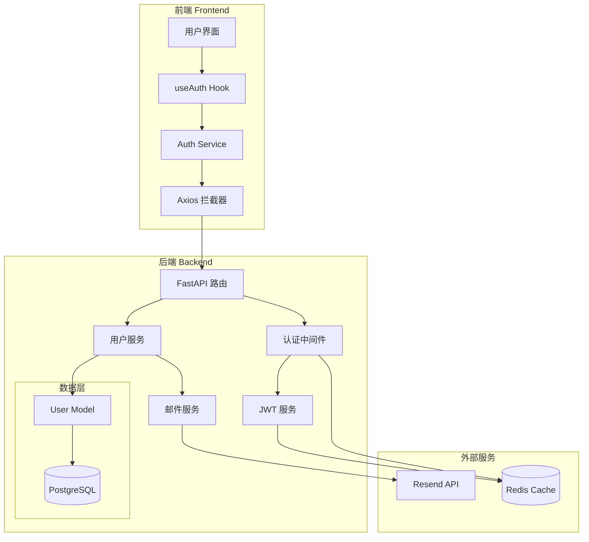
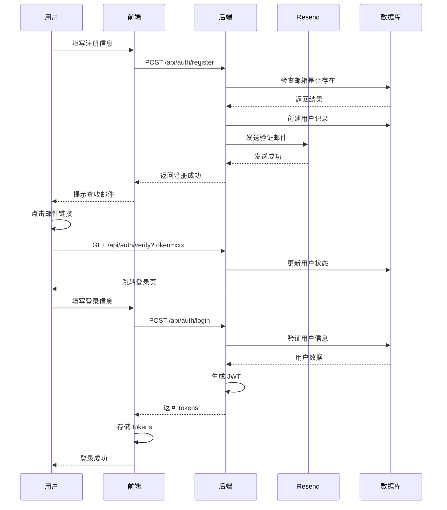
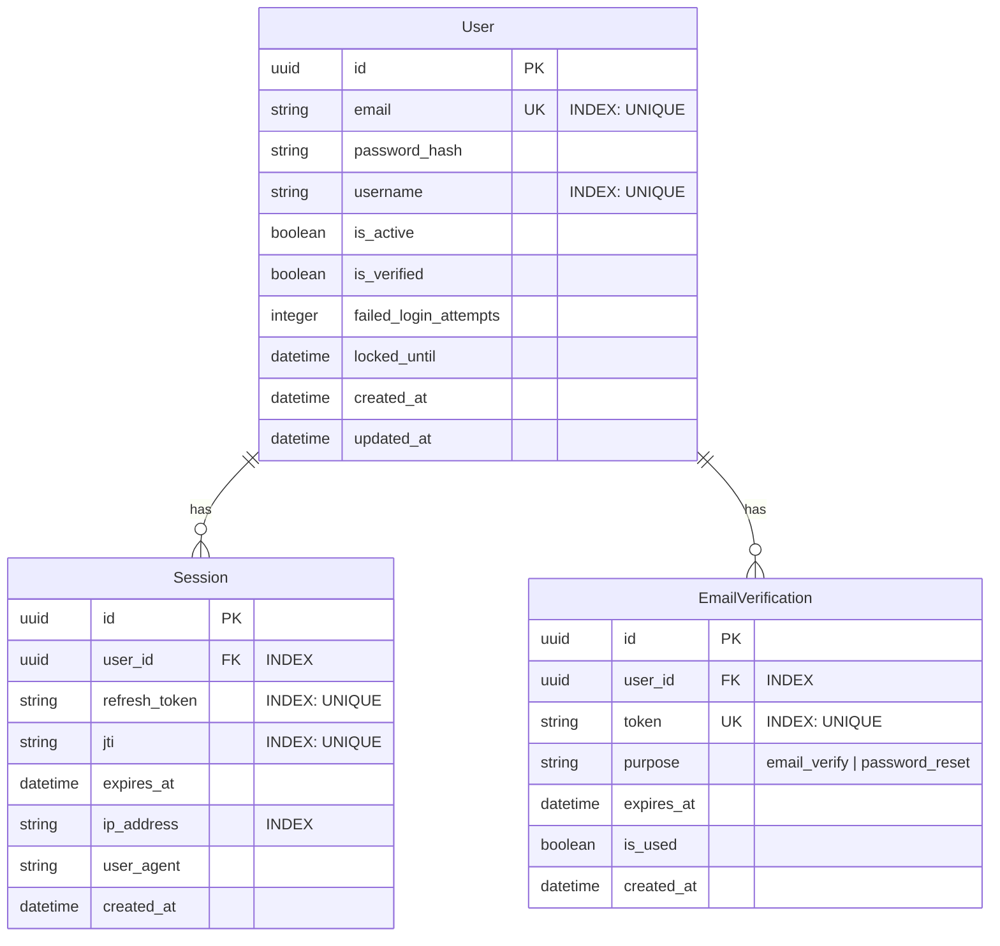

# 用户认证MVP实现方案

## 技术方案

### 技术栈选择
- **后端**: FastAPI + SQLAlchemy + PostgreSQL + Redis
  - python-jose[cryptography] - JWT 生成和验证
  - passlib[bcrypt] - 密码加密
  - slowapi - Rate Limiting
  - alembic - 数据库迁移
- **前端**: Vite + React + React Router + Zustand
  - axios - HTTP 客户端
  - react-hook-form + zod - 表单验证
  - @tanstack/react-query - 数据获取和缓存
- **邮件服务**: Resend API
- **测试**: Pytest + Vitest + Testcontainers

### 认证流程设计
1. **注册流程**
   - 用户提交邮箱和密码
   - 后端验证邮箱唯一性
   - 密码加密存储
   - 生成邮箱验证码
   - 通过 Resend 发送验证邮件
   - 用户点击验证链接激活账号

2. **登录流程**
   - 用户提交邮箱和密码
   - 验证账号是否已激活
   - 验证密码正确性
   - 生成 JWT tokens
   - 返回 tokens 和用户信息

3. **Token 管理**
   - Access Token: 15分钟有效期（开发环境可配置）
   - Refresh Token: 7天有效期
   - 自动刷新机制
   - Token Rotation（刷新时废弃旧 Token）
   - Redis 黑名单机制

4. **忘记密码流程**
   - 用户提交邮箱
   - 生成密码重置 Token（1小时有效）
   - 发送重置邮件
   - 用户点击链接并设置新密码
   - 自动登录并清除重置 Token

## 架构设计

### 系统架构图



### 认证流程图

```mermaid
flowchart LR
    Start[开始] --> Register{注册/登录?}
    
    Register -->|注册| RegForm[填写注册表单]
    RegForm --> ValidateEmail[验证邮箱格式]
    ValidateEmail --> CheckUnique[检查邮箱唯一性]
    CheckUnique --> HashPwd[密码加密]
    HashPwd --> SaveUser[保存用户]
    SaveUser --> SendEmail[发送验证邮件]
    SendEmail --> WaitVerify[等待验证]
    WaitVerify --> Activate[激活账号]
    Activate --> LoginPage[跳转登录]
    
    Register -->|登录| LoginForm[填写登录表单]
    LoginPage --> LoginForm
    LoginForm --> CheckUser[验证用户]
    CheckUser --> CheckActive[检查激活状态]
    CheckActive --> VerifyPwd[验证密码]
    VerifyPwd --> GenTokens[生成 Tokens]
    GenTokens --> StoreTokens[存储 Tokens]
    StoreTokens --> Success[登录成功]
```



### 时序图



### 数据模型



### 索引策略

1. **User 表**
   - `email`: 唯一索引（用于登录查询）
   - `username`: 唯一索引（防止重复）
   - `(is_active, is_verified)`: 复合索引（查询活跃用户）

2. **Session 表**
   - `refresh_token`: 唯一索引（Token 验证）
   - `jti`: 唯一索引（JWT ID 查询）
   - `user_id`: 普通索引（查询用户会话）
   - `ip_address`: 普通索引（安全审计）
   - `(user_id, expires_at)`: 复合索引（清理过期会话）

3. **EmailVerification 表**
   - `token`: 唯一索引（验证链接查询）
   - `user_id`: 普通索引（查询用户验证记录）
   - `(purpose, expires_at)`: 复合索引（清理过期记录）

## API 设计

### 认证端点

```
POST   /api/auth/register          # 用户注册
POST   /api/auth/login             # 用户登录
POST   /api/auth/logout            # 用户登出
POST   /api/auth/refresh           # 刷新 Token
GET    /api/auth/verify            # 邮箱验证
POST   /api/auth/resend            # 重发验证邮件
POST   /api/auth/forgot-password   # 忘记密码
POST   /api/auth/reset-password    # 重置密码
GET    /api/auth/me                # 获取当前用户信息
```

### 请求/响应示例

```json
// 注册请求
POST /api/auth/register
{
  "email": "user@example.com",
  "password": "securePassword123",
  "username": "johndoe"
}

// 注册响应
{
  "message": "Registration successful. Please check your email.",
  "user": {
    "id": "uuid",
    "email": "user@example.com",
    "username": "johndoe"
  }
}

// 登录请求
POST /api/auth/login
{
  "email": "user@example.com",
  "password": "securePassword123"
}

// 登录响应
{
  "access_token": "eyJ...",
  "refresh_token": "eyJ...",
  "token_type": "bearer",
  "user": {
    "id": "uuid",
    "email": "user@example.com",
    "username": "johndoe"
  }
}

// 忘记密码请求
POST /api/auth/forgot-password
{
  "email": "user@example.com"
}

// 忘记密码响应
{
  "message": "Password reset email sent. Please check your inbox."
}

// 重置密码请求
POST /api/auth/reset-password
{
  "token": "reset-token-from-email",
  "new_password": "newSecurePassword123"
}

// 重置密码响应
{
  "message": "Password reset successful.",
  "access_token": "eyJ...",
  "refresh_token": "eyJ...",
  "token_type": "bearer"
}
```

## 安全措施

### 密码安全
- 使用 bcrypt 加密，cost factor = 12
- 密码强度要求：最少8位，包含大小写字母和数字
- 密码重置链接有效期：1小时

### Token 安全
- Access Token 短期有效（15分钟，开发环境可配置）
- Refresh Token 存储在 httpOnly cookie
- Token 黑名单机制（Redis）
- Token Rotation：每次刷新废弃旧 Token
- 防重放攻击：Token 包含 jti（JWT ID）

### 请求安全
- Rate Limiting: 5次/分钟（登录），10次/分钟（注册）
- CSRF 保护
- CORS 配置
- SQL 注入防护（使用 ORM）

## 风险评估

### 技术风险
1. **邮件发送失败**
   - 缓解：实现重试机制，提供手动重发功能
   
2. **Token 泄露**
   - 缓解：短期 Access Token，Refresh Token rotation
   
3. **暴力破解**
   - 缓解：Rate limiting，账号锁定机制

### 业务风险
1. **用户体验**
   - 邮件延迟可能影响注册体验
   - 缓解：优化邮件模板，提供清晰的提示

2. **扩展性**
   - MVP 版本可能需要后续添加 OAuth
   - 缓解：设计可扩展的认证架构

## 测试计划

### 单元测试
- 密码加密/验证
- JWT 生成/验证
- 用户模型 CRUD
- 邮件模板渲染

### 集成测试
- 完整注册流程
- 登录/登出流程
- Token 刷新流程
- 邮件发送

### E2E 测试
- 用户注册并激活账号
- 登录并访问受保护资源
- Token 自动刷新
- 并发登录测试

### 安全测试
- SQL 注入测试
- XSS 测试
- CSRF 测试
- 暴力破解测试

## JWT 实现细节

### 后端 JWT 实现示例

```python
# apps/backend/src/services/jwt.py
import os
import uuid
from datetime import datetime, timedelta
from typing import Optional
from jose import jwt, JWTError
from passlib.context import CryptContext
from pydantic import BaseModel
import redis

# Redis 客户端
redis_client = redis.from_url(os.getenv("REDIS_URL", "redis://localhost:6379"))

# 密码加密上下文
pwd_context = CryptContext(schemes=["bcrypt"], deprecated="auto")

# JWT 配置
SECRET_KEY = os.getenv("JWT_SECRET_KEY")  # 必须从环境变量读取
ALGORITHM = "HS256"
ACCESS_TOKEN_EXPIRE_MINUTES = int(os.getenv("ACCESS_TOKEN_EXPIRE_MINUTES", "15"))
REFRESH_TOKEN_EXPIRE_DAYS = int(os.getenv("REFRESH_TOKEN_EXPIRE_DAYS", "7"))

class TokenData(BaseModel):
    user_id: str
    email: str
    jti: str  # JWT ID，用于黑名单
    exp: Optional[datetime] = None
    type: str  # "access" 或 "refresh"

def create_access_token(data: dict) -> str:
    """创建访问令牌"""
    to_encode = data.copy()
    expire = datetime.utcnow() + timedelta(minutes=ACCESS_TOKEN_EXPIRE_MINUTES)
    jti = str(uuid.uuid4())
    to_encode.update({
        "exp": expire, 
        "type": "access",
        "jti": jti
    })
    return jwt.encode(to_encode, SECRET_KEY, algorithm=ALGORITHM)

def create_refresh_token(data: dict) -> str:
    """创建刷新令牌"""
    to_encode = data.copy()
    expire = datetime.utcnow() + timedelta(days=REFRESH_TOKEN_EXPIRE_DAYS)
    jti = str(uuid.uuid4())
    to_encode.update({
        "exp": expire, 
        "type": "refresh",
        "jti": jti
    })
    return jwt.encode(to_encode, SECRET_KEY, algorithm=ALGORITHM)

def verify_token(token: str, token_type: str = "access") -> Optional[TokenData]:
    """验证令牌（包含黑名单检查）"""
    try:
        payload = jwt.decode(token, SECRET_KEY, algorithms=[ALGORITHM])
        if payload.get("type") != token_type:
            return None
        
        # 检查黑名单
        jti = payload.get("jti")
        if jti and is_token_blacklisted(jti):
            return None
            
        return TokenData(**payload)
    except JWTError:
        return None

def add_token_to_blacklist(jti: str, exp: datetime):
    """将 Token 加入黑名单"""
    # 计算 TTL，确保黑名单记录在 token 过期后自动删除
    ttl = int((exp - datetime.utcnow()).total_seconds())
    if ttl > 0:
        redis_client.setex(f"blacklist:{jti}", ttl, "1")

def is_token_blacklisted(jti: str) -> bool:
    """检查 Token 是否在黑名单中"""
    return redis_client.exists(f"blacklist:{jti}") > 0

def rotate_refresh_token(old_token: str) -> Optional[tuple[str, str]]:
    """刷新 Token（实现 rotation）"""
    token_data = verify_token(old_token, "refresh")
    if not token_data:
        return None
    
    # 将旧 refresh token 加入黑名单
    add_token_to_blacklist(token_data.jti, token_data.exp)
    
    # 生成新的 token 对
    user_data = {"user_id": token_data.user_id, "email": token_data.email}
    access_token = create_access_token(user_data)
    refresh_token = create_refresh_token(user_data)
    
    return access_token, refresh_token

def verify_password(plain_password: str, hashed_password: str) -> bool:
    """验证密码"""
    return pwd_context.verify(plain_password, hashed_password)

def get_password_hash(password: str) -> str:
    """获取密码哈希"""
    return pwd_context.hash(password)
```

### 认证中间件示例

```python
# apps/backend/src/middleware/auth.py
from fastapi import Depends, HTTPException, status
from fastapi.security import HTTPBearer, HTTPAuthorizationCredentials
from jose import JWTError
from .services.jwt import verify_token

security = HTTPBearer()

async def get_current_user(credentials: HTTPAuthorizationCredentials = Depends(security)):
    """获取当前用户"""
    token = credentials.credentials
    token_data = verify_token(token)
    
    if not token_data:
        raise HTTPException(
            status_code=status.HTTP_401_UNAUTHORIZED,
            detail="Invalid authentication credentials",
            headers={"WWW-Authenticate": "Bearer"},
        )
    
    # 从数据库获取用户
    user = await get_user_by_id(token_data.user_id)
    if not user:
        raise HTTPException(
            status_code=status.HTTP_404_NOT_FOUND,
            detail="User not found"
        )
    
    return user
```

### 前端 Token 管理示例

```typescript
// apps/frontend/src/services/auth.ts
import axios from 'axios';
import { create } from 'zustand';

// Token 存储在内存中
interface AuthState {
  accessToken: string | null;
  setAccessToken: (token: string | null) => void;
}

const useAuthStore = create<AuthState>((set) => ({
  accessToken: null,
  setAccessToken: (token) => set({ accessToken: token }),
}));

class AuthService {
  private refreshPromise: Promise<string | null> | null = null;

  setAccessToken(token: string | null) {
    useAuthStore.getState().setAccessToken(token);
  }

  getAccessToken(): string | null {
    return useAuthStore.getState().accessToken;
  }

  async refreshAccessToken(): Promise<string | null> {
    // 防止并发刷新
    if (this.refreshPromise) {
      return this.refreshPromise;
    }

    this.refreshPromise = axios.post('/api/auth/refresh', {}, {
      withCredentials: true  // 发送 httpOnly cookie
    })
    .then(response => {
      const { access_token } = response.data;
      this.setAccessToken(access_token);
      return access_token;
    })
    .catch(error => {
      // Token 刷新失败，需要重新登录
      this.logout();
      return null;
    })
    .finally(() => {
      this.refreshPromise = null;
    });

    return this.refreshPromise;
  }

  logout() {
    this.setAccessToken(null);
    // 清除 cookie（需要后端配合）
    axios.post('/api/auth/logout', {}, { withCredentials: true });
    window.location.href = '/login';
  }

  setupInterceptors() {
    // 请求拦截器 - 添加 token
    axios.interceptors.request.use(
      (config) => {
        const token = this.getAccessToken();
        if (token) {
          config.headers.Authorization = `Bearer ${token}`;
        }
        return config;
      },
      (error) => Promise.reject(error)
    );

    // 响应拦截器 - 处理 token 过期
    axios.interceptors.response.use(
      (response) => response,
      async (error) => {
        const originalRequest = error.config;
        
        if (error.response?.status === 401 && !originalRequest._retry) {
          originalRequest._retry = true;
          
          const newToken = await this.refreshAccessToken();
          if (newToken) {
            originalRequest.headers.Authorization = `Bearer ${newToken}`;
            return axios(originalRequest);
          }
        }
        
        return Promise.reject(error);
      }
    );
  }
}
```

## 实施步骤

1. **后端基础设施**（第1-2天）
   - 创建用户模型
   - 实现密码加密服务
   - 配置 JWT 服务
   - 集成 Redis

2. **认证 API**（第3-4天）
   - 实现注册端点
   - 实现登录端点
   - 实现 Token 刷新
   - 添加认证中间件

3. **邮件服务**（第5天）
   - 集成 Resend API
   - 创建邮件模板
   - 实现发送逻辑
   - 添加重试机制

4. **前端实现**（第6-7天）
   - 创建认证页面
   - 实现 useAuth Hook
   - 配置 Axios 拦截器
   - 添加路由保护

5. **测试与优化**（第8-9天）
   - 编写测试用例
   - 性能优化
   - 安全加固
   - 文档完善