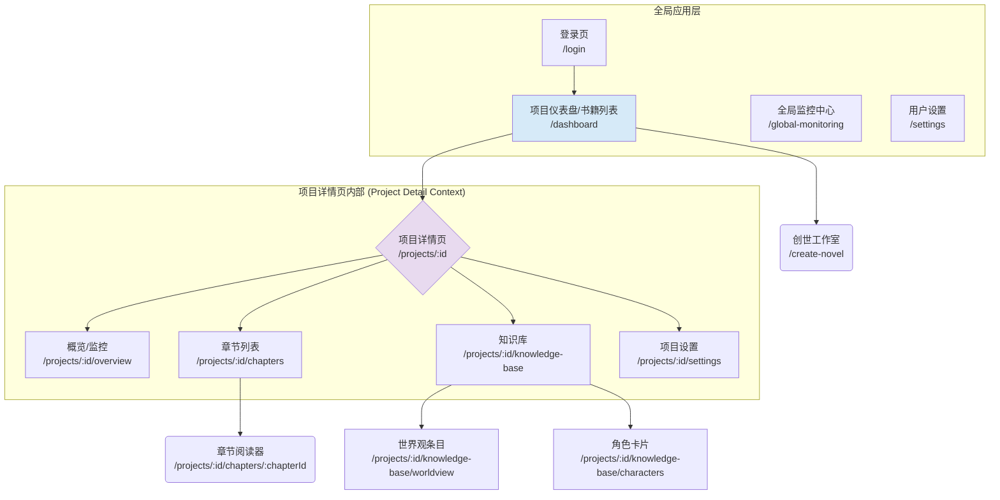
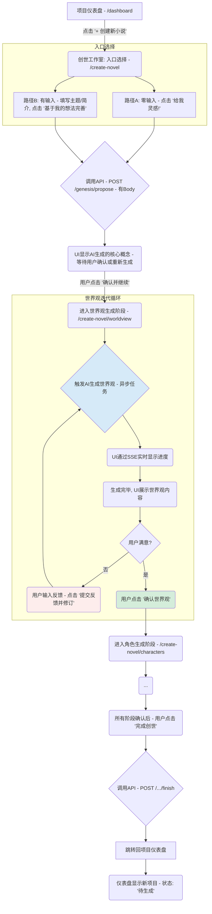
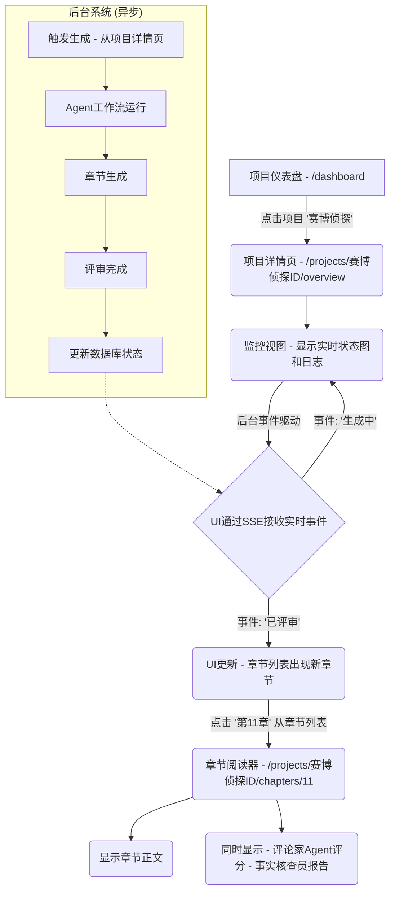

# 多智能体网络小说自动写作系统 UI/UX 规格文档

## 简介

本文档定义了“多智能体网络小说自动写作系统”的用户体验目标、信息架构、用户流程和视觉设计规范。它将作为视觉设计和前端开发的基石，确保为我们的“监督者”用户提供一个内聚且以用户为中心的体验。

### 整体UX目标与原则

#### 目标用户画像

*   **核心用户：** **内容平台的编辑与运营者**。他们是技术娴熟的专业人士，目标是高效地管理和监控规模化的内容生产。他们关心的是效率、控制力和结果的可预测性。
*   **次要用户：** **独立作者或小型团队**。他们可能需要更多的引导和辅助，但同样追求创作效率的提升。

#### 可用性目标

*   **清晰度 (Clarity):** 用户必须能在5秒内理解仪表盘上各个项目的核心状态（如“正在生成”、“需要审核”、“已失败”）。
*   **可控性 (Control):** 用户必须能够轻松地启动、暂停或中止任何一个创作流程，并清楚地知道其操作的后果。
*   **效率 (Efficiency):** 对于核心任务，如启动一个新章节的生成，所需的操作步骤不应超过3次点击。
*   **可发现性 (Discoverability):** 用户无需培训，就应该能通过界面直观地找到核心功能，如查看章节内容、监控日志等。

#### 设计原则

1.  **信息优先，而非界面 (Information over Interface):** UI应像一块干净的玻璃，让用户能毫无障碍地看到最重要的信息——数据和状态。避免不必要的装饰和动画。
2.  **提供上下文，而非仅有数据 (Context, not just Data):** 不仅要展示“章节生成失败”，还要提供快速入口，让用户能立刻看到相关的错误日志或失败原因。
3.  **渐进式披露 (Progressive Disclosure):** 默认展示最高层级、最重要的信息。只有当用户主动请求时，才展示更深层次的细节（如某个Agent的具体参数、完整的API调用日志）。
4.  **状态明确，反馈及时 (Clear States, Immediate Feedback):** 系统中的任何对象（小说、章节、工作流）都必须有明确的状态，并且用户的任何操作都应得到即时的、可见的反馈。
5.  **为专家设计，但对新手友好 (Design for Experts, but Welcome Novices):** 界面应为每天使用它的专业编辑提供强大的快捷方式和信息密度，但同时也为初次使用的作者提供清晰的向导和解释。

### Change Log

| Date | Version | Description | Author |
| :--- | :------ | :---------- | :----- |
|      | 1.0     | Initial Draft | Sally (UX Expert) |
|      | 1.1     | Updated IA, User Flows, and Screen Layouts based on PRD v1.3. | Sally (UX Expert) |
|      | 1.2     | Added detailed descriptions for core components (Button, Badge, Progress, Stepper, NovelReader). | Sally (UX Expert) |
|      | 2.0     | **重大更新**: 根据PRD v2.1，完全重构了“创世流程”的用户流程图和屏幕布局概念，以匹配新的“创世工作室”和“双入口”模式。所有章节已完整展开。 | Sally (UX Expert) |

## 信息架构 (IA)

### 站点地图 / 屏幕清单

这是我们应用的核心屏幕及其层级关系，以“项目仪表盘”为起点。



### 导航结构

#### 1. 全局主导航 (Global Primary Navigation)

*   **位置:** 通常实现为应用左侧的固定侧边栏，或顶部的水平导航栏。
*   **内容:** 根据PRD v1.3的“全局导航结构”定义，主要包含：
    1.  **项目仪表盘 (Dashboard):** 链接到 `/dashboard`。这是用户登录后的默认着陆页。
    2.  **全局监控中心 (Global Monitoring Center):** 链接到 `/global-monitoring`。用于查看系统级的整体健康状况、性能指标和成本分析（如果其功能与单个项目的监控视图显著不同）。
    3.  **用户设置 (User Settings):** 链接到 `/settings`。用于管理用户账户信息、偏好设置等。
*   **行为:** 此导航在应用的任何顶级视图中都应保持可见和一致。

#### 2. 项目内二级导航 (In-Project Secondary Navigation)

*   **位置:** 当用户从“项目仪表盘”进入一个具体的“项目详情页” (`/projects/:id`) 后，此导航通常显示在该项目详情页的左侧（如果主导航在顶部）或者作为项目详情页内部的标签页。
*   **内容:** 针对当前选定的书籍项目，提供内部功能的导航链接，例如：
    1.  **概览/监控 (Overview/Monitoring):** 链接到 `/projects/:id/overview` 或 `/projects/:id/monitoring`。显示当前书籍的生成状态、日志等。
    2.  **章节列表 (Chapters):** 链接到 `/projects/:id/chapters`。
    3.  **知识库 (Knowledge Base):** 链接到 `/projects/:id/knowledge-base`。展示当前书籍的设定、角色等。
    4.  **项目设置 (Project Settings):** 链接到 `/projects/:id/settings`。当前书籍的特定配置。
*   **行为:** 此导航仅在用户处于特定项目详情页的上下文中时出现。

#### 3. 项目切换机制

*   **位置:** 在“项目详情页”的显著位置，例如页面右上角或顶部导航栏中。
*   **形式:** 可以是一个显示当前项目名称的下拉菜单，点击后列出所有其他项目，并提供一个返回“项目仪表盘”的快捷链接。
*   **目的:** 允许用户在不返回主仪表盘的情况下，快速切换到另一个书籍项目进行查看或操作。

#### 4. 面包屑导航 (Breadcrumb Strategy)

*   我们将提供面包屑导航，以清晰地显示用户在应用层级结构中的当前位置，特别是在进入多层级的项目详情内部时。
*   **示例:**
    *   `仪表盘 > 项目: 赛博侦探`
    *   `仪表盘 > 项目: 赛博侦探 > 章节列表 > 第11章`
    *   `仪表盘 > 项目: 赛博侦探 > 知识库 > 角色: 艾拉`

## 用户流程

### 流程一：创建新小说 (创世工作室流程)

*   **用户目标:** 用户希望通过一个灵活、智能的流程，快速启动一个新小说项目，无论自己是否有初始想法。
*   **入口点:** **项目仪表盘 (`/dashboard`)** 上的“创建新小说”按钮。
*   **成功标准:** 用户成功确认了AI生成或完善的所有核心设定（世界观、角色、大纲），系统在数据库中创建了新的小说项目，并跳转回仪表盘，新项目出现在列表中。

#### 流程图 (双入口模式)



*   **边缘情况与错误处理:**
    *   如果任何异步生成任务失败，UI必须通过SSE接收到失败状态，并向用户显示清晰的错误信息和重试选项。
    *   系统应自动保存每个阶段确认过的内容，如果用户中途关闭浏览器，下次返回时可以从上次中断的阶段继续。

### 流程二：监控章节生成并查看结果

*   **用户目标:** 用户希望实时了解章节生成的进度，并在完成后方便地查看内容和评审结果。
*   **入口点:** 在**项目仪表盘 (`/dashboard`)** 点击一个正在进行中或已完成的书籍项目。
*   **成功标准:** 用户能够清晰地看到工作流的实时状态，并在章节生成后，能无缝地打开和阅读章节内容及其相关的AI评审意见。

#### 流程图



## 线框图与模型

### 主要设计文件

*   **设计工具:** 我们将使用 **Figma** 来进行详细的UI设计和原型制作。
*   **Figma链接:** `[待创建 - 创建后将在此处提供链接]`

### 关键屏幕布局概念

#### 1. 创世工作室 (Creation Studio - `/create-novel`)

*   **目的:** 取代旧的静态向导，提供一个动态的、交互式的工作空间来完成创世。
*   **布局 (多状态):**
    *   **状态A: 入口选择**
        *   页面标题：“开始一部新小说”。
        *   **左侧区域 (路径B):** 一个或多个文本框（“主题”、“一句话简介”等），下方有一个“基于我的想法完善”按钮。
        *   **右侧区域 (路径A):** 一个视觉上更吸引人的卡片或区域，上面有一个大大的“给我灵感！”按钮。
        *   用清晰的文本（如“或者”）分隔两个区域。
    *   **状态B: AI生成与用户确认 (通用)**
        *   这是一个通用的布局，用于后续所有阶段（核心概念、世界观、角色、大纲）。
        *   **左侧/主区域:** 内容展示区。
            *   当任务进行中时，显示一个带有实时日志或进度的加载状态组件（`LoadingSpinner`）。
            *   任务完成后，展示AI生成的文本或卡片式内容。
        *   **右侧/底部操作区:**
            *   一个反馈文本输入框。
            *   一个“提交反馈并修订”按钮（仅在有反馈时激活）。
            *   一个“重新生成”按钮（用于完全丢弃当前版本，重新开始本次迭代）。
            *   一个绿色的、主要的“确认并进入下一步”按钮。
    *   **顶部:** 一个步骤指示器（`Stepper`组件），清晰地显示当前所处阶段（`核心概念` -> `世界观` -> `角色` -> `初始大纲` -> `完成`），并高亮当前阶段。

```
// 状态B: 世界观阶段的布局概念
+-------------------------------------------------------------------+
| [步骤指示器: 核心概念(√) -> 世界观(Active) -> 角色 -> 大纲]         |
|-------------------------------------------------------------------|
| [主内容区 - 左侧]                                                 |
|   (若加载中: [加载动画 + "世界铸造师正在构建宏大世界..."])         |
|   (若完成: <h1>魔法系统</h1> <p>基于火与水的二元对立...</p>)  |
|   ...                                                             |
|-------------------------------------------------------------------|
| [操作区 - 右侧或底部]                                             |
|   [反馈输入框: "我觉得可以加入风元素..."]                         |
|   [按钮: 提交反馈并修订] [按钮: 重新生成]                         |
|   [主按钮: 确认世界观]                                            |
+-------------------------------------------------------------------+
```

#### 2. 项目仪表盘 / 书籍列表 (Dashboard / Book List - `/dashboard`)

*   **目的:** 作为应用的主要入口，提供所有小说项目的高层概览，并作为创建新项目的起点。
*   **布局:**
    *   **全局主导航:** (如侧边栏或顶部栏) 包含“仪表盘”、“全局监控中心”、“用户设置”。
    *   **页面标题:** “我的书籍项目”或类似。
    *   **右上角:** 一个显眼的“+ 创建新小说”按钮。
    *   **主区域:**
        *   如果用户没有任何书籍项目，显示一个欢迎信息和更突出的“创建您的第一部小说”的引导。
        *   如果用户有书籍项目，则以卡片式或表格布局展示。
        *   **每张卡片/每行包含:**
            *   小说标题 (可点击，导航到项目详情页)。
            *   当前状态（例如，`创世中`, `生成中`, `已暂停`, `已完成`）- 带有颜色标识的徽章。
            *   进度条/章节数（例如 `35 / 100 章`）。
            *   最近活动时间戳。
            *   快捷操作按钮（如“继续生成”、“查看详情”）。
*   **注意:** 此页面不包含特定于某个书籍项目的左侧导航栏。

#### 3. 项目详情页 (Project Detail View - `/projects/:id/*`)

*   **目的:** 提供特定书籍项目的详细信息、操作入口和内部导航。
*   **布局:**
    *   **全局主导航:** 保持可见。
    *   **顶部:** 面包屑导航 (`仪表盘 > 项目: [当前项目名] > [当前子页面]`)。
    *   **页面右上角/顶部显著位置:**
        *   显示当前项目名称。
        *   一个“切换项目”的下拉菜单或返回“项目仪表盘”的链接。
    *   **左侧项目内二级导航栏:**
        *   链接到当前项目的不同功能区，如“概览/监控”、“章节列表”、“知识库”、“项目设置”。
    *   **主内容区域 (根据二级导航选择而变化):**
        *   例如，选择“概览/监控”时，显示工作流状态图、实时事件日志、触发生成按钮等。
        *   选择“章节列表”时，显示所有章节，并可点击进入“章节阅读器”。
        *   选择“知识库”时，显示当前书籍的设定、角色等。

## 组件库 / 设计系统

### 设计系统方法

*   **基础:** 我们将采用 **Shadcn UI** 作为我们的基础组件库。
*   **定制化:** 在项目中创建 `components/ui` (存放Shadcn基础组件或其微调版本) 和 `components/custom` (存放业务相关的复合组件)。
*   **原则:** 优先使用或组合Shadcn UI提供的组件。

### 核心组件

#### 1. ProjectCard (项目卡片 - 自定义)

*   **目的:** 用于在“项目仪表盘”上展示每个小说项目。
*   **构成:** `Card`, `CardHeader`, `CardTitle`, `CardDescription`, `CardContent`, `CardFooter` (Shadcn基础), `Badge` (用于状态), `Progress` (用于进度)。
*   **交互:** 点击卡片导航到对应的“项目详情页”。

#### 2. GlobalSidebar / GlobalHeader (全局导航 - 自定义)

*   **目的:** 实现全局主导航功能。
*   **构成:** 可能使用Shadcn的 `Sheet` (用于移动端抽屉菜单), `NavigationMenu` (用于顶部导航), 或自定义布局。
*   **内容:** 包含“仪表盘”、“全局监控中心”、“用户设置”等链接。

#### 3. ProjectSidebar / ProjectTabs (项目内导航 - 自定义)

*   **目的:** 实现“项目详情页”内部的二级导航。
*   **构成:** 可以是左侧的垂直导航列表，或顶部的标签页 (`Tabs` from Shadcn)。
*   **内容:** 包含“概览/监控”、“章节列表”、“知识库”、“项目设置”等链接。

#### 4. ProjectSwitcherDropdown (项目切换下拉菜单 - 自定义)

*   **目的:** 在项目详情页提供快速切换其他项目或返回仪表盘的功能。
*   **构成:** 使用Shadcn的 `DropdownMenu` 或 `Select` 组件。
*   **内容:** 列出用户的所有项目，并包含一个“返回仪表盘”的选项。

#### 5. Button (按钮)

*   **目的:** 应用内的主要交互元素，用于触发操作或导航。
*   **Shadcn基础:** `Button`。
*   **状态:** Default, Hover, Active, Disabled, Loading (通过 `isLoading` prop 或类似方式控制)。
*   **变体 (Variants) 与使用指南:**
    *   **`primary` (默认/主色调):** 用于页面上的主要行动召唤（Call to Action, CTA），例如“创建新小说”、“保存设置”。
    *   **`secondary` (次色调):** 用于次要的、补充性的操作，例如“取消”、“查看详情”。
    *   **`destructive` (危险色):** 专门用于执行不可逆的、可能导致数据丢失的操作，例如“删除项目”。**必须**与一个确认对话框结合使用。
    *   **`outline` (描边):** 用于视觉层级较低，但仍需明确为按钮的操作。
    *   **`ghost` (幽灵):** 用于在视觉上不那么突出，但功能上仍是按钮的交互。
    *   **`link` (链接样式):** 外观像链接，但行为是按钮。

#### 6. Badge (徽章)

*   **目的:** 用于以简洁、视觉化的方式展示状态、标签或少量元数据。
*   **Shadcn基础:** `Badge`。
*   **变体 (Variants) 与使用指南:**
    *   **自定义状态徽章:** 我们将为其 `variant` 属性增加几种新的颜色方案，以对应不同的项目或章节状态：
        *   `generating` (例如，蓝色背景): 表示“生成中”。
        *   `paused` (例如，灰色背景): 表示“已暂停”。
        *   `completed` (例如，绿色背景): 表示“已完成”或“已发布”。
        *   `review_needed` (例如，黄色背景): 表示“需要审核”。
        *   `error` (例如，红色背景): 表示“失败”。
*   **应用场景:** 项目卡片上的状态显示、章节列表中的章节状态、标签云等。

#### 7. Progress (进度条)

*   **目的:** 可视化地展示一个任务或过程的完成进度。
*   **Shadcn基础:** `Progress`。
*   **使用指南:** 用于项目仪表盘的项目卡片上，动态显示章节生成进度。

#### 8. Stepper (步骤器 - 自定义)

*   **目的:** 用于引导用户完成多步骤的流程（如“创世工作室”）。
*   **定制与构成:** 使用基础HTML元素和Tailwind CSS自行构建，展示步骤编号、标题，并高亮当前活动步骤。

#### 9. NovelReader (小说阅读器 - 自定义复合组件)

*   **目的:** 为用户提供一个沉浸式、高度可读的界面，用于审查和阅读生成的章节内容。
*   **核心功能与子组件:**
    *   **内容显示区 (`ScrollArea`):**
        *   用于展示章节正文，必须支持流畅的滚动，并能处理大量文本。
        *   文本渲染必须清晰，段落间距、行高都经过优化，以保证最佳可读性（特别是针对中文内容）。
    *   **阅读设置菜单 (`DropdownMenu` 或 `Popover` + `Button`):**
        *   提供一个设置按钮（例如，齿轮图标），点击后弹出下拉菜单或浮窗。
        *   **菜单选项:**
            *   **字体大小:** 提供至少三种字号选项（例如，小、中、大），可通过按钮或滑块调整。
            *   **主题切换:** 提供“亮色”、“深色（默认）”和“护眼（例如，米黄色背景）”三种主题模式。
            *   **字体选择:** (可选，后MVP) 提供几种适合长时间阅读的字体选项（如系统默认宋体、黑体、楷体，或引入的WebFont）。
            *   **行高调整:** (可选) 提供几种行高选项。
    *   **章节导航:**
        *   在阅读器的顶部或底部，提供清晰的“上一章”和“下一章”的导航按钮（使用 `Button` 组件）。
        *   显示当前章节的标题和编号。
    *   **（后MVP）批注与高亮功能 (`Tooltip` 或 `Popover`):**
        *   用户选中一段文本后，可能会弹出一个小的工具提示（Tooltip）或浮窗（Popover）。
        *   工具提示中提供“高亮”和“添加批注”的按钮，为未来的“人机反馈闭环”功能奠定基础。
*   **可访问性:** 确保阅读器内容可通过键盘导航，并且阅读设置的更改能被屏幕阅读器感知。

## 品牌与风格指南

### 视觉识别

*   **品牌指南:** 本项目为内部工具，不设复杂的品牌指南。视觉风格的核心是**功能性、清晰度和专业性**。我们将采用以深色模式为基础的“代码/开发者工具”美学。

### 颜色调色板

我们将使用CSS变量在 `globals.css` 中定义我们的颜色系统，以便于全局应用和主题切换。

| 颜色类型 | CSS 变量 | 亮色模式 (Hex) | 暗色模式 (Hex) | 用途 |
| :--- | :--- | :--- | :--- | :--- |
| **背景** | `--background` | `#FFFFFF` | `#020817` | 页面主背景 |
| **前景** | `--foreground` | `#020817` | `#F8FAFC` | 主要文本颜色 |
| **卡片/模态框** | `--card` | `#FFFFFF` | `#0F172A` | 卡片背景 |
| **卡片/前景** | `--card-foreground`| `#020817` | `#F8FAFC` | 卡片内文本 |
| **主色调** | `--primary` | `#1E40AF` | `#60A5FA` | 主要按钮、链接、高亮 |
| **主色调/前景**| `--primary-foreground`| `#FFFFFF` | `#0F172A` | 主色调按钮上的文本 |
| **次色调** | `--secondary` | `#F1F5F9` | `#334155` | 次要按钮、输入框背景 |
| **次色调/前景**| `--secondary-foreground`| `#1E293B` | `#F1F5F9` | 次色调按钮上的文本 |
| **成功色** | `--success` | `#16A34A` | `#4ADE80` | 成功状态、确认信息 |
| **警告色** | `--warning` | `#F59E0B` | `#FBBF24` | 警告提示、需要注意 |
| **危险色** | `--destructive` | `#DC2626` | `#F87171` | 错误信息、删除操作 |
| **边框/分割线**| `--border` | `#E2E8F0` | `#1E293B` | 元素边框、分割线 |

### 字体排版

*   **主字体 (UI与正文):**
    *   **CSS `font-family` 设置:**
        ```css
        font-family: "Inter", "HarmonyOS Sans SC", "PingFang SC", "Microsoft YaHei", sans-serif;
        ```
    *   **字体选择理由:**
        1.  **`Inter` (英文首选):** 负责渲染所有西文字符（字母、数字、符号）。其清晰的设计能与大多数现代中文字体和谐搭配。
        2.  **`HarmonyOS Sans SC` (中文理想选择):** **鸿蒙黑体**。这是一款由华为推出的高质量、开源的无衬线中文字体，专为屏幕显示优化，字形现代、清晰，适合长时间阅读。我们会通过Web Fonts的方式引入。
        3.  **`PingFang SC` (macOS/iOS 降级):** 苹果系统的默认中文字体，质量非常高。
        4.  **`Microsoft YaHei` (Windows 降级):** Windows系统中最常见的中文字体。
        5.  **`sans-serif` (最终降级):** 如果以上字体都不可用，则使用浏览器默认的无衬线字体。

*   **等宽字体 (代码与日志):**
    *   **CSS `font-family` 设置:**
        ```css
        font-family: "Fira Code", "Source Code Pro", "Microsoft YaHei Mono", monospace;
        ```
    *   **字体选择理由:**
        1.  **`Fira Code` / `Source Code Pro` (英文首选):** 优秀的开源编程字体。
        2.  **`Microsoft YaHei Mono` (中文降级):** 微软雅黑的等宽版本，能确保中文字符也对齐。
        3.  **`monospace` (最终降级):** 使用浏览器默认的等宽字体。

*   **字号体系 (Type Scale):** 保持不变，使用Tailwind CSS的默认响应式字号体系。

*   **行高 (Line Height):**
    *   对于包含大量中文的段落（如小说阅读器），我们需要设置比英文段落**稍大一些的行高**（例如 `leading-relaxed` 或 `leading-loose`），因为汉字结构更复杂，需要更多的呼吸空间以保证可读性。

### 图标

*   **图标库:** **Lucide Icons (`lucide-react`)**。
*   **使用指南:**
    *   Lucide Icons 与Shadcn UI完美集成。
    *   保持图标风格的一致性，优先使用线条风格。
    *   所有用作交互元素的图标按钮都必须有清晰的文字标签（`aria-label`）或工具提示（`Tooltip`）以保证可访问性。

### 间距与布局

*   **网格系统:** 我们不使用严格的12列网格，而是采用基于 **Flexbox** 和 **CSS Grid** 的灵活布局，通过Tailwind CSS的工具类实现。
*   **间距体系:** 严格遵循Tailwind CSS的 **4px基线间距体系** (`space-`, `p-`, `m-` 等工具类，如 `p-4` 代表 `16px`）。这能确保所有元素之间的间距和谐且一致。

## 可访问性要求

### 合规目标

*   **标准:** 我们将以 **WCAG 2.1 AA 级别** 作为我们产品可访问性的最低合规目标。

### 关键要求

#### 视觉

*   **颜色对比度:**
    *   所有文本内容与其背景的对比度必须至少为 **4.5:1**。
    *   所有大型文本（18pt或14pt粗体以上）的对比度必须至少为 **3:1**。
    *   我们将使用在线工具来检查和验证颜色组合。
*   **焦点指示器 (Focus Indicators):**
    *   所有可交互的元素（链接、按钮、输入框等）在通过键盘（如Tab键）获得焦点时，**必须**有一个清晰、可见的轮廓或样式变化。Shadcn UI的默认设置在这方面做得很好，我们必须保持它。
*   **颜色并非唯一信息传达方式:**
    *   不能仅使用颜色来传达重要信息。例如，错误状态除了用红色边框外，还必须附带一个图标和明确的错误文本。

#### 交互

*   **键盘导航:**
    *   应用的所有功能**必须**能够仅通过键盘来访问和操作。
    *   Tab键的焦点顺序必须是逻辑的、可预测的。
    *   对于复杂的组件（如下拉菜单、模态框），必须实现正确的焦点管理（例如，打开模态框后，焦点应移入其中）。
*   **屏幕阅读器支持:**
    *   所有非文本内容（如图标、图片）**必须**提供有意义的替代文本（`alt` 属性或 `aria-label`）。
    *   使用语义化的HTML标签（如 `<nav>`, `<main>`, `<button>`）来构建页面结构，以便屏幕阅读器能正确解析。
    *   对于动态更新的内容区域，需要使用ARIA Live Regions来通知屏幕阅读器用户。
*   **触摸目标:**
    *   所有可点击的交互元素，其触摸目标尺寸应不小于 **44x44像素**，以方便移动设备和触摸屏用户操作。

#### 内容

*   **表单标签:**
    *   每一个输入框（`<input>`）**必须**有一个与之关联的、可见的标签（`<label>`）。
*   **标题结构:**
    *   页面标题（`<h1>`, `<h2>`, `<h3>`等）的使用必须遵循逻辑层级，不能为了样式而跳级使用（例如，`<h1>` 下面直接是 `<h3>`）。

### 测试策略

*   **自动化测试:** 在CI/CD流程中集成自动化可访问性测试工具（如 `axe-core`）。
*   **手动测试:** 定期进行手动键盘导航测试和屏幕阅读器（如VoiceOver, NVDA）测试。
*   **开发自查:** 鼓励开发者在开发过程中使用浏览器插件（如axe DevTools）进行即时检查。

## 响应式策略

我们将采用 **移动优先 (Mobile-First)** 的CSS策略，但以桌面端的用户体验为主要设计目标。

### 断点 (Breakpoints)

我们将使用 **Tailwind CSS** 的默认断点系统，这套系统经过精心设计，能够覆盖绝大多数现代设备。

| 断点名称 | 最小宽度 | CSS 媒体查询 | 目标设备/场景 |
| :--- | :--- | :--- | :--- |
| (默认) | 0px | (无) | 移动设备 (竖屏) |
| `sm` | 640px | `@media (min-width: 640px)` | 大型手机, 平板 (竖屏) |
| `md` | 768px | `@media (min-width: 768px)` | 平板 (横屏) |
| `lg` | 1024px | `@media (min-width: 1024px)`| 笔记本电脑, 小型桌面显示器 |
| `xl` | 1280px | `@media (min-width: 1280px)`| 标准桌面显示器 |
| `2xl` | 1536px | `@media (min-width: 1536px)`| 大型桌面显示器 |

### 适配模式

#### 1. 布局变化
*   **项目仪表盘:**
    *   **移动端 (`<md`):** 项目卡片单列垂直堆叠。全局主导航变为汉堡包菜单。
    *   **桌面端 (`>=md`):** 项目卡片多列网格。全局主导航为展开的侧边栏或顶部栏。
*   **项目详情页:**
    *   **移动端 (`<lg`):** 左侧项目内二级导航栏默认折叠或变为抽屉式菜单。主内容区占据全宽。项目切换机制可能集成到汉堡包菜单中。
    *   **桌面端 (`>=lg`):** 全局主导航 + 左侧项目内二级导航 + 主内容区 + 右上角项目切换。

#### 2. 导航变化
*   **全局主导航:**
    *   **移动端 (`<lg`):** 折叠成“汉堡包”图标按钮。
    *   **桌面端 (`>=lg`):** 展开为固定的侧边栏或顶部栏。
*   **项目内二级导航:**
    *   **移动端 (`<lg`):** 可能变为抽屉式菜单或屏幕顶部的下拉选择。
    *   **桌面端 (`>=lg`):** 作为项目详情页左侧的固定导航。

#### 3. 内容优先级
*   在小屏幕上，我们将优先显示最核心的信息。例如，在项目卡片上，可能会隐藏一些次要的元数据，只保留标题、状态和进度。

#### 4. 交互变化
*   **悬停效果 (Hover):** 所有依赖鼠标悬停才能触发的交互（如显示Tooltip），在触摸设备上必须有替代的交互方式（例如，通过点击来触发显示/隐藏）。

## 动画与微交互

### 动画原则

1.  **快速响应:** 动画时长应保持简短（通常在150ms - 300ms之间），避免让用户感到等待。
2.  **功能导向:** 每个动画都应有其目的，例如指示状态变化、提供反馈或平滑过渡。
3.  **性能优先:** 优先使用对性能影响较小的CSS属性进行动画处理，如 `transform` 和 `opacity`，避免引起页面重绘。
4.  **一致性:** 在整个应用中保持动画风格和速度曲线的一致性。

### 关键动画与微交互

我们将使用 **Framer Motion** 或 **Tailwind CSS的内置过渡** 来实现以下效果：

*   **状态过渡:**
    *   **描述:** 当元素状态改变时（如按钮从可用变为禁用，或徽章颜色变化），使用平滑的颜色和背景过渡效果（`transition-colors`）。
    *   **时长:** 150ms
    *   **缓动函数:** `ease-in-out`
*   **元素进入/退出:**
    *   **描述:** 当新元素出现在屏幕上（如模态框、下拉菜单、警告提示）或消失时，使用淡入淡出（`fade-in`/`fade-out`）和轻微的缩放（`scale-in`/`scale-out`）效果。
    *   **时长:** 200ms
    *   **缓动函数:** `ease-out`
*   **悬停与焦点效果 (Hover & Focus):**
    *   **描述:** 当鼠标悬停在可交互元素上或元素获得键盘焦点时，应有轻微的视觉变化，如背景变亮、边框高亮或元素轻微上移。
    *   **时长:** 100ms
    *   **缓动函数:** `ease-out`
*   **加载指示器 (Loading Spinners):**
    *   **描述:** 在等待数据加载或后台任务处理时，使用清晰的加载动画（如旋转的Spinner）。对于按钮内部的加载状态，用一个小的Spinner替换按钮图标或文本。
*   **列表项重排:**
    *   **描述:** (可选，后MVP) 如果列表（如项目仪表盘）支持排序或过滤，列表项的位置变化应有平滑的动画过渡，而不是瞬间跳变。Framer Motion 在这方面非常强大。

## 性能考量

### 性能目标 (Performance Goals)

我们将以Google的 **核心网页指标 (Core Web Vitals)** 作为衡量前端性能的基准，旨在达到“良好”评级。

*   **最大内容绘制 (LCP - Largest Contentful Paint):**
    *   **目标:** **小于 2.5 秒**。
    *   **描述:** 视口中最大可见图片或文本块的渲染时间。这直接关系到用户感知到的加载速度。
*   **首次输入延迟 (FID - First Input Delay):**
    *   **目标:** **小于 100 毫秒**。
    *   **描述:** 从用户首次与页面交互（如点击按钮）到浏览器能够实际响应该交互的时间。这衡量了应用的响应能力。
*   **累积布局偏移 (CLS - Cumulative Layout Shift):**
    *   **目标:** **小于 0.1**。
    *   **描述:** 衡量页面在加载过程中视觉元素的意外移动情况。一个低的CLS分数意味着页面是稳定、可预测的，不会在用户交互时突然跳动。

### 影响UX的设计策略

为了达到上述目标，我们在设计和开发中将采取以下策略：

*   **代码分割 (Code Splitting):**
    *   **策略:** 利用Vite的内置功能，按路由对代码进行自动分割。这意味着用户访问特定页面时，只会下载该页面所需的JavaScript，而不是整个应用的全部代码。
*   **图片优化:**
    *   **策略:** 所有在UI中使用的图片（如果未来有的话，如用户头像）都必须经过压缩，并使用现代的图片格式（如 WebP）。
*   **骨架屏加载 (Skeleton Screens):**
    *   **策略:** 在等待页面核心数据加载时（例如，在项目仪表盘加载项目列表时），我们将显示页面的“骨架”布局（灰色的占位符），而不是一个空白屏幕或一个简单的加载圈。这能极大地改善用户对加载速度的主观感知。
*   **虚拟化长列表 (List Virtualization):**
    *   **策略:** 对于可能变得非常长的列表（如章节列表），我们将采用虚拟化技术。这意味着只渲染当前在视口中可见的列表项，而不是一次性渲染全部几百上千项，从而避免性能瓶颈。
*   **避免布局偏移:**
    *   **策略:** 为所有图片和iframe预先指定尺寸。在动态加载内容（如广告或嵌入内容）的区域，预留固定的空间，防止内容加载后导致页面布局突然变化。