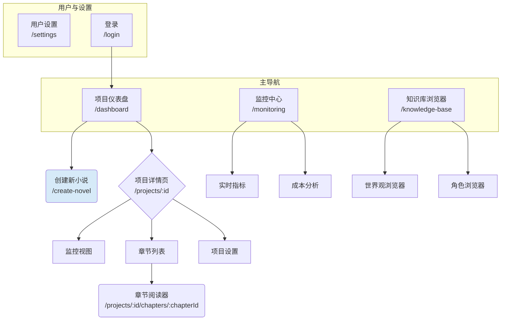
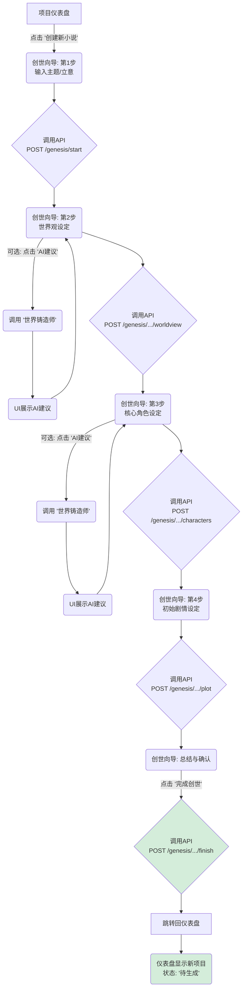
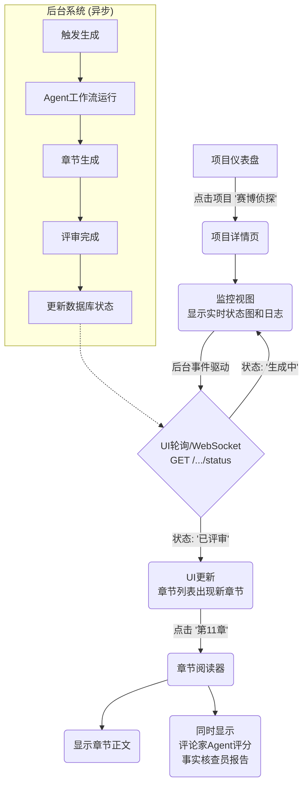

# 多智能体网络小说自动写作系统 UI/UX 规格文档

## 简介

本文档定义了“多智能体网络小说自动写作系统”的用户体验目标、信息架构、用户流程和视觉设计规范。它将作为视觉设计和前端开发的基石，确保为我们的“监督者”用户提供一个内聚且以用户为中心的体验。

### 整体UX目标与原则

#### 目标用户画像

*   **核心用户：** **内容平台的编辑与运营者**。他们是技术娴熟的专业人士，目标是高效地管理和监控规模化的内容生产。他们关心的是效率、控制力和结果的可预测性。
*   **次要用户：** **独立作者或小型团队**。他们可能需要更多的引导和辅助，但同样追求创作效率的提升。

#### 可用性目标

*   **清晰度 (Clarity):** 用户必须能在5秒内理解仪表盘上各个项目的核心状态（如“正在生成”、“需要审核”、“已失败”）。
*   **可控性 (Control):** 用户必须能够轻松地启动、暂停或中止任何一个创作流程，并清楚地知道其操作的后果。
*   **效率 (Efficiency):** 对于核心任务，如启动一个新章节的生成，所需的操作步骤不应超过3次点击。
*   **可发现性 (Discoverability):** 用户无需培训，就应该能通过界面直观地找到核心功能，如查看章节内容、监控日志等。

#### 设计原则

1.  **信息优先，而非界面 (Information over Interface):** UI应像一块干净的玻璃，让用户能毫无障碍地看到最重要的信息——数据和状态。避免不必要的装饰和动画。
2.  **提供上下文，而非仅有数据 (Context, not just Data):** 不仅要展示“章节生成失败”，还要提供快速入口，让用户能立刻看到相关的错误日志或失败原因。
3.  **渐进式披露 (Progressive Disclosure):** 默认展示最高层级、最重要的信息。只有当用户主动请求时，才展示更深层次的细节（如某个Agent的具体参数、完整的API调用日志）。
4.  **状态明确，反馈及时 (Clear States, Immediate Feedback):** 系统中的任何对象（小说、章节、工作流）都必须有明确的状态，并且用户的任何操作都应得到即时的、可见的反馈。
5.  **为专家设计，但对新手友好 (Design for Experts, but Welcome Novices):** 界面应为每天使用它的专业编辑提供强大的快捷方式和信息密度，但同时也为初次使用的作者提供清晰的向导和解释。

### Change Log

| Date | Version | Description | Author |
| :--- | :------ | :---------- | :----- |
|      | 1.0     | Initial Draft | Sally (UX Expert) |

## 信息架构 (IA)

### 站点地图 / 屏幕清单

这是我们应用的核心屏幕及其层级关系。



### 导航结构

*   **主导航 (Primary Navigation):**
    *   这是一个位于应用侧边栏或顶部的持久性导航栏。
    *   它包含三个核心入口点：
        1.  **项目仪表盘 (Dashboard):** 所有小说项目的概览，是用户进入应用后的默认页面。
        2.  **监控中心 (Monitoring):** 查看系统级的健康状况、性能和成本指标的地方。
        3.  **知识库浏览器 (Knowledge Base):** 用于浏览、搜索和管理所有小说共享的世界观和角色信息。
*   **次级导航 (Secondary Navigation):**
    *   当用户进入一个特定区域（如“项目详情页”）时，会出现与该区域相关的次级导航。
    *   例如，在项目详情页内，会有“监控”、“章节”和“设置”三个子页面切换。
*   **面包屑导航 (Breadcrumb Strategy):**
    *   我们将提供面包屑导航，以清晰地显示用户在应用层级结构中的当前位置。
    *   **示例:** `仪表盘 > 项目: 赛博侦探 > 章节: 第11章`

## 用户流程

### 流程一：创建新小说 (创世流程)

*   **用户目标:** 用户希望通过一个引导式的流程，轻松地设定一部新小说的核心元素，并启动项目。
*   **入口点:** 项目仪表盘上的“创建新小说”按钮。
*   **成功标准:** 用户成功完成所有设定步骤，系统在数据库中创建了新的小说项目，并跳转回仪表盘，新项目出现在列表中。

#### 流程图



*   **边缘情况与错误处理:**
    *   如果用户中途退出向导，系统应保存其进度，下次进入时可继续。
    *   如果任何一步的API调用失败，UI应显示明确的错误信息，并允许用户重试。

### 流程二：监控章节生成并查看结果

*   **用户目标:** 用户希望实时了解章节生成的进度，并在完成后方便地查看内容和评审结果。
*   **入口点:** 在项目仪表盘点击一个正在进行中的项目。
*   **成功标准:** 用户能够清晰地看到工作流的实时状态，并在章节生成后，能无缝地打开和阅读章节内容及其相关的AI评审意见。

#### 流程图



## 线框图与模型

### 主要设计文件

*   **设计工具:** 我们将使用 **Figma** 来进行详细的UI设计和原型制作。
*   **Figma链接:** `[待创建 - 创建后将在此处提供链接]`

### 关键屏幕布局概念

#### 1. 项目仪表盘 (Dashboard)

*   **目的:** 提供所有小说项目的高层概览，并作为主要的操作入口。
*   **布局:**
    *   **左侧:** 固定的主导航栏。
    *   **主区域:** 一个卡片式或表格布局。
    *   **每张卡片/每行包含:**
        *   小说标题
        *   当前状态（例如，`创世中`, `生成中`, `已暂停`, `已完成`）- 带有颜色标识。
        *   进度条/章节数（例如 `35 / 100 章`）。
        *   “查看详情”按钮。
    *   **右上角:** 一个显眼的“+ 创建新小说”按钮。

```
+-------------------------------------------------------------------+
| [导航栏] | [页面标题: 项目仪表盘]          [+ 创建新小说]          |
|          |---------------------------------------------------------|
|          | [卡片1: 赛博侦探]                                       |
|          |   状态: [生成中]  进度: [35/100]      [查看详情]        |
|          |---------------------------------------------------------|
|          | [卡片2: 玄幻史诗]                                       |
|          |   状态: [已暂停]  进度: [150/500]     [查看详情]        |
|          |---------------------------------------------------------|
|          | [卡片3: ...]                                            |
+-------------------------------------------------------------------+
```

#### 2. 项目详情/监控视图 (Project Detail View)

*   **目的:** 实时监控一个特定项目的创作流程，并提供所有相关信息的访问入口。
*   **布局:**
    *   **顶部:** 面包屑导航和项目标题。
    *   **左侧面板 (1/3宽度):**
        *   **章节列表:** 显示所有已生成或正在生成的章节，点击可导航。
        *   **项目信息:** 如主题、立意等。
    *   **右侧主面板 (2/3宽度):**
        *   **顶部:** 一个可视化的工作流状态图（例如，一个简化的Mermaid流程图）。
        *   **底部:** 一个实时滚动的事件日志区域，显示来自各个Agent的关键日志。

```
+-------------------------------------------------------------------+
| [导航栏] | [面包屑: 仪表盘 > 赛博侦探]                             |
|          |---------------------------------------------------------|
|          | [章节列表]      | [工作流状态图]                          |
|          | - 第1章 (已发布) |   [大纲] -> [场景] -> [写作] -> ...   |
|          | - 第2章 (已发布) |                                         |
|          | - 第3章 (生成中) |-----------------------------------------|
|          |               | [实时事件日志]                          |
|          | [项目信息]      |   10:35 - WriterAgent: Chapter.Drafted  |
|          |               |   10:36 - CriticAgent: Review.Completed |
+-------------------------------------------------------------------+
```

#### 3. 章节阅读器 (Chapter Viewer)

*   **目的:** 清晰地展示生成的章节内容，并附带所有相关的评审元数据。
*   **布局:**
    *   **主区域 (2/3宽度):**
        *   一个简洁、易于阅读的文本显示区域，用于展示章节正文。
        *   提供字体大小、行高调整选项。
    *   **右侧边栏 (1/3宽度):**
        *   一个可折叠的“评审信息”面板。
        *   **面板内包含:**
            *   评论家Agent的评分和评语。
            *   事实核查员Agent的一致性报告。
            *   （后MVP）人工编辑的修改和批注。

```
+-------------------------------------------------------------------+
| [导航栏] | [面包屑: ... > 第3章]                                   |
|          |---------------------------------------------------------|
|          | [章节正文]        | [评审信息]                            |
|          |   雨点击打着窗... |   - 评论家评分: 7.8/10                |
|          |                 |   - 事实核查: [通过]                  |
|          |                 |   - ...                               |
|          |                 |                                         |
|          |                 |                                         |
+-------------------------------------------------------------------+
```

## 组件库 / 设计系统

### 设计系统方法

*   **基础:** 我们将采用 **Shadcn UI** 作为我们的基础组件库。Shadcn UI 不是一个传统的组件库，而是一系列可复制粘贴、可完全定制的组件，这给予我们极大的灵活性。
*   **定制化:** 我们将在项目中创建一个 `components/ui` 目录，用于存放从Shadcn UI复制并可能进行过定制的基础组件。同时，我们会创建一个 `components/custom` 目录，用于存放我们自己构建的、由基础组件组合而成的业务组件。
*   **原则:** 优先使用或组合Shadcn UI提供的组件。只有在Shadcn UI无法满足需求时，才考虑构建全新的基础组件。

### 核心组件

#### 1. Card (卡片)

*   **目的:** 用于在仪表盘上展示每个小说项目。
*   **Shadcn基础:** `Card`, `CardHeader`, `CardTitle`, `CardDescription`, `CardContent`, `CardFooter`。
*   **定制:** 我们将创建一个 `ProjectCard` 复合组件，它内部会包含一个 `Badge` (用于显示状态) 和一个 `Progress` (用于显示进度条)。

#### 2. Badge (徽章)

*   **目的:** 用于清晰地展示状态，如项目的“生成中”、“已暂停”等。
*   **Shadcn基础:** `Badge`。
*   **定制:** 我们将为其 `variant` 属性增加几种新的颜色方案，以对应不同的项目状态：
    *   `generating` (蓝色)
    *   `paused` (灰色)
    *   `failed` (红色)
    *   `completed` (绿色)

#### 3. Button (按钮)

*   **目的:** 应用内的主要交互元素。
*   **Shadcn基础:** `Button`。
*   **使用指南:**
    *   **Primary (默认):** 用于页面上的主要操作，如“+ 创建新小说”。
    *   **Secondary:** 用于次要操作，如“查看详情”。
    *   **Destructive:** 用于危险操作（例如，删除项目），必须与一个 `AlertDialog` 结合使用。
    *   **Ghost/Link:** 用于非关键的、导航性的操作。

#### 4. Progress (进度条)

*   **目的:** 在项目卡片上可视化地展示章节生成进度。
*   **Shadcn基础:** `Progress`。
*   **使用指南:** 将其值与 `(已完成章节数 / 总目标章节数) * 100` 动态绑定。

#### 5. Stepper (步骤器)

*   **目的:** 用于“创世向导”流程，清晰地向用户展示他们当前在哪一步，以及总共有多少步骤。
*   **Shadcn基础:** Shadcn UI **没有** 内置的Stepper组件。
*   **定制:** 我们需要使用 `div` 和 `span` 等基础元素，结合 `cn` 工具函数，**自行构建一个 `Stepper` 复合组件**。这将是我们第一个重要的自定义业务组件。

#### 6. NovelReader (小说阅读器)

*   **目的:** 为用户提供一个沉浸式、高度可读的界面，用于审查和阅读生成的章节内容。
*   **Shadcn基础:** 这个组件没有直接对应的Shadcn基础组件，它将是一个由多个基础组件（如 `ScrollArea`, `Separator`, `DropdownMenu`, `Tooltip`）组合而成的复杂复合组件。
*   **核心功能与子组件:**
    *   **内容显示区 (`ScrollArea`):**
        *   用于展示章节正文。
        *   必须支持流畅的滚动，并能处理大量文本。
        *   文本渲染必须清晰，段落间距、行高都经过优化，以保证最佳可读性。
    *   **阅读设置菜单 (`DropdownMenu`):**
        *   提供一个设置按钮，点击后弹出下拉菜单。
        *   **菜单选项:**
            *   **字体大小:** 提供至少三种字号选项（小、中、大）。
            *   **主题切换:** 提供“亮色”、“深色（默认）”和“护眼（米黄色背景）”三种主题模式。
            *   **字体选择:** (可选，后MVP) 提供几种适合长时间阅读的字体选项（如宋体、黑体、楷体）。
    *   **章节导航:**
        *   在阅读器的顶部或底部，提供清晰的“上一章”和“下一章”的导航按钮。
        *   显示当前章节的标题和编号。
    *   **（后MVP）批注与高亮功能 (`Tooltip`):**
        *   用户选中一段文本后，会弹出一个小的工具提示（Tooltip）。
        *   工具提示中提供“高亮”和“添加批注”的按钮，为未来的“人机反馈闭环”功能奠定基础。

## 品牌与风格指南

### 视觉识别

*   **品牌指南:** 本项目为内部工具，不设复杂的品牌指南。视觉风格的核心是**功能性、清晰度和专业性**。我们将采用以深色模式为基础的“代码/开发者工具”美学。

### 颜色调色板

我们将使用CSS变量在 `globals.css` 中定义我们的颜色系统，以便于全局应用和主题切换。

| 颜色类型 | CSS 变量 | 亮色模式 (Hex) | 暗色模式 (Hex) | 用途 |
| :--- | :--- | :--- | :--- | :--- |
| **背景** | `--background` | `#FFFFFF` | `#020817` | 页面主背景 |
| **前景** | `--foreground` | `#020817` | `#F8FAFC` | 主要文本颜色 |
| **卡片/模态框** | `--card` | `#FFFFFF` | `#0F172A` | 卡片背景 |
| **卡片/前景** | `--card-foreground`| `#020817` | `#F8FAFC` | 卡片内文本 |
| **主色调** | `--primary` | `#1E40AF` | `#60A5FA` | 主要按钮、链接、高亮 |
| **主色调/前景**| `--primary-foreground`| `#FFFFFF` | `#0F172A` | 主色调按钮上的文本 |
| **次色调** | `--secondary` | `#F1F5F9` | `#334155` | 次要按钮、输入框背景 |
| **次色调/前景**| `--secondary-foreground`| `#1E293B` | `#F1F5F9` | 次色调按钮上的文本 |
| **成功色** | `--success` | `#16A34A` | `#4ADE80` | 成功状态、确认信息 |
| **警告色** | `--warning` | `#F59E0B` | `#FBBF24` | 警告提示、需要注意 |
| **危险色** | `--destructive` | `#DC2626` | `#F87171` | 错误信息、删除操作 |
| **边框/分割线**| `--border` | `#E2E8F0` | `#1E293B` | 元素边框、分割线 |

### 字体排版

*   **字体家族策略:**
    *   我们将采用一个**中英文混合的字体栈**，优先使用我们指定的字体，如果用户系统中不存在，则优雅地降级到高质量的系统默认字体。

*   **主字体 (UI与正文):**
    *   **CSS `font-family` 设置:**
        ```css
        font-family: "Inter", "HarmonyOS Sans SC", "PingFang SC", "Microsoft YaHei", sans-serif;
        ```
    *   **字体选择理由:**
        1.  **`Inter` (英文首选):** 负责渲染所有西文字符（字母、数字、符号）。其清晰的设计能与大多数现代中文字体和谐搭配。
        2.  **`HarmonyOS Sans SC` (中文理想选择):** **鸿蒙黑体**。这是一款由华为推出的高质量、开源的无衬线中文字体，专为屏幕显示优化，字形现代、清晰，适合长时间阅读。我们会通过Web Fonts的方式引入。
        3.  **`PingFang SC` (macOS/iOS 降级):** 苹果系统的默认中文字体，质量非常高。
        4.  **`Microsoft YaHei` (Windows 降级):** Windows系统中最常见的中文字体。
        5.  **`sans-serif` (最终降级):** 如果以上字体都不可用，则使用浏览器默认的无衬线字体。

*   **等宽字体 (代码与日志):**
    *   **CSS `font-family` 设置:**
        ```css
        font-family: "Fira Code", "Source Code Pro", "Microsoft YaHei Mono", monospace;
        ```
    *   **字体选择理由:**
        1.  **`Fira Code` / `Source Code Pro` (英文首选):** 优秀的开源编程字体。
        2.  **`Microsoft YaHei Mono` (中文降级):** 微软雅黑的等宽版本，能确保中文字符也对齐。
        3.  **`monospace` (最终降级):** 使用浏览器默认的等宽字体。

*   **字号体系 (Type Scale):** 保持不变，使用Tailwind CSS的默认响应式字号体系。

*   **行高 (Line Height):**
    *   对于包含大量中文的段落（如小说阅读器），我们需要设置比英文段落**稍大一些的行高**（例如 `leading-relaxed` 或 `leading-loose`），因为汉字结构更复杂，需要更多的呼吸空间以保证可读性。

### 图标

*   **图标库:** **Lucide Icons (`lucide-react`)**。
*   **使用指南:**
    *   Lucide Icons 与Shadcn UI完美集成。
    *   保持图标风格的一致性，优先使用线条风格。
    *   所有用作交互元素的图标按钮都必须有清晰的文字标签（`aria-label`）或工具提示（`Tooltip`）以保证可访问性。

### 间距与布局

*   **网格系统:** 我们不使用严格的12列网格，而是采用基于 **Flexbox** 和 **CSS Grid** 的灵活布局，通过Tailwind CSS的工具类实现。
*   **间距体系:** 严格遵循Tailwind CSS的 **4px基线间距体系** (`space-`, `p-`, `m-` 等工具类，如 `p-4` 代表 `16px`）。这能确保所有元素之间的间距和谐且一致。

## 可访问性要求

### 合规目标

*   **标准:** 我们将以 **WCAG 2.1 AA 级别** 作为我们产品可访问性的最低合规目标。这意味着我们需要满足一系列关于可感知性、可操作性、可理解性和鲁棒性的标准。

### 关键要求

为了达到上述目标，我们在设计和开发中必须遵守以下关键要求：

#### 视觉

*   **颜色对比度:**
    *   所有文本内容与其背景的对比度必须至少为 **4.5:1**。
    *   所有大型文本（18pt或14pt粗体以上）的对比度必须至少为 **3:1**。
    *   我们将使用在线工具来检查和验证颜色组合。
*   **焦点指示器 (Focus Indicators):**
    *   所有可交互的元素（链接、按钮、输入框等）在通过键盘（如Tab键）获得焦点时，**必须**有一个清晰、可见的轮廓或样式变化。Shadcn UI的默认设置在这方面做得很好，我们必须保持它。
*   **颜色并非唯一信息传达方式:**
    *   不能仅使用颜色来传达重要信息。例如，错误状态除了用红色边框外，还必须附带一个图标和明确的错误文本。

#### 交互

*   **键盘导航:**
    *   应用的所有功能**必须**能够仅通过键盘来访问和操作。
    *   Tab键的焦点顺序必须是逻辑的、可预测的。
    *   对于复杂的组件（如下拉菜单、模态框），必须实现正确的焦点管理（例如，打开模态框后，焦点应移入其中）。
*   **屏幕阅读器支持:**
    *   所有非文本内容（如图标、图片）**必须**提供有意义的替代文本（`alt` 属性或 `aria-label`）。
    *   使用语义化的HTML标签（如 `<nav>`, `<main>`, `<button>`）来构建页面结构，以便屏幕阅读器能正确解析。
    *   对于动态更新的内容区域，需要使用ARIA Live Regions来通知屏幕阅读器用户。
*   **触摸目标:**
    *   所有可点击的交互元素，其触摸目标尺寸应不小于 **44x44像素**，以方便移动设备和触摸屏用户操作。

#### 内容

*   **表单标签:**
    *   每一个输入框（`<input>`）**必须**有一个与之关联的、可见的标签（`<label>`）。
*   **标题结构:**
    *   页面标题（`<h1>`, `<h2>`, `<h3>`等）的使用必须遵循逻辑层级，不能为了样式而跳级使用（例如，`<h1>` 下面直接是 `<h3>`）。

### 测试策略

*   **自动化测试:** 在CI/CD流程中集成自动化可访问性测试工具（如 `axe-core`）。
*   **手动测试:** 定期进行手动键盘导航测试和屏幕阅读器（如VoiceOver, NVDA）测试。
*   **开发自查:** 鼓励开发者在开发过程中使用浏览器插件（如axe DevTools）进行即时检查。

## 响应式策略

我们将采用 **移动优先 (Mobile-First)** 的CSS策略，但以桌面端的用户体验为主要设计目标。这意味着在代码层面，我们先编写适用于小屏幕的样式，然后通过媒体查询（Media Queries）逐步增强大屏幕的布局和功能。

### 断点 (Breakpoints)

我们将使用 **Tailwind CSS** 的默认断点系统，这套系统经过精心设计，能够覆盖绝大多数现代设备。

| 断点名称 | 最小宽度 | CSS 媒体查询 | 目标设备/场景 |
| :--- | :--- | :--- | :--- |
| (默认) | 0px | (无) | 移动设备 (竖屏) |
| `sm` | 640px | `@media (min-width: 640px)` | 大型手机, 平板 (竖屏) |
| `md` | 768px | `@media (min-width: 768px)` | 平板 (横屏) |
| `lg` | 1024px | `@media (min-width: 1024px)`| 笔记本电脑, 小型桌面显示器 |
| `xl` | 1280px | `@media (min-width: 1280px)`| 标准桌面显示器 |
| `2xl` | 1536px | `@media (min-width: 1536px)`| 大型桌面显示器 |

### 适配模式

#### 1. 布局变化

*   **仪表盘:**
    *   **移动端 (`<md`):** 项目卡片将变为单列垂直堆叠。
    *   **桌面端 (`>=md`):** 项目卡片将采用多列网格布局（Grid），列数随屏幕宽度增加。
*   **项目详情页:**
    *   **移动端 (`<lg`):** 左侧的“章节列表”面板将默认折叠或变为一个可抽出的抽屉式菜单（Drawer），主区域占据整个屏幕宽度。
    *   **桌面端 (`>=lg`):** 采用我们在线框图中设计的经典三栏式布局。

#### 2. 导航变化

*   **主导航栏:**
    *   **移动端 (`<lg`):** 将折叠成一个“汉堡包”图标按钮，点击后展开一个覆盖式的菜单。
    *   **桌面端 (`>=lg`):** 展开为固定的、带有图标和文字的侧边栏。

#### 3. 内容优先级

*   在小屏幕上，我们将优先显示最核心的信息。例如，在项目卡片上，可能会隐藏一些次要的元数据，只保留标题、状态和进度。

#### 4. 交互变化

*   **悬停效果 (Hover):** 所有依赖鼠标悬停才能触发的交互（如显示Tooltip），在触摸设备上必须有替代的交互方式（例如，通过点击来触发显示/隐藏）。

## 动画与微交互

### 动画原则

1.  **快速响应:** 动画时长应保持简短（通常在150ms - 300ms之间），避免让用户感到等待。
2.  **功能导向:** 每个动画都应有其目的，例如指示状态变化、提供反馈或平滑过渡。
3.  **性能优先:** 优先使用对性能影响较小的CSS属性进行动画处理，如 `transform` 和 `opacity`，避免引起页面重绘。
4.  **一致性:** 在整个应用中保持动画风格和速度曲线的一致性。

### 关键动画与微交互

我们将使用 **Framer Motion** 或 **Tailwind CSS的内置过渡** 来实现以下效果：

*   **状态过渡:**
    *   **描述:** 当元素状态改变时（如按钮从可用变为禁用，或徽章颜色变化），使用平滑的颜色和背景过渡效果（`transition-colors`）。
    *   **时长:** 150ms
    *   **缓动函数:** `ease-in-out`
*   **元素进入/退出:**
    *   **描述:** 当新元素出现在屏幕上（如模态框、下拉菜单、警告提示）或消失时，使用淡入淡出（`fade-in`/`fade-out`）和轻微的缩放（`scale-in`/`scale-out`）效果。
    *   **时长:** 200ms
    *   **缓动函数:** `ease-out`
*   **悬停与焦点效果 (Hover & Focus):**
    *   **描述:** 当鼠标悬停在可交互元素上或元素获得键盘焦点时，应有轻微的视觉变化，如背景变亮、边框高亮或元素轻微上移。
    *   **时长:** 100ms
    *   **缓动函数:** `ease-out`
*   **加载指示器 (Loading Spinners):**
    *   **描述:** 在等待数据加载或后台任务处理时，使用清晰的加载动画（如旋转的Spinner）。对于按钮内部的加载状态，用一个小的Spinner替换按钮图标或文本。
*   **列表项重排:**
    *   **描述:** (可选，后MVP) 如果列表（如项目仪表盘）支持排序或过滤，列表项的位置变化应有平滑的动画过渡，而不是瞬间跳变。Framer Motion 在这方面非常强大。

## 性能考量

### 性能目标 (Performance Goals)

我们将以Google的 **核心网页指标 (Core Web Vitals)** 作为衡量前端性能的基准，旨在达到“良好”评级。

*   **最大内容绘制 (LCP - Largest Contentful Paint):**
    *   **目标:** **小于 2.5 秒**。
    *   **描述:** 视口中最大可见图片或文本块的渲染时间。这直接关系到用户感知到的加载速度。
*   **首次输入延迟 (FID - First Input Delay):**
    *   **目标:** **小于 100 毫秒**。
    *   **描述:** 从用户首次与页面交互（如点击按钮）到浏览器能够实际响应该交互的时间。这衡量了应用的响应能力。
*   **累积布局偏移 (CLS - Cumulative Layout Shift):**
    *   **目标:** **小于 0.1**。
    *   **描述:** 衡量页面在加载过程中视觉元素的意外移动情况。一个低的CLS分数意味着页面是稳定、可预测的，不会在用户交互时突然跳动。

### 影响UX的设计策略

为了达到上述目标，我们在设计和开发中将采取以下策略：

*   **代码分割 (Code Splitting):**
    *   **策略:** 利用Vite的内置功能，按路由对代码进行自动分割。这意味着用户访问特定页面时，只会下载该页面所需的JavaScript，而不是整个应用的全部代码。
*   **图片优化:**
    *   **策略:** 所有在UI中使用的图片（如果未来有的话，如用户头像）都必须经过压缩，并使用现代的图片格式（如 WebP）。
*   **骨架屏加载 (Skeleton Screens):**
    *   **策略:** 在等待页面核心数据加载时（例如，在项目仪表盘加载项目列表时），我们将显示页面的“骨架”布局（灰色的占位符），而不是一个空白屏幕或一个简单的加载圈。这能极大地改善用户对加载速度的主观感知。
*   **虚拟化长列表 (List Virtualization):**
    *   **策略:** 对于可能变得非常长的列表（如章节列表），我们将采用虚拟化技术。这意味着只渲染当前在视口中可见的列表项，而不是一次性渲染全部几百上千项，从而避免性能瓶颈。
*   **避免布局偏移:**
    *   **策略:** 为所有图片和iframe预先指定尺寸。在动态加载内容（如广告或嵌入内容）的区域，预留固定的空间，防止内容加载后导致页面布局突然变化。
```

