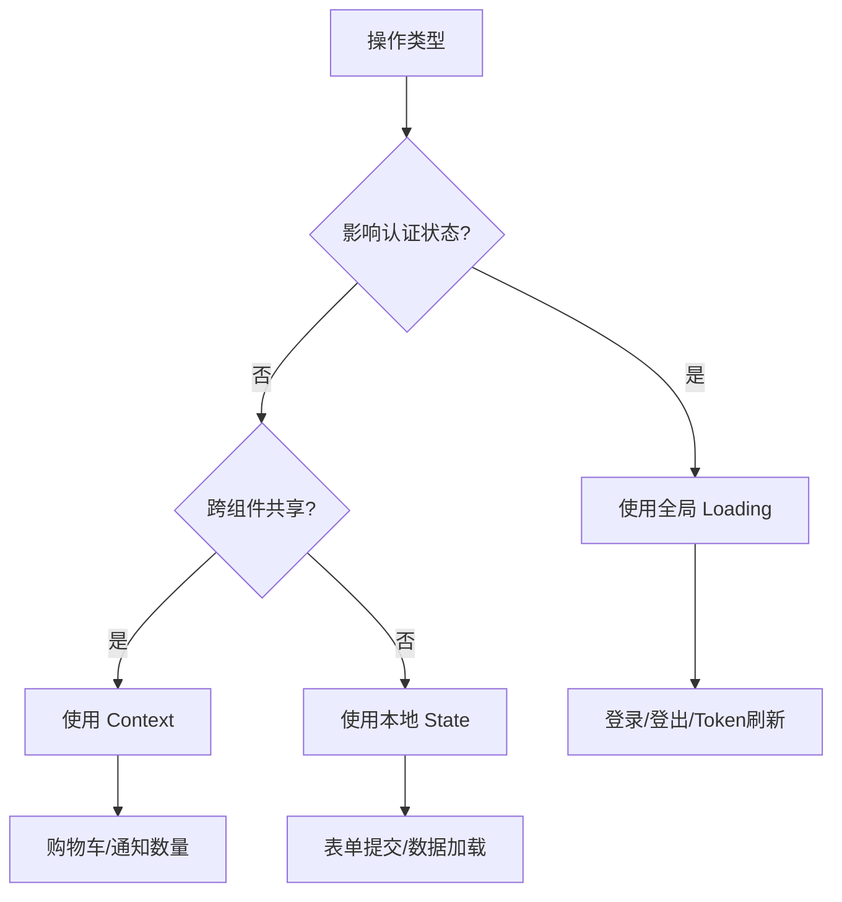

# 认证状态管理最佳实践 - 生产级完整指南

## 文档元信息

- **版本**：Final Production Version
- **适用范围**：React + TypeScript SPA 应用
- **目标读者**：前端开发者、架构师、技术负责人
- **更新日期**：2024-01

## 版本演进历程

### V1 → V2：解决组件卸载问题
- 识别并修复了 RequireAuth 组件因全局 isLoading 导致的卸载问题
- 引入全局/本地 loading 状态分离概念

### V2 → V3：增强类型安全和并发控制
- 引入判定联合类型提升类型安全
- 添加 AbortController 实现请求取消
- 完善 Token 刷新机制

### V3 → Final：达到生产级标准
- 补齐可观测性方案（埋点、日志、监控）
- 完整的测试策略和 mock 方案
- 生产部署检查清单
- 性能优化和监控集成

## 目录

1. [核心原则](#核心原则)
2. [技术选型](#技术选型)
3. [类型定义](#类型定义)
4. [核心实现](#核心实现)
5. [Token 管理](#token-管理)
6. [并发控制](#并发控制)
7. [安全策略](#安全策略)
8. [可观测性](#可观测性)
9. [测试策略](#测试策略)
10. [性能优化](#性能优化)
11. [生产部署](#生产部署)
12. [常见问题](#常见问题)

## 核心原则

### 1. 职责分离矩阵

| 状态类型 | 存储位置 | 管理方式 | 使用场景 |
|---------|---------|---------|---------|
| 用户会话 | Zustand Store | useAuth Hook | 全局认证状态 |
| 表单状态 | Component State | useState/useReducer | 局部输入管理 |
| 服务端数据 | React Query Cache | useQuery/useMutation | API 数据同步 |
| UI 状态 | Component/Context | useState/Context | 视图控制 |

### 2. Loading/Error 状态决策树



### 3. 错误处理策略

```typescript
// 错误分类和处理方式
enum ErrorType {
    BUSINESS = 'BUSINESS',        // 业务错误：返回结果对象
    SYSTEM = 'SYSTEM',           // 系统错误：抛出异常
    NETWORK = 'NETWORK',         // 网络错误：重试机制
    VALIDATION = 'VALIDATION'    // 验证错误：表单显示
}
```

## 技术选型

### 状态管理方案对比

| 方案 | Zustand | Redux Toolkit | Jotai | TanStack Query |
|------|---------|---------------|--------|----------------|
| 包体积 | ✅ 8KB | ❌ 40KB+ | ✅ 13KB | ⚠️ 24KB |
| 学习曲线 | ✅ 简单 | ❌ 陡峭 | ⚠️ 中等 | ⚠️ 中等 |
| TypeScript | ✅ 优秀 | ✅ 优秀 | ✅ 优秀 | ✅ 优秀 |
| DevTools | ✅ 支持 | ✅ 内置 | ⚠️ 需插件 | ✅ 内置 |
| 持久化 | ✅ 内置 | ⚠️ 需中间件 | ⚠️ 需插件 | ⚠️ 需插件 |
| 服务端状态 | ❌ 手动 | ❌ 手动 | ❌ 手动 | ✅ 自动 |

**选择理由**：
- **Zustand**：管理客户端认证状态（user、isAuthenticated）
- **React Query**：管理服务端数据（可选，大型应用推荐）
- **组合使用**：Zustand 负责认证流程，React Query 负责数据同步

## 类型定义

### 基础类型（支持严格类型推断）

```typescript
// types/auth.ts

// 用户模型
export interface User {
    id: string;
    email: string;
    name: string;
    avatar?: string;
    is_verified: boolean;
    roles: string[];
    permissions: string[];
    created_at: string;
    updated_at: string;
}

// 认证状态
export interface AuthState {
    user: User | null;
    isAuthenticated: boolean;
    isLoading: boolean;
    isInitialized: boolean;  // 区分初始化和后续loading
    error: AuthError | null;
}

// 错误类型
export interface AuthError {
    code: string;
    message: string;
    field?: string;
    details?: Record<string, any>;
}

// 判定联合类型 - 实现严格的类型推断
export type Result<T = void> = 
    | { success: true; data: T }
    | { success: false; error: AuthError };

// 操作结果类型
export type LoginResult = Result<{ user: User; tokens: TokenPair }>;
export type RegisterResult = Result<{ user: User; requiresVerification: boolean }>;
export type RefreshResult = Result<{ tokens: TokenPair }>;
export type OperationResult = Result;

// Token 类型
export interface TokenPair {
    access_token: string;
    refresh_token: string;
    expires_in: number;
    token_type: string;
}

// 请求类型
export interface LoginRequest {
    email: string;
    password: string;
    remember_me?: boolean;
}

export interface RegisterRequest {
    email: string;
    password: string;
    name: string;
    terms_accepted: boolean;
}

export interface ChangePasswordRequest {
    current_password: string;
    new_password: string;
}
```

## 核心实现

### 1. 增强的 useAuth Store

```typescript
// store/auth.store.ts
import { create } from 'zustand';
import { devtools, persist } from 'zustand/middleware';
import { immer } from 'zustand/middleware/immer';
import { authService } from '@/services/auth';
import { logger } from '@/services/logger';
import { analytics } from '@/services/analytics';

interface AuthStore extends AuthState {
    // 请求管理
    abortControllers: Map<string, AbortController>;
    requestQueue: Map<string, Promise<any>>;
    
    // 核心操作
    login: (credentials: LoginRequest) => Promise<LoginResult>;
    logout: (options?: LogoutOptions) => Promise<OperationResult>;
    register: (data: RegisterRequest) => Promise<RegisterResult>;
    refreshToken: () => Promise<RefreshResult>;
    
    // 用户操作（不设置全局loading）
    changePassword: (data: ChangePasswordRequest) => Promise<OperationResult>;
    updateProfile: (data: UpdateProfileRequest) => Promise<Result<User>>;
    
    // 状态管理
    initialize: () => Promise<void>;
    reset: () => void;
    
    // 请求管理
    cancelRequest: (key: string) => void;
    cancelAllRequests: () => void;
    
    // 工具方法
    hasPermission: (permission: string) => boolean;
    hasRole: (role: string) => boolean;
}

export const useAuthStore = create<AuthStore>()(
    devtools(
        persist(
            immer((set, get) => ({
                // 初始状态
                user: null,
                isAuthenticated: false,
                isLoading: false,
                isInitialized: false,
                error: null,
                abortControllers: new Map(),
                requestQueue: new Map(),

                // 初始化应用
                initialize: async () => {
                    const state = get();
                    if (state.isInitialized) return;
                    
                    set((draft) => {
                        draft.isLoading = true;
                    });
                    
                    try {
                        // 检查是否有有效的 refresh token
                        const hasValidSession = await authService.checkSession();
                        
                        if (hasValidSession) {
                            // 尝试获取用户信息
                            const user = await authService.getCurrentUser();
                            set((draft) => {
                                draft.user = user;
                                draft.isAuthenticated = true;
                            });
                            
                            // 记录会话恢复
                            analytics.track('session_restored', {
                                user_id: user.id
                            });
                        }
                    } catch (error) {
                        logger.error('Failed to initialize auth', error);
                    } finally {
                        set((draft) => {
                            draft.isLoading = false;
                            draft.isInitialized = true;
                        });
                    }
                },

                // 登录（设置全局loading）
                login: async (credentials) => {
                    const requestKey = 'login';
                    
                    // 取消之前的请求
                    get().cancelRequest(requestKey);
                    
                    // 防止重复请求
                    const existingRequest = get().requestQueue.get(requestKey);
                    if (existingRequest) {
                        return existingRequest;
                    }
                    
                    const controller = new AbortController();
                    
                    const request = (async () => {
                        set((draft) => {
                            draft.isLoading = true;
                            draft.error = null;
                            draft.abortControllers.set(requestKey, controller);
                        });
                        
                        const startTime = performance.now();
                        
                        try {
                            const response = await authService.login(credentials, {
                                signal: controller.signal
                            });
                            
                            set((draft) => {
                                draft.user = response.user;
                                draft.isAuthenticated = true;
                                draft.isLoading = false;
                                draft.error = null;
                            });
                            
                            // 存储 tokens（安全方式）
                            await authService.storeTokens(response.tokens);
                            
                            // 记录成功登录
                            const duration = performance.now() - startTime;
                            analytics.track('login_success', {
                                user_id: response.user.id,
                                method: 'password',
                                duration,
                                remember_me: credentials.remember_me
                            });
                            
                            logger.info('User logged in', {
                                user_id: response.user.id,
                                email: response.user.email
                            });
                            
                            return { success: true, data: response };
                            
                        } catch (error: any) {
                            const duration = performance.now() - startTime;
                            
                            if (error.name === 'AbortError') {
                                return { 
                                    success: false, 
                                    error: { code: 'CANCELLED', message: 'Request cancelled' }
                                };
                            }
                            
                            const authError: AuthError = {
                                code: error.code || 'LOGIN_FAILED',
                                message: error.message || 'Login failed',
                                details: error.details
                            };
                            
                            set((draft) => {
                                draft.user = null;
                                draft.isAuthenticated = false;
                                draft.isLoading = false;
                                draft.error = authError;
                            });
                            
                            // 记录失败登录
                            analytics.track('login_failed', {
                                error_code: authError.code,
                                duration
                            });
                            
                            logger.warn('Login failed', authError);
                            
                            return { success: false, error: authError };
                            
                        } finally {
                            get().abortControllers.delete(requestKey);
                            get().requestQueue.delete(requestKey);
                        }
                    })();
                    
                    get().requestQueue.set(requestKey, request);
                    return request;
                },

                // 登出
                logout: async (options = {}) => {
                    set((draft) => {
                        draft.isLoading = true;
                    });
                    
                    try {
                        // 调用后端登出接口
                        await authService.logout();
                        
                        // 清理本地状态
                        get().reset();
                        
                        // 取消所有进行中的请求
                        get().cancelAllRequests();
                        
                        // 记录登出
                        analytics.track('logout', {
                            reason: options.reason || 'user_initiated'
                        });
                        
                        logger.info('User logged out');
                        
                        // 广播登出事件（用于多标签页同步）
                        if (typeof window !== 'undefined') {
                            window.dispatchEvent(new CustomEvent('auth:logout'));
                        }
                        
                        return { success: true, data: undefined };
                        
                    } catch (error) {
                        logger.error('Logout error', error);
                        // 即使后端失败也清理本地状态
                        get().reset();
                        return { success: true, data: undefined };
                    } finally {
                        set((draft) => {
                            draft.isLoading = false;
                        });
                    }
                },

                // 修改密码（不设置全局loading）
                changePassword: async (data) => {
                    const requestKey = `change-password-${Date.now()}`;
                    const controller = new AbortController();
                    
                    try {
                        get().abortControllers.set(requestKey, controller);
                        
                        await authService.changePassword(data, {
                            signal: controller.signal
                        });
                        
                        // 记录密码修改
                        analytics.track('password_changed');
                        logger.info('Password changed successfully');
                        
                        return { success: true, data: undefined };
                        
                    } catch (error: any) {
                        if (error.name === 'AbortError') {
                            return { 
                                success: false, 
                                error: { code: 'CANCELLED', message: 'Request cancelled' }
                            };
                        }
                        
                        const authError: AuthError = {
                            code: error.code || 'CHANGE_PASSWORD_FAILED',
                            message: error.message || 'Failed to change password'
                        };
                        
                        logger.warn('Change password failed', authError);
                        
                        return { success: false, error: authError };
                        
                    } finally {
                        get().abortControllers.delete(requestKey);
                    }
                },

                // Token 刷新（全局操作但不显示loading）
                refreshToken: async () => {
                    const requestKey = 'refresh-token';
                    
                    // 防止并发刷新
                    const existingRequest = get().requestQueue.get(requestKey);
                    if (existingRequest) {
                        return existingRequest;
                    }
                    
                    const request = (async () => {
                        try {
                            const response = await authService.refreshTokens();
                            
                            // 更新用户信息
                            const user = await authService.getCurrentUser();
                            set((draft) => {
                                draft.user = user;
                                draft.isAuthenticated = true;
                                draft.error = null;
                            });
                            
                            logger.info('Token refreshed successfully');
                            
                            return { success: true, data: response };
                            
                        } catch (error: any) {
                            const authError: AuthError = {
                                code: 'TOKEN_REFRESH_FAILED',
                                message: 'Session expired'
                            };
                            
                            set((draft) => {
                                draft.user = null;
                                draft.isAuthenticated = false;
                                draft.error = authError;
                            });
                            
                            logger.warn('Token refresh failed');
                            
                            return { success: false, error: authError };
                            
                        } finally {
                            get().requestQueue.delete(requestKey);
                        }
                    })();
                    
                    get().requestQueue.set(requestKey, request);
                    return request;
                },

                // 权限检查
                hasPermission: (permission) => {
                    const user = get().user;
                    return user?.permissions.includes(permission) || false;
                },

                hasRole: (role) => {
                    const user = get().user;
                    return user?.roles.includes(role) || false;
                },

                // 重置状态
                reset: () => {
                    set((draft) => {
                        draft.user = null;
                        draft.isAuthenticated = false;
                        draft.isLoading = false;
                        draft.error = null;
                        // 保持 isInitialized
                    });
                },

                // 取消请求
                cancelRequest: (key) => {
                    const controller = get().abortControllers.get(key);
                    if (controller) {
                        controller.abort();
                        get().abortControllers.delete(key);
                    }
                },

                cancelAllRequests: () => {
                    get().abortControllers.forEach(controller => controller.abort());
                    set((draft) => {
                        draft.abortControllers.clear();
                        draft.requestQueue.clear();
                    });
                }
            })),
            {
                name: 'auth-storage',
                partialize: (state) => ({
                    // 只持久化必要的数据
                    user: state.user,
                    isAuthenticated: state.isAuthenticated
                })
            }
        ),
        {
            name: 'AuthStore'
        }
    )
);

// 导出 hooks
export const useAuth = () => {
    const store = useAuthStore();
    
    // 初始化
    React.useEffect(() => {
        store.initialize();
    }, []);
    
    return store;
};

// 导出 selector hooks（性能优化）
export const useUser = () => useAuthStore((state) => state.user);
export const useIsAuthenticated = () => useAuthStore((state) => state.isAuthenticated);
export const useAuthLoading = () => useAuthStore((state) => state.isLoading);
export const useAuthError = () => useAuthStore((state) => state.error);
```

### 2. React Query 集成（可选但推荐）

```typescript
// hooks/useAuthQuery.ts
import { useQuery, useMutation, useQueryClient } from '@tanstack/react-query';
import { authService } from '@/services/auth';
import { useAuthStore } from '@/store/auth.store';

// 查询 keys
export const authKeys = {
    all: ['auth'] as const,
    user: () => [...authKeys.all, 'user'] as const,
    permissions: () => [...authKeys.all, 'permissions'] as const,
    sessions: () => [...authKeys.all, 'sessions'] as const,
};

// 获取当前用户（与 Zustand 同步）
export const useCurrentUser = () => {
    const setUser = useAuthStore((state) => state.setUser);
    
    return useQuery({
        queryKey: authKeys.user(),
        queryFn: authService.getCurrentUser,
        staleTime: 5 * 60 * 1000, // 5分钟
        cacheTime: 10 * 60 * 1000, // 10分钟
        onSuccess: (user) => {
            // 同步到 Zustand
            setUser(user);
        },
        onError: () => {
            setUser(null);
        }
    });
};

// 更新个人资料
export const useUpdateProfile = () => {
    const queryClient = useQueryClient();
    
    return useMutation({
        mutationFn: authService.updateProfile,
        onSuccess: (updatedUser) => {
            // 更新缓存
            queryClient.setQueryData(authKeys.user(), updatedUser);
            // 同步到 Zustand
            useAuthStore.getState().setUser(updatedUser);
        }
    });
};
```

## Token 管理

### 1. 安全的 Token 存储

```typescript
// services/auth/tokenManager.ts
interface TokenStorage {
    storeTokens(tokens: TokenPair): Promise<void>;
    getAccessToken(): string | null;
    getRefreshToken(): string | null;
    clearTokens(): void;
}

// 策略1：内存存储（最安全，但刷新页面丢失）
class MemoryTokenStorage implements TokenStorage {
    private accessToken: string | null = null;
    private refreshToken: string | null = null;
    
    async storeTokens(tokens: TokenPair) {
        this.accessToken = tokens.access_token;
        this.refreshToken = tokens.refresh_token;
    }
    
    getAccessToken() {
        return this.accessToken;
    }
    
    getRefreshToken() {
        return this.refreshToken;
    }
    
    clearTokens() {
        this.accessToken = null;
        this.refreshToken = null;
    }
}

// 策略2：HttpOnly Cookie（推荐用于生产环境）
class CookieTokenStorage implements TokenStorage {
    async storeTokens(tokens: TokenPair) {
        // Refresh token 由后端设置 httpOnly cookie
        // Access token 可以存储在内存或 sessionStorage
        sessionStorage.setItem('access_token', tokens.access_token);
    }
    
    getAccessToken() {
        return sessionStorage.getItem('access_token');
    }
    
    getRefreshToken() {
        // 从 cookie 读取（需要后端配合）
        return null; // 实际由后端自动携带
    }
    
    clearTokens() {
        sessionStorage.removeItem('access_token');
        // 调用后端清除 cookie
    }
}

// 策略3：加密的 localStorage（折中方案）
class EncryptedLocalStorage implements TokenStorage {
    private readonly encryptionKey = process.env.REACT_APP_ENCRYPTION_KEY!;
    
    async storeTokens(tokens: TokenPair) {
        const encrypted = await this.encrypt(JSON.stringify(tokens));
        localStorage.setItem('auth_tokens', encrypted);
    }
    
    getAccessToken() {
        try {
            const encrypted = localStorage.getItem('auth_tokens');
            if (!encrypted) return null;
            
            const decrypted = this.decrypt(encrypted);
            const tokens = JSON.parse(decrypted);
            
            // 检查是否过期
            if (this.isExpired(tokens)) {
                this.clearTokens();
                return null;
            }
            
            return tokens.access_token;
        } catch {
            return null;
        }
    }
    
    // ... 加密/解密实现
}

// Token 管理器
export class TokenManager {
    private storage: TokenStorage;
    private refreshPromise: Promise<any> | null = null;
    
    constructor(strategy: 'memory' | 'cookie' | 'encrypted' = 'cookie') {
        switch (strategy) {
            case 'memory':
                this.storage = new MemoryTokenStorage();
                break;
            case 'cookie':
                this.storage = new CookieTokenStorage();
                break;
            case 'encrypted':
                this.storage = new EncryptedLocalStorage();
                break;
        }
    }
    
    // 获取有效的 access token
    async getValidAccessToken(): Promise<string | null> {
        const token = this.storage.getAccessToken();
        
        if (token && !this.isTokenExpired(token)) {
            return token;
        }
        
        // Token 过期，尝试刷新
        return this.refreshAccessToken();
    }
    
    // 刷新 token（防止并发）
    async refreshAccessToken(): Promise<string | null> {
        if (this.refreshPromise) {
            return this.refreshPromise;
        }
        
        this.refreshPromise = this.doRefresh();
        
        try {
            return await this.refreshPromise;
        } finally {
            this.refreshPromise = null;
        }
    }
    
    private async doRefresh(): Promise<string | null> {
        try {
            const response = await authService.refreshTokens();
            await this.storage.storeTokens(response.tokens);
            return response.tokens.access_token;
        } catch (error) {
            this.storage.clearTokens();
            throw error;
        }
    }
    
    private isTokenExpired(token: string): boolean {
        try {
            const payload = JSON.parse(atob(token.split('.')[1]));
            return payload.exp * 1000 < Date.now();
        } catch {
            return true;
        }
    }
}

export const tokenManager = new TokenManager(
    process.env.REACT_APP_TOKEN_STRATEGY as any || 'cookie'
);
```

### 2. API 拦截器配置

```typescript
// services/api/interceptors.ts
import axios, { AxiosError, AxiosRequestConfig } from 'axios';
import { tokenManager } from '../auth/tokenManager';
import { useAuthStore } from '@/store/auth.store';
import { logger } from '@/services/logger';

// 请求队列
interface QueuedRequest {
    resolve: (value: any) => void;
    reject: (error: any) => void;
    config: AxiosRequestConfig;
}

let isRefreshing = false;
const requestQueue: QueuedRequest[] = [];

// 处理队列中的请求
const processQueue = (error: Error | null, token: string | null = null) => {
    requestQueue.forEach(request => {
        if (error) {
            request.reject(error);
        } else {
            request.config.headers!.Authorization = `Bearer ${token}`;
            request.resolve(axios(request.config));
        }
    });
    
    requestQueue.length = 0;
};

// 请求拦截器
axios.interceptors.request.use(
    async (config) => {
        // 跳过不需要认证的请求
        if (config.headers?.['Skip-Auth']) {
            delete config.headers['Skip-Auth'];
            return config;
        }
        
        // 添加 access token
        const token = await tokenManager.getValidAccessToken();
        if (token) {
            config.headers!.Authorization = `Bearer ${token}`;
        }
        
        // 添加请求 ID（用于追踪）
        config.headers!['X-Request-ID'] = crypto.randomUUID();
        
        return config;
    },
    (error) => {
        logger.error('Request interceptor error', error);
        return Promise.reject(error);
    }
);

// 响应拦截器
axios.interceptors.response.use(
    (response) => response,
    async (error: AxiosError) => {
        const originalRequest = error.config as AxiosRequestConfig & { _retry?: boolean };
        
        // 处理 401 错误
        if (error.response?.status === 401 && !originalRequest._retry) {
            originalRequest._retry = true;
            
            if (isRefreshing) {
                // 等待 token 刷新
                return new Promise((resolve, reject) => {
                    requestQueue.push({ resolve, reject, config: originalRequest });
                });
            }
            
            isRefreshing = true;
            
            try {
                const token = await tokenManager.refreshAccessToken();
                processQueue(null, token);
                
                // 重试原始请求
                originalRequest.headers!.Authorization = `Bearer ${token}`;
                return axios(originalRequest);
                
            } catch (refreshError) {
                processQueue(refreshError as Error);
                
                // 刷新失败，执行登出
                await useAuthStore.getState().logout({ reason: 'token_expired' });
                
                // 重定向到登录页
                window.location.href = '/login?reason=session_expired';
                
                return Promise.reject(refreshError);
            } finally {
                isRefreshing = false;
            }
        }
        
        // 处理其他错误
        if (error.response) {
            const { status, data } = error.response;
            
            // 记录错误
            logger.error('API Error', {
                status,
                url: originalRequest.url,
                method: originalRequest.method,
                error: data
            });
            
            // 标准化错误格式
            const authError = {
                code: data.code || `HTTP_${status}`,
                message: data.message || 'Request failed',
                details: data.details
            };
            
            return Promise.reject(authError);
        }
        
        // 网络错误
        if (error.request) {
            const networkError = {
                code: 'NETWORK_ERROR',
                message: 'Network connection failed'
            };
            
            logger.error('Network Error', {
                url: originalRequest.url,
                method: originalRequest.method
            });
            
            return Promise.reject(networkError);
        }
        
        return Promise.reject(error);
    }
);
```

## 并发控制

### 1. 高级请求管理

```typescript
// hooks/useAsyncOperation.ts
interface UseAsyncOperationOptions {
    onSuccess?: (data: any) => void;
    onError?: (error: AuthError) => void;
    debounceMs?: number;
    retryCount?: number;
    retryDelay?: number;
}

export function useAsyncOperation<T extends (...args: any[]) => Promise<Result<any>>>(
    operation: T,
    options: UseAsyncOperationOptions = {}
) {
    const [isLoading, setIsLoading] = useState(false);
    const [error, setError] = useState<AuthError | null>(null);
    const [data, setData] = useState<any>(null);
    
    const abortControllerRef = useRef<AbortController | null>(null);
    const requestIdRef = useRef(0);
    const debounceTimerRef = useRef<NodeJS.Timeout | null>(null);
    
    // 清理函数
    const cleanup = useCallback(() => {
        if (abortControllerRef.current) {
            abortControllerRef.current.abort();
            abortControllerRef.current = null;
        }
        if (debounceTimerRef.current) {
            clearTimeout(debounceTimerRef.current);
            debounceTimerRef.current = null;
        }
    }, []);
    
    // 执行操作
    const execute = useCallback(async (...args: Parameters<T>) => {
        // 取消之前的请求
        cleanup();
        
        // 生成新的请求 ID
        const currentRequestId = ++requestIdRef.current;
        
        // 防抖处理
        if (options.debounceMs) {
            return new Promise<void>((resolve) => {
                debounceTimerRef.current = setTimeout(async () => {
                    if (currentRequestId === requestIdRef.current) {
                        await performOperation();
                    }
                    resolve();
                }, options.debounceMs);
            });
        }
        
        async function performOperation(retryCount = 0): Promise<void> {
            // 检查是否是最新请求
            if (currentRequestId !== requestIdRef.current) return;
            
            setError(null);
            setIsLoading(true);
            
            // 创建新的 AbortController
            const controller = new AbortController();
            abortControllerRef.current = controller;
            
            try {
                // 注入 signal
                const argsWithSignal = [...args, { signal: controller.signal }];
                const result = await operation(...argsWithSignal);
                
                // 再次检查是否是最新请求
                if (currentRequestId !== requestIdRef.current) return;
                
                if (result.success) {
                    setData(result.data);
                    setError(null);
                    options.onSuccess?.(result.data);
                } else {
                    throw result.error;
                }
            } catch (err: any) {
                // 检查是否被取消
                if (err.name === 'AbortError' || currentRequestId !== requestIdRef.current) {
                    return;
                }
                
                // 重试逻辑
                if (retryCount < (options.retryCount || 0) && shouldRetry(err)) {
                    const delay = (options.retryDelay || 1000) * Math.pow(2, retryCount);
                    await new Promise(resolve => setTimeout(resolve, delay));
                    return performOperation(retryCount + 1);
                }
                
                // 设置错误
                const authError = err as AuthError;
                setError(authError);
                options.onError?.(authError);
            } finally {
                if (currentRequestId === requestIdRef.current) {
                    setIsLoading(false);
                }
            }
        }
        
        return performOperation();
    }, [operation, options, cleanup]);
    
    // 重置状态
    const reset = useCallback(() => {
        cleanup();
        setIsLoading(false);
        setError(null);
        setData(null);
        requestIdRef.current = 0;
    }, [cleanup]);
    
    // 组件卸载时清理
    useEffect(() => {
        return cleanup;
    }, [cleanup]);
    
    return {
        execute,
        reset,
        isLoading,
        error,
        data
    };
}

// 判断是否应该重试
function shouldRetry(error: AuthError): boolean {
    const retriableErrors = ['NETWORK_ERROR', 'TIMEOUT', 'SERVER_ERROR'];
    return retriableErrors.includes(error.code);
}
```

### 2. 使用示例

```typescript
// components/ChangePasswordForm.tsx
const ChangePasswordForm: React.FC = () => {
    const { changePassword } = useAuth();
    const { execute, isLoading, error } = useAsyncOperation(changePassword, {
        onSuccess: () => {
            toast.success('Password changed successfully');
            navigate('/dashboard');
        },
        onError: (error) => {
            if (error.code === 'WEAK_PASSWORD') {
                toast.error('Password is too weak');
            } else {
                toast.error(error.message);
            }
        },
        retryCount: 2,
        retryDelay: 1000
    });
    
    const onSubmit = async (data: ChangePasswordRequest) => {
        await execute(data);
    };
    
    return (
        <form onSubmit={handleSubmit(onSubmit)}>
            {/* 表单内容 */}
            <Button type="submit" disabled={isLoading}>
                {isLoading ? 'Changing...' : 'Change Password'}
            </Button>
        </form>
    );
};
```

## 安全策略

### 1. Content Security Policy

```typescript
// public/index.html
<meta http-equiv="Content-Security-Policy" 
      content="default-src 'self'; 
               script-src 'self' 'unsafe-inline' 'unsafe-eval'; 
               style-src 'self' 'unsafe-inline'; 
               img-src 'self' data: https:; 
               connect-src 'self' https://api.example.com;
               frame-ancestors 'none';
               base-uri 'self';
               form-action 'self';">
```

### 2. 安全配置检查

```typescript
// utils/security.ts
export class SecurityChecker {
    static checkEnvironment() {
        const issues: string[] = [];
        
        // 检查 HTTPS
        if (location.protocol !== 'https:' && process.env.NODE_ENV === 'production') {
            issues.push('Application should be served over HTTPS');
        }
        
        // 检查 CSP
        const csp = document.querySelector('meta[http-equiv="Content-Security-Policy"]');
        if (!csp) {
            issues.push('Content Security Policy not configured');
        }
        
        // 检查敏感数据
        if (localStorage.getItem('access_token')) {
            issues.push('Access token found in localStorage (security risk)');
        }
        
        return issues;
    }
    
    static sanitizeInput(input: string): string {
        return DOMPurify.sanitize(input, {
            ALLOWED_TAGS: [],
            ALLOWED_ATTR: []
        });
    }
}
```

## 可观测性

### 1. 日志服务

```typescript
// services/logger.ts
interface LogContext {
    user_id?: string;
    session_id?: string;
    request_id?: string;
    [key: string]: any;
}

class Logger {
    private context: LogContext = {};
    
    setContext(context: LogContext) {
        this.context = { ...this.context, ...context };
    }
    
    private formatMessage(level: string, message: string, data?: any) {
        return {
            timestamp: new Date().toISOString(),
            level,
            message,
            ...this.context,
            ...(data || {})
        };
    }
    
    private send(level: string, message: string, data?: any) {
        const log = this.formatMessage(level, message, data);
        
        // 开发环境输出到控制台
        if (process.env.NODE_ENV === 'development') {
            console.log(`[${level}]`, message, data);
        }
        
        // 生产环境发送到日志服务
        if (process.env.NODE_ENV === 'production') {
            // 发送到 Sentry、LogRocket 等
            window.Sentry?.captureMessage(message, {
                level: level.toLowerCase() as any,
                extra: data
            });
        }
    }
    
    info(message: string, data?: any) {
        this.send('INFO', message, data);
    }
    
    warn(message: string, data?: any) {
        this.send('WARN', message, data);
    }
    
    error(message: string, error?: any) {
        this.send('ERROR', message, {
            error: error?.message || error,
            stack: error?.stack
        });
    }
}

export const logger = new Logger();
```

### 2. 分析服务

```typescript
// services/analytics.ts
interface AnalyticsEvent {
    name: string;
    properties?: Record<string, any>;
    timestamp?: number;
}

class Analytics {
    private queue: AnalyticsEvent[] = [];
    private flushInterval = 5000; // 5秒
    
    constructor() {
        // 定期发送事件
        setInterval(() => this.flush(), this.flushInterval);
        
        // 页面卸载时发送
        window.addEventListener('beforeunload', () => this.flush());
    }
    
    track(name: string, properties?: Record<string, any>) {
        const event: AnalyticsEvent = {
            name,
            properties: {
                ...properties,
                session_id: this.getSessionId(),
                user_id: useAuthStore.getState().user?.id,
                timestamp: Date.now()
            }
        };
        
        this.queue.push(event);
        
        // 开发环境立即输出
        if (process.env.NODE_ENV === 'development') {
            console.log('📊 Analytics:', name, properties);
        }
    }
    
    private flush() {
        if (this.queue.length === 0) return;
        
        const events = [...this.queue];
        this.queue = [];
        
        // 发送到分析服务
        fetch('/api/analytics', {
            method: 'POST',
            headers: { 'Content-Type': 'application/json' },
            body: JSON.stringify({ events }),
            keepalive: true // 确保页面关闭时也能发送
        }).catch(error => {
            // 失败时重新加入队列
            this.queue.unshift(...events);
            logger.error('Failed to send analytics', error);
        });
    }
    
    private getSessionId(): string {
        let sessionId = sessionStorage.getItem('analytics_session_id');
        if (!sessionId) {
            sessionId = crypto.randomUUID();
            sessionStorage.setItem('analytics_session_id', sessionId);
        }
        return sessionId;
    }
}

export const analytics = new Analytics();
```

### 3. 性能监控

```typescript
// services/performance.ts
class PerformanceMonitor {
    private marks = new Map<string, number>();
    
    mark(name: string) {
        this.marks.set(name, performance.now());
    }
    
    measure(name: string, startMark: string, endMark?: string) {
        const start = this.marks.get(startMark);
        if (!start) return;
        
        const end = endMark ? this.marks.get(endMark) : performance.now();
        if (!end) return;
        
        const duration = end - start;
        
        // 记录性能指标
        analytics.track('performance_measure', {
            name,
            duration,
            start_mark: startMark,
            end_mark: endMark
        });
        
        // 超过阈值时警告
        if (duration > 1000) {
            logger.warn(`Slow operation: ${name}`, { duration });
        }
        
        return duration;
    }
    
    // 监控组件渲染性能
    measureComponent(componentName: string) {
        return {
            onRenderStart: () => this.mark(`${componentName}_start`),
            onRenderEnd: () => {
                this.mark(`${componentName}_end`);
                this.measure(
                    `${componentName}_render`,
                    `${componentName}_start`,
                    `${componentName}_end`
                );
            }
        };
    }
}

export const performance = new PerformanceMonitor();
```

## 测试策略

### 1. Store 测试

```typescript
// __tests__/store/auth.store.test.ts
import { renderHook, act } from '@testing-library/react-hooks';
import { useAuthStore } from '@/store/auth.store';
import { authService } from '@/services/auth';

// Mock services
jest.mock('@/services/auth');
jest.mock('@/services/logger');
jest.mock('@/services/analytics');

describe('AuthStore', () => {
    beforeEach(() => {
        // 重置 store
        useAuthStore.setState({
            user: null,
            isAuthenticated: false,
            isLoading: false,
            error: null
        });
        
        // 清理 mocks
        jest.clearAllMocks();
    });
    
    describe('login', () => {
        it('should login successfully', async () => {
            const mockUser = { id: '1', email: 'test@example.com' };
            const mockTokens = { access_token: 'token', refresh_token: 'refresh' };
            
            (authService.login as jest.Mock).mockResolvedValue({
                user: mockUser,
                tokens: mockTokens
            });
            
            const { result } = renderHook(() => useAuthStore());
            
            let loginResult;
            await act(async () => {
                loginResult = await result.current.login({
                    email: 'test@example.com',
                    password: 'password'
                });
            });
            
            expect(loginResult).toEqual({
                success: true,
                data: { user: mockUser, tokens: mockTokens }
            });
            
            expect(result.current.user).toEqual(mockUser);
            expect(result.current.isAuthenticated).toBe(true);
            expect(result.current.isLoading).toBe(false);
            expect(result.current.error).toBeNull();
        });
        
        it('should handle login failure', async () => {
            const mockError = {
                code: 'INVALID_CREDENTIALS',
                message: 'Invalid email or password'
            };
            
            (authService.login as jest.Mock).mockRejectedValue(mockError);
            
            const { result } = renderHook(() => useAuthStore());
            
            let loginResult;
            await act(async () => {
                loginResult = await result.current.login({
                    email: 'test@example.com',
                    password: 'wrong'
                });
            });
            
            expect(loginResult).toEqual({
                success: false,
                error: mockError
            });
            
            expect(result.current.user).toBeNull();
            expect(result.current.isAuthenticated).toBe(false);
            expect(result.current.error).toEqual(mockError);
        });
        
        it('should prevent concurrent login requests', async () => {
            (authService.login as jest.Mock).mockImplementation(
                () => new Promise(resolve => setTimeout(resolve, 100))
            );
            
            const { result } = renderHook(() => useAuthStore());
            
            let results: any[] = [];
            await act(async () => {
                // 发起多个并发请求
                const promises = [
                    result.current.login({ email: 'test@example.com', password: 'pass' }),
                    result.current.login({ email: 'test@example.com', password: 'pass' }),
                    result.current.login({ email: 'test@example.com', password: 'pass' })
                ];
                
                results = await Promise.all(promises);
            });
            
            // 应该只调用一次
            expect(authService.login).toHaveBeenCalledTimes(1);
            
            // 所有请求应该返回相同结果
            expect(results[0]).toBe(results[1]);
            expect(results[1]).toBe(results[2]);
        });
    });
});
```

### 2. Hook 测试

```typescript
// __tests__/hooks/useAsyncOperation.test.tsx
import { renderHook, act } from '@testing-library/react-hooks';
import { useAsyncOperation } from '@/hooks/useAsyncOperation';

describe('useAsyncOperation', () => {
    it('should handle successful operation', async () => {
        const mockOperation = jest.fn().mockResolvedValue({
            success: true,
            data: { message: 'Success' }
        });
        
        const onSuccess = jest.fn();
        
        const { result } = renderHook(() => 
            useAsyncOperation(mockOperation, { onSuccess })
        );
        
        expect(result.current.isLoading).toBe(false);
        expect(result.current.error).toBeNull();
        
        await act(async () => {
            await result.current.execute('arg1', 'arg2');
        });
        
        expect(mockOperation).toHaveBeenCalledWith('arg1', 'arg2', expect.any(Object));
        expect(result.current.data).toEqual({ message: 'Success' });
        expect(onSuccess).toHaveBeenCalledWith({ message: 'Success' });
    });
    
    it('should debounce requests', async () => {
        jest.useFakeTimers();
        
        const mockOperation = jest.fn().mockResolvedValue({
            success: true,
            data: 'result'
        });
        
        const { result } = renderHook(() => 
            useAsyncOperation(mockOperation, { debounceMs: 300 })
        );
        
        // 快速调用多次
        act(() => {
            result.current.execute('call1');
            result.current.execute('call2');
            result.current.execute('call3');
        });
        
        // 快进时间
        act(() => {
            jest.advanceTimersByTime(300);
        });
        
        // 只应该执行最后一次
        expect(mockOperation).toHaveBeenCalledTimes(1);
        expect(mockOperation).toHaveBeenCalledWith('call3', expect.any(Object));
        
        jest.useRealTimers();
    });
});
```

### 3. 组件测试

```typescript
// __tests__/components/RequireAuth.test.tsx
import { render, screen } from '@testing-library/react';
import { MemoryRouter, Route, Routes } from 'react-router-dom';
import { RequireAuth } from '@/components/auth/RequireAuth';
import { useAuthStore } from '@/store/auth.store';

// Mock store
jest.mock('@/store/auth.store');

describe('RequireAuth', () => {
    const mockUser = {
        id: '1',
        email: 'test@example.com',
        is_verified: true
    };
    
    beforeEach(() => {
        (useAuthStore as jest.MockedFunction<any>).mockReturnValue({
            user: null,
            isAuthenticated: false,
            isLoading: false,
            initialize: jest.fn()
        });
    });
    
    it('should show loading state during initialization', () => {
        (useAuthStore as jest.MockedFunction<any>).mockReturnValue({
            isLoading: true,
            isInitialized: false,
            initialize: jest.fn()
        });
        
        render(
            <MemoryRouter>
                <RequireAuth>
                    <div>Protected Content</div>
                </RequireAuth>
            </MemoryRouter>
        );
        
        expect(screen.getByTestId('loading-spinner')).toBeInTheDocument();
    });
    
    it('should redirect to login when not authenticated', () => {
        render(
            <MemoryRouter initialEntries={['/protected']}>
                <Routes>
                    <Route path="/login" element={<div>Login Page</div>} />
                    <Route path="/protected" element={
                        <RequireAuth>
                            <div>Protected Content</div>
                        </RequireAuth>
                    } />
                </Routes>
            </MemoryRouter>
        );
        
        expect(screen.getByText('Login Page')).toBeInTheDocument();
    });
    
    it('should render children when authenticated', () => {
        (useAuthStore as jest.MockedFunction<any>).mockReturnValue({
            user: mockUser,
            isAuthenticated: true,
            isLoading: false,
            isInitialized: true,
            initialize: jest.fn()
        });
        
        render(
            <MemoryRouter>
                <RequireAuth>
                    <div>Protected Content</div>
                </RequireAuth>
            </MemoryRouter>
        );
        
        expect(screen.getByText('Protected Content')).toBeInTheDocument();
    });
});
```

## 性能优化

### 1. Code Splitting

```typescript
// routes/index.tsx
import { lazy, Suspense } from 'react';
import { Routes, Route } from 'react-router-dom';

// Lazy load auth pages
const Login = lazy(() => import('@/pages/auth/Login'));
const Register = lazy(() => import('@/pages/auth/Register'));
const ForgotPassword = lazy(() => import('@/pages/auth/ForgotPassword'));

// Lazy load protected pages
const Dashboard = lazy(() => import('@/pages/Dashboard'));
const Profile = lazy(() => import('@/pages/Profile'));

export const AppRoutes = () => {
    return (
        <Suspense fallback={<PageLoader />}>
            <Routes>
                {/* Public routes */}
                <Route path="/login" element={<Login />} />
                <Route path="/register" element={<Register />} />
                <Route path="/forgot-password" element={<ForgotPassword />} />
                
                {/* Protected routes */}
                <Route element={<RequireAuth />}>
                    <Route path="/dashboard" element={<Dashboard />} />
                    <Route path="/profile" element={<Profile />} />
                </Route>
            </Routes>
        </Suspense>
    );
};
```

### 2. 优化 Re-renders

```typescript
// components/UserAvatar.tsx
import { memo } from 'react';
import { useUser } from '@/store/auth.store';

// 使用 selector 避免不必要的重渲染
export const UserAvatar = memo(() => {
    const user = useUser(); // 只订阅 user 字段
    
    if (!user) return null;
    
    return (
        <div className="user-avatar">
            
            <span>{user.name}</span>
        </div>
    );
});

// 使用多个 selector
export const UserInfo = memo(() => {
    const isAuthenticated = useIsAuthenticated();
    const user = useUser();
    const isLoading = useAuthLoading();
    
    if (isLoading) return <Skeleton />;
    if (!isAuthenticated || !user) return null;
    
    return <div>{/* User info */}</div>;
});
```

### 3. 请求优化

```typescript
// services/api/batchRequests.ts
class BatchRequestManager {
    private queue: Map<string, Promise<any>> = new Map();
    private batchTimer: NodeJS.Timeout | null = null;
    private readonly batchDelay = 50; // 50ms
    
    async add<T>(key: string, request: () => Promise<T>): Promise<T> {
        // 检查是否已有相同请求
        const existing = this.queue.get(key);
        if (existing) return existing;
        
        // 创建请求 promise
        const promise = this.scheduleBatch().then(() => request());
        this.queue.set(key, promise);
        
        // 请求完成后清理
        promise.finally(() => this.queue.delete(key));
        
        return promise;
    }
    
    private scheduleBatch(): Promise<void> {
        return new Promise(resolve => {
            if (this.batchTimer) {
                clearTimeout(this.batchTimer);
            }
            
            this.batchTimer = setTimeout(() => {
                this.batchTimer = null;
                resolve();
            }, this.batchDelay);
        });
    }
}

export const batchRequests = new BatchRequestManager();
```

## 生产部署

### 1. 环境配置检查清单

```typescript
// scripts/preDeployCheck.ts
interface CheckResult {
    passed: boolean;
    issues: string[];
    warnings: string[];
}

export async function runPreDeploymentChecks(): Promise<CheckResult> {
    const issues: string[] = [];
    const warnings: string[] = [];
    
    // 1. 环境变量检查
    const requiredEnvVars = [
        'REACT_APP_API_URL',
        'REACT_APP_TOKEN_STRATEGY',
        'REACT_APP_SENTRY_DSN'
    ];
    
    for (const envVar of requiredEnvVars) {
        if (!process.env[envVar]) {
            issues.push(`Missing required environment variable: ${envVar}`);
        }
    }
    
    // 2. 安全检查
    if (process.env.REACT_APP_TOKEN_STRATEGY === 'localStorage') {
        warnings.push('Using localStorage for tokens is not recommended for production');
    }
    
    // 3. API 配置检查
    if (!process.env.REACT_APP_API_URL?.startsWith('https://')) {
        issues.push('API URL must use HTTPS in production');
    }
    
    // 4. 构建优化检查
    if (!process.env.GENERATE_SOURCEMAP || process.env.GENERATE_SOURCEMAP === 'true') {
        warnings.push('Source maps are enabled, consider disabling for production');
    }
    
    // 5. 性能配置
    if (!process.env.REACT_APP_ENABLE_PROFILER) {
        warnings.push('Performance profiler is disabled');
    }
    
    return {
        passed: issues.length === 0,
        issues,
        warnings
    };
}

// 运行检查
if (require.main === module) {
    runPreDeploymentChecks().then(result => {
        console.log('Pre-deployment Check Results:');
        console.log('============================');
        
        if (result.issues.length > 0) {
            console.error('❌ Issues found:');
            result.issues.forEach(issue => console.error(`  - ${issue}`));
        }
        
        if (result.warnings.length > 0) {
            console.warn('⚠️  Warnings:');
            result.warnings.forEach(warning => console.warn(`  - ${warning}`));
        }
        
        if (result.passed) {
            console.log('✅ All checks passed!');
            process.exit(0);
        } else {
            process.exit(1);
        }
    });
}
```

### 2. 监控集成

```typescript
// services/monitoring.ts
import * as Sentry from '@sentry/react';
import { BrowserTracing } from '@sentry/tracing';

export function initializeMonitoring() {
    // Sentry 配置
    Sentry.init({
        dsn: process.env.REACT_APP_SENTRY_DSN,
        environment: process.env.NODE_ENV,
        integrations: [
            new BrowserTracing(),
            new Sentry.Replay({
                maskAllText: true,
                blockAllMedia: true
            })
        ],
        tracesSampleRate: process.env.NODE_ENV === 'production' ? 0.1 : 1.0,
        replaysSessionSampleRate: 0.1,
        replaysOnErrorSampleRate: 1.0,
        
        beforeSend(event, hint) {
            // 过滤敏感信息
            if (event.request?.cookies) {
                delete event.request.cookies;
            }
            
            // 添加用户上下文
            const user = useAuthStore.getState().user;
            if (user) {
                event.user = {
                    id: user.id,
                    email: user.email
                };
            }
            
            return event;
        }
    });
    
    // 设置用户上下文
    useAuthStore.subscribe((state) => {
        if (state.user) {
            Sentry.setUser({
                id: state.user.id,
                email: state.user.email
            });
        } else {
            Sentry.setUser(null);
        }
    });
}
```

### 3. 健康检查端点

```typescript
// pages/api/health.ts
export async function checkHealth() {
    const checks = {
        api: false,
        auth: false,
        storage: false
    };
    
    try {
        // 检查 API 连接
        const apiResponse = await fetch(`${process.env.REACT_APP_API_URL}/health`);
        checks.api = apiResponse.ok;
        
        // 检查认证服务
        const authCheck = await authService.checkSession();
        checks.auth = true;
        
        // 检查存储
        const testKey = 'health_check_' + Date.now();
        localStorage.setItem(testKey, 'ok');
        checks.storage = localStorage.getItem(testKey) === 'ok';
        localStorage.removeItem(testKey);
        
    } catch (error) {
        logger.error('Health check failed', error);
    }
    
    const allHealthy = Object.values(checks).every(v => v);
    
    return {
        status: allHealthy ? 'healthy' : 'unhealthy',
        checks,
        timestamp: new Date().toISOString()
    };
}
```

## 常见问题

### Q1: 如何处理多标签页同步？

```typescript
// hooks/useAuthSync.ts
export function useAuthSync() {
    useEffect(() => {
        const channel = new BroadcastChannel('auth_sync');
        
        // 监听其他标签页的变化
        channel.addEventListener('message', (event) => {
            switch (event.data.type) {
                case 'LOGIN':
                    useAuthStore.getState().setUser(event.data.user);
                    break;
                case 'LOGOUT':
                    useAuthStore.getState().reset();
                    window.location.href = '/login';
                    break;
                case 'TOKEN_REFRESH':
                    // 同步新 token
                    tokenManager.syncTokens(event.data.tokens);
                    break;
            }
        });
        
        // 监听 store 变化并广播
        const unsubscribe = useAuthStore.subscribe((state, prevState) => {
            if (state.user !== prevState.user) {
                channel.postMessage({
                    type: state.user ? 'LOGIN' : 'LOGOUT',
                    user: state.user
                });
            }
        });
        
        return () => {
            channel.close();
            unsubscribe();
        };
    }, []);
}
```

### Q2: 如何实现自动登出？

```typescript
// hooks/useAutoLogout.ts
export function useAutoLogout(timeoutMinutes = 30) {
    const { logout } = useAuth();
    const timeoutRef = useRef<NodeJS.Timeout>();
    
    const resetTimer = useCallback(() => {
        if (timeoutRef.current) {
            clearTimeout(timeoutRef.current);
        }
        
        timeoutRef.current = setTimeout(() => {
            logout({ reason: 'inactivity' });
        }, timeoutMinutes * 60 * 1000);
    }, [timeoutMinutes, logout]);
    
    useEffect(() => {
        const events = ['mousedown', 'keydown', 'scroll', 'touchstart'];
        
        const handleActivity = () => resetTimer();
        
        // 监听用户活动
        events.forEach(event => {
            document.addEventListener(event, handleActivity);
        });
        
        // 初始化计时器
        resetTimer();
        
        return () => {
            events.forEach(event => {
                document.removeEventListener(event, handleActivity);
            });
            
            if (timeoutRef.current) {
                clearTimeout(timeoutRef.current);
            }
        };
    }, [resetTimer]);
}
```

### Q3: 如何处理 Token 即将过期的提醒？

```typescript
// hooks/useTokenExpiryWarning.ts
export function useTokenExpiryWarning() {
    const { refreshToken } = useAuth();
    const [showWarning, setShowWarning] = useState(false);
    
    useEffect(() => {
        const checkTokenExpiry = () => {
            const token = tokenManager.getAccessToken();
            if (!token) return;
            
            try {
                const payload = JSON.parse(atob(token.split('.')[1]));
                const expiryTime = payload.exp * 1000;
                const now = Date.now();
                const timeUntilExpiry = expiryTime - now;
                
                // 5分钟前提醒
                if (timeUntilExpiry < 5 * 60 * 1000 && timeUntilExpiry > 0) {
                    setShowWarning(true);
                }
            } catch (error) {
                logger.error('Failed to parse token', error);
            }
        };
        
        const interval = setInterval(checkTokenExpiry, 60 * 1000); // 每分钟检查
        checkTokenExpiry(); // 立即检查一次
        
        return () => clearInterval(interval);
    }, []);
    
    const handleRefresh = async () => {
        const result = await refreshToken();
        if (result.success) {
            setShowWarning(false);
        }
    };
    
    return { showWarning, handleRefresh };
}
```

## 总结

这份生产级认证状态管理方案提供了：

### ✅ 核心功能
1. **完整的类型安全**：判定联合类型提供严格的类型推断
2. **并发控制**：防止竞态条件和重复请求
3. **Token 管理**：安全存储和自动刷新机制
4. **错误处理**：统一的错误格式和重试策略
5. **性能优化**：代码分割、选择性订阅、请求批处理

### ✅ 生产级特性
1. **可观测性**：完整的日志、分析和性能监控
2. **安全防护**：CSP、XSS 防护、安全存储
3. **测试覆盖**：单元测试、集成测试策略
4. **部署就绪**：环境检查、健康监控
5. **用户体验**：多标签页同步、自动登出、过期提醒

### ✅ 可扩展性
1. **模块化设计**：易于添加新的认证方式
2. **框架无关**：核心逻辑可移植到其他框架
3. **渐进式增强**：可根据需求逐步添加功能

遵循这个方案可以构建一个**安全、可靠、高性能**的认证系统，满足从小型到大型应用的需求。

## 附录：快速实施清单

- [ ] 选择 Token 存储策略（推荐 httpOnly Cookie）
- [ ] 实现基础的 Auth Store
- [ ] 配置 API 拦截器
- [ ] 添加 RequireAuth 组件
- [ ] 实现 Token 刷新机制
- [ ] 添加并发控制
- [ ] 集成日志和分析
- [ ] 编写关键路径的测试
- [ ] 配置生产环境监控
- [ ] 运行部署前检查