# 本地开发调试指南

## 📋 开发流程概览

```mermaid
graph LR
    A[环境准备] --> B[启动基础设施]
    B --> C[启动后端服务]
    C --> D[启动前端]
    D --> E[开发调试]
    E --> F[运行测试]
    F --> G[提交代码]
```



## 🚀 快速开始

### 1. 初次设置

```bash
# 克隆项目后，运行开发环境设置
./scripts/dev/setup-dev.sh

# 这会自动完成：
# - 安装 uv 和 pnpm
# - 创建 Python 虚拟环境
# - 安装所有依赖
# - 设置 pre-commit hooks
```

### 2. 日常开发流程

```bash
# 1. 激活 Python 虚拟环境
source .venv/bin/activate

# 2. 启动基础设施（数据库等）
pnpm infra up

# 3. 检查服务健康状态
pnpm check:services

# 4. 新开终端，启动后端 API Gateway
cd apps/backend
python -m src.api.main

# 5. 新开终端，启动前端
pnpm --filter frontend dev

# 6. 访问应用
# 前端：http://localhost:5173
# 后端：http://localhost:8000
# API 文档：http://localhost:8000/docs
```

## 🐛 调试配置

### VSCode 调试配置

创建 `.vscode/launch.json`：

```json
{
  "version": "0.2.0",
  "configurations": [
    {
      "name": "Python: API Gateway",
      "type": "python",
      "request": "launch",
      "module": "uvicorn",
      "args": [
        "src.api.main:app",
        "--reload",
        "--host", "0.0.0.0",
        "--port", "8000"
      ],
      "cwd": "${workspaceFolder}/apps/backend",
      "env": {
        "SERVICE_TYPE": "api-gateway",
        "PYTHONPATH": "${workspaceFolder}/apps/backend"
      },
      "envFile": "${workspaceFolder}/.env.backend",
      "console": "integratedTerminal",
      "justMyCode": false
    },
    {
      "name": "Python: Agent (Worldsmith)",
      "type": "python",
      "request": "launch",
      "module": "src.agents.worldsmith.main",
      "cwd": "${workspaceFolder}/apps/backend",
      "env": {
        "SERVICE_TYPE": "agent-worldsmith",
        "PYTHONPATH": "${workspaceFolder}/apps/backend"
      },
      "envFile": "${workspaceFolder}/.env.backend",
      "console": "integratedTerminal"
    },
    {
      "name": "Python: Current File",
      "type": "python",
      "request": "launch",
      "program": "${file}",
      "console": "integratedTerminal",
      "justMyCode": false
    },
    {
      "name": "Python: Debug Tests",
      "type": "python",
      "request": "launch",
      "module": "pytest",
      "args": [
        "-xvs",
        "${file}"
      ],
      "cwd": "${workspaceFolder}/apps/backend",
      "console": "integratedTerminal",
      "justMyCode": false
    },
    {
      "name": "React: Debug Frontend",
      "type": "chrome",
      "request": "launch",
      "url": "http://localhost:5173",
      "webRoot": "${workspaceFolder}/apps/frontend/src",
      "sourceMaps": true,
      "sourceMapPathOverrides": {
        "webpack:///src/*": "${webRoot}/*"
      }
    }
  ],
  "compounds": [
    {
      "name": "Full Stack",
      "configurations": ["Python: API Gateway", "React: Debug Frontend"],
      "stopAll": true
    }
  ]
}
```

### PyCharm 调试配置

1. **API Gateway 配置**：
   - Run > Edit Configurations > Add New Configuration > Python
   - Module name: `uvicorn`
   - Parameters: `src.api.main:app --reload`
   - Working directory: `$PROJECT_DIR$/apps/backend`
   - Environment variables: `SERVICE_TYPE=api-gateway`

2. **Agent 服务配置**：
   - Module name: `src.agents.worldsmith.main`
   - Working directory: `$PROJECT_DIR$/apps/backend`
   - Environment variables: `SERVICE_TYPE=agent-worldsmith`

## 💻 常见开发场景

### 场景 1: 开发新的 API 端点

```bash
# 1. 在 health.py 旁边创建新路由文件
cd apps/backend/src/api/routes/v1
touch novels.py

# 2. 实时重载会自动生效
# 3. 访问 http://localhost:8000/docs 查看新端点
```

### 场景 2: 调试数据库查询

```python
# 在代码中添加断点或日志
import logging
logger = logging.getLogger(__name__)

async def get_novel(novel_id: str):
    logger.info(f"Fetching novel: {novel_id}")
    # 在这里设置断点
    result = await postgres_service.fetch_one(...)
    logger.debug(f"Query result: {result}")
    return result
```

### 场景 3: 测试 Agent 通信

```bash
# 1. 启动 Kafka 消费者查看消息
docker exec -it infinite-scribe-kafka kafka-console-consumer \
  --bootstrap-server localhost:9092 \
  --topic novel-creation \
  --from-beginning

# 2. 发送测试消息
python scripts/test-kafka-message.py
```

### 场景 4: 前后端联调

```bash
# 1. 启动后端（开启 CORS）
cd apps/backend
uvicorn src.api.main:app --reload

# 2. 启动前端代理
cd apps/frontend
pnpm dev  # vite.config.ts 已配置代理到 localhost:8000

# 3. 使用浏览器开发工具
# - Network 标签查看 API 请求
# - Console 查看日志
# - React DevTools 调试组件
```

## 🔧 调试技巧

### 1. 使用 ipdb 调试

```python
# 安装已包含在 dev 依赖中
# 在代码中插入断点
import ipdb; ipdb.set_trace()

# 调试命令：
# n - 下一行
# s - 进入函数
# c - 继续
# l - 查看代码
# pp variable - 打印变量
```

### 2. 使用日志调试

```python
# 配置详细日志
import logging
logging.basicConfig(level=logging.DEBUG)

# 结构化日志
import structlog
logger = structlog.get_logger()
logger.info("processing_request", user_id=123, action="create_novel")
```

### 3. 使用 Rich 美化输出

```python
from rich import print
from rich.console import Console
from rich.table import Table

console = Console()

# 美化打印
console.print("[bold red]Error![/bold red] Something went wrong")

# 打印表格
table = Table(title="Database Results")
table.add_column("ID")
table.add_column("Title")
table.add_row("1", "My Novel")
console.print(table)
```

### 4. 性能分析

```python
# 使用 cProfile
import cProfile
import pstats

profiler = cProfile.Profile()
profiler.enable()

# 你的代码
do_something()

profiler.disable()
stats = pstats.Stats(profiler).sort_stats('cumulative')
stats.print_stats()
```

## 🧪 测试驱动开发

### 运行测试

```bash
# 运行所有测试
cd apps/backend
pytest

# 运行特定测试文件
pytest tests/unit/api/routes/v1/test_health.py

# 运行并查看覆盖率
pytest --cov=src --cov-report=html
open htmlcov/index.html

# 监视模式（文件变化自动运行）
pytest-watch
```

### 调试测试

```bash
# 显示打印输出
pytest -s

# 在第一个失败处停止
pytest -x

# 显示详细信息
pytest -v

# 进入调试器
pytest --pdb
```

## 🔄 热重载配置

### 后端热重载

FastAPI 使用 `--reload` 参数自动重载：

```bash
uvicorn src.api.main:app --reload --reload-dir src
```

### 前端热重载

Vite 默认支持 HMR（热模块替换）：

```bash
pnpm --filter frontend dev
```

## 📊 监控和性能

### 查看服务状态

```bash
# 检查所有服务
pnpm check:services

# 查看 Docker 容器状态
docker ps

# 查看服务日志
pnpm infra logs --service postgres --follow
pnpm infra logs --service neo4j --follow

# 或直接使用 Docker 命令
docker-compose logs -f postgres
docker-compose logs -f neo4j
```

### 数据库调试

```bash
# PostgreSQL
psql -h localhost -U postgres -d infinite_scribe

# Neo4j Browser
open http://localhost:7474

# Redis CLI
redis-cli -h localhost -p 6379
```

## 🚨 常见问题

### 1. 端口被占用

```bash
# 查找占用端口的进程
lsof -i :8000
# 或
netstat -tunlp | grep 8000

# 结束进程
kill -9 <PID>
```

### 2. 数据库连接失败

```bash
# 检查服务是否运行
pnpm infra status
# 或使用 Docker 命令
docker-compose ps

# 重启服务
docker-compose restart postgres

# 查看日志
pnpm infra logs --service postgres
# 或使用 Docker 命令
docker-compose logs postgres
```

### 3. Python 导入错误

```bash
# 确保激活虚拟环境
source .venv/bin/activate

# 确保 PYTHONPATH 正确
export PYTHONPATH="${PYTHONPATH}:${PWD}/apps/backend"

# 重新安装依赖
uv sync --dev
```

### 4. 前端代理问题

检查 `apps/frontend/vite.config.ts` 中的代理配置：

```typescript
proxy: {
  '/api': {
    target: 'http://localhost:8000',
    changeOrigin: true
  }
}
```

## 📚 推荐的开发工具

### VSCode 扩展

- Python
- Pylance
- Python Debugger
- Ruff
- Black Formatter
- Docker
- Thunder Client (API 测试)
- Database Client
- GitLens

### 命令行工具

- httpie: `http localhost:8000/health`
- jq: JSON 处理
- pgcli: PostgreSQL 客户端
- mycli: MySQL 客户端（如需要）

## 🎯 开发最佳实践

1. **始终在虚拟环境中工作**
2. **经常运行测试**：在提交前确保测试通过
3. **使用类型注解**：帮助 IDE 和 mypy 检查错误
4. **遵循代码规范**：pre-commit 会自动检查
5. **写好日志**：方便调试和生产问题排查
6. **及时提交**：小步快跑，频繁提交

## 🔗 相关资源

- [Python 导入最佳实践](./python-import-best-practices.md)
- [Docker 架构说明](./docker-architecture.md)
- [CI/CD 配置指南](./ci-cd-and-pre-commit.md)
- [FastAPI 官方文档](https://fastapi.tiangolo.com/)
- [React 开发者工具](https://react.dev/learn/react-developer-tools)