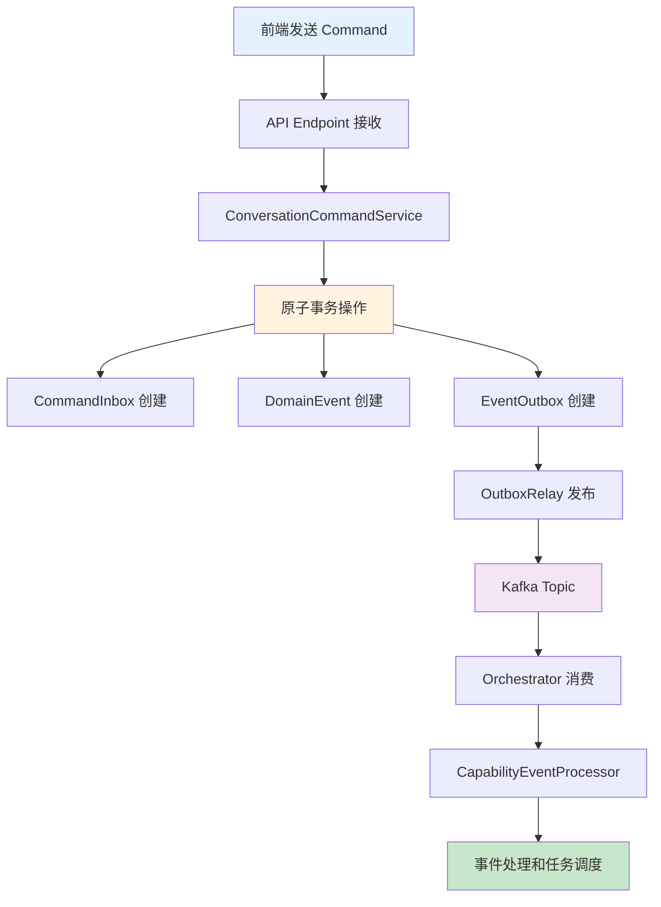
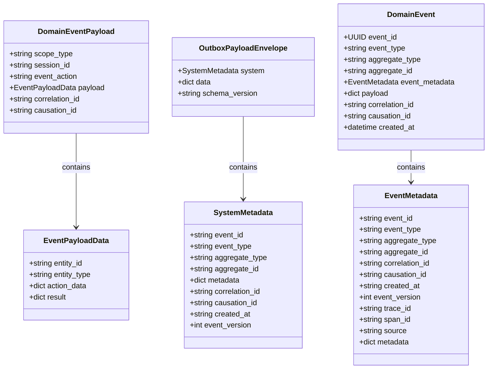
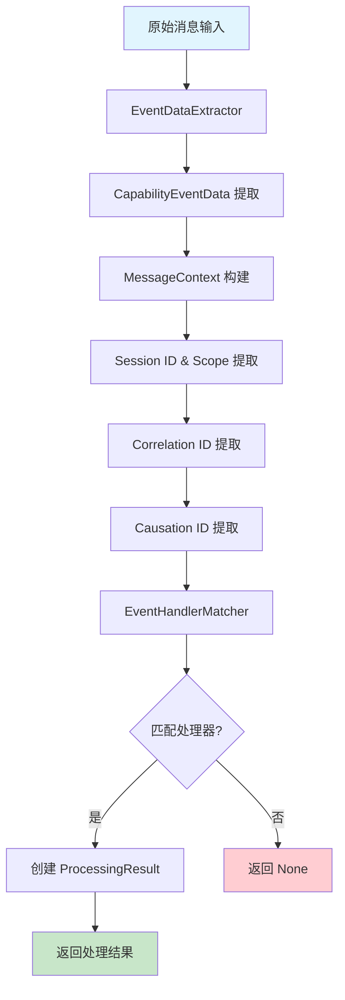
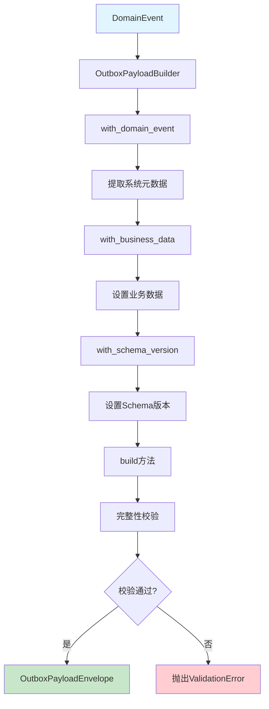
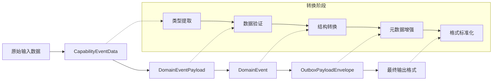
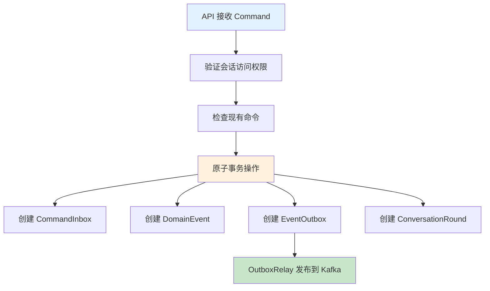
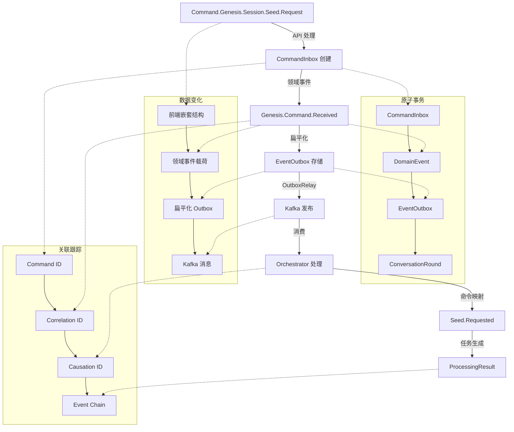
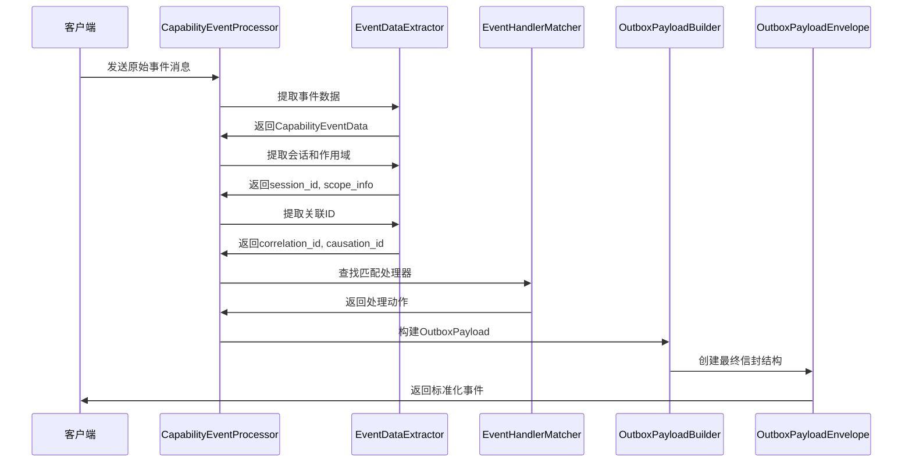

# Orchestrator 事件结构类型传递和转换文档

## 概述

本文档详细描述了从前端 Command 命令到 `apps/backend/src/agents/orchestrator` 模块的完整事件流转和转换过程。系统采用领域事件驱动架构，通过 Command → Outbox → Orchestrator 的数据管道，实现类型安全的事件处理和转换。

## 完整数据流转概览



## 核心事件结构类型

### 1. EventMetadata - 统一事件元数据模型

```python
class EventMetadata(BaseModel):
    # 核心标识字段
    event_id: str | None = None          # 事件唯一标识符
    event_type: str | None = None        # 事件类型标识
    aggregate_type: str | None = None    # 聚合根类型
    aggregate_id: str | None = None      # 聚合根实例ID

    # 业务关联字段
    correlation_id: str | None = None    # 业务流程关联ID
    causation_id: str | None = None      # 因果关系ID

    # 时间字段
    created_at: str | None = None        # 事件创建时间戳

    # 版本字段
    event_version: int | None = None     # 事件schema版本号
    version: str | None = None           # 字符串版本标识

    # 分布式追踪字段
    trace_id: str | None = None          # 分布式追踪ID
    span_id: str | None = None           # 调用链段标识
    source: str | None = None            # 事件来源标识

    # 扩展元数据
    metadata: dict[str, Any] = Field(default_factory=dict)
```

### 2. DomainEventPayload - 领域事件负载

```python
class DomainEventPayload(BaseModel):
    scope_type: str                      # 作用域类型
    session_id: str                      # 会话ID
    event_action: str                    # 事件动作
    payload: EventPayloadData            # 事件负载数据
    correlation_id: str | None = None    # 关联ID
    causation_id: str | None = None      # 因果ID
```

### 3. EventPayloadData - 事件负载数据

```python
class EventPayloadData(BaseModel):
    entity_id: str | None = None         # 实体ID
    entity_type: str | None = None       # 实体类型
    action_data: dict[str, Any] | None = None  # 动作数据
    result: dict[str, Any] | None = None       # 结果数据
```

### 4. OutboxPayloadEnvelope - Outbox信封结构

```python
class OutboxPayloadEnvelope(BaseModel):
    system: SystemMetadata               # 系统元数据
    data: dict[str, Any]                 # 业务数据
    schema_version: str = "v1"           # Schema版本
```

## 事件结构关系图



## 事件转换流程

### 1. 能力事件处理流程



### 2. 领域事件到 Outbox 转换



### 3. 事件数据转换层次



## 核心转换组件

### 1. CapabilityEventProcessor

主要的能力事件处理编排器，负责协调整个能力事件的处理流程：

```python
class CapabilityEventProcessor:
    def __init__(self, logger: Any) -> None:
        self.log = logger
        self.data_extractor = EventDataExtractor()
        self.handler_matcher = EventHandlerMatcher(logger)

    async def handle_capability_event(
        self, msg_type: str, message: dict[str, Any], context: dict[str, Any]
    ) -> ProcessingResult | None:
        # 1. 数据提取和类型安全处理
        data = self.data_extractor.extract_event_data(message)
        context_model = MessageContext(**context)

        # 2. 会话和作用域信息提取
        session_id, scope_info = self.data_extractor.extract_session_and_scope(data, context_model)

        # 3. 关联ID提取
        correlation_id = self.data_extractor.extract_correlation_id(context_model, data)
        causation_id = self.data_extractor.extract_causation_id(context_model, data)

        # 4. 处理器匹配
        action = self.handler_matcher.find_matching_handler(
            msg_type, session_id, data, correlation_id, scope_info, causation_id
        )

        # 5. 返回类型安全的处理结果
        if action:
            return create_processing_result(
                action=action,
                msg_type=msg_type,
                session_id=session_id,
                correlation_id=correlation_id,
            )
        return None
```

### 2. OutboxPayloadBuilder

类型安全的 outbox payload 构建器：

```python
class OutboxPayloadBuilder:
    def __init__(self):
        self._system_metadata: dict[str, Any] = {}
        self._business_data: dict[str, Any] = {}
        self._schema_version: str = "v1"

    def with_domain_event(self, event: DomainEvent) -> OutboxPayloadBuilder:
        """从领域事件提取系统元数据"""
        self._system_metadata = {
            "event_id": str(event.event_id),
            "event_type": event.event_type,
            "aggregate_type": event.aggregate_type,
            "aggregate_id": event.aggregate_id,
            "metadata": event.event_metadata or {},
        }
        # 添加可选字段 (correlation_id, causation_id, created_at, event_version)
        return self

    def with_business_data(self, data: dict[str, Any]) -> OutboxPayloadBuilder:
        """设置业务数据，防御性检查顶层保留字段冲突"""
        conflicts = set(data.keys()) & self.RESERVED_TOP_LEVEL_FIELDS
        if conflicts:
            raise ValueError(f"Business data contains reserved top-level fields: {conflicts}")
        self._business_data = data
        return self

    def build(self) -> OutboxPayloadEnvelope:
        """构建最终的outbox payload"""
        # 完整性校验：必需的系统字段
        required_fields = ["event_id", "event_type", "aggregate_type", "aggregate_id"]
        missing_fields = [field for field in required_fields if field not in self._system_metadata]

        if missing_fields:
            raise ValueError(f"Missing required system metadata fields: {missing_fields}")

        return OutboxPayloadEnvelope(
            system=SystemMetadata(**self._system_metadata),
            data=self._business_data,
            schema_version=self._schema_version,
        )
```

## 前端 Command 到 Orchestrator 完整转换流程

### 1. 前端 Command 结构

前端发送的原始 Command 结构包含完整的业务上下文和用户输入：

```json
{
  "payload": {
    "stage": "INITIAL_PROMPT",
    "context": {
      "iteration_number": 1,
      "user_preferences": {},
      "previous_attempts": 0
    },
    "session_id": "d4eddedd-0e3e-4011-b208-f87f7ef1d062",
    "user_input": "我想写一个关于...",
    "preferences": {}
  },
  "user_id": "1",
  "session_id": "d4eddedd-0e3e-4011-b208-f87f7ef1d062",
  "command_type": "Command.Genesis.Session.Seed.Request"
}
```

### 2. ConversationCommandService 处理

API 端点接收到前端 Command 后，通过 `ConversationCommandService.enqueue_command` 进行处理：



### 3. 原子事务操作详解

`ConversationAtomicOperations.enqueue_command_atomic` 确保数据一致性：

```python
# 原子事务中创建的组件
async def enqueue_command_atomic():
    async with transactional(db):
        # 1. 创建 CommandInbox
        cmd = await command_factory.get_or_create_command(
            db, session_id, command_type, payload, idempotency_key
        )

        # 2. 创建 DomainEvent
        dom_evt = await event_factory.get_or_create_domain_event(
            db, session, cmd, command_type, payload, user_id=user_id
        )

        # 3. 创建 EventOutbox
        await outbox_manager.ensure_outbox_entry(db, session, dom_evt, cmd)

        # 4. 创建 ConversationRound
        round_obj = await create_round_for_command_atomic(...)

        return {"command": cmd, "round": round_obj}
```

### 4. EventOutbox 数据转换

`ConversationOutboxManager.create_outbox_entry` 创建扁平化的 Outbox 条目：

```python
# EventOutbox 扁平化载荷构建
flat_payload = {
    "event_id": str(dom_evt.event_id),
    "event_type": dom_evt.event_type,
    "aggregate_type": dom_evt.aggregate_type,
    "aggregate_id": dom_evt.aggregate_id,
    "metadata": dom_evt.event_metadata or {},
}

# 合并业务数据
if dom_evt.payload:
    flat_payload.update(dom_evt.payload)

# 创建 EventOutbox 条目
out = EventOutbox(
    id=dom_evt.event_id,
    topic=get_domain_topic(session.scope_type),
    key=str(session.id),
    partition_key=str(session.id),
    payload=flat_payload,
    headers={
        "event_type": dom_evt.event_type,
        "version": 1,
        "correlation_id": str(cmd.id),
    },
    status=OutboxStatus.PENDING,
)
```

### 5. 完整转换示例

#### 步骤 1: 前端 Command (原始输入)

```json
{
  "payload": {
    "stage": "INITIAL_PROMPT",
    "context": {
      "iteration_number": 1,
      "user_preferences": {},
      "previous_attempts": 0
    },
    "session_id": "d4eddedd-0e3e-4011-b208-f87f7ef1d062",
    "user_input": "我想写一个关于时间旅行的科幻小说",
    "preferences": {}
  },
  "user_id": "1",
  "session_id": "d4eddedd-0e3e-4011-b208-f87f7ef1d062",
  "command_type": "Command.Genesis.Session.Seed.Request"
}
```

#### 步骤 2: DomainEvent 创建 (领域事件)

```json
{
  "event_id": "evt-550e8400-e29b-41d4-a716-446655440000",
  "event_type": "Genesis.Command.Received",
  "aggregate_type": "Genesis",
  "aggregate_id": "d4eddedd-0e3e-4011-b208-f87f7ef1d062",
  "correlation_id": "cmd-12345-uuid",
  "causation_id": "cmd-12345-uuid",
  "created_at": "2024-12-01T10:30:00.123Z",
  "payload": {
    "command_type": "Command.Genesis.Session.Seed.Request",
    "payload": {
      "stage": "INITIAL_PROMPT",
      "context": {
        "iteration_number": 1,
        "user_preferences": {},
        "previous_attempts": 0
      },
      "session_id": "d4eddedd-0e3e-4011-b208-f87f7ef1d062",
      "user_input": "我想写一个关于时间旅行的科幻小说",
      "preferences": {}
    },
    "session_id": "d4eddedd-0e3e-4011-b208-f87f7ef1d062",
    "user_id": "1"
  },
  "event_metadata": {
    "source": "api-gateway",
    "user_id": "1"
  }
}
```

#### 步骤 3: EventOutbox 存储格式 (扁平化结构)

```json
{
  "id": "evt-550e8400-e29b-41d4-a716-446655440000",
  "topic": "genesis.session.events",
  "key": "d4eddedd-0e3e-4011-b208-f87f7ef1d062",
  "partition_key": "d4eddedd-0e3e-4011-b208-f87f7ef1d062",
  "payload": {
    "event_id": "evt-550e8400-e29b-41d4-a716-446655440000",
    "event_type": "Genesis.Command.Received",
    "aggregate_type": "Genesis",
    "aggregate_id": "d4eddedd-0e3e-4011-b208-f87f7ef1d062",
    "metadata": {
      "source": "api-gateway",
      "user_id": "1"
    },
    "command_type": "Command.Genesis.Session.Seed.Request",
    "payload": {
      "stage": "INITIAL_PROMPT",
      "context": {
        "iteration_number": 1,
        "user_preferences": {},
        "previous_attempts": 0
      },
      "session_id": "d4eddedd-0e3e-4011-b208-f87f7ef1d062",
      "user_input": "我想写一个关于时间旅行的科幻小说",
      "preferences": {}
    },
    "session_id": "d4eddedd-0e3e-4011-b208-f87f7ef1d062",
    "user_id": "1",
    "created_at": "2024-12-01T10:30:00.123Z"
  },
  "headers": {
    "event_type": "Genesis.Command.Received",
    "version": 1,
    "correlation_id": "cmd-12345-uuid"
  },
  "status": "PENDING",
  "created_at": "2024-12-01T10:30:00.123Z"
}
```

#### 步骤 4: Orchestrator 接收的消息格式

Orchestrator 通过 Kafka 消费到的消息格式：

```json
{
  "msg_type": "genesis.command.received",
  "message": {
    "raw_data": {
      "event_id": "evt-550e8400-e29b-41d4-a716-446655440000",
      "event_type": "Genesis.Command.Received",
      "aggregate_id": "d4eddedd-0e3e-4011-b208-f87f7ef1d062",
      "command_type": "Command.Genesis.Session.Seed.Request",
      "payload": {
        "stage": "INITIAL_PROMPT",
        "context": {
          "iteration_number": 1,
          "user_preferences": {},
          "previous_attempts": 0
        },
        "session_id": "d4eddedd-0e3e-4011-b208-f87f7ef1d062",
        "user_input": "我想写一个关于时间旅行的科幻小说",
        "preferences": {}
      },
      "session_id": "d4eddedd-0e3e-4011-b208-f87f7ef1d062",
      "user_id": "1"
    }
  },
  "context": {
    "session_id": "d4eddedd-0e3e-4011-b208-f87f7ef1d062",
    "scope_type": "genesis",
    "correlation_id": "cmd-12345-uuid",
    "trace_id": "trace-def456",
    "source": "kafka"
  }
}
```

#### 步骤 5: CapabilityEventProcessor 处理结果

Orchestrator 基于 `command_type` 进行命令映射，通过 `COMMAND_EVENT_MAPPING` 将 `Command.Genesis.Session.Seed.Request` 映射为 `Seed.Requested`，最终生成的处理结果：

```json
{
  "action": "genesis.seed.generate",
  "session_id": "d4eddedd-0e3e-4011-b208-f87f7ef1d062",
  "correlation_id": "cmd-12345-uuid",
  "task_input": {
    "user_input": "我想写一个关于时间旅行的科幻小说",
    "stage": "INITIAL_PROMPT",
    "context": {
      "iteration_number": 1,
      "user_preferences": {},
      "previous_attempts": 0
    },
    "session_id": "d4eddedd-0e3e-4011-b208-f87f7ef1d062",
    "user_id": "1"
  },
  "scope_info": {
    "scope_type": "genesis",
    "scope_prefix": "Genesis",
    "topic": "genesis.seed.tasks"
  },
  "message_type": "genesis.command.received",
  "mapped_event": "Seed.Requested"
}
```

### 6. 关键转换点分析



## 重要澄清：EventBridgePublisher 的实际作用

⚠️ **注意**：`EventBridgePublisher` **不是**处理前端 Command 的组件。它的实际作用是：

- **用途**: 发布事件到 SSE (Server-Sent Events) 流，向前端推送实时更新
- **触发时机**: 当后台任务完成或状态变化时，用于通知前端
- **数据流向**: Orchestrator/Agent → EventBridgePublisher → SSE → Frontend
- **职责**: 实时通知，而非命令处理

**正确的前端 Command 处理流程**是通过 `ConversationCommandService` 进行的原子事务操作。

## 传统能力事件处理示例

### 转换前 - 原始能力事件消息

```json
{
  "msg_type": "capability.character.generation.completed",
  "message": {
    "raw_data": {
      "entity_id": "char-123",
      "entity_type": "character",
      "action_data": {
        "generation_params": {...},
        "request_id": "req-456"
      },
      "result": {
        "character_data": {...},
        "generation_time": 1234567890
      }
    }
  },
  "context": {
    "session_id": "sess-789",
    "scope_type": "genesis",
    "correlation_id": "corr-abc123",
    "trace_id": "trace-def456"
  }
}
```

### 转换中 - DomainEventPayload

```json
{
  "scope_type": "genesis",
  "session_id": "sess-789",
  "event_action": "character.generation.completed",
  "payload": {
    "entity_id": "char-123",
    "entity_type": "character",
    "action_data": {
      "generation_params": {...},
      "request_id": "req-456"
    },
    "result": {
      "character_data": {...},
      "generation_time": 1234567890
    }
  },
  "correlation_id": "corr-abc123",
  "causation_id": null
}
```

### 转换后 - OutboxPayloadEnvelope

```json
{
  "system": {
    "event_id": "evt-uuid-12345",
    "event_type": "Genesis.Character.Generated",
    "aggregate_type": "Character",
    "aggregate_id": "char-123",
    "correlation_id": "corr-abc123",
    "causation_id": null,
    "created_at": "2024-12-01T10:30:00.123Z",
    "event_version": 1,
    "metadata": {
      "trace_id": "trace-def456",
      "source": "orchestrator"
    }
  },
  "data": {
    "scope_type": "genesis",
    "session_id": "sess-789",
    "entity_id": "char-123",
    "entity_type": "character",
    "generation_params": {...},
    "character_data": {...},
    "generation_time": 1234567890
  },
  "schema_version": "v1"
}
```

## 关键设计特性

### 1. 命名空间隔离设计

- **系统元数据 (`system`)**: 专注事件基础设施信息
- **业务数据 (`data`)**: 专注业务逻辑负载
- **Schema版本**: 支持渐进式演进

### 2. 类型安全保障

- 使用 Pydantic 模型确保类型安全
- 字段验证和类型强制
- 运行时数据校验

### 3. 冲突防护机制

- 顶层保留字段检查 (`RESERVED_TOP_LEVEL_FIELDS`)
- 业务数据与系统字段隔离
- 防止字段覆盖和命名冲突

### 4. 向后兼容性

- 可选字段设计
- `extra="allow"` 配置
- Schema版本控制

## 处理流程总结



## 总结

本系统通过完整的 **Frontend Command → Outbox → Orchestrator** 数据管道，实现了：

### 🎯 核心设计原则

1. **类型安全转换**: 通过 Pydantic 模型确保每个转换步骤的数据完整性
2. **命名空间隔离**: 系统元数据与业务数据分离，避免字段冲突
3. **事件驱动架构**: 异步、解耦的事件处理机制
4. **可观测性**: 完整的追踪链路 (correlation_id, trace_id)

### 🔄 数据转换特点

1. **结构重组**: 从嵌套的 Command 结构到扁平化的 Outbox 存储，再到结构化的处理结果
2. **元数据增强**: 在每个步骤添加追踪、时间戳、版本等关键信息
3. **业务语义保持**: 用户输入和业务逻辑在整个流程中保持语义完整性
4. **向后兼容**: 支持 schema 演进和版本管理

### 🚀 系统优势

- **可靠性**: 通过 Outbox 模式确保事件不丢失
- **可扩展性**: 松耦合的组件设计便于系统扩展
- **可维护性**: 清晰的数据转换边界和类型定义
- **可观测性**: 完整的事件追踪和监控能力

这个架构确保了从前端用户交互到后台任务执行的完整数据流，同时保持了高度的类型安全性和系统可靠性。